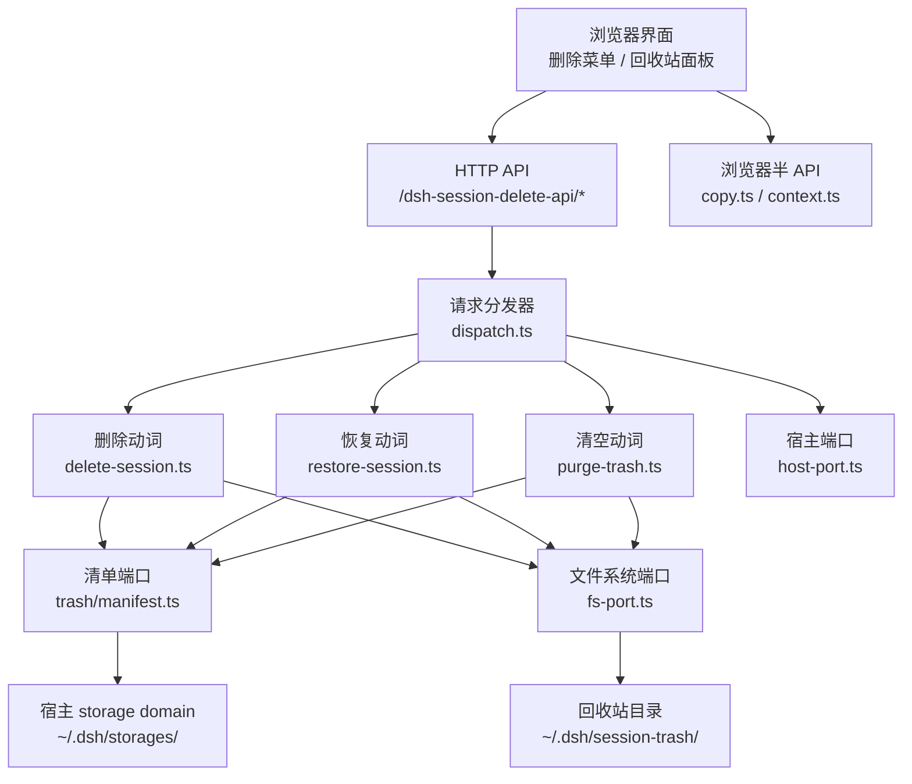
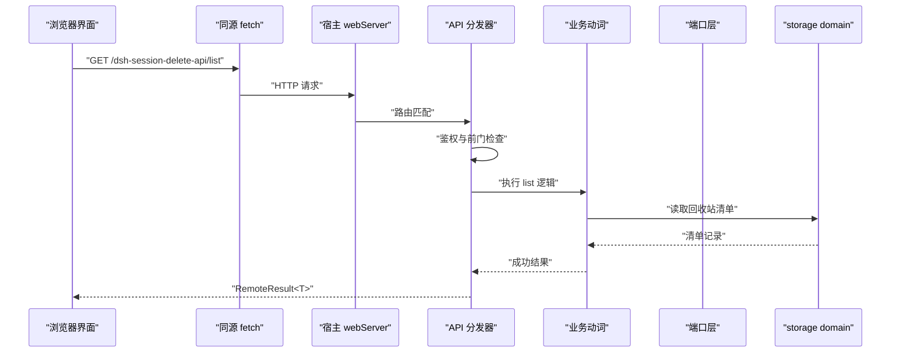
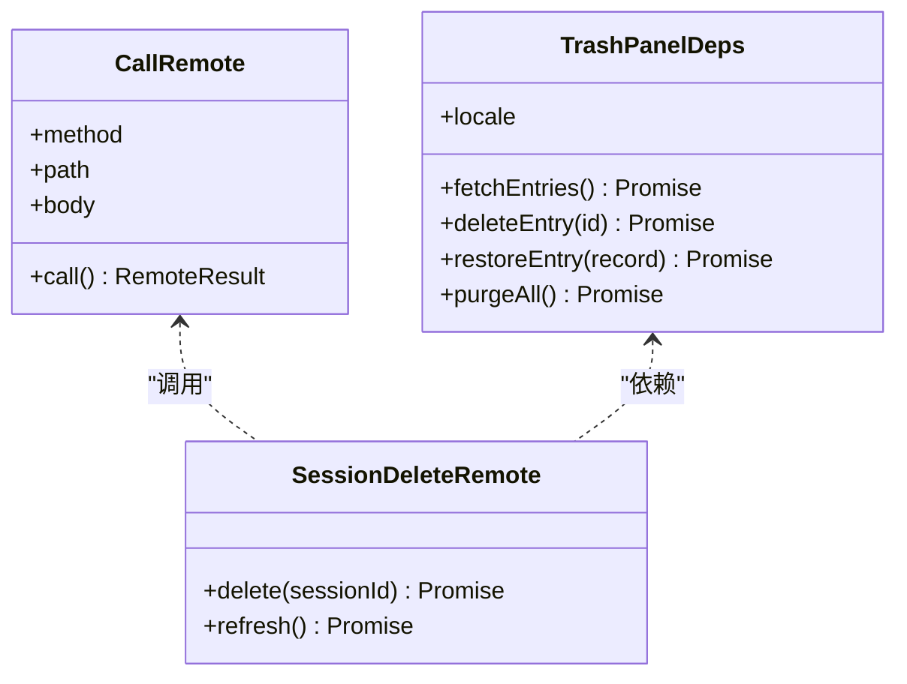
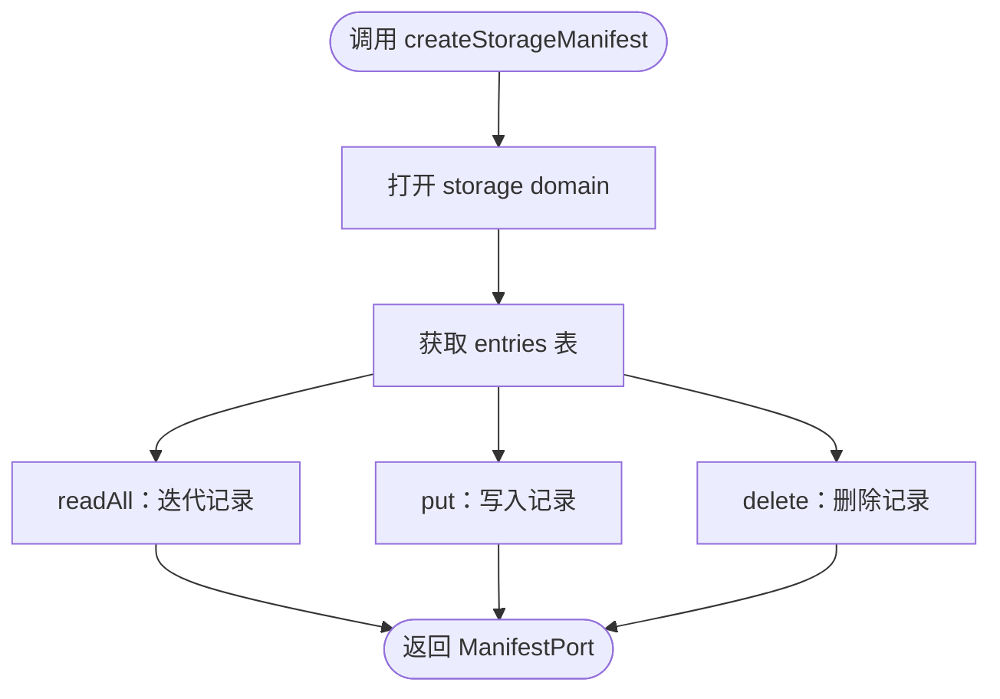
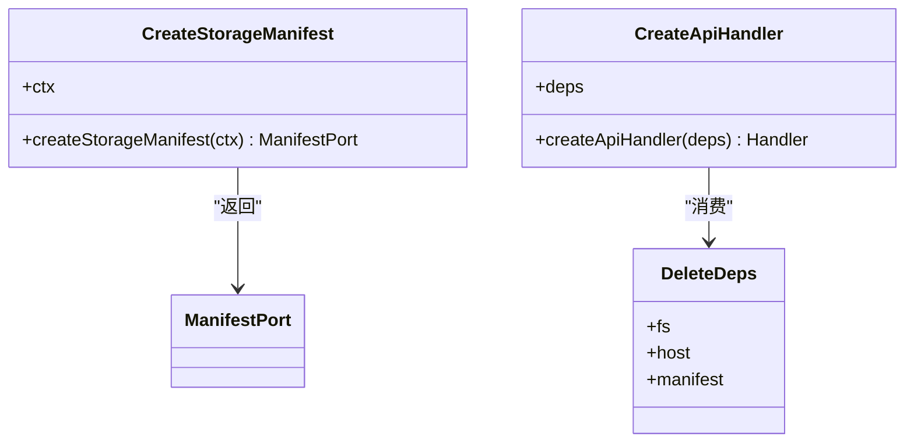
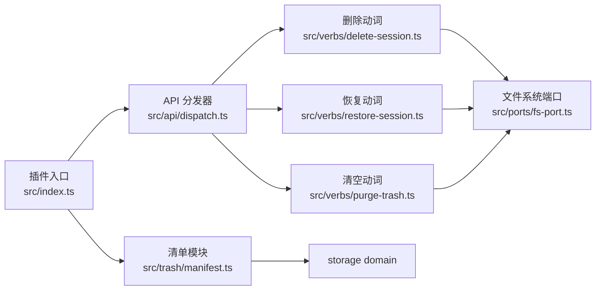

# API 参考

<cite>
**本文引用的文件**
- [README.md](file://README.md)
- [package.json](file://package.json)
- [tsdown.config.ts](file://tsdown.config.ts)
- [src/index.ts](file://src/index.ts)
- [src/api/dispatch.ts](file://src/api/dispatch.ts)
- [src/verbs/delete-session.ts](file://src/verbs/delete-session.ts)
- [src/verbs/restore-session.ts](file://src/verbs/restore-session.ts)
- [src/verbs/purge-trash.ts](file://src/verbs/purge-trash.ts)
- [src/verbs/errors.ts](file://src/verbs/errors.ts)
- [src/trash/manifest.ts](file://src/trash/manifest.ts)
- [src/client/copy.ts](file://src/client/copy.ts)
- [src/client/context.ts](file://src/client/context.ts)
- [src/client/delete-confirm.tsx](file://src/client/delete-confirm.tsx)
- [src/client/trash-entry.tsx](file://src/client/trash-entry.tsx)
- [src/client/undo-toast.tsx](file://src/client/undo-toast.tsx)
- [src/ports/fs-port.ts](file://src/ports/fs-port.ts)
- [src/ports/host-port.ts](file://src/ports/host-port.ts)
- [src/remote/map-error.ts](file://src/remote/map-error.ts)
</cite>

## 目录
1. [简介](#简介)
2. [项目结构](#项目结构)
3. [核心组件](#核心组件)
4. [架构总览](#架构总览)
5. [详细组件分析](#详细组件分析)
6. [依赖关系分析](#依赖关系分析)
7. [性能与兼容性](#性能与兼容性)
8. [故障排查指南](#故障排查指南)
9. [结论](#结论)

## 简介
本插件为 DeepSeek Harness（DSH）补充“删除会话”能力：删除不是直接销毁，而是移入回收站；提供恢复、彻底删除与清空回收站的完整流程。浏览器侧通过同源 HTTP API 调用 Node 端动词，Node 端通过宿主服务访问文件系统与 storage domain。

本参考文档聚焦三类公开接口：
- HTTP API：GET /list、POST /delete、POST /restore、POST /purge。
- 浏览器半 API：`callRemote`、`SessionDeleteRemote`、`TrashPanelDeps` 等导出契约。
- Node 半 API：`createStorageManifest`、`createApiHandler`、`DeleteDeps` 等工厂函数与依赖注入方式。

## 项目结构
插件按职责分层组织：
- `src/index.ts`：插件入口、依赖注入、storage domain 绑定、home 路径解析。
- `src/api/dispatch.ts`：HTTP 路由分发、请求校验、响应信封、鉴权前门。
- `src/verbs/*`：删除、恢复、清空回收站的业务动词。
- `src/trash/manifest.ts`：回收站清单持久化抽象。
- `src/ports/*`：文件系统与宿主能力端口。
- `src/client/*`：浏览器侧 UI 与远程调用封装。
- `src/remote/map-error.ts`：远端错误映射。
- `tsdown.config.ts`：Node 半与浏览器半构建配置。
- `package.json`：插件元信息、peer 依赖、`dsh.compatibility.dshReleases`。



**图示来源**
- [src/api/dispatch.ts](file://src/api/dispatch.ts)
- [src/verbs/delete-session.ts](file://src/verbs/delete-session.ts)
- [src/verbs/restore-session.ts](file://src/verbs/restore-session.ts)
- [src/verbs/purge-trash.ts](file://src/verbs/purge-trash.ts)
- [src/trash/manifest.ts](file://src/trash/manifest.ts)
- [src/ports/fs-port.ts](file://src/ports/fs-port.ts)
- [src/ports/host-port.ts](file://src/ports/host-port.ts)

**章节来源**
- [src/index.ts:1-120](file://src/index.ts#L1-L120)
- [tsdown.config.ts:1-150](file://tsdown.config.ts#L1-L150)

## 核心组件
- **HTTP 分发器**：根据路由选择动词，统一返回信封，处理鉴权与前门。
- **动词层**：删除、恢复、清空三个原子操作，各自负责参数验证与副作用。
- **清单端口**：对宿主 storage domain 的读写适配，实现懒开与句柄清理。
- **端口层**：文件系统与宿主能力的最小抽象，便于测试与替换。
- **浏览器半**：把用户操作包装成同源 fetch 调用，并管理撤销提示与确认弹窗。
- **错误映射**：把远端失败标准化为前端可消费的 `RemoteFailure`。

**章节来源**
- [src/api/dispatch.ts](file://src/api/dispatch.ts)
- [src/verbs/delete-session.ts](file://src/verbs/delete-session.ts)
- [src/verbs/restore-session.ts](file://src/verbs/restore-session.ts)
- [src/verbs/purge-trash.ts](file://src/verbs/purge-trash.ts)
- [src/trash/manifest.ts](file://src/trash/manifest.ts)
- [src/ports/fs-port.ts](file://src/ports/fs-port.ts)
- [src/ports/host-port.ts](file://src/ports/host-port.ts)
- [src/remote/map-error.ts](file://src/remote/map-error.ts)

## 架构总览
浏览器侧通过宿主提供的 webServer 暴露的前缀路由访问插件 API；Node 侧使用宿主注入的 workspaceRegistry、storageDomain、webServer 完成数据与 IO。



**图示来源**
- [src/index.ts:1-120](file://src/index.ts#L1-L120)
- [src/api/dispatch.ts](file://src/api/dispatch.ts)
- [src/trash/manifest.ts](file://src/trash/manifest.ts)

## 详细组件分析

### HTTP API

#### 通用约定
- 路由前缀由宿主 webServer 注册；插件内部使用共享常量定义实际前缀。
- 所有写操作均要求鉴权通过；鉴权失败应返回标准错误信封。
- 成功响应统一使用 `RemoteResult<T>`；失败响应统一使用 `RemoteFailure`。
- 同源校验：
  - 优先校验 `Origin`。
  - 若未携带 `Origin`，回退到 `Referer`。
  - 仅允许来自宿主同源的请求；桌面壳特殊路径应按设计稿策略放行或拒绝。
- 错误码：
  - 鉴权失败：401。
  - 参数无效：400。
  - 资源不存在：404。
  - 服务器内部错误：500。

| 方法 | 路径 | 用途 | 主体 | 成功响应 | 典型失败 |
|---|---|---|---|---|---|
| GET | `/dsh-session-delete-api/list` | 列出回收站条目 | 无 | `RemoteResult<TrashEntry[]>` | 鉴权失败、存储服务不可用 |
| POST | `/dsh-session-delete-api/delete` | 将会话移入回收站 | `{ sessionId }` | `RemoteResult<void>` | 会话不存在、会话正在运行 |
| POST | `/dsh-session-delete-api/restore` | 从回收站恢复会话 | `{ id, originalPath }` | `RemoteResult<void>` | 清单记录缺失、原路径不可恢复 |
| POST | `/dsh-session-delete-api/purge` | 彻底删除指定条目或清空回收站 | `{ ids?: string[], all?: boolean }` | `RemoteResult<number>` | 权限不足、磁盘不可写 |

##### GET /list
- 请求体：无。
- 成功响应：`{ ok: true, data: [TrashEntry, ...] }`。
- 失败响应：`{ ok: false, error: RemoteFailure }`。
- curl 示例：
  ```bash
  curl --include --header "Origin: https://your-dsh-host" \
    "https://your-dsh-host/dsh-session-delete-api/list"
  ```
- fetch 示例：
  ```javascript
  const resp = await fetch("/dsh-session-delete-api/list", { credentials: "same-origin" });
  const body = await resp.json();
  if (body.ok) return body.data;
  throw new Error(body.error.message);
  ```

##### POST /delete
- 请求体：
  ```json
  { "sessionId": "会话标识" }
  ```
- 成功响应：`{ ok: true }`。
- 典型失败：
  - 会话不存在：`{ ok: false, error: { code: "NOT_FOUND", message: "..." } }`。
  - 会话正在运行：`{ ok: false, error: { code: "BUSY_SESSION", message: "..." } }`。
- curl 示例：
  ```bash
  curl --include --request POST --header "Content-Type: application/json" \
    --header "Origin: https://your-dsh-host" \
    --data '{"sessionId":"example-id"}' \
    "https://your-dsh-host/dsh-session-delete-api/delete"
  ```
- fetch 示例：
  ```javascript
  await fetch("/dsh-session-delete-api/delete", {
    method: "POST",
    credentials: "same-origin",
    headers: { "Content-Type": "application/json" },
    body: JSON.stringify({ sessionId: "example-id" }),
  });
  ```

##### POST /restore
- 请求体：
  ```json
  { "id": "回收站记录 id", "originalPath": "原始会话目录路径" }
  ```
- 成功响应：`{ ok: true }`。
- 典型失败：
  - 记录不存在：`{ ok: false, error: { code: "NOT_FOUND", message: "..." } }`。
  - 目标目录冲突：`{ ok: false, error: { code: "CONFLICT", message: "..." } }`。
- curl 示例：
  ```bash
  curl --include --request POST --header "Content-Type: application/json" \
    --header "Origin: https://your-dsh-host" \
    --data '{"id":"trash-record-id","originalPath":"/path/to/project/sessions/old-name"}' \
    "https://your-dsh-host/dsh-session-delete-api/restore"
  ```

##### POST /purge
- 请求体：
  ```json
  { "ids": ["id1", "id2"], "all": false }
  ```
  - 至少提供 `ids` 数组或 `all: true`。
- 成功响应：`{ ok: true, data: number }`，表示已删除条数。
- 典型失败：
  - 参数缺失：`{ ok: false, error: { code: "INVALID_REQUEST", message: "..." } }`。
  - 部分失败时可按实现策略返回已处理数量或整体失败。
- curl 示例：
  ```bash
  curl --include --request POST --header "Content-Type: application/json" \
    --header "Origin: https://your-dsh-host" \
    --data '{"all":true}' \
    "https://your-dsh-host/dsh-session-delete-api/purge"
  ```

##### 错误映射表
| 场景 | 推荐 code | 建议 message | 客户端行为 |
|---|---|---|---|
| 鉴权失败 | `UNAUTHORIZED` | "需要登录或会话无效" | 跳转登录或刷新身份 |
| 请求体无效 | `INVALID_REQUEST` | "参数不完整或类型错误" | 高亮字段并阻止提交 |
| 资源不存在 | `NOT_FOUND` | "会话或回收站记录不存在" | 提示刷新列表 |
| 会话正在运行 | `BUSY_SESSION` | "会话正在运行，请先停止" | 禁用删除按钮并说明原因 |
| 目录冲突 | `CONFLICT` | "恢复目标已存在" | 提示重命名或手动处理 |
| 存储损坏 | `STORAGE_ERROR` | "清单不可读，请重试" | 显示重试按钮 |
| 磁盘写入失败 | `IO_ERROR` | "磁盘不可写或空间不足" | 提示检查磁盘 |
| 未知异常 | `INTERNAL_ERROR` | "服务器内部错误" | 上报日志并提示稍后重试 |

##### 同源校验与桌面壳路径
- 正常浏览器环境：必须携带合法 `Origin`。
- 无 `Origin` 时：检查 `Referer`，并与宿主预期域名匹配。
- 桌面壳特殊路径：若请求来自桌面壳内部地址，应按设计稿决定是放行还是拒绝；当前仓库未内建桌面壳白名单，应在分发器中扩展策略。

##### 鉴权前提
- 写操作必须经过宿主鉴权前门；鉴权状态由宿主维护，插件不应绕过。
- 读操作也应受同源限制，避免跨源读取回收站数据。

**章节来源**
- [src/api/dispatch.ts](file://src/api/dispatch.ts)
- [src/verbs/delete-session.ts](file://src/verbs/delete-session.ts)
- [src/verbs/restore-session.ts](file://src/verbs/restore-session.ts)
- [src/verbs/purge-trash.ts](file://src/verbs/purge-trash.ts)
- [src/verbs/errors.ts](file://src/verbs/errors.ts)

### 浏览器半 API

#### callRemote
- 用途：浏览器侧发起同源远端调用，封装 fetch 与错误转换。
- 参数：
  - `method`：HTTP 方法。
  - `path`：相对路径，不含主机名。
  - `body`：可选 JSON 主体。
- 返回值：`Promise<RemoteResult<T>>`。
- 使用示例：
  ```javascript
  const result = await callRemote("POST", "/dsh-session-delete-api/delete", { sessionId: "id" });
  if (!result.ok) {
    console.error(result.error.code, result.error.message);
  }
  ```

#### SessionDeleteRemote
- 用途：面向删除操作的浏览器半封装，对外暴露更语义化的调用。
- 主要方法：
  - `delete(sessionId)`：调用删除 API 并返回结果。
  - `refresh()`：重新拉取回收站列表。
- 依赖：
  - `callRemote`：用于网络调用。
  - 宿主 locale 服务：用于文案降级。

#### TrashPanelDeps
- 用途：回收站面板所需的依赖对象，解耦 UI 与数据源。
- 常见字段：
  - `fetchEntries`：获取回收站条目。
  - `deleteEntry`：删除单条。
  - `restoreEntry`：恢复单条。
  - `purgeAll`：清空回收站。
  - `locale`：国际化文案。
- 使用示例：
  ```javascript
  const panel = render(<TrashPanel deps={TrashPanelDeps} />);
  // 点击恢复后刷新列表
  ```



**图示来源**
- [src/client/copy.ts](file://src/client/copy.ts)
- [src/client/context.ts](file://src/client/context.ts)
- [src/client/trash-entry.tsx](file://src/client/trash-entry.tsx)

**章节来源**
- [src/client/copy.ts](file://src/client/copy.ts)
- [src/client/context.ts](file://src/client/context.ts)
- [src/client/delete-confirm.tsx](file://src/client/delete-confirm.tsx)
- [src/client/trash-entry.tsx](file://src/client/trash-entry.tsx)
- [src/client/undo-toast.tsx](file://src/client/undo-toast.tsx)

### Node 半 API

#### createStorageManifest(ctx)
- 用途：将宿主 storage domain 适配为本插件的清单端口。
- 参数：
  - `ctx`：宿主上下文，需提供 `storageDomain.open` 与 `effect`。
- 返回值：`ManifestPort`，支持 `readAll`、`put`、`delete`。
- 行为要点：
  - 清单域名为 `xrn1997_session_delete_trash`。
  - 清单布局为 `per-record`，坏记录备份并跳过。
  - 插件卸载时关闭 domain 句柄。



**图示来源**
- [src/index.ts:60-120](file://src/index.ts#L60-L120)
- [src/trash/manifest.ts](file://src/trash/manifest.ts)

#### createApiHandler(deps)
- 用途：生成 HTTP 请求处理器，绑定路由与动词。
- 参数：
  - `deps`：包含鉴权前门、文件系统端口、清单端口、宿主端口等依赖。
- 返回值：可用于宿主 webServer 的路由处理器。
- 行为要点：
  - 路由前缀来自共享常量。
  - 每个动词对应一个处理器。
  - 统一返回信封。

#### DeleteDeps
- 用途：删除动词所需的最小依赖集合。
- 常见字段：
  - `fs`：文件系统端口。
  - `host`：宿主端口。
  - `manifest`：清单端口。
- 注入方式：由插件装配层构造并传入动词函数。



**图示来源**
- [src/index.ts:1-120](file://src/index.ts#L1-L120)
- [src/verbs/delete-session.ts](file://src/verbs/delete-session.ts)

**章节来源**
- [src/index.ts:1-120](file://src/index.ts#L1-L120)
- [src/verbs/delete-session.ts](file://src/verbs/delete-session.ts)
- [src/trash/manifest.ts](file://src/trash/manifest.ts)

## 依赖关系分析



**图示来源**
- [src/index.ts:1-120](file://src/index.ts#L1-L120)
- [src/api/dispatch.ts](file://src/api/dispatch.ts)
- [src/verbs/delete-session.ts](file://src/verbs/delete-session.ts)
- [src/verbs/restore-session.ts](file://src/verbs/restore-session.ts)
- [src/verbs/purge-trash.ts](file://src/verbs/purge-trash.ts)
- [src/trash/manifest.ts](file://src/trash/manifest.ts)
- [src/ports/fs-port.ts](file://src/ports/fs-port.ts)

**章节来源**
- [src/index.ts:1-120](file://src/index.ts#L1-L120)
- [package.json:1-91](file://package.json#L1-L91)

## 性能与兼容性

### 性能特性
- 回收站移动采用同卷 rename，原子且瞬时。
- 清单采用 per-record 布局，单条损坏不影响其他记录。
- 不设置自动过期，清空为显式操作，适合长期保留。
- 浏览器半只 inline React 家族三个冻结平台模块，减少运行时依赖。

### 版本兼容策略
- 安装阶段由 peerDependencies 控制；本插件未钉死 `dsh-*` peer，因此装得上不代表在所有宿主上都实测过。
- 运行阶段以 `dsh.compatibility.dshReleases` 为准，目前标记 DSH Desktop 0.2.0-rc.2 为 compatible。
- 浏览器半通过 tsdown 构建纯度门，禁止跨插件值 import，避免宿主换代导致运行时崩溃。

**章节来源**
- [README.md:1-130](file://README.md#L1-L130)
- [package.json:1-91](file://package.json#L1-L91)
- [tsdown.config.ts:1-150](file://tsdown.config.ts#L1-L150)

## 故障排查指南

| 现象 | 可能原因 | 排查步骤 | 修复建议 |
|---|---|---|---|
| 侧栏没有“回收站”，菜单没有“删除” | 取数通道探测失败 | 检查 webServer 是否可用、同源配置是否正确 | 重启宿主；确认插件激活 |
| 删除后侧栏行仍存在 | 宿主尚未移除会话条目 | 刷新页面或等待宿主通知 | 冷会话删除应立即消失 |
| 正在运行的会话无法删除 | 活跃会话保护 | 查看活跃会话状态 | 先停止会话再删除 |
| 恢复失败 | 原路径不存在或冲突 | 检查原始目录与权限 | 手动处理冲突后重试 |
| 清空回收站报错 | 磁盘不可写或空间不足 | 检查磁盘状态 | 释放空间或调整权限 |
| 清单损坏 | storage domain 记录损坏 | 查看 backup-and-skip 行为 | 重建清单或迁移数据 |

**章节来源**
- [README.md:1-130](file://README.md#L1-L130)
- [src/index.ts:1-120](file://src/index.ts#L1-L120)
- [src/remote/map-error.ts](file://src/remote/map-error.ts)

## 结论
本插件通过清晰的三层契约——HTTP API、浏览器半 API、Node 半 API——提供会话删除与回收站管理能力。HTTP 层强调鉴权、同源与错误信封；浏览器半强调调用封装与 UI 依赖注入；Node 半强调依赖注入与端口抽象。兼容性由 peerDependencies 与 `dsh.compatibility.dshReleases` 共同约束，运行时通过构建纯度门降低宿主换代风险。