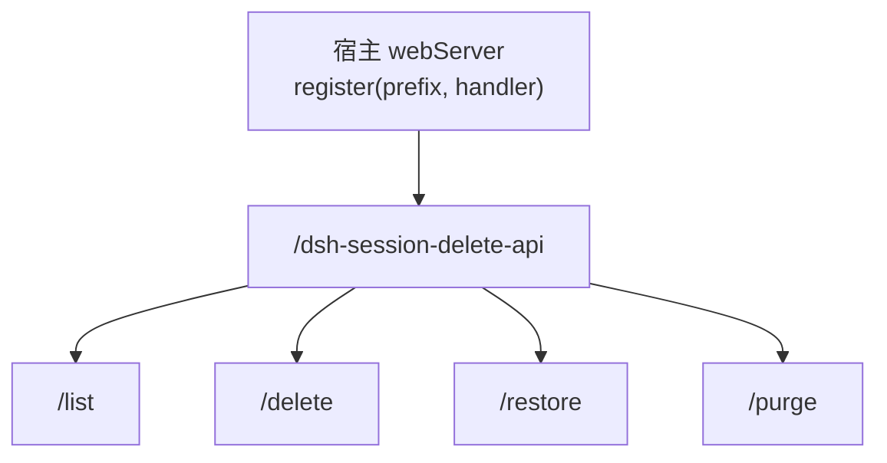
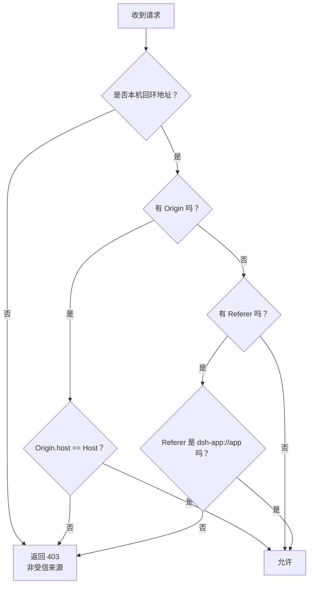
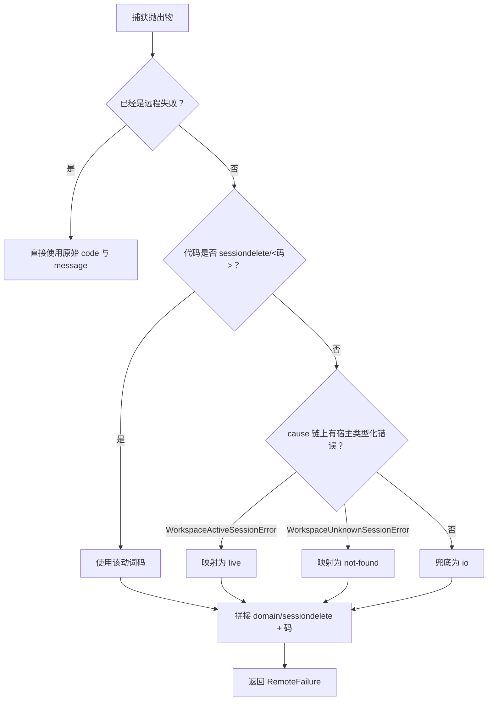
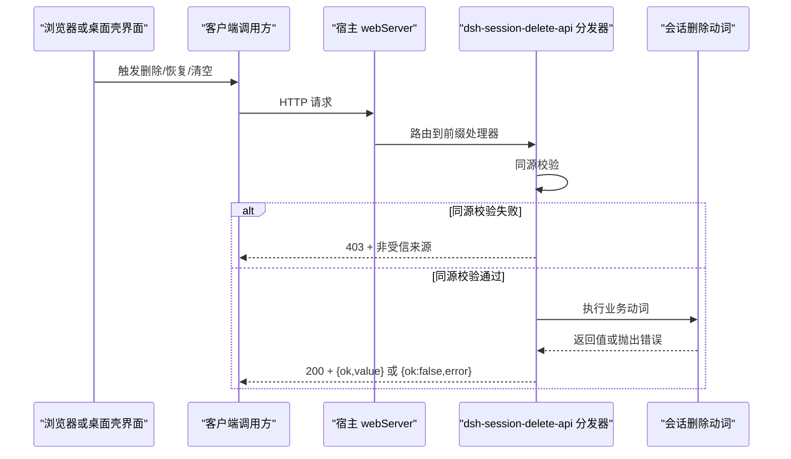

# HTTP API

<cite>
**本文引用的文件**   
- [dispatch.ts](file://src/api/dispatch.ts)
- [wire.ts](file://src/shared/wire.ts)
- [map-error.ts](file://src/remote/map-error.ts)
- [api.test.ts](file://tests/api.test.ts)
</cite>

## 目录

1. [简介](#简介)
2. [路由与鉴权前提](#路由与鉴权前提)
3. [同源校验与桌面壳处理](#同源校验与桌面壳处理)
4. [通用请求与响应约定](#通用请求与响应约定)
5. [端点参考](#端点参考)
6. [错误码映射](#错误码映射)
7. [客户端调用方式](#客户端调用方式)
8. [调试建议](#调试建议)
9. [常见问题排查](#常见问题排查)

## 简介

本插件为 DeepSeek Harness（DSH）提供“删除会话”能力，并通过宿主自带的 web server 暴露一组内部 HTTP API。四个端点分别是：

| 用途 | URL | 方法 |
| --- | --- | --- |
| 列出回收站条目 | `/dsh-session-delete-api/list` | `GET` |
| 把会话移入回收站 | `/dsh-session-delete-api/delete` | `POST` |
| 从回收站恢复会话 | `/dsh-session-delete-api/restore` | `POST` |
| 彻底删除回收站条目或清空回收站 | `/dsh-session-delete-api/purge` | `POST` |

这些接口是插件 Node 半与浏览器半之间的内部契约，不是给外部第三方公开的外部网关；它们由宿主 web server 挂载到固定前缀下，并由同源栅栏保护。

**章节来源**
- [dispatch.ts:1-30](file://src/api/dispatch.ts#L1-L30)
- [wire.ts:1-24](file://src/shared/wire.ts#L1-L24)

## 路由与鉴权前提

### 前缀注册位置

所有端点都位于前缀 `/dsh-session-delete-api` 之下。该前缀由共享 wire 定义，Node 半的分发器按此前缀裁剪路径后进入具体路由表。



**图表来源**
- [wire.ts:27-40](file://src/shared/wire.ts#L27-L40)
- [dispatch.ts:155-192](file://src/api/dispatch.ts#L155-L192)

### 鉴权前提

- 插件依赖宿主的 web server 将 handler 挂到上述前缀上。
- 如果宿主未挂载该前缀，则这四个端点不可用；但插件会“不可用时不出现”，不会因此拖垮宿主。
- 即使前缀已挂载，请求仍要通过同源校验；非受信请求直接返回 `403`，且不会读取动词、清单或文件系统。

**章节来源**
- [dispatch.ts:1-30](file://src/api/dispatch.ts#L1-L30)
- [dispatch.ts:155-192](file://src/api/dispatch.ts#L155-L192)

## 同源校验与桌面壳处理

### 基本规则

同源校验在分发器入口执行，早于任何业务逻辑。只有满足以下条件的请求才会被放行：

1. 客户端必须来自本机回环地址，包括 `127.0.0.1`、`::1` 和 IPv4 映射的 IPv6 地址。
2. 同时满足以下三种信任形状之一：
   - **浏览器同源**：`Origin` 存在且其 host 与请求 `Host` 一致。
   - **桌面壳页面**：`Referer` 指向 `dsh-app://app`（真机路径）。
   - **两者皆缺席**：没有 `Origin` 也没有 `Referer`，视为本机工具调用，例如 curl 或本机脚本。

如果任一条件不满足，服务端立即写回信封并返回状态码 `403`。

### 桌面壳特殊路径

桌面壳会把某些请求头删掉后再转发，其中包括 `Origin`；但 `Referer` 仍保留。因此，桌面端请求通常没有 `Origin`，却带有指向 `dsh-app://app` 的 `Referer`。分发器通过判断 `Referer` 是否匹配桌面壳协议与主机名来放行这类请求。



**图表来源**
- [dispatch.ts:60-133](file://src/api/dispatch.ts#L60-L133)

### 对跨源 GET 的安全说明

对于只读的 `GET /list`，跨源 `no-cors` 请求可能既不带 `Origin` 也不带 `Referer`，从而命中“两者皆缺席”的放行分支。但 `no-cors` 返回的是 opaque 响应，浏览器脚本无法读取内容，因此不会造成数据泄露。

**章节来源**
- [dispatch.ts:60-133](file://src/api/dispatch.ts#L60-L133)

## 通用请求与响应约定

### 成功响应

正常业务调用（包括 `ok: false` 的业务失败）统一使用状态码 `200`，并由信封决定成败：

```jsonc
{
  "ok": true,
  "value": "<端点特定的值>"
}
```

### 业务失败响应

当动词抛出受控错误时，响应体为：

```jsonc
{
  "ok": false,
  "error": {
    "code": "sessiondelete/<错误码>",
    "message": "<人类可读原文>"
  }
}
```

其中 `code` 以 `sessiondelete/` 开头，后面跟五个受设计约束的错误码之一。

### 非业务错误

| 情况 | HTTP 状态码 | 响应体 |
| --- | --- | --- |
| 同源校验失败 | `403` | `{ ok: false, error: { code: "...", message: "非受信来源" } }` |
| 未知路由或错误方法 | `200` | `{ ok: false, error: { code: "io", message: "未知路由：..." 或 "方法不允许：..." } }` |
| 请求体超限或非法 JSON | `200` | `{ ok: false, error: { code: "io", message: "请求体超过...字节上限" 或 "请求体不是合法 JSON：..." } }` |
| 缺少必填字段 | `200` | `{ ok: false, error: { code: "io", message: "请求体需带非空字符串字段 sessionId/entryId" } }` |
| 可选字段类型错误 | `200` | `{ ok: false, error: { code: "io", message: "字段 entryId 若在场必须是非空字符串" } }` |

注意：HTTP 状态码并不表示业务成功与否；客户端应始终检查信封中的 `ok`。

**章节来源**
- [dispatch.ts:92-154](file://src/api/dispatch.ts#L92-L154)
- [map-error.ts:1-72](file://src/remote/map-error.ts#L1-L72)
- [wire.ts:42-84](file://src/shared/wire.ts#L42-L84)

## 端点参考

### GET /list

列出当前回收站中的会话条目。列表顺序按最近删除在前。

| 项目 | 说明 |
| --- | --- |
| URL | `/dsh-session-delete-api/list` |
| 方法 | `GET` |
| 鉴权 | 同源校验通过 |
| 请求体 | 无 |
| 成功状态码 | `200` |
| 失败状态码 | `403`（仅同源失败） |
| 成功响应 `value` | `TrashEntry[]` |
| 典型错误 | 同源拒绝、未知路由、方法不对 |

#### 成功响应示例

```jsonc
{
  "ok": true,
  "value": [
    {
      "id": "<时间戳-原目录名 生成的 id>",
      "sessionId": "<原会话目录名>",
      "projectDir": "<项目目录>",
      "workspaceId": "<工作区 id>",
      "wasArchived": false,
      "deletedAt": 1,
      "title": "",
      "sizeBytes": 224000
    },
    ...
  ]
}
```

#### curl 示例

```bash
curl --fail-with-body \
  'http://127.0.0.1:<端口>/dsh-session-delete-api/list'
```

#### fetch 示例

```js
const res = await fetch(
  'http://127.0.0.1:<端口>/dsh-session-delete-api/list',
  { method: 'GET' }
);
const envelope = await res.json();
if (!envelope.ok) throw new Error(envelope.error.message);
return envelope.value;
```

**章节来源**
- [dispatch.ts:135-154](file://src/api/dispatch.ts#L135-L154)
- [api.test.ts:120-134](file://tests/api.test.ts#L120-L134)

---

### POST /delete

将指定会话移入回收站。请求体需要 `sessionId`，值为会话的原目录名。

| 项目 | 说明 |
| --- | --- |
| URL | `/dsh-session-delete-api/delete` |
| 方法 | `POST` |
| 鉴权 | 同源校验通过 |
| 请求体 | `{ sessionId: string }` |
| 成功状态码 | `200` |
| 失败状态码 | `403`（仅同源失败） |
| 成功响应 `value` | 移入回收站后的单条记录 |
| 典型错误 | 会话正在运行、找不到会话、IO 异常 |

#### 请求体 Schema

| 字段 | 类型 | 必填 | 说明 |
| --- | --- | --- | --- |
| `sessionId` | `string` | 是 | 会话原目录名；不能为空串 |

#### 成功响应示例

```jsonc
{
  "ok": true,
  "value": {
    "id": "<回收站条目 id>",
    "sessionId": "session-abc",
    "title": "会话标题",
    "sizeBytes": 224000,
    "deletedAt": 1,
    "wasArchived": false
  }
}
```

#### curl 示例

```bash
curl --fail-with-body \
  --header 'Content-Type: application/json' \
  --data '{"sessionId":"session-abc"}' \
  'http://127.0.0.1:<端口>/dsh-session-delete-api/delete'
```

#### fetch 示例

```js
const res = await fetch(
  'http://127.0.0.1:<端口>/dsh-session-delete-api/delete',
  {
    method: 'POST',
    headers: { 'Content-Type': 'application/json' },
    body: JSON.stringify({ sessionId: 'session-abc' })
  }
);
const envelope = await res.json();
if (!envelope.ok) throw new Error(envelope.error.message);
return envelope.value;
```

**章节来源**
- [dispatch.ts:135-154](file://src/api/dispatch.ts#L135-L154)
- [api.test.ts:136-146](file://tests/api.test.ts#L136-L146)

---

### POST /restore

从回收站恢复一条会话。请求体需要 `entryId`，值为回收站清单中的条目 id。

| 项目 | 说明 |
| --- | --- |
| URL | `/dsh-session-delete-api/restore` |
| 方法 | `POST` |
| 鉴权 | 同源校验通过 |
| 请求体 | `{ entryId: string }` |
| 成功状态码 | `200` |
| 失败状态码 | `403`（仅同源失败） |
| 成功响应 `value` | 恢复后的条目对象 |
| 典型错误 | 回收站中不存在该条目、原项目目录缺失、IO 异常 |

#### 请求体 Schema

| 字段 | 类型 | 必填 | 说明 |
| --- | --- | --- | --- |
| `entryId` | `string` | 是 | 回收站条目 id；不能为空串 |

#### 成功响应示例

```jsonc
{
  "ok": true,
  "value": {
    "id": "<回收站条目 id>",
    "sessionId": "<原会话目录名>",
    "projectDir": "<项目目录>",
    "workspaceId": "<工作区 id>",
    "wasArchived": false,
    "deletedAt": 1,
    "title": "",
    "sizeBytes": 224000
  }
}
```

#### curl 示例

```bash
curl --fail-with-body \
  --header 'Content-Type: application/json' \
  --data '{"entryId":"<回收站条目 id>"}' \
  'http://127.0.0.1:<端口>/dsh-session-delete-api/restore'
```

#### fetch 示例

```js
const res = await fetch(
  'http://127.0.0.1:<端口>/dsh-session-delete-api/restore',
  {
    method: 'POST',
    headers: { 'Content-Type': 'application/json' },
    body: JSON.stringify({ entryId: '<回收站条目 id>' })
  }
);
const envelope = await res.json();
if (!envelope.ok) throw new Error(envelope.error.message);
return envelope.value;
```

**章节来源**
- [dispatch.ts:135-154](file://src/api/dispatch.ts#L135-L154)
- [api.test.ts:148-158](file://tests/api.test.ts#L148-L158)

---

### POST /purge

彻底删除回收站中的条目；不提供 `entryId` 时清空整个回收站。

| 项目 | 说明 |
| --- | --- |
| URL | `/dsh-session-delete-api/purge` |
| 方法 | `POST` |
| 鉴权 | 同源校验通过 |
| 请求体 | `{ entryId?: string }` |
| 成功状态码 | `200` |
| 失败状态码 | `403`（仅同源失败） |
| 成功响应 `value` | `{ removed: number, freedBytes: number }` |
| 典型错误 | IO 异常 |

#### 请求体 Schema

| 字段 | 类型 | 必填 | 说明 |
| --- | --- | --- | --- |
| `entryId` | `string` | 否 | 回收站条目 id；若存在则不能为空串。缺席表示清空全部 |

#### 删除单条响应示例

```jsonc
{
  "ok": true,
  "value": {
    "removed": 1,
    "freedBytes": 224000
  }
}
```

#### 清空回收站响应示例

```jsonc
{
  "ok": true,
  "value": {
    "removed": 2,
    "freedBytes": 448000
  }
}
```

#### curl 示例：删除单条

```bash
curl --fail-with-body \
  --header 'Content-Type: application/json' \
  --data '{"entryId":"<回收站条目 id>"}' \
  'http://127.0.0.1:<端口>/dsh-session-delete-api/purge'
```

#### curl 示例：清空回收站

```bash
curl --fail-with-body \
  --header 'Content-Type: application/json' \
  --data '{}' \
  'http://127.0.0.1:<端口>/dsh-session-delete-api/purge'
```

#### fetch 示例：删除单条

```js
const res = await fetch(
  'http://127.0.0.1:<端口>/dsh-session-delete-api/purge',
  {
    method: 'POST',
    headers: { 'Content-Type': 'application/json' },
    body: JSON.stringify({ entryId: '<回收站条目 id>' })
  }
);
const envelope = await res.json();
if (!envelope.ok) throw new Error(envelope.error.message);
return envelope.value;
```

#### fetch 示例：清空回收站

```js
const res = await fetch(
  'http://127.0.0.1:<端口>/dsh-session-delete-api/purge',
  {
    method: 'POST',
    headers: { 'Content-Type': 'application/json' },
    body: JSON.stringify({})
  }
);
const envelope = await res.json();
if (!envelope.ok) throw new Error(envelope.error.message);
return envelope.value;
```

**章节来源**
- [dispatch.ts:135-154](file://src/api/dispatch.ts#L135-L154)
- [api.test.ts:160-176](file://tests/api.test.ts#L160-L176)

## 错误码映射

所有业务错误都以信封形式返回，`error.code` 形如 `sessiondelete/<码>`。底层映射逻辑如下：



| 错误码 | 含义 | 常见触发场景 |
| --- | --- | --- |
| `sessiondelete/live` | 会话仍在运行 | 调用 `/delete` 删除活跃会话 |
| `sessiondelete/not-found` | 找不到会话 | 恢复或删除一个不在有效会话集合中的会话 |
| `sessiondelete/trash-empty` | 回收站中没有对应条目 | 恢复一个不在回收站清单中的 `entryId` |
| `sessiondelete/project-missing` | 原项目目录缺失 | 恢复时目标项目根目录不存在 |
| `sessiondelete/io` | I/O 或未知错误 | 文件系统操作失败、其他未分类异常 |

### 典型错误响应示例

#### 删除运行中会话

```jsonc
{
  "ok": false,
  "error": {
    "code": "sessiondelete/live",
    "message": "包含会话信息的原文"
  }
}
```

#### 恢复不存在的条目

```jsonc
{
  "ok": false,
  "error": {
    "code": "sessiondelete/trash-empty",
    "message": "包含条目 id 的原文"
  }
}
```

#### 项目目录缺失

```jsonc
{
  "ok": false,
  "error": {
    "code": "sessiondelete/project-missing",
    "message": "描述项目目录缺失的原文"
  }
}
```

**章节来源**
- [map-error.ts:1-72](file://src/remote/map-error.ts#L1-L72)
- [api.test.ts:178-200](file://tests/api.test.ts#L178-L200)

## 客户端调用方式

### 浏览器侧调用

浏览器端通过同源 fetch 访问宿主提供的 `/dsh-session-delete-api` 前缀。调用方应：

1. 先发起 `GET /list` 获取回收站条目。
2. 用户确认删除后，调用 `POST /delete`，传入 `sessionId`。
3. 用户确认恢复后，调用 `POST /restore`，传入 `entryId`。
4. 用户确认彻底删除后，调用 `POST /purge`，传入单个 `entryId` 或空对象清空全部。
5. 每次调用都解析信封，根据 `ok` 判断结果，而不是只看 HTTP 状态码。

### 桌面壳调用

桌面端渲染进程加载 `dsh-app://app` 下的页面，再通过宿主 web server 访问该前缀。桌面壳会删除 `Origin` 等头，因此客户端不应依赖 `Origin` 存在；分发器通过 `Referer` 是否为 `dsh-app://app` 放行真实桌面请求。



**图表来源**
- [dispatch.ts:155-192](file://src/api/dispatch.ts#L155-L192)
- [api.test.ts:73-93](file://tests/api.test.ts#L73-L93)

**章节来源**
- [dispatch.ts:1-30](file://src/api/dispatch.ts#L1-L30)
- [dispatch.ts:60-133](file://src/api/dispatch.ts#L60-L133)
- [api.test.ts:73-93](file://tests/api.test.ts#L73-L93)

## 调试建议

### 查看宿主日志

- 如果端点完全不可用，优先确认宿主是否成功挂载了 `/dsh-session-delete-api` 前缀。
- 如果出现 `403`，检查客户端是否来自本机回环地址，以及 `Origin`、`Referer`、`Host` 是否符合分发器规则。
- 如果出现业务失败，查看 `error.message`，它来自底层抛出的原始错误，适合直接定位问题。

### 模拟桌面壳 Referer

本地测试时，如果希望模拟桌面端行为，可以通过原生 HTTP 客户端发送请求，使 `Referer` 指向 `dsh-app://app`。测试用例中使用 Node 原生 `http.request` 正是为了绕过浏览器 fetch 对 forbidden header 的限制。

关键要点：

- 不要期望普通浏览器 fetch 能设置 `Origin` 或 `Referer`；这两个头属于禁止头部。
- 本机工具（curl、本机脚本）没有这两个头时，只要目标地址是回环地址，也能被放行。
- 桌面端真实请求没有 `Origin`，但有 `Referer: dsh-app://app`。

### 处理 403

最常见原因：

1. 客户端 IP 不是本机回环地址。
2. `Origin` 存在但与 `Host` 不同源。
3. `Referer` 存在但不是桌面壳页面，也不是与 `Host` 同源的页面。
4. 宿主尚未挂载该前缀。

处理方法：

- 本机开发时确保请求目标是 `127.0.0.1` 或 `localhost`。
- 桌面端不需要手动构造 `Referer`；这是壳负责的行为。
- 如果是本机脚本，可以不带 `Origin` 与 `Referer`。

### 处理 500 与业务错误

实现上，业务错误通常返回 `200`，而不是 `500`。如果你看到 `500`，更可能是：

- 宿主自身的前置中间件拦截了请求。
- 宿主未正确挂载该前缀。
- 请求路径拼写错误，导致被当作未知路由处理。
- 网络层或反向代理把信封错误地转成了服务器错误。

此时应优先检查：

- 实际请求 URL 是否以 `/dsh-session-delete-api` 开头。
- 方法是否与端点匹配。
- 响应体是否仍是 `{ ok, value/error }` 结构。
- `error.code` 是否以 `sessiondelete/` 开头。

**章节来源**
- [dispatch.ts:60-133](file://src/api/dispatch.ts#L60-L133)
- [api.test.ts:95-118](file://tests/api.test.ts#L95-L118)

## 常见问题排查

| 现象 | 可能原因 | 处理方式 |
| --- | --- | --- |
| 安装后侧栏没有回收站 | 取数通道探测失败，插件不注册任何入口 | 重启宿主；确认宿主版本兼容；检查宿主日志 |
| 返回 `403` | 同源校验失败 | 检查客户端地址、`Origin`、`Referer`、`Host` |
| 删除运行中会话失败 | 设计不允许删除活跃会话 | 先停止会话再删除 |
| 恢复时报 `trash-empty` | 回收站清单中没有该 `entryId` | 重新拉取清单后重试 |
| 恢复时报 `project-missing` | 原项目根目录缺失 | 检查宿主会话目录结构 |
| 清空回收站后仍有文件 | 附件采用全局内容寻址，不属于会话父子关系 | 附件清理属另一维度，不在本插件自动范围 |
| 卸载后回收站目录仍存在 | 设计如此，卸载不清理 `~/.dsh/session-trash/` | 如需清理请手动处理 |

**章节来源**
- [README.md:1-130](file://README.md#L1-L130)
- [dispatch.ts:135-154](file://src/api/dispatch.ts#L135-L154)

## 结论

DSH 会话删除插件的 HTTP API 围绕四个端点组织，共享同一份 wire 契约：固定前缀 `/dsh-session-delete-api`、信封式响应、五类业务错误码，以及严格的同源栅栏。客户端应以信封为准，不依赖 HTTP 状态码判断业务成败；桌面端依赖 `Referer: dsh-app://app` 的特殊放行规则；本机工具可省略 `Origin` 与 `Referer`。遇到问题时，优先检查同源校验、路由前缀、请求方法与请求体字段。