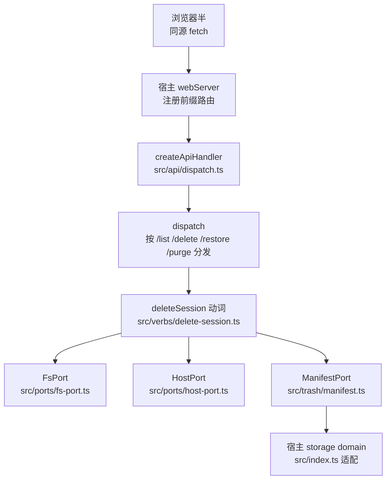
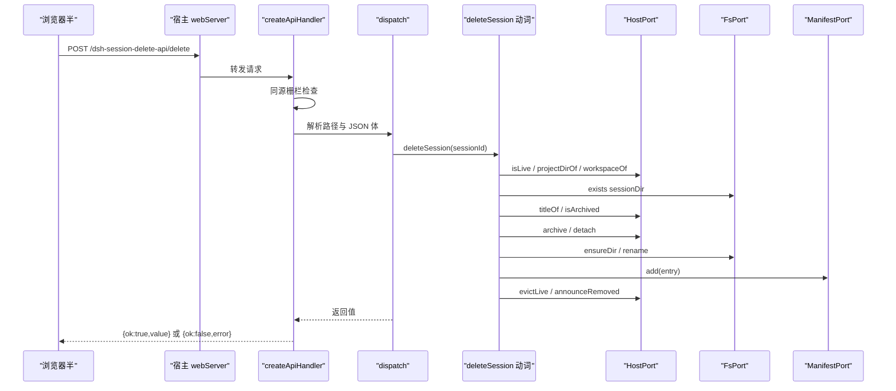
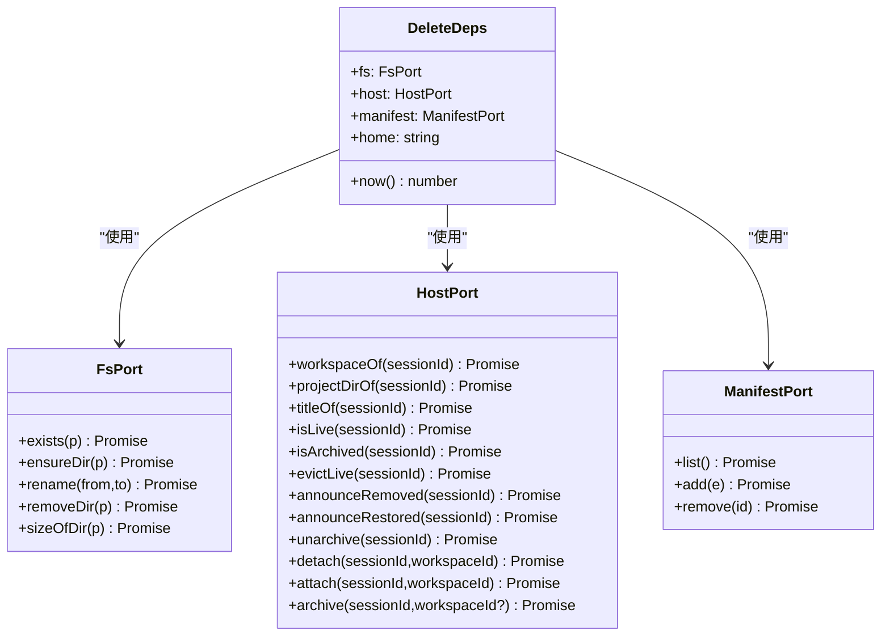
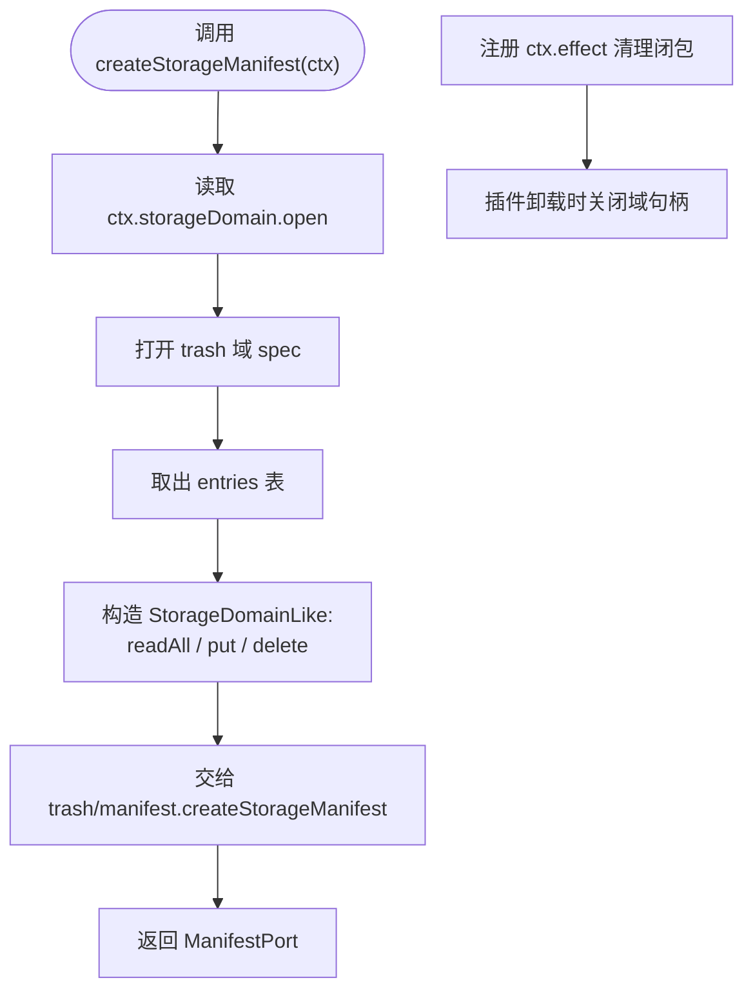
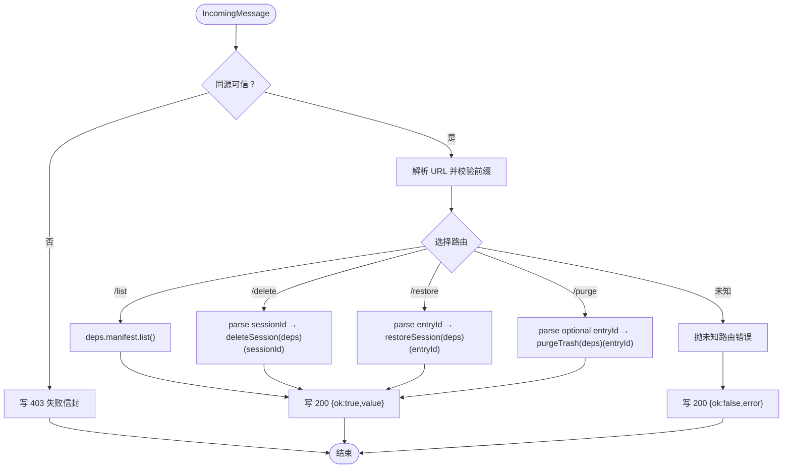
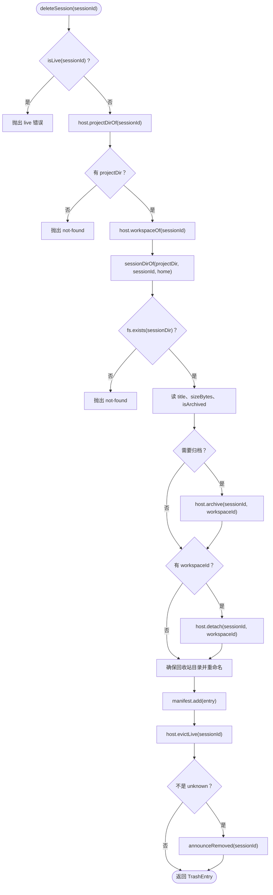
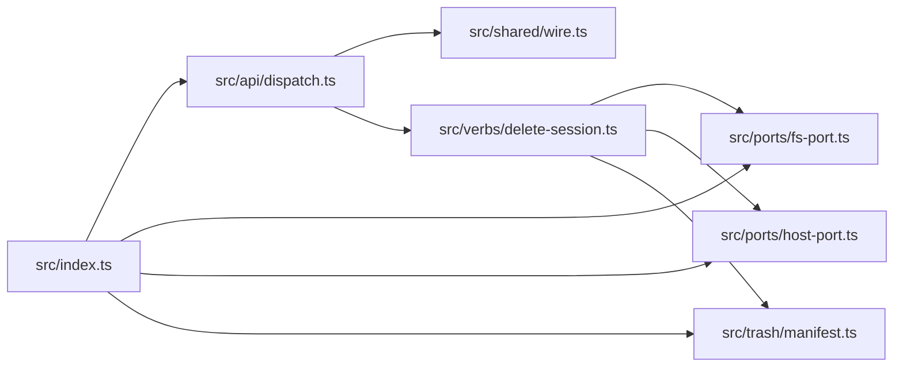

# Node 半 API

<cite>
**本文引用的文件**   
- [src/index.ts](file://src/index.ts)
- [src/api/dispatch.ts](file://src/api/dispatch.ts)
- [src/shared/wire.ts](file://src/shared/wire.ts)
- [src/ports/fs-port.ts](file://src/ports/fs-port.ts)
- [src/ports/host-port.ts](file://src/ports/host-port.ts)
- [src/trash/manifest.ts](file://src/trash/manifest.ts)
- [src/verbs/delete-session.ts](file://src/verbs/delete-session.ts)
- [tests/assembly.test.ts](file://tests/assembly.test.ts)
- [tests/ports.test.ts](file://tests/ports.test.ts)
</cite>

## 目录
1. [引言](#引言)
2. [项目结构](#项目结构)
3. [核心导出与职责边界](#核心导出与职责边界)
4. [架构总览](#架构总览)
5. [关键组件详解](#关键组件详解)
6. [依赖关系分析](#依赖关系分析)
7. [性能与一致性考虑](#性能与一致性考虑)
8. [测试与替换实现](#测试与替换实现)
9. [故障排查指南](#故障排查指南)
10. [结论](#结论)

## 引言
本文档面向在 Cordis 插件上下文中使用本仓库 Node 半的开发者，聚焦三个半导出点：

- `createStorageManifest`：把宿主 `storageDomain` 适配成动词层需要的 `ManifestPort`。
- `createApiHandler`：接收 `DeleteDeps` 并返回一个可直接交给宿主 `webServer.register({kind:'prefix', path, handler})` 的 HTTP 处理器。
- `DeleteDeps` 中的 `FsPort`、`HostPort`、`ManifestPort`：分别限定文件系统、宿主会话服务、回收站清单的职责边界。

文档同时给出最小装配示例、端口模式动机、可替换实现方式，以及键冲突、工作区不匹配、目录不存在等常见错误的调试建议。

## 项目结构
Node 半围绕“动词 + 端口 + 适配器”组织：

- 顶层导出位于 `src/index.ts`：插件名、注入列表、`createStorageManifest`、`createApiHandler`。
- HTTP 路由分发位于 `src/api/dispatch.ts`。
- 跨端契约（前缀、路由段、参数名、信封）位于 `src/shared/wire.ts`。
- 端口定义位于 `src/ports/`：`fs-port.ts`、`host-port.ts`。
- 回收站清单抽象位于 `src/trash/manifest.ts`。
- 删除会话等业务动词位于 `src/verbs/delete-session.ts`。

图表来源
- [src/api/dispatch.ts:1-192](file://src/api/dispatch.ts#L1-L192)
- [src/index.ts:1-200](file://src/index.ts#L1-L200)
- [src/verbs/delete-session.ts:1-104](file://src/verbs/delete-session.ts#L1-L104)

章节来源
- [src/index.ts:1-200](file://src/index.ts#L1-L200)
- [src/api/dispatch.ts:1-192](file://src/api/dispatch.ts#L1-L192)
- [src/shared/wire.ts:1-84](file://src/shared/wire.ts#L1-L84)

## 核心导出与职责边界

### `createStorageManifest(ctx)`
- 输入：Cordis `Context`。
- 输出：`ManifestPort`。
- 作用：
  - 用插件专属域名称打开宿主 `storageDomain`。
  - 只取 `entries` 表，提供 `readAll` / `put` / `delete`。
  - 把该适配层交给 `trash/manifest.ts` 的 `createStorageManifest`，得到统一清单端口。
  - 通过 `ctx.effect` 在插件卸载时关闭域句柄。

关键点
- 域名称必须带插件前缀且符合宿主 `UNIT_NAME_RE`；同名域只能 `open()` 一次，否则激活时报错。
- 清单记录 schema 校验失败走“备份并跳过”，避免一条坏记录导致整个域无法打开。

章节来源
- [src/index.ts:1-200](file://src/index.ts#L1-L200)
- [src/trash/manifest.ts:1-35](file://src/trash/manifest.ts#L1-L35)

### `createApiHandler(deps)`
- 输入：`DeleteDeps`。
- 输出：`(req: IncomingMessage, res: ServerResponse) => Promise<void>`。
- 作用：
  - 同源栅栏检查。
  - 校验 URL 是否以 `/dsh-session-delete-api` 开头。
  - 按剩余路径分发给 `list`、`delete`、`restore`、`purge`。
  - 成功回 `{ok:true,value}`，业务错误回 `{ok:false,error}`，非受信请求回 403。

章节来源
- [src/api/dispatch.ts:1-192](file://src/api/dispatch.ts#L1-L192)
- [src/shared/wire.ts:1-84](file://src/shared/wire.ts#L1-L84)

### `DeleteDeps`
| 字段 | 类型 | 职责 | 典型副作用 |
|---|---|---|---|
| `fs` | `FsPort` | 会话目录与回收站目录的文件操作 | 读大小、建目录、重命名、递归删除 |
| `host` | `HostPort` | 会话归属、活跃性、归档状态、账本 detach/attach/archive、内存摘除与事件通告 | 查 workspaceRegistry、waterfall、sessionController、emit |
| `manifest` | `ManifestPort` | 回收站清单增删查 | 持久化 trash entry |
| `home` | `string` | 宿主数据根，用于计算 `~/.dsh/session-trash` 下目录 | 无直接 I/O，但决定路径空间 |
| `now` | `() => number` | 生成删除时间戳 | 纯函数，便于测试 |

章节来源
- [src/verbs/delete-session.ts:1-104](file://src/verbs/delete-session.ts#L1-L104)

## 架构总览

图表来源
- [src/api/dispatch.ts:1-192](file://src/api/dispatch.ts#L1-L192)
- [src/verbs/delete-session.ts:1-104](file://src/verbs/delete-session.ts#L1-L104)
- [src/ports/host-port.ts:1-200](file://src/ports/host-port.ts#L1-L200)
- [src/ports/fs-port.ts:1-33](file://src/ports/fs-port.ts#L1-L33)
- [src/trash/manifest.ts:1-35](file://src/trash/manifest.ts#L1-L35)

## 关键组件详解

### 端口模式设计动机
端口是 Node 半与外部系统之间的窄接口。它有三个明确好处：

1. **隔离宿主实现细节**：动词层只依赖 `FsPort`、`HostPort`、`ManifestPort`，不需要知道具体调用哪个宿主服务或哪个文件系统 API。
2. **可测试**：测试可以注入内存实现、假文件系统、模拟宿主上下文，从而覆盖未命中、IO 失败、归档回滚等分支。
3. **可替换**：自定义存储、沙箱环境、回放日志等场景只需替换端口实现，而不改业务逻辑。

#### 端口类型图

图表来源
- [src/ports/fs-port.ts:1-33](file://src/ports/fs-port.ts#L1-L33)
- [src/ports/host-port.ts:1-200](file://src/ports/host-port.ts#L1-L200)
- [src/trash/manifest.ts:1-35](file://src/trash/manifest.ts#L1-L35)
- [src/verbs/delete-session.ts:1-104](file://src/verbs/delete-session.ts#L1-L104)

### `createStorageManifest` 的工作流程

图表来源
- [src/index.ts:1-200](file://src/index.ts#L1-L200)
- [src/trash/manifest.ts:1-35](file://src/trash/manifest.ts#L1-L35)

### `createApiHandler` 的请求处理流程

图表来源
- [src/api/dispatch.ts:1-192](file://src/api/dispatch.ts#L1-L192)
- [src/shared/wire.ts:1-84](file://src/shared/wire.ts#L1-L84)

### 删除会话的关键分支

图表来源
- [src/verbs/delete-session.ts:1-104](file://src/verbs/delete-session.ts#L1-L104)

## 依赖关系分析

图表来源
- [src/index.ts:1-200](file://src/index.ts#L1-L200)
- [src/api/dispatch.ts:1-192](file://src/api/dispatch.ts#L1-L192)
- [src/verbs/delete-session.ts:1-104](file://src/verbs/delete-session.ts#L1-L104)

耦合说明
- `index.ts` 是插件装配中心，负责把 Cordis `Context` 转换为各端口。
- `api/dispatch.ts` 不依赖 Cordis，只依赖 `node:http` 类型与业务动词。
- `verbs/delete-session.ts` 是纯业务入口，完全通过端口消费外部能力。
- `ports/*` 是对外系统的窄镜像，降低对宿主实现的隐式依赖。

章节来源
- [src/index.ts:1-200](file://src/index.ts#L1-L200)
- [src/api/dispatch.ts:1-192](file://src/api/dispatch.ts#L1-L192)
- [src/verbs/delete-session.ts:1-104](file://src/verbs/delete-session.ts#L1-L104)

## 性能与一致性考虑

- 清单排序：`ManifestPort.list()` 和 `trash/manifest.ts` 都会按 `deletedAt` 倒序排序，时间复杂度为 O(n log n)。
- 目录大小统计：`FsPort.sizeOfDir` 递归遍历目录树，时间复杂度与目录中文件数量线性相关。
- 存储域懒加载：`createStorageManifest` 只在第一次访问表时打开域句柄，并在插件卸载时关闭，避免长期持有句柄。
- 原子移动：删除会话优先使用同卷 `rename`，减少中间状态窗口。
- 先读后写：标题和目录大小在读阶段收集，避免部分写入后出现不一致。
- 回滚顺序：清单登记失败会反向恢复文件位置、重新 attach 和还原归档状态，防止“文件已入回收站但清单无行”。

章节来源
- [src/ports/fs-port.ts:1-33](file://src/ports/fs-port.ts#L1-L33)
- [src/trash/manifest.ts:1-35](file://src/trash/manifest.ts#L1-L35)
- [src/verbs/delete-session.ts:1-104](file://src/verbs/delete-session.ts#L1-L104)
- [src/index.ts:1-200](file://src/index.ts#L1-L200)

## 测试与替换实现

### 在 Cordis 插件上下文中组装的最小示例

以下示例展示如何把 `workspaceRegistry`、`sessions`、`webServer`、`storageDomain` 以窄接口形式注入到本插件：

1. 声明注入列表：
   - `workspaceRegistry`：提供会话与工作区的归属信息。
   - `storageDomain`：提供回收站清单的持久化域。
   - `webServer`：提供 `/dsh-session-delete-api` 前缀路由承载。

2. 创建主机端口：
   - 使用 `createHostPort(ctx)` 从 Cordis `Context` 构造 `HostPort`。

3. 创建清单端口：
   - 使用 `createStorageManifest(ctx)` 把宿主 `storageDomain` 包装成 `ManifestPort`。

4. 创建文件系统端口：
   - 使用 `createFsPort()` 获取默认 Node 文件系统实现。

5. 构建 `DeleteDeps`：
   - `fs`、`host`、`manifest`、`home`、`now`。

6. 创建 API 处理器：
   - `createApiHandler(deps)` 返回 `(req, res) => Promise<void>`。

7. 注册路由：
   - 通过宿主的 `webServer.register({kind:'prefix', path: SESSION_DELETE_API_PREFIX, handler})` 挂载。

参考接线行为可在测试夹具中看到：测试用 `makeEnv` 构造 `workspaceRegistry`、`waterfall`、`get('sessions')`、`get('sessionProjectionCache')`、`emit`，并断言 `createHostPort` 暴露的十二个方法都返回 Promise，且调用顺序正确。

章节来源
- [src/index.ts:1-200](file://src/index.ts#L1-L200)
- [src/api/dispatch.ts:1-192](file://src/api/dispatch.ts#L1-L192)
- [tests/assembly.test.ts:1-200](file://tests/assembly.test.ts#L1-L200)

### 替换 `FsPort` 支持测试或自定义存储

推荐做法：保留 `FsPort` 接口不变，替换内部实现。

- 测试场景：
  - `exists` 返回固定值。
  - `ensureDir` 把路径加入内存集合。
  - `rename` 更新内存映射。
  - `removeDir` 删除内存条目。
  - `sizeOfDir` 返回预设字节数。

- 自定义存储场景：
  - 如果回收站希望落盘到对象存储或数据库，应先在更高层替换 `ManifestPort`；`FsPort` 通常仍对应本机会话目录的移动与大小统计。
  - 若连会话目录也落到远程介质，则需同时调整 `home` 语义、`sessionDirOf`、`trashDirOf` 所在的路径计算逻辑，但这已经超出 `FsPort` 当前职责。

参考用例
- `tests/ports.test.ts` 验证了真实 `node:fs/promises` 下的存在判断、递归大小累加、解构调用、多级目录创建。

章节来源
- [src/ports/fs-port.ts:1-33](file://src/ports/fs-port.ts#L1-L33)
- [tests/ports.test.ts:1-42](file://tests/ports.test.ts#L1-L42)

### 替换 `HostPort` 实现以支持测试

测试夹具展示了如何构造最小 `HostCtxLike`：

- `workspaceRegistry.list()`：返回工作区实体数组。
- `workspaceRegistry.get(id)`：按 id 查找工作区。
- `workspaceRegistry.archivedSessionIds`：归档会话集合。
- `workspaceRegistry.readSessionHeader(id)`：按会话 ID 读取 header，未知会话抛裸 Error。
- `waterfall(name, args, next)`：查询会话活动，空数组表示不活跃。
- `get('sessions')`：可选活体会话存储。
- `get('sessionProjectionCache')`：可选投影缓存。
- `emit(name, ...args)`：发送事件。

替换策略
- 单元测试：用数组、Map、计数器记录调用。
- 集成测试：使用真实宿主上下文，但钉住行为。
- 回归测试：复现已知宿主行为，例如未知会话抛出的错误消息。

章节来源
- [src/ports/host-port.ts:1-200](file://src/ports/host-port.ts#L1-L200)
- [tests/assembly.test.ts:1-200](file://tests/assembly.test.ts#L1-L200)

### 替换 `ManifestPort` 实现以支持测试

- 内存实现：`trash/manifest.ts` 提供 `createMemoryManifest(seed)`，适合单测。
- 持久化实现：由 `createStorageManifest` 基于宿主 `storageDomain` 提供。
- 自定义实现：只需实现 `list`、`add`、`remove`，并按 `deletedAt` 倒序返回。

章节来源
- [src/trash/manifest.ts:1-35](file://src/trash/manifest.ts#L1-L35)

## 故障排查指南

### 1. 存储域键冲突
现象
- 插件激活时报错，提示域名称不符合规则，或同名域已占用。

原因
- 域名称必须是小写字母、数字和下划线，并以字母开头。
- 一个 facility 内同一个域名只能 `open()` 一次。
- 若其他插件或宿主代码占用了相同域名，本插件会失败。

定位
- 检查 `TRASH_DOMAIN_NAME` 是否被修改为不含插件前缀的名称。
- 检查是否符合 `UNIT_NAME_RE`。
- 检查是否与其他插件共享同一域名。

恢复建议
- 使用包含 scope 与插件名的唯一前缀。
- 升级域版本，但不要随意复用旧名称。
- 确认宿主没有提前 open 过同名域。

章节来源
- [src/index.ts:1-200](file://src/index.ts#L1-L200)

### 2. `workspaceId` 不匹配
现象
- 删除成功，但会话在宿主分组面表现异常。
- 恢复后会话挂回错误工作区，或未分组。

原因
- `workspaceOf(sessionId)` 是从 `workspaceRegistry.list()` 的 `sessionIds` 中查找。
- 如果宿主侧会话与工作区的关系发生变化，而节点尚未刷新，可能拿到 undefined 或旧归属。
- 删除逻辑允许没有工作区的会话，此时 `workspaceId` 为空串，恢复时也不会强行挂回工作区。

定位
- 检查 `workspaceRegistry.list()` 返回的工作区是否包含该 `sessionId`。
- 检查 `workspaceRegistry.get(workspaceId)` 是否能找到目标工作区。
- 检查是否先调用了 `detach`，再误以为还有归属。

恢复建议
- 先确认会话确实属于某个工作区。
- 若会话已被摘出工作区但仍想恢复归属，应在恢复流程中显式传入期望工作区，而不是依赖历史 `workspaceId`。
- 注意：当前删除逻辑中，`workspaceId` 来自宿主，不是用户可配置项。

章节来源
- [src/ports/host-port.ts:1-200](file://src/ports/host-port.ts#L1-L200)
- [src/verbs/delete-session.ts:1-104](file://src/verbs/delete-session.ts#L1-L104)

### 3. 目录不存在
现象
- 删除请求返回 `not-found`。
- 客户端显示会话不存在或 IO 失败。

原因
- `projectDirOf(sessionId)` 返回 `undefined`：宿主账本中没有该会话。
- `fs.exists(sessionDir)` 返回 `false`：会话目录不在预期路径。
- 可能是会话已被手动删除、迁移、清理，或 `home` 指向了不同数据根。

定位
- 查看 `projectDirOf` 返回的是 `undefined` 还是有效目录名。
- 检查 `home` 是否为宿主实际数据根。
- 检查 `sessionDirOf(projectDir, sessionId, home)` 是否等于磁盘上真实路径。

恢复建议
- 如果是误删或路径漂移，先修复 `home` 与宿主一致。
- 如果会话确实已不存在，不要强制恢复；应让用户重新创建或从其他备份恢复。
- 如果怀疑是脏数据，先检查回收站清单是否已有对应 entry。

章节来源
- [src/ports/host-port.ts:1-200](file://src/ports/host-port.ts#L1-L200)
- [src/verbs/delete-session.ts:1-104](file://src/verbs/delete-session.ts#L1-L104)

### 4. 同源请求被拒
现象
- 桌面版或浏览器半调用接口返回 403。
- 本地 curl 能访问，但页面请求失败。

原因
- 同源栅栏要求请求来自回环地址，并且满足 Origin 或 Referer 信任条件。
- 桌面壳转发时会删除 `Origin`，只留 `Referer`；若 `Referer` 也不是 `dsh-app://app`，会被拒绝。

定位
- 检查 `req.socket.remoteAddress` 是否在回环地址集合。
- 检查 `Origin` 是否与 `Host` 同源。
- 检查 `Referer` 是否为桌面壳页面。

恢复建议
- 确认浏览器半通过宿主 web server 的同源路径访问。
- 确认桌面壳没有意外剥离 `Referer`。
- 不要为了绕过栅栏而放宽到任意来源，这会带来 CSRF 风险。

章节来源
- [src/api/dispatch.ts:1-192](file://src/api/dispatch.ts#L1-L192)

### 5. 回收站清单状态不一致
现象
- 文件已进入回收站，但面板看不到对应行。
- 面板能看到行，但原目录已不存在。
- 恢复时报 IO 错误。

原因
- 清单登记发生在文件移动之后；如果清单写入失败，实现会尝试回滚文件位置和宿主状态。
- 如果回滚过程中某个步骤失败，可能出现“半吊子状态”。
- 存储域的一条坏记录会被备份并跳过，不会让域整体崩溃，但可能导致清单缺失该行。

定位
- 检查回收站目录是否存在。
- 检查宿主 `storageDomain` 中是否有对应 entry。
- 检查 `manifest.add` 是否抛出 IO 错误。
- 检查 `manifest.remove` 是否误删。

恢复建议
- 先停止对该会话的删除/恢复并发操作。
- 根据磁盘状态修复清单：
  - 文件在回收站但清单无行：重建 entry。
  - 清单有行但文件不在回收站：移除孤儿 entry。
- 若域中有损坏记录，允许其被备份跳过，但要检查备份目录并评估数据完整性。

章节来源
- [src/verbs/delete-session.ts:1-104](file://src/verbs/delete-session.ts#L1-L104)
- [src/index.ts:1-200](file://src/index.ts#L1-L200)

## 结论
本仓库的 Node 半通过端口模式把三块外部能力清晰分离：

- `FsPort` 管文件系统。
- `HostPort` 管宿主会话与服务。
- `ManifestPort` 管回收站清单。

`createStorageManifest` 把宿主 `storageDomain` 适配成统一的清单端口，`createApiHandler` 把 `DeleteDeps` 暴露给宿主 web server，而 `DeleteDeps` 把业务动词与外部实现解耦。这种设计让插件既能安全接入宿主，又能用内存替身、假文件和模拟上下文完成可靠测试。

使用时的最佳实践是：

1. 在 Cordis 插件中只引用窄接口：`workspaceRegistry`、`sessions`、`webServer`、`storageDomain`。
2. 用 `createHostPort`、`createFsPort`、`createStorageManifest` 构造端口。
3. 用 `createApiHandler` 注册 `/dsh-session-delete-api`。
4. 测试时替换端口，而不是复制业务逻辑。
5. 遇到键冲突、工作区不匹配、目录不存在时，先区分“宿主未命中”和“真实 IO 错误”，再决定是否回滚或人工修复。