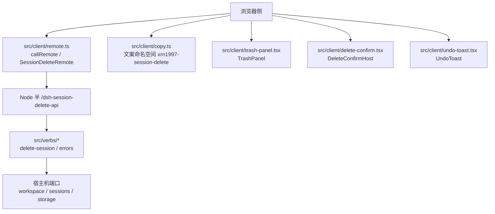
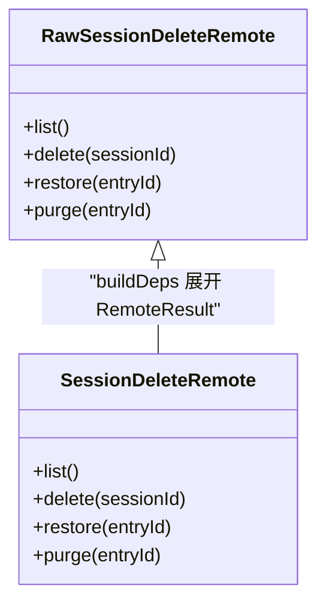
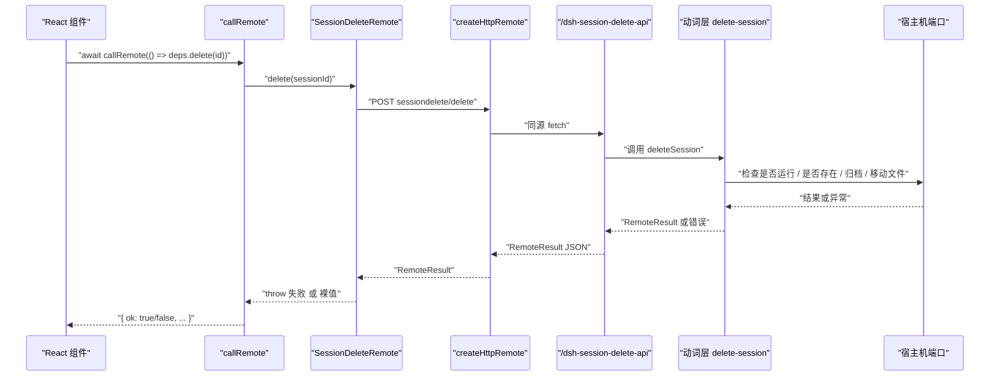
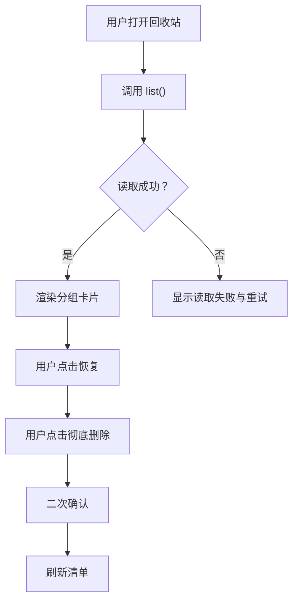
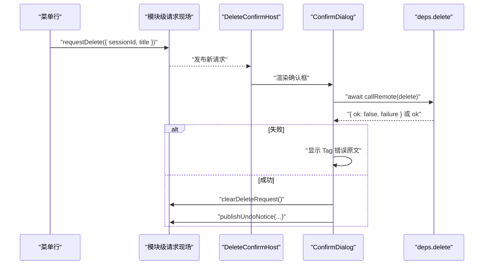
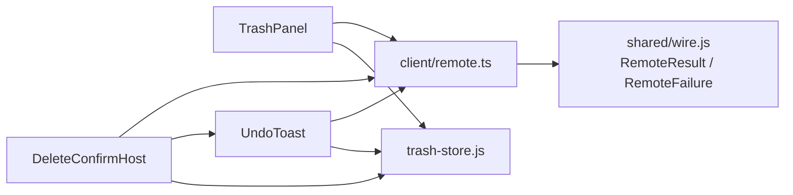
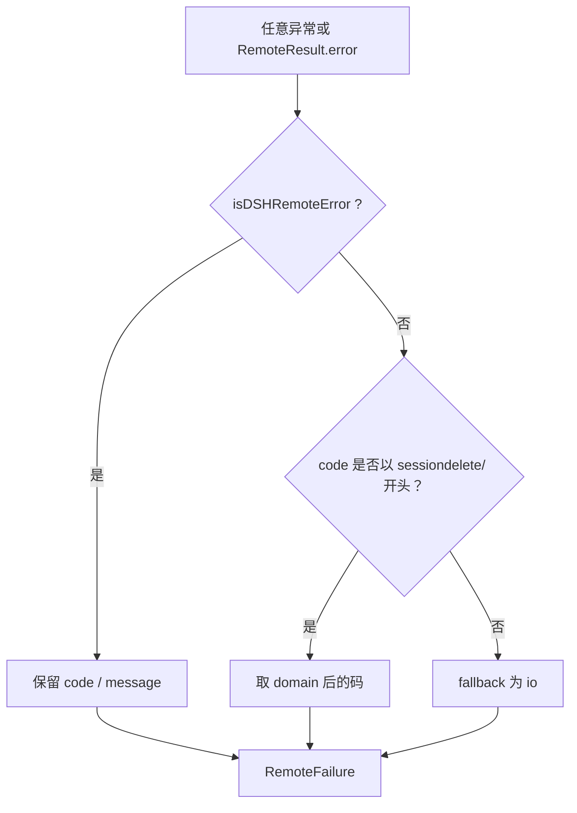
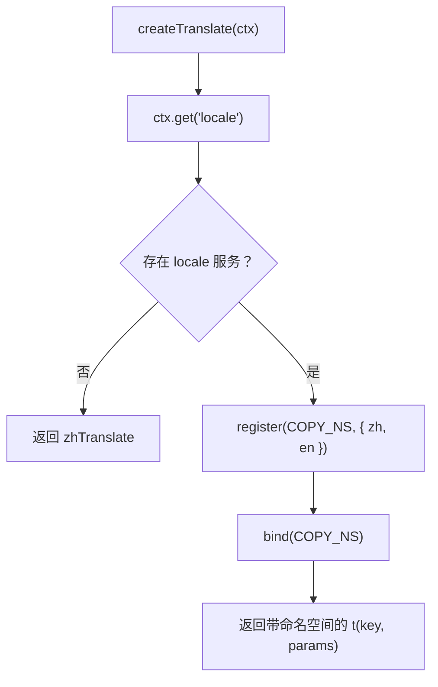

# 浏览器半 API

<cite>
**本文引用的文件**   
- [src/index.ts](file://src/index.ts)
- [src/client/remote.ts](file://src/client/remote.ts)
- [src/client/copy.ts](file://src/client/copy.ts)
- [src/client/trash-panel.tsx](file://src/client/trash-panel.tsx)
- [src/client/delete-confirm.tsx](file://src/client/delete-confirm.tsx)
- [src/client/undo-toast.tsx](file://src/client/undo-toast.tsx)
- [src/client/context.ts](file://src/client/context.ts)
- [src/verbs/delete-session.ts](file://src/verbs/delete-session.ts)
- [src/verbs/errors.ts](file://src/verbs/errors.ts)
- [src/remote/map-error.ts](file://src/remote/map-error.ts)
- [locale/zh.json](file://locale/zh.json)
- [locale/en.json](file://locale/en.json)
</cite>

## 目录

1. [简介](#简介)
2. [项目结构](#项目结构)
3. [核心接口与类型](#核心接口与类型)
4. [架构总览](#架构总览)
5. [详细组件分析](#详细组件分析)
6. [依赖关系分析](#依赖关系分析)
7. [性能与行为特性](#性能与行为特性)
8. [集成指南](#集成指南)
9. [国际化扩展](#国际化扩展)
10. [常见错误与排查](#常见错误与排查)
11. [结论](#结论)

## 简介

本仓库实现了一个“会话删除”插件的浏览器侧公共接口，重点暴露：

- 一次远程调用的统一落地面 `callRemote`。
- 浏览器半与服务端的远程能力抽象 `SessionDeleteRemote`。
- 回收站面板、删除确认框、撤销提示三个 React 组件及其依赖注入方式。
- 文案命名空间 `xrn1997-session-delete` 与宿主 locale 服务的绑定契约。

该模块不是后端：它通过同源 `fetch` 访问 Node 半挂出的 `/dsh-session-delete-api` 前缀路由，再调用宿主的文件系统、工作区、会话等真实服务。浏览器端只负责 UI、状态编排和错误上屏。

## 项目结构

从浏览器半角度看，关键文件按职责划分如下：

| 文件 | 职责 |
|---|---|
| [src/client/remote.ts](file://src/client/remote.ts) | 远程通道、信封、`callRemote`、`SessionDeleteRemote`、`TrashPanelDeps` 等类型 |
| [src/client/copy.ts](file://src/client/copy.ts) | 文案命名空间、中文真源、英文镜像、locale 注册与降级翻译函数 |
| [src/client/trash-panel.tsx](file://src/client/trash-panel.tsx) | 回收站清单主面板 |
| [src/client/delete-confirm.tsx](file://src/client/delete-confirm.tsx) | 挂在 `shell.overlay` 上的删除确认对话框 |
| [src/client/undo-toast.tsx](file://src/client/undo-toast.tsx) | 挂在 `shell.overlay` 上的撤销横幅 |
| [src/client/context.ts](file://src/client/context.ts) | 宿主浏览器侧 `ctx` 的窄镜像，含槽位、可选服务与副作用生命周期 |
| [src/index.ts](file://src/index.ts) | Node 半入口、存储域、API 路由装配（用于理解远端失败来源） |



**图表来源**
- [src/client/remote.ts:1-208](file://src/client/remote.ts#L1-L208)
- [src/client/copy.ts:1-183](file://src/client/copy.ts#L1-L183)
- [src/client/trash-panel.tsx:76-244](file://src/client/trash-panel.tsx#L76-L244)
- [src/client/delete-confirm.tsx:1-174](file://src/client/delete-confirm.tsx#L1-L174)
- [src/client/undo-toast.tsx:1-123](file://src/client/undo-toast.tsx#L1-L123)
- [src/index.ts:201-237](file://src/index.ts#L201-L237)

**章节来源**
- [src/client/remote.ts:1-208](file://src/client/remote.ts#L1-L208)
- [src/client/copy.ts:1-183](file://src/client/copy.ts#L1-L183)
- [src/client/context.ts:1-34](file://src/client/context.ts#L1-L34)

## 核心接口与类型

### callRemote

`callRemote` 是浏览器半对“可能失败的异步操作”的统一包装。它接收一个返回 Promise 的函数，并始终 resolve，不会 reject。

| 参数 | 类型 | 说明 |
|---|---|---|
| `run` | `() => Promise<T>` | 要执行的远程调用或异步业务逻辑 |

| 返回值 | 含义 |
|---|---|
| `{ ok: true; value: T }` | 调用成功，`value` 是解包后的值 |
| `{ ok: false; failure: RemoteFailure }` | 调用失败，`failure.code` 与 `failure.message` 可上屏 |

`RemoteOutcome<T>` 是联合类型：要么成功分支，要么失败分支。调用方应写：

```ts
const outcome = await callRemote(() => deps.delete(sessionId))
if (!outcome.ok) {
  // 处理 failure
}
```

不要写 try/catch 包裹正常流；只有网络不通、响应体不是信封等“通道问题”才会走异常分支。

**章节来源**
- [src/client/remote.ts:95-120](file://src/client/remote.ts#L95-L120)

### RemoteResult<T> 与 RemoteFailure

`RemoteResult<T>` 是浏览器半与 Node 半之间的线上契约：

| 字段 | 类型 | 说明 |
|---|---|---|
| `ok` | `boolean` | 是否成功 |
| `value` | `T` | 成功时的数据 |
| `error` | `RemoteFailure` | 失败时的错误信封 |

`RemoteFailure` 由服务端映射器生成，包含：

| 字段 | 类型 | 说明 |
|---|---|---|
| `code` | `string` | 以 `sessiondelete/` 为前缀的错误码，如 `sessiondelete/not-found`、`sessiondelete/live`、`sessiondelete/io` |
| `message` | `string` | 可用于上屏的人类可读消息 |

浏览器半在 `unwrapRemoteResult` 中把 `{ ok: false, error }` 转换成抛出的错误；而 `callRemote` 捕获这个抛出，最终交给调用方的 `failureOf`。

**章节来源**
- [src/client/remote.ts:22-60](file://src/client/remote.ts#L22-L60)
- [src/client/remote.ts:120-170](file://src/client/remote.ts#L120-L170)
- [src/remote/map-error.ts:1-72](file://src/remote/map-error.ts#L1-L72)
- [src/verbs/errors.ts:1-12](file://src/verbs/errors.ts#L1-L12)

### SessionDeleteRemote 接口

`SessionDeleteRemote` 是展开过 `RemoteResult` 的组件友好接口：

| 方法 | 参数 | 返回值 | 语义 |
|---|---|---|---|
| `list()` | 无 | `Promise<TrashEntryLike[]>` | 读取回收站条目列表 |
| `delete(sessionId)` | 会话 id | `Promise<TrashEntryLike>` | 将会话移入回收站 |
| `restore(entryId)` | 回收站条目 id | `Promise<TrashEntryLike>` | 从回收站恢复会话 |
| `purge(entryId?)` | 可选条目 id | `Promise<PurgeResultLike>` | 清空回收站或彻底删除单条 |

注意：这个接口的方法本身不会返回 `{ ok, value }`；失败会通过 `buildDeps` 转为 throw。因此组件里直接调用即可，无需再判 `ok`。



**图表来源**
- [src/client/remote.ts:146-208](file://src/client/remote.ts#L146-L208)

**章节来源**
- [src/client/remote.ts:146-208](file://src/client/remote.ts#L146-L208)

### TrashPanelDeps

`TrashPanelDeps` 是回收站面板需要的依赖面：

| 字段 | 类型 | 来源 |
|---|---|---|
| `list` | `(sessionId?: string) => Promise<...>` | `SessionDeleteRemote.list` |
| `restore` | `(entryId: string) => Promise<...>` | `SessionDeleteRemote.restore` |
| `purge` | `(entryId?: string) => Promise<...>` | `SessionDeleteRemote.purge` |

实际定义是：

```ts
export type TrashPanelDeps = Pick<SessionDeleteRemote, 'list' | 'restore' | 'purge'>
```

它不要求 `delete`，因为面板只消费已存在的回收站条目。

**章节来源**
- [src/client/trash-panel.tsx:76-80](file://src/client/trash-panel.tsx#L76-L80)
- [src/client/remote.ts:183-208](file://src/client/remote.ts#L183-L208)

### 其他相关依赖类型

| 类型 | 文件 | 用途 |
|---|---|---|
| `DeleteConfirmDeps` | [src/client/remote.ts](file://src/client/remote.ts) | 删除确认框只需要 `delete` |
| `UndoToastDeps` | [src/client/undo-toast.tsx](file://src/client/undo-toast.tsx) | 撤销横幅只需要 `restore` |
| `Translate` | [src/client/copy.ts](file://src/client/copy.ts) | 文案函数签名 |
| `ClientContextLike` | [src/client/context.ts](file://src/client/context.ts) | 宿主浏览器侧 ctx 的窄镜像 |

**章节来源**
- [src/client/remote.ts:208-208](file://src/client/remote.ts#L208-L208)
- [src/client/undo-toast.tsx:14-22](file://src/client/undo-toast.tsx#L14-L22)
- [src/client/copy.ts:130-183](file://src/client/copy.ts#L130-L183)
- [src/client/context.ts:1-34](file://src/client/context.ts#L1-L34)

## 架构总览

浏览器半的远程调用路径如下：



**图表来源**
- [src/client/remote.ts:95-170](file://src/client/remote.ts#L95-L170)
- [src/verbs/delete-session.ts:1-104](file://src/verbs/delete-session.ts#L1-L104)
- [src/index.ts:201-237](file://src/index.ts#L201-L237)

## 详细组件分析

### TrashPanel 回收站面板

`TrashPanel` 是中央列的主面板，负责列出回收站条目、分组、刷新、恢复、清空等操作。

#### props

| 属性 | 类型 | 必填 | 默认值 | 说明 |
|---|---|---:|---|---|
| `deps` | `TrashPanelDeps` | 是 | 无 | 注入 `list`、`restore`、`purge` |
| `t` | `Translate` | 否 | `zhTranslate` | 文案函数；不传表示没有宿主 locale 服务 |

#### 事件与行为

- 点击恢复：调用 `restore(entryId)`，成功后让面板重读。
- 点击彻底删除：打开二次确认框，确认后调用 `purge(entryId)`。
- 点击清空回收站：调用 `purge(undefined)`。
- 点击刷新：重新调用 `list()`。
- 加载失败：显示“读不到”消息与重试按钮。

#### 插槽与注册

面板自身并不直接注册到宿主槽位；注册通常发生在宿主装配层。根据设计稿与本仓约定，面板行图标来自 `TrashPanelIcon`，面板本体由宿主 `main` 槽挂载。



**图表来源**
- [src/client/trash-panel.tsx:76-244](file://src/client/trash-panel.tsx#L76-L244)

**章节来源**
- [src/client/trash-panel.tsx:76-244](file://src/client/trash-panel.tsx#L76-L244)

### DeleteConfirm 删除确认框

`DeleteConfirm` 并不是普通组件实例，而是通过 `DeleteConfirmHost` 挂在 `shell.overlay` 上。它的职责是把“菜单行请求删除”和“对话框渲染提交”拆开，避免菜单收起时对话框被卸载。

#### 导出项

| 导出名 | 类型 | 说明 |
|---|---|---|
| `requestDelete` | `(input: { sessionId: string; title: string }) => void` | 由菜单行调用，告诉 overlay 显示确认框 |
| `clearDeleteRequest` | `() => void` | 关闭确认框 |
| `useDeleteRequest` | Hook | 订阅当前删除请求 |
| `DeleteConfirmHost` | React 组件 | 常驻 overlay 宿主组件 |

#### DeleteConfirmHost props

| 属性 | 类型 | 必填 | 默认值 | 说明 |
|---|---|---:|---|---|
| `deps` | `DeleteConfirmDeps` | 是 | 无 | 需要 `delete` |
| `t` | `Translate` | 否 | `zhTranslate` | 文案函数 |

#### 交互流程



**图表来源**
- [src/client/delete-confirm.tsx:24-174](file://src/client/delete-confirm.tsx#L24-L174)
- [src/client/undo-toast.tsx:14-123](file://src/client/undo-toast.tsx#L14-L123)

**章节来源**
- [src/client/delete-confirm.tsx:1-174](file://src/client/delete-confirm.tsx#L1-L174)

### UndoToast 撤销提示

`UndoToast` 是另一个常驻 `shell.overlay` 的组件，用于在删除成功后给出可撤销的提示横幅。

#### 导出项

| 导出名 | 类型 | 说明 |
|---|---|---|
| `publishUndoNotice` | `(input: { entryId: string; title: string }) => void` | 删除成功后发布撤销通知 |
| `clearUndoNotice` | `() => void` | 手动清除提示 |
| `useUndoNotice` | Hook | 订阅当前撤销通知 |
| `UNDO_HOLD_MS` | `number` | 固定 6000 毫秒停留时间 |
| `UndoToast` | React 组件 | overlay 宿主组件 |

#### UndoToast props

| 属性 | 类型 | 必填 | 默认值 | 说明 |
|---|---|---:|---|---|
| `deps` | `UndoToastDeps` | 是 | 无 | 需要 `restore` |
| `t` | `Translate` | 否 | `zhTranslate` | 文案函数 |

#### 行为规则

- 成功删除后发布通知。
- 用户点击“撤销”时调用 `restore(entryId)`。
- 撤销成功：清掉通知并刷新清单。
- 撤销失败：在同一条通知中显示失败原因，不再提供撤销按钮。

**章节来源**
- [src/client/undo-toast.tsx:1-123](file://src/client/undo-toast.tsx#L1-L123)

## 依赖关系分析

### 组件依赖图



**图表来源**
- [src/client/trash-panel.tsx:76-244](file://src/client/trash-panel.tsx#L76-L244)
- [src/client/delete-confirm.tsx:1-174](file://src/client/delete-confirm.tsx#L1-L174)
- [src/client/undo-toast.tsx:1-123](file://src/client/undo-toast.tsx#L1-L123)
- [src/client/remote.ts:1-208](file://src/client/remote.ts#L1-L208)

### 错误链路



**图表来源**
- [src/remote/map-error.ts:1-72](file://src/remote/map-error.ts#L1-L72)
- [src/verbs/errors.ts:1-12](file://src/verbs/errors.ts#L1-L12)

**章节来源**
- [src/remote/map-error.ts:1-72](file://src/remote/map-error.ts#L1-L72)
- [src/verbs/errors.ts:1-12](file://src/verbs/errors.ts#L1-L12)

## 性能与行为特性

- **远程调用不 reject**：`callRemote` 保证 Promise 始终 resolve，失败通过 `RemoteOutcome` 表达。这符合宿主网关“unary 调用从不因载体问题 reject”的设计原则。
- **失败原文必须能上屏**：非 Error 对象也会尽量取 `.message`，兜底用 `String()`，避免显示 `[object Object]`。
- **通道探测使用 list**：`probeChannel` 只要成功拿到信封就算通道可用，即使信封是 `{ ok: false }`。
- **文案函数可降级**：没有宿主 locale 服务时，所有组件退回到内置中文，不抛错、不阻塞启动。
- **overlay 组件不随菜单卸载**：`DeleteConfirmHost` 与 `UndoToast` 都挂在 `shell.overlay`，独立于菜单子树。
- **回收站清单自收滚动**：面板内部维护滚动容器，避免把宿主中央列撑坏。

[本节为通用行为总结，不直接分析具体代码片段]

## 集成指南

### 在宿主中挂载回收站面板

宿主侧通常需要完成三件事：

1. 创建远程通道：
   - 使用 `createHttpRemote(SESSION_DELETE_API_PREFIX)` 创建 `RawSessionDeleteRemote`。
   - 使用 `buildDeps(raw)` 得到 `SessionDeleteRemote`。
   - 使用 `probeChannel(raw)` 判断通道是否可用。

2. 注册面板行与面板主体：
   - 面板图标：`TrashPanelIcon`。
   - 面板标签：建议传 thunk `() => t('trash.title')`，使标题随语言变化。
   - 面板主体：`TrashPanel`，传入 `deps` 与 `t`。

3. 把面板注册到宿主槽位：
   - 面板行图标注册到 `sidebar.panellist`。
   - 面板主体注册到 `main` 槽。

示例引用位置：

- 面板类型定义与 props：[src/client/trash-panel.tsx:76-80](file://src/client/trash-panel.tsx#L76-L80)
- 面板组件定义：[src/client/trash-panel.tsx:244-244](file://src/client/trash-panel.tsx#L244-L244)
- 远程通道与依赖构建：[src/client/remote.ts:146-208](file://src/client/remote.ts#L146-L208)
- 渠道探测：[src/client/remote.ts:173-181](file://src/client/remote.ts#L173-L181)

### 在 shell.overlay 上挂载 DeleteConfirmHost 与 UndoToast

`DeleteConfirmHost` 和 `UndoToast` 都是常驻 overlay 的宿主组件：

```ts
import { DeleteConfirmHost } from './client/delete-confirm'
import { UndoToast } from './client/undo-toast'

// 在宿主注入 shell.overlay 时挂载
ctx.slots.inject('shell.overlay', () => ({
  components: [
    { component: DeleteConfirmHost, inject: () => ({ deps: confirmDeps, t }) },
    { component: UndoToast, inject: () => ({ deps: undoDeps, t }) },
  ],
}))
```

- `confirmDeps` 需要提供 `delete`。
- `undoDeps` 需要提供 `restore`。
- `t` 来自 `createTranslate(ctx)`。

示例引用位置：

- 删除确认宿主组件：[src/client/delete-confirm.tsx:80-100](file://src/client/delete-confirm.tsx#L80-L100)
- 撤销提示宿主组件：[src/client/undo-toast.tsx:88-123](file://src/client/undo-toast.tsx#L88-L123)
- 宿主 ctx 窄镜像：[src/client/context.ts:1-34](file://src/client/context.ts#L1-L34)

### 通过菜单项触发删除确认框

不要在菜单行里直接弹出确认框。正确做法是：

1. 菜单行渲染时保存 `setMenuOpen`。
2. 用户点击菜单行时先收起菜单。
3. 调用 `requestDelete({ sessionId, title })`。
4. 如果删除失败，`DeleteConfirmHost` 已经在 overlay 上显示错误原文，用户可以再次尝试。

示例引用位置：

- 请求与取消接口：[src/client/delete-confirm.tsx:40-78](file://src/client/delete-confirm.tsx#L40-L78)
- 确认框提交逻辑：[src/client/delete-confirm.tsx:100-174](file://src/client/delete-confirm.tsx#L100-L174)

### 组件导出速查

| 导出 | 文件 | 主要用途 |
|---|---|---|
| `TrashPanel` | [src/client/trash-panel.tsx](file://src/client/trash-panel.tsx) | 回收站清单主面板 |
| `TrashPanelIcon` | [src/client/trash-entry.tsx](file://src/client/trash-entry.tsx) | 侧栏面板行图标 |
| `DeleteConfirmHost` | [src/client/delete-confirm.tsx](file://src/client/delete-confirm.tsx) | overlay 上的删除确认框 |
| `requestDelete` | [src/client/delete-confirm.tsx](file://src/client/delete-confirm.tsx) | 菜单行触发的删除请求 |
| `clearDeleteRequest` | [src/client/delete-confirm.tsx](file://src/client/delete-confirm.tsx) | 关闭删除确认框 |
| `useDeleteRequest` | [src/client/delete-confirm.tsx](file://src/client/delete-confirm.tsx) | 订阅删除请求 |
| `UndoToast` | [src/client/undo-toast.tsx](file://src/client/undo-toast.tsx) | overlay 上的撤销横幅 |
| `publishUndoNotice` | [src/client/undo-toast.tsx](file://src/client/undo-toast.tsx) | 删除成功后发布撤销通知 |
| `clearUndoNotice` | [src/client/undo-toast.tsx](file://src/client/undo-toast.tsx) | 清除撤销通知 |
| `useUndoNotice` | [src/client/undo-toast.tsx](file://src/client/undo-toast.tsx) | 订阅撤销通知 |
| `callRemote` | [src/client/remote.ts](file://src/client/remote.ts) | 统一远程调用落地面 |
| `SessionDeleteRemote` | [src/client/remote.ts](file://src/client/remote.ts) | 组件依赖接口 |
| `TrashPanelDeps` | [src/client/trash-panel.tsx](file://src/client/trash-panel.tsx) | 面板依赖类型 |
| `createTranslate` | [src/client/copy.ts](file://src/client/copy.ts) | 绑定宿主 locale 服务 |

**章节来源**
- [src/client/trash-panel.tsx:76-244](file://src/client/trash-panel.tsx#L76-L244)
- [src/client/trash-entry.tsx:1-30](file://src/client/trash-entry.tsx#L1-L30)
- [src/client/delete-confirm.tsx:1-174](file://src/client/delete-confirm.tsx#L1-L174)
- [src/client/undo-toast.tsx:1-123](file://src/client/undo-toast.tsx#L1-L123)
- [src/client/remote.ts:95-208](file://src/client/remote.ts#L95-L208)
- [src/client/copy.ts:130-183](file://src/client/copy.ts#L130-L183)

## 国际化扩展

### 文案命名空间

本插件使用命名空间：

```ts
const COPY_NS = 'xrn1997-session-delete'
```

这是第三方插件文案命名空间，不应与宿主占用的 `common`、`settings`、`sidebar` 等冲突。

### 中文与英文字典

中文是完整真源，英文必须逐键齐全。缺失任一键会在宿主注册时报错。当前覆盖的键包括：

- `common.*`：通用文案
- `trash.*`：回收站界面文案
- `menu.*`：菜单项文案
- `dialog.*`：删除确认框文案
- `undo.*`：撤销提示文案

新增文案时，必须同时补全 `ZH` 与 `EN` 中的对应键。

### 绑定宿主 locale 服务

`createTranslate` 的行为：

1. 尝试从 `ctx.get('locale')` 读取可选服务。
2. 若不存在，返回 `zhTranslate`，即直接使用内置中文。
3. 若存在，调用 `register(COPY_NS, { zh: ZH, en: EN })`。
4. 调用 `bind(COPY_NS)` 获取记忆化翻译函数。
5. 把 disposer 挂进 `ctx.effect`，避免 HMR 或卸载后重复注册。



**图表来源**
- [src/client/copy.ts:130-183](file://src/client/copy.ts#L130-L183)

### 扩展步骤

1. 在 `copy.ts` 的 `ZH` 对象中添加新键。
2. 在 `EN` 对象中添加相同键的英文翻译。
3. 在目标组件中使用 `t('xrn1997-session-delete.new.key', params)`。
4. 若面板标题需要随语言切换，传 thunk：`() => t('trash.title')`。
5. 不要把文案硬编码在 JSX 字符串中，也不要只改中文不改英文。

**章节来源**
- [src/client/copy.ts:1-183](file://src/client/copy.ts#L1-L183)

## 常见错误与排查

### 远程调用失败

**现象**

- 删除、恢复、清空后出现 `sessiondelete/...` 错误。
- 控制台或界面上显示服务端返回的 `message`。

**可能原因**

- 会话正在运行：错误码 `sessiondelete/live`。
- 会话不存在：错误码 `sessiondelete/not-found`。
- 文件读写或宿主服务异常：错误码 `sessiondelete/io`。

**排查步骤**

1. 检查 `outcome.failure.code` 是否为 `sessiondelete/live`、`sessiondelete/not-found` 或 `sessiondelete/io`。
2. 如果是 `live`，先停止会话再删除。
3. 如果是 `not-found`，检查会话是否已被外部移除。
4. 如果是 `io`，查看底层 `cause` 与 Node 半日志。
5. 确认 Node 半已成功注册 `/dsh-session-delete-api`。

**章节来源**
- [src/client/remote.ts:95-120](file://src/client/remote.ts#L95-L120)
- [src/remote/map-error.ts:1-72](file://src/remote/map-error.ts#L1-L72)
- [src/verbs/delete-session.ts:1-104](file://src/verbs/delete-session.ts#L1-L104)
- [src/index.ts:201-237](file://src/index.ts#L201-L237)

### locale 未加载或报错

**现象**

- 组件仍可使用，但全部显示内置中文。
- 宿主报“某命名空间已注册 locale”或“缺少某种语言”。

**可能原因**

- `ctx.get('locale')` 返回 undefined。
- `register` 返回的 disposer 没有挂进 `ctx.effect`。
- HMR 或重复挂载导致同一命名空间重复注册。
- `en` 字典缺键。

**排查步骤**

1. 确认 `ctx.get('locale')` 存在。
2. 确认 `createTranslate` 的 register 调用由 `ctx.effect` 管理。
3. 确认 `ZH` 与 `EN` 键集合一致。
4. 确认面板标题使用 thunk `() => t('trash.title')`，而不是静态字符串。
5. 检查 HMR 或热重载是否造成重复 effect。

**章节来源**
- [src/client/copy.ts:1-183](file://src/client/copy.ts#L1-L183)
- [src/client/context.ts:1-34](file://src/client/context.ts#L1-L34)

### 组件卸载后状态丢失

**现象**

- 菜单收起后确认框消失。
- 撤销横幅在菜单关闭后消失。
- 回收站面板刷新后数据为空。

**原因与对策**

- 菜单行会随菜单一起卸载，因此确认框不能放在菜单行内部。应使用 `requestDelete` 与 `DeleteConfirmHost`。
- 撤销提示也放在 `shell.overlay`，通过 `publishUndoNotice` 触发。
- 回收站面板内部维护自己的滚动与状态；如需跨刷新保持，应配合宿主提供的持久化 store。
- 面板首次挂载时只取一次数，后续需要显式刷新或依赖失效机制。

**章节来源**
- [src/client/delete-confirm.tsx:1-78](file://src/client/delete-confirm.tsx#L1-L78)
- [src/client/undo-toast.tsx:1-60](file://src/client/undo-toast.tsx#L1-L60)
- [src/client/trash-panel.tsx:1-76](file://src/client/trash-panel.tsx#L1-L76)

### 通道不可用

**现象**

- `probeChannel` 返回 false。
- 面板入口不出现。
- 前端报“取数通道打不通”或“回的不是信封”。

**可能原因**

- Node 半未启动。
- `/dsh-session-delete-api` 前缀路由未注册。
- 请求落到 SPA 兜底处理器，返回 HTML 而非 JSON 信封。

**排查步骤**

1. 检查 Node 半是否成功调用 `webServer.register`。
2. 检查请求路径是否为 `SESSION_DELETE_API_PREFIX`。
3. 检查响应体是否为 `RemoteResult` JSON。
4. 确认 `probeChannel` 捕获的是往返失败，而不是 `{ ok: false }`。

**章节来源**
- [src/client/remote.ts:146-181](file://src/client/remote.ts#L146-L181)
- [src/index.ts:201-237](file://src/index.ts#L201-L237)

## 结论

浏览器半 API 的核心契约可以概括为：

- 所有远程失败都通过 `RemoteResult` 或 `RemoteOutcome` 表达，不静吞错误。
- `callRemote` 把“值或抛错”统一成“成功或失败对象”，组件只需判断 `ok`。
- `SessionDeleteRemote` 是组件依赖面；`TrashPanelDeps`、`DeleteConfirmDeps`、`UndoToastDeps` 是更窄的依赖切片。
- 三个组件通过依赖注入获得远程能力，通过 `t` 获得文案。
- 面板、确认框、撤销提示分别承担不同职责，并通过 `shell.overlay` 与模块级现场解耦宿主生命周期。
- 国际化扩展必须同时维护中文与英文，且命名空间必须以插件专属前缀开头。