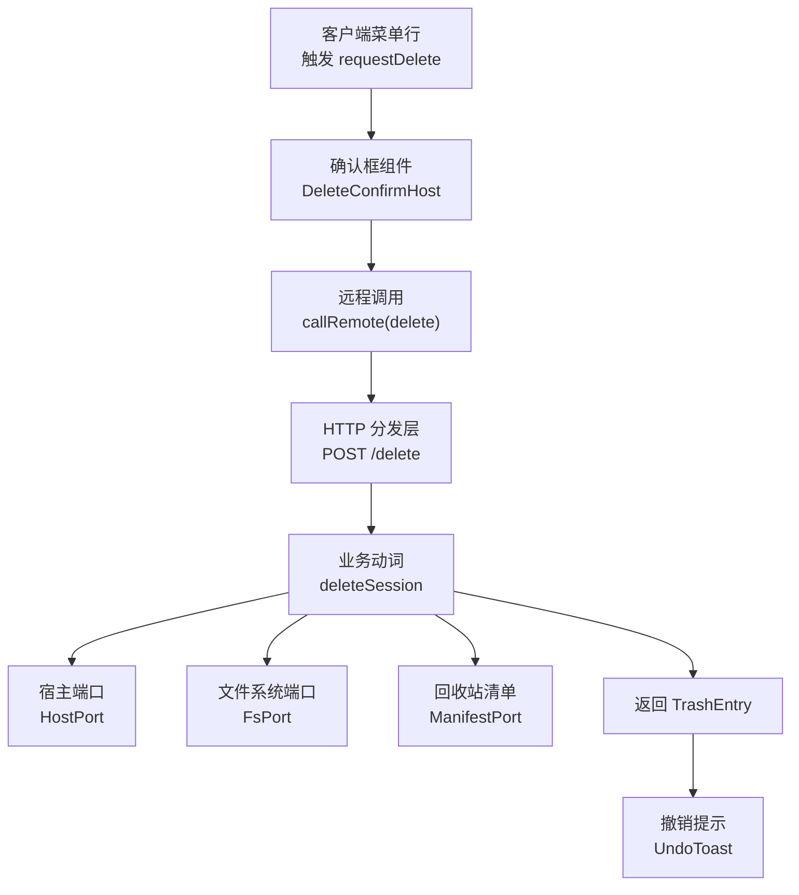
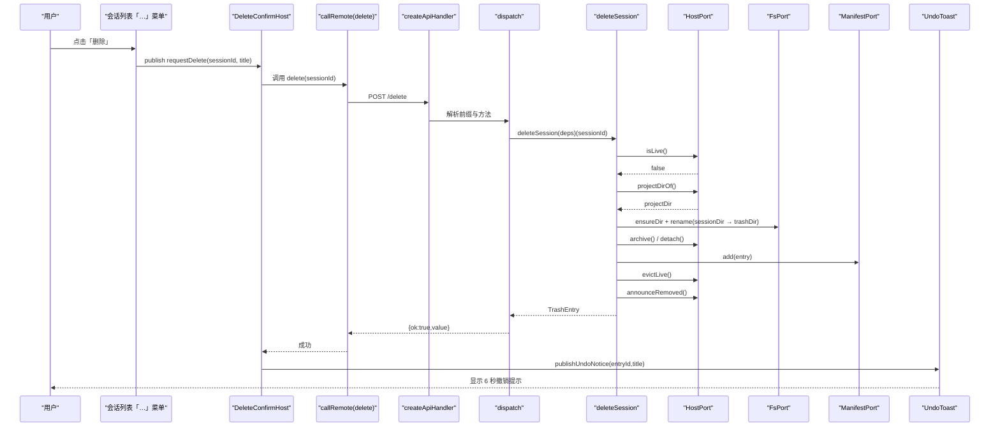
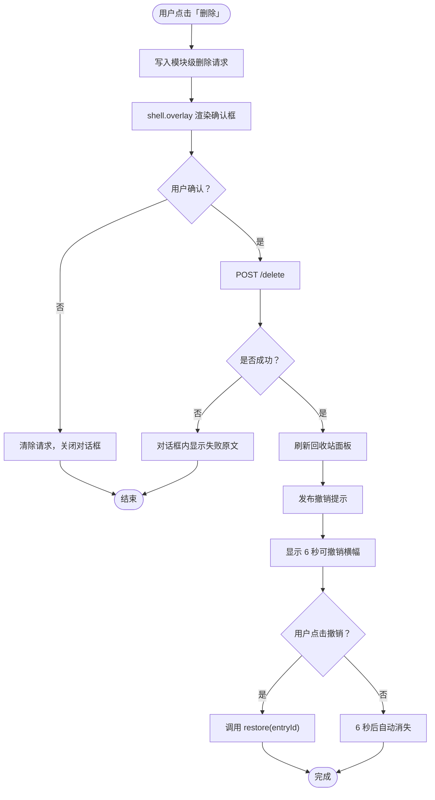
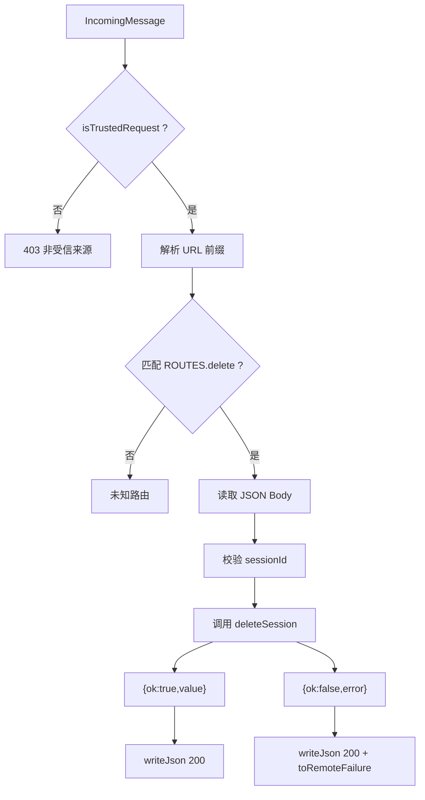
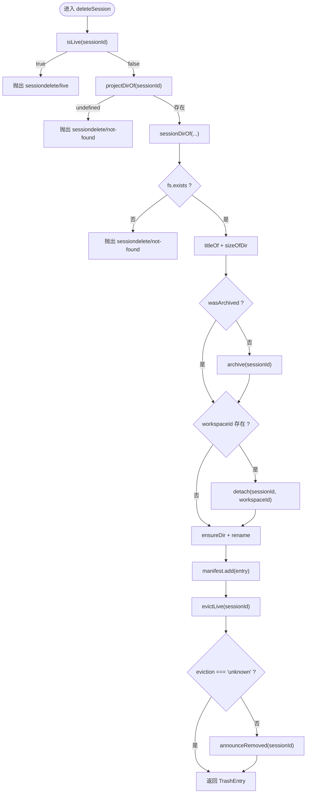
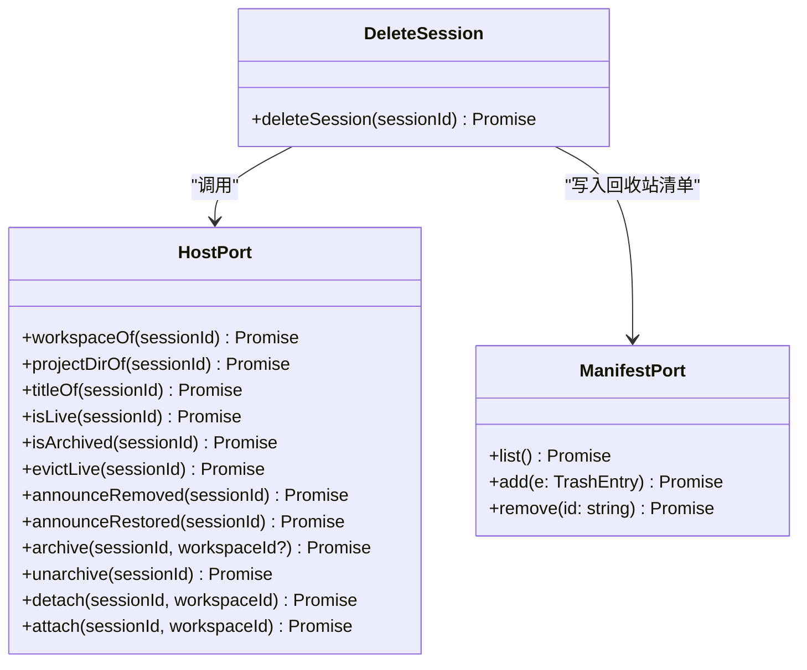
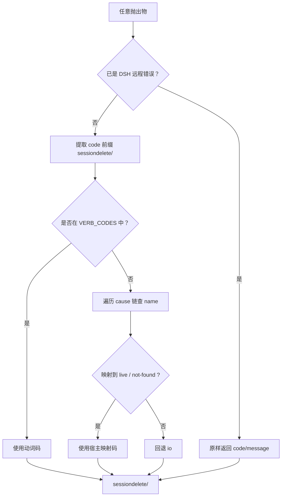
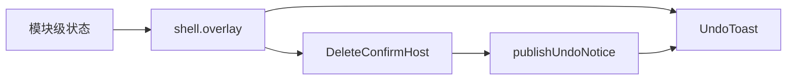
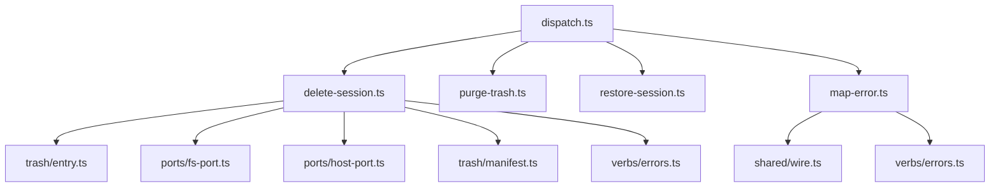

# 会话删除

<cite>
**本文引用的文件**   
- [delete-session.ts](file://src/verbs/delete-session.ts)
- [dispatch.ts](file://src/api/dispatch.ts)
- [map-error.ts](file://src/remote/map-error.ts)
- [host-port.ts](file://src/ports/host-port.ts)
- [manifest.ts](file://src/trash/manifest.ts)
- [delete-confirm.tsx](file://src/client/delete-confirm.tsx)
- [undo-toast.tsx](file://src/client/undo-toast.tsx)
- [delete-session.test.ts](file://tests/delete-session.test.ts)
</cite>

## 目录
1. [引言](#引言)
2. [项目结构](#项目结构)
3. [核心组件](#核心组件)
4. [架构总览](#架构总览)
5. [详细组件分析](#详细组件分析)
6. [依赖关系分析](#依赖关系分析)
7. [性能与一致性](#性能与一致性)
8. [故障排查指南](#故障排查指南)
9. [结论](#结论)

## 引言
本文件从用户视角到代码实现，完整说明「会话删除」功能：用户在会话列表的「…」菜单点击删除，弹出确认框；确认后通过 POST /delete 调用后端；成功后显示 6 秒可撤销提示。随后深入到 `deleteSession` 动词的事务流程、HTTP 分发层、错误映射表，以及通过 `shell.overlay` 注入确认框与撤销提示的实现机制，并给出常见异常和扩展建议。

## 项目结构
该功能横跨客户端 UI、HTTP 路由、业务动词、宿主端口与回收站清单五个层次：

**图表来源**
- [delete-confirm.tsx:1-174](file://src/client/delete-confirm.tsx#L1-L174)
- [dispatch.ts:1-192](file://src/api/dispatch.ts#L1-L192)
- [delete-session.ts:1-104](file://src/verbs/delete-session.ts#L1-L104)
- [host-port.ts:1-200](file://src/ports/host-port.ts#L1-L200)
- [manifest.ts:1-35](file://src/trash/manifest.ts#L1-L35)
- [undo-toast.tsx:1-123](file://src/client/undo-toast.tsx#L1-L123)

**章节来源**
- [delete-session.ts:1-104](file://src/verbs/delete-session.ts#L1-L104)
- [dispatch.ts:1-192](file://src/api/dispatch.ts#L1-L192)
- [delete-confirm.tsx:1-174](file://src/client/delete-confirm.tsx#L1-L174)
- [undo-toast.tsx:1-123](file://src/client/undo-toast.tsx#L1-L123)

## 核心组件
- 客户端确认框：把删除请求写入模块级状态，并通过 `shell.overlay` 渲染对话框。
- 撤销提示：独立模块级通知台，固定 6 秒停留时间，支持恢复操作。
- HTTP 分发器：按前缀路由解析请求体、校验方法、调用动词，并把动词抛出的错误统一转成信封。
- 会话删除动词：封装 isLive 拦截、projectDirOf 解析、archive/detach/rename/manifest.add/evictLive/announceRemoved 事务。
- 宿主端口：镜像宿主服务的最小方法面，负责工作区、归档、活体摘除与事件通告。
- 回收站清单：抽象 add/list/remove，内存实现用于测试，存储适配实现用于宿主。

**章节来源**
- [delete-confirm.tsx:1-174](file://src/client/delete-confirm.tsx#L1-L174)
- [undo-toast.tsx:1-123](file://src/client/undo-toast.tsx#L1-L123)
- [dispatch.ts:1-192](file://src/api/dispatch.ts#L1-L192)
- [delete-session.ts:1-104](file://src/verbs/delete-session.ts#L1-L104)
- [host-port.ts:1-200](file://src/ports/host-port.ts#L1-L200)
- [manifest.ts:1-35](file://src/trash/manifest.ts#L1-L35)

## 架构总览
下图展示一次成功删除的端到端调用链：

**图表来源**
- [delete-confirm.tsx:1-174](file://src/client/delete-confirm.tsx#L1-L174)
- [dispatch.ts:1-192](file://src/api/dispatch.ts#L1-L192)
- [delete-session.ts:1-104](file://src/verbs/delete-session.ts#L1-L104)
- [undo-toast.tsx:1-123](file://src/client/undo-toast.tsx#L1-L123)

## 详细组件分析

### 用户流程：从菜单到撤销提示
1. 用户在会话列表行打开「…」菜单，选择「删除」。
2. 菜单行不直接发起网络请求，而是调用 `requestDelete({ sessionId, title })`，把请求写进模块级状态。
3. `DeleteConfirmHost` 挂在 `shell.overlay` 上，订阅该状态并渲染确认对话框。
4. 用户点击确认后，调用 `callRemote(() => deps.delete(current.sessionId))`。
5. 成功后清空请求、刷新回收站面板，并发布撤销提示。
6. `UndoToast` 在 `shell.overlay` 上显示 6 秒横幅，提供「撤销」按钮。

**图表来源**
- [delete-confirm.tsx:1-174](file://src/client/delete-confirm.tsx#L1-L174)
- [undo-toast.tsx:1-123](file://src/client/undo-toast.tsx#L1-L123)

**章节来源**
- [delete-confirm.tsx:1-174](file://src/client/delete-confirm.tsx#L1-L174)
- [undo-toast.tsx:1-123](file://src/client/undo-toast.tsx#L1-L123)

### HTTP 层：`dispatch.ts` 与 `/delete`
`dispatch.ts` 是薄线 Node 半的内部分发器，职责是：
- 同源栅栏：只允许回环地址、同源 Origin，或桌面壳 `dsh-app://app` 的请求。
- 路由匹配：`list` 为 GET，`delete`、`restore`、`purge` 为 POST。
- 请求体验证：限制 JSON Body 最大字节数，要求必需字段为非空字符串。
- 调用动词：对 `/delete` 解析 `sessionId` 后调用 `deleteSession(deps)(sessionId)`。
- 统一信封：所有结果都包装为 `{ ok, value }` 或 `{ ok, error }`；错误经 `toRemoteFailure` 转换。

**图表来源**
- [dispatch.ts:1-192](file://src/api/dispatch.ts#L1-L192)

**章节来源**
- [dispatch.ts:1-192](file://src/api/dispatch.ts#L1-L192)

### 会话删除动词：`deleteSession` 事务
`deleteSession` 是删除的核心事务函数，关键步骤如下：

1. **运行中拦截**：调用 `host.isLive(sessionId)`，若为真则立即抛出 `verbError('live', ...)`，不做任何写操作。
2. **解析会话目录**：调用 `host.projectDirOf(sessionId)`，若返回空值则抛出 `verbError('not-found', ...)`。
3. **可选工作区**：调用 `host.workspaceOf(sessionId)`，未分组会话返回 `undefined`，后续不 detach/attach。
4. **路径与存在性检查**：用 `sessionDirOf(projectDir, sessionId, home)` 构造路径，再 `fs.exists` 验证。
5. **提前纯读**：先取标题与目录大小，失败时包装为 `verbError('io', ...)`，保证零副作用失败。
6. **归档与摘账本**：
   - 若未归档，先 `archive(sessionId, workspaceId)`。
   - 若有工作区，再 `detach(sessionId, workspaceId)`；失败时尝试回滚归档。
7. **原子移动**：确保回收站根目录存在，然后 `rename(sessionDir, trashDir)`；失败时回滚 attach/unarchive。
8. **登记清单**：`manifest.add(entry)`；失败时回滚 rename/attach/unarchive。
9. **通知宿主刷新**：`evictLive(sessionId)` 返回三种结果，仅当不是 `unknown` 时才发 `announceRemoved`。

**图表来源**
- [delete-session.ts:1-104](file://src/verbs/delete-session.ts#L1-L104)

**章节来源**
- [delete-session.ts:1-104](file://src/verbs/delete-session.ts#L1-L104)
- [delete-session.test.ts:1-208](file://tests/delete-session.test.ts#L1-L208)

### 宿主端口：`HostPort` 契约
`HostPort` 是本插件访问宿主的窄接口，包括：
- `workspaceOf`：会话属于哪个工作区。
- `projectDirOf`：会话落盘的项目目录名。
- `titleOf`：会话标题。
- `isLive` / `isArchived`：运行态与归档态判断。
- `evictLive`：摘除内存中的活体，返回 `evicted | not-live | unknown`。
- `announceRemoved` / `announceRestored`：向客户端广播会话移除或恢复。
- `archive` / `unarchive` / `detach` / `attach`：归档与账本成员资格管理。

**图表来源**
- [host-port.ts:1-200](file://src/ports/host-port.ts#L1-L200)
- [delete-session.ts:1-104](file://src/verbs/delete-session.ts#L1-L104)
- [manifest.ts:1-35](file://src/trash/manifest.ts#L1-L35)

**章节来源**
- [host-port.ts:1-200](file://src/ports/host-port.ts#L1-L200)
- [manifest.ts:1-35](file://src/trash/manifest.ts#L1-L35)

### 错误映射：`map-error.ts`
`toRemoteFailure` 是服务端与客户端之间的唯一错误映射点：
- 已识别的 DSH 远程错误原样透传。
- 宿主类型化错误（如 `WorkspaceUnknownSessionError`、`WorkspaceActiveSessionError`）映射为 `not-found` 或 `live`。
- 动词抛出的 `sessiondelete/<码>` 被剥离域名后还原为内部码。
- 其余情况统一归为 `io`。
- 最终输出 `{ code: "sessiondelete/<码>", message }`，供 HTTP 层写入信封。

**图表来源**
- [map-error.ts:1-72](file://src/remote/map-error.ts#L1-L72)

**章节来源**
- [map-error.ts:1-72](file://src/remote/map-error.ts#L1-L72)

### 确认框与撤销提示：通过 `shell.overlay` 注入
- 确认框不能放在菜单行里，因为菜单收起时该行会卸载；因此使用模块级状态 + `shell.overlay` 常驻组件。
- 撤销提示同样独立于菜单行，使用 `publishUndoNotice` 发布通知，由 `UndoToast` 消费。
- 两者都通过 React 的 `useSyncExternalStore` 订阅模块级 store，避免引入额外状态库。

**图表来源**
- [delete-confirm.tsx:1-174](file://src/client/delete-confirm.tsx#L1-L174)
- [undo-toast.tsx:1-123](file://src/client/undo-toast.tsx#L1-L123)

**章节来源**
- [delete-confirm.tsx:1-174](file://src/client/delete-confirm.tsx#L1-L174)
- [undo-toast.tsx:1-123](file://src/client/undo-toast.tsx#L1-L123)

## 依赖关系分析
- `dispatch.ts` 依赖 `verbs/delete-session.ts`、`verbs/purge-trash.ts`、`verbs/restore-session.ts`、`shared/wire.ts`、`remote/map-error.ts`。
- `delete-session.ts` 依赖 `trash/entry.ts`、`ports/fs-port.ts`、`ports/host-port.ts`、`trash/manifest.ts`、`verbs/errors.ts`。
- `host-port.ts` 是宿主服务的窄镜像，不直接 import 宿主包，而是按方法面探测服务。
- `map-error.ts` 依赖 `shared/wire.ts` 和 `verbs/errors.ts`，集中处理跨域错误。

**图表来源**
- [dispatch.ts:1-192](file://src/api/dispatch.ts#L1-L192)
- [delete-session.ts:1-104](file://src/verbs/delete-session.ts#L1-L104)
- [map-error.ts:1-72](file://src/remote/map-error.ts#L1-L72)

**章节来源**
- [dispatch.ts:1-192](file://src/api/dispatch.ts#L1-L192)
- [delete-session.ts:1-104](file://src/verbs/delete-session.ts#L1-L104)
- [map-error.ts:1-72](file://src/remote/map-error.ts#L1-L72)

## 性能与一致性
- 事务顺序优先保证可见性与一致性：先归档再摘账本，避免“无主且可见”的窗口。
- 纯读前置：标题与目录大小在写之前读取，失败即零副作用失败。
- 原子移动：同卷 `rename` 瞬时完成，减少中间态风险。
- 最后登记清单：即使清单写入失败，也会回滚前面所有写操作，避免孤儿条目。
- 通知门槛：仅当 `evictLive` 明确知道会话已从宿主列表摘除时才发 `announceRemoved`，避免假告警。
- 撤销时长固定 6 秒，避免用户来不及反应。

[本节为通用设计讨论，不直接分析具体代码片段]

## 故障排查指南

### 常见异常
- **会话不存在**：`projectDirOf` 返回空值，或 `sessionDirOf` 对应目录不存在，动词抛出 `sessiondelete/not-found`。
- **磁盘权限不足**：`fs.rename` 或 `ensureDir` 失败，动词包装为 `sessiondelete/io`，并携带原始错误作为 `cause`。
- **路径包含非 ASCII 字符**：`projectKey` 会把非 ASCII 编码为十六进制占位符，但若宿主侧路径计算不一致，可能导致 `projectDirOf` 无法命中。
- **恢复时项目目录冲突**：恢复流程依赖清单中的 `projectDir` 与 `sessionId`；若目录已被其他会话占用，应走恢复失败路径，由上层错误处理提示。
- **运行中会话**：`isLive` 返回真，动词直接拒绝，不产生写操作。
- **同源栅栏失败**：HTTP 层返回 403，通常是跨源请求或非回环地址。

**章节来源**
- [delete-session.ts:1-104](file://src/verbs/delete-session.ts#L1-L104)
- [dispatch.ts:1-192](file://src/api/dispatch.ts#L1-L192)
- [host-port.ts:1-200](file://src/ports/host-port.ts#L1-L200)
- [delete-session.test.ts:1-208](file://tests/delete-session.test.ts#L1-L208)

### 如何扩展自定义错误码
1. 在动词层使用 `verbError(code, message, cause)` 抛出带域前缀的错误。
2. 将新码加入 `VERB_CODES`，使 `toRemoteFailure` 能识别它。
3. 若需要映射宿主特定错误，可在 `HOST_ERROR_CODE` 中添加 `name → code` 映射。
4. HTTP 层会自动把 `sessiondelete/<code>` 转为信封中的 `error.code`。

参考位置：
- 动词错误构造：[delete-session.ts:1-104](file://src/verbs/delete-session.ts#L1-L104)
- 错误映射表：[map-error.ts:1-72](file://src/remote/map-error.ts#L1-L72)

### 如何调整撤销时长
撤销时长由 `UNDO_HOLD_MS` 定义，当前值为 6000 毫秒。修改该常量即可调整横幅停留时间。

参考位置：
- [undo-toast.tsx:1-123](file://src/client/undo-toast.tsx#L1-L123)

## 结论
「会话删除」功能以动词为核心，把 UI 交互、HTTP 路由、宿主能力与回收站清单串成一条一致事务。用户侧只需点击删除、确认、等待 6 秒撤销提示；系统侧则保证运行中会话不可删、目录原子移动、清单可靠登记，并在宿主列表干净后才通知客户端刷新。错误通过统一映射表收敛，异常场景覆盖不存在、权限、路径与非 ASCII 等常见问题。扩展自定义错误码或调整撤销时长都有明确的接入点。