# 功能详解

<cite>
**本文引用的文件**   
- [README.md](file://README.md)
- [src/index.ts](file://src/index.ts)
- [src/client/index.tsx](file://src/client/index.tsx)
- [src/client/delete-menu-item.tsx](file://src/client/delete-menu-item.tsx)
- [src/client/trash-panel.tsx](file://src/client/trash-panel.tsx)
- [src/api/dispatch.ts](file://src/api/dispatch.ts)
- [src/shared/wire.ts](file://src/shared/wire.ts)
- [src/ports/host-port.ts](file://src/ports/host-port.ts)
- [src/ports/fs-port.ts](file://src/ports/fs-port.ts)
- [src/remote/map-error.ts](file://src/remote/map-error.ts)
- [src/verbs/delete-session.ts](file://src/verbs/delete-session.ts)
- [src/verbs/restore-session.ts](file://src/verbs/restore-session.ts)
- [src/verbs/purge-trash.ts](file://src/verbs/purge-trash.ts)
</cite>

## 目录
1. [简介](#简介)
2. [项目结构](#项目结构)
3. [核心组件](#核心组件)
4. [架构总览](#架构总览)
5. [六大用户能力详解](#六大用户能力详解)
6. [端到端流程与事务语义](#端到端流程与事务语义)
7. [依赖关系分析](#依赖关系分析)
8. [性能与边界](#性能与边界)
9. [故障排查](#故障排查)
10. [结论](#结论)

## 简介
DSH 会话删除插件为 DeepSeek Harness 补齐“删除”能力：删除不是归档，而是把会话搬进本机回收站，并可恢复；回收站另有单条彻底删除与整页清空。插件提供六个用户可见能力：

| 编号 | 能力 | 入口 | 结果 |
|---|---|---|---|
| 1 | 会话删除入口（菜单项） | 会话条目「…」菜单 → 删除 | 触发确认框、调用 `deleteSession` |
| 2 | 运行中会话置灰 | 同一菜单行 | 禁用并提示先停止 |
| 3 | 撤销提示 | 确认并执行后自动出现 | 6 秒内可点击恢复刚删的会话 |
| 4 | 回收站面板 | 侧栏「回收站」面板 | 头部统计 + 按项目分组卡片 + 刷新 |
| 5 | 单条恢复 / 单条彻底删除 | 每条卡片右侧操作区 | 分别调用 `restoreSession` / `purgeTrash(entryId)` |
| 6 | 整页清空 | 面板页脚实心红按钮 | 调用 `purgeTrash()`（无 `entryId`） |

本插件不联网、不上传数据；回收站本体位于 `~/.dsh/session-trash/`，清单落在宿主 storage domain 中。

**章节来源**
- [README.md:1-130](file://README.md#L1-L130)

## 项目结构
仓库按职责分层组织：

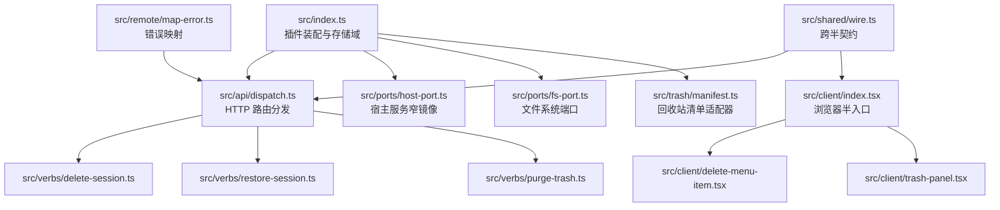

**图示来源**
- [src/index.ts:1-200](file://src/index.ts#L1-L200)
- [src/api/dispatch.ts:1-192](file://src/api/dispatch.ts#L1-L192)
- [src/client/index.tsx:1-200](file://src/client/index.tsx#L1-L200)
- [src/shared/wire.ts:1-84](file://src/shared/wire.ts#L1-L84)
- [src/remote/map-error.ts:1-72](file://src/remote/map-error.ts#L1-L72)

**章节来源**
- [src/index.ts:1-200](file://src/index.ts#L1-L200)
- [src/client/index.tsx:1-200](file://src/client/index.tsx#L1-L200)
- [src/shared/wire.ts:1-84](file://src/shared/wire.ts#L1-L84)

## 核心组件
| 组件 | 职责 | 关键行为 |
|---|---|---|
| 插件装配 `src/index.ts` | 注册 Node 半 API、打开回收站清单存储域、解析宿主数据根 | 定义 storage domain `xrn1997_session_delete_trash`；懒开表句柄；卸载时关闭 |
| HTTP 分发 `src/api/dispatch.ts` | 将 `/dsh-session-delete-api/*` 请求路由到三个 Verb | 同源栅栏、JSON body 限 1MiB、统一信封 `{ok,value}` / `{ok:false,error}` |
| 浏览器入口 `src/client/index.tsx` | 注册五个槽位贡献：删除菜单行、撤销提示、确认框、回收站面板行与中央面板 | 先探测取数通道，失败则一个入口都不注册 |
| 菜单项 `src/client/delete-menu-item.tsx` | 渲染「删除」行；运行中会话禁用；写入模块级现场并收起菜单 | 用原生 `disabled`，Tooltip 给出原因 |
| 回收站面板 `src/client/trash-panel.tsx` | 展示头部统计、按项目分组卡片、刷新、单条恢复/删除、整页清空 | 四态：读数中 / 空 / 失败 / 有条目 |
| 宿主端口 `src/ports/host-port.ts` | 把动词问题翻译为 workspace registry、waterfall、sessionController 等宿主调用 | 镜像 `projectKey`、区分未知会话与 IO 故障 |
| 文件端口 `src/ports/fs-port.ts` | `exists` / `ensureDir` / `rename` / `removeDir` / `sizeOfDir` | 递归计算目录大小 |
| 错误映射 `src/remote/map-error.ts` | 把抛出物折成 `RemoteFailure` | 优先识别宿主类型化错误，再识别动词码，最后兜底 `io` |

**章节来源**
- [src/index.ts:1-200](file://src/index.ts#L1-L200)
- [src/api/dispatch.ts:1-192](file://src/api/dispatch.ts#L1-L192)
- [src/client/index.tsx:1-200](file://src/client/index.tsx#L1-L200)
- [src/client/delete-menu-item.tsx:1-80](file://src/client/delete-menu-item.tsx#L1-L80)
- [src/client/trash-panel.tsx:1-200](file://src/client/trash-panel.tsx#L1-L200)
- [src/ports/host-port.ts:1-200](file://src/ports/host-port.ts#L1-L200)
- [src/ports/fs-port.ts:1-33](file://src/ports/fs-port.ts#L1-L33)
- [src/remote/map-error.ts:1-72](file://src/remote/map-error.ts#L1-L72)

## 架构总览
用户交互从浏览器半发起，经同源 fetch 进入宿主 web server 的前缀路由，再由薄线分发到三个纯函数 Verb；Verb 组合宿主端口、文件端口与回收站清单端口完成落盘。

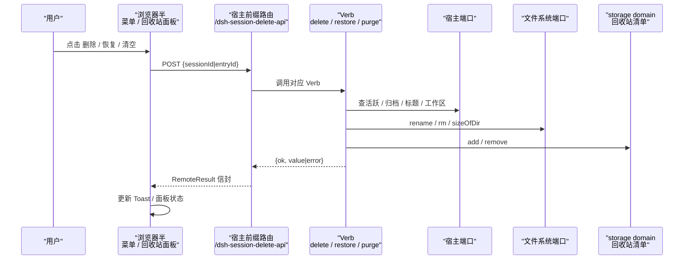

**图示来源**
- [src/client/index.tsx:1-200](file://src/client/index.tsx#L1-L200)
- [src/api/dispatch.ts:1-192](file://src/api/dispatch.ts#L1-L192)
- [src/ports/host-port.ts:1-200](file://src/ports/host-port.ts#L1-L200)
- [src/ports/fs-port.ts:1-33](file://src/ports/fs-port.ts#L1-L33)
- [src/index.ts:1-200](file://src/index.ts#L1-L200)

## 六大用户能力详解

### 1. 会话删除入口（菜单项）
- 位置：会话条目「…」菜单中的「删除」。
- 行为：
  - 读取当前会话是否运行中；若是则禁用该行，并用 Tooltip 提示“会话正在运行，先停止再删除”。
  - 点击后把 `{sessionId, title}` 写入 `delete-confirm.tsx` 的模块级现场，随后让宿主收起菜单。
  - 确认框由 `shell.overlay` 常驻渲染，避免随菜单子树卸载。
  - 二次确认后调用 `deleteSession(sessionId)`。

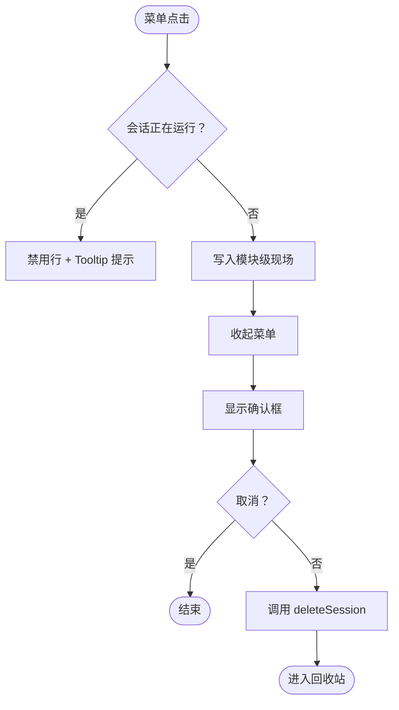

**图示来源**
- [src/client/delete-menu-item.tsx:1-80](file://src/client/delete-menu-item.tsx#L1-L80)
- [src/client/index.tsx:1-200](file://src/client/index.tsx#L1-L200)

**章节来源**
- [src/client/delete-menu-item.tsx:1-80](file://src/client/delete-menu-item.tsx#L1-L80)
- [src/client/index.tsx:1-200](file://src/client/index.tsx#L1-L200)

### 2. 运行中会话置灰
- 使用宿主提供的活跃检查（同官方归档准入同源），而非插件自判。
- 禁用属性落在原生按钮上，保证读屏与测试工具一致。
- 文案来自宿主 locale；不可用时回退内置中文。

**章节来源**
- [src/client/delete-menu-item.tsx:1-80](file://src/client/delete-menu-item.tsx#L1-L80)
- [src/ports/host-port.ts:1-200](file://src/ports/host-port.ts#L1-L200)

### 3. 撤销提示（6 秒可撤销 Toast）
- 在 `deleteSession` 成功后由 `UndoToast` 常驻组件显示。
- 提供“撤销”按钮，内部调用 `restoreSession(entryId)`。
- 超时后自动消失；若 6 秒内未撤销，后续面板应不再列出该记录（取决于清单与撤销逻辑配合）。

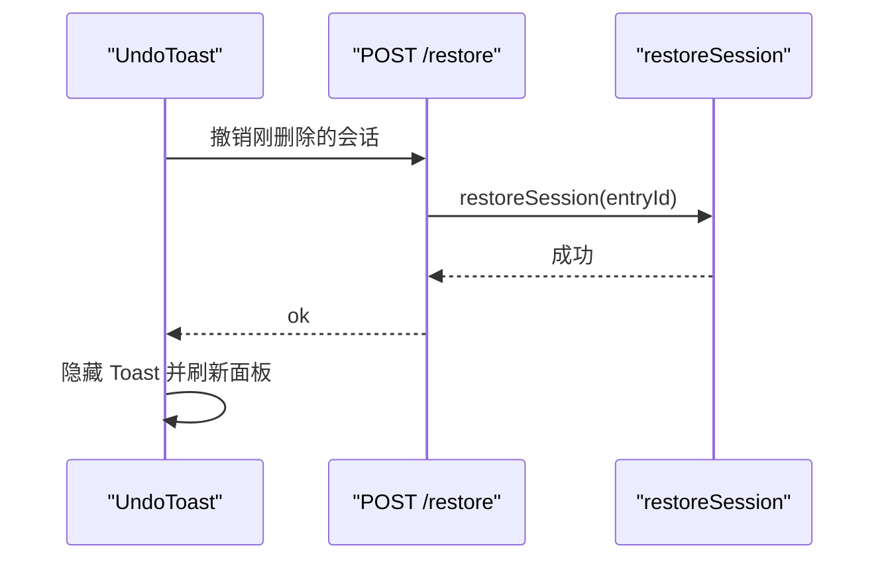

**图示来源**
- [src/client/index.tsx:1-200](file://src/client/index.tsx#L1-L200)
- [src/api/dispatch.ts:1-192](file://src/api/dispatch.ts#L1-L192)
- [src/verbs/restore-session.ts](file://src/verbs/restore-session.ts)

**章节来源**
- [src/client/index.tsx:1-200](file://src/client/index.tsx#L1-L200)

### 4. 回收站面板（头部统计、按项目分组卡片、刷新）
- 侧栏面板行与中央面板必须成对注册；探测不到取数通道时，两个都不注册，页面表现为“插件不存在”，而不是半吊子入口。
- 面板四态：
  - 读数中：显示加载骨架。
  - 空：显示“回收站是空的”，且底部不出现“清空回收站…”。
  - 失败：显示宿主原文并带“重试”。
  - 有条目：按项目分组卡片列表。
- 头部显示“条数 · 合计占用”和“刷新”按钮。
- 每条卡片显示标题、相对删除时间、大小，以及“恢复”“彻底删除…”。

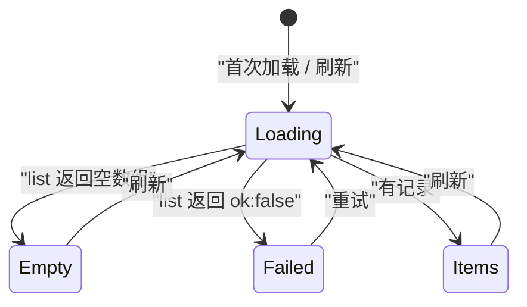

**图示来源**
- [src/client/index.tsx:1-200](file://src/client/index.tsx#L1-L200)
- [src/client/trash-panel.tsx:1-200](file://src/client/trash-panel.tsx#L1-L200)

**章节来源**
- [src/client/index.tsx:1-200](file://src/client/index.tsx#L1-L200)
- [src/client/trash-panel.tsx:1-200](file://src/client/trash-panel.tsx#L1-L200)

### 5. 单条恢复
- 用户点击卡片上的“恢复”。
- 前端调用 `restoreSession(entryId)`。
- Verb 会还原会话原项目目录名、恢复其原本可见性（删除前未归档则恢复后仍不归档，已归档则保持归档）。
- 成功后通知宿主移除旧行、重新添加摘要，并刷新回收站。

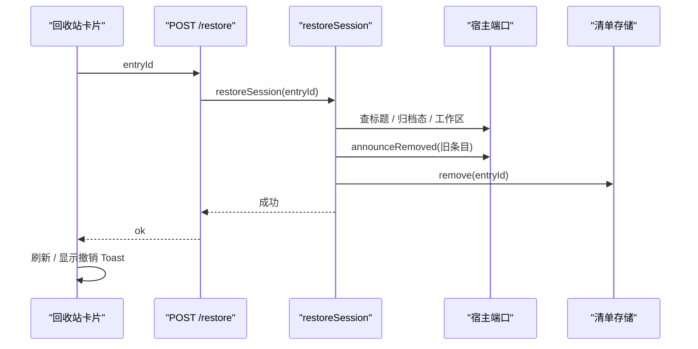

**图示来源**
- [src/client/trash-panel.tsx:1-200](file://src/client/trash-panel.tsx#L1-L200)
- [src/api/dispatch.ts:1-192](file://src/api/dispatch.ts#L1-L192)
- [src/ports/host-port.ts:1-200](file://src/ports/host-port.ts#L1-L200)

**章节来源**
- [src/client/trash-panel.tsx:1-200](file://src/client/trash-panel.tsx#L1-L200)
- [src/api/dispatch.ts:1-192](file://src/api/dispatch.ts#L1-L192)
- [src/ports/host-port.ts:1-200](file://src/ports/host-port.ts#L1-L200)

### 6. 单条彻底删除与整页清空
- 单条彻底删除：卡片右侧“彻底删除…”；整页清空：面板页脚唯一一块实心红按钮。
- 两者共用同一个二次确认框，正文明确“之后没有任何副本可以恢复”。
- 单条调用 `purgeTrash(entryId)`；整页调用 `purgeTrash()`（缺省 `entryId` 表示清空）。
- Verb 会删除回收站磁盘目录并移除清单记录。

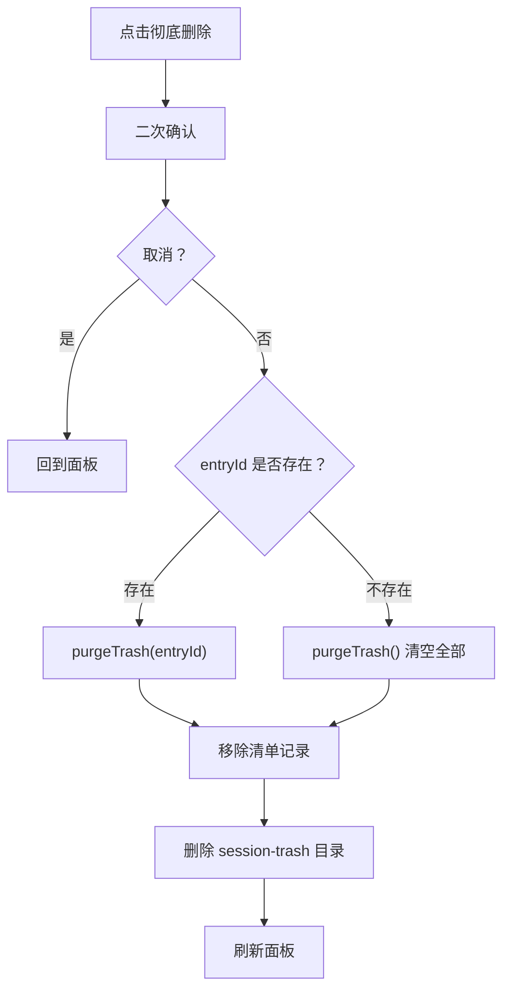

**图示来源**
- [src/client/trash-panel.tsx:1-200](file://src/client/trash-panel.tsx#L1-L200)
- [src/api/dispatch.ts:1-192](file://src/api/dispatch.ts#L1-L192)

**章节来源**
- [src/client/trash-panel.tsx:1-200](file://src/client/trash-panel.tsx#L1-L200)
- [src/api/dispatch.ts:1-192](file://src/api/dispatch.ts#L1-L192)

## 端到端流程与事务语义

### 删除 `deleteSession` 的事务顺序
删除是“持久化优先、内存摘除尽力、通告如实上报”的三段式：

1. 校验会话存在、非运行中。
2. 通过 `fs.rename` 把会话目录移入 `~/.dsh/session-trash/<时间戳>-<原目录名>`。
3. 向 storage domain 清单写入回收站记录。
4. 尽力从宿主 live store 摘除活体。
5. 发出“会话已移除”的宿主事件。

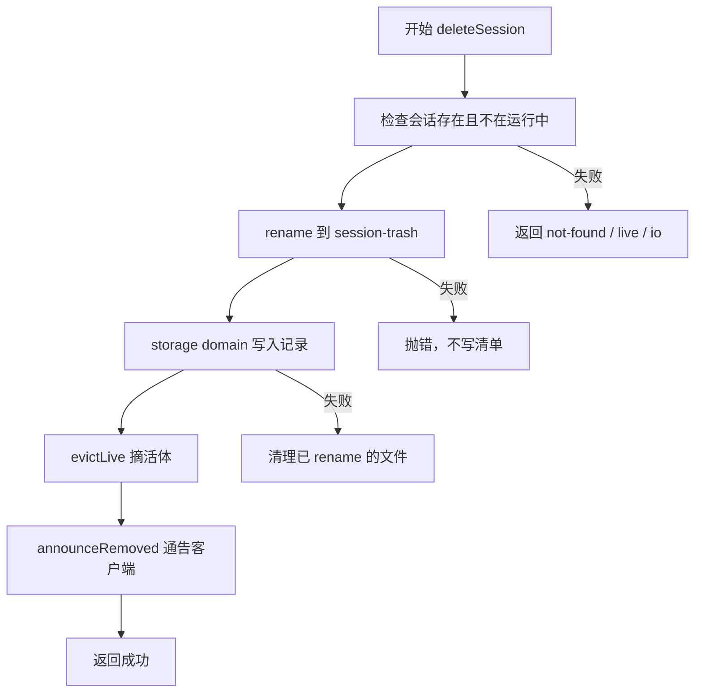

**图示来源**
- [src/verbs/delete-session.ts](file://src/verbs/delete-session.ts)
- [src/ports/host-port.ts:1-200](file://src/ports/host-port.ts#L1-L200)
- [src/ports/fs-port.ts:1-33](file://src/ports/fs-port.ts#L1-L33)
- [src/index.ts:1-200](file://src/index.ts#L1-L200)

**章节来源**
- [src/verbs/delete-session.ts](file://src/verbs/delete-session.ts)
- [src/ports/host-port.ts:1-200](file://src/ports/host-port.ts#L1-L200)

### 恢复 `restoreSession` 的回滚顺序
恢复不是简单移动回来，还要还原可见性与工作区关联：

1. 根据清单记录找到回收站目录。
2. 查会话标题、归档态、工作区。
3. 如果原项目目录已被其他会话占用，生成带后缀的新目录名。
4. 从回收站目录移回 `~/.dsh/sessions/<projectKey>/<cwd>/...`。
5. 从清单移除记录。
6. 通过宿主事件“移除旧行 + 新增摘要”同步列表。
7. 如果恢复后仍归档，则调用归档接口恢复归档态。

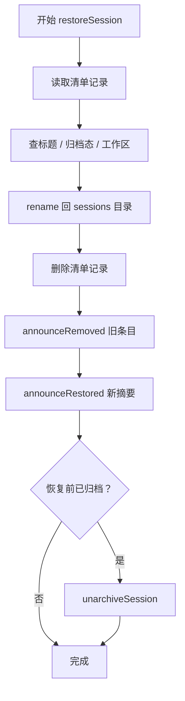

**图示来源**
- [src/verbs/restore-session.ts](file://src/verbs/restore-session.ts)
- [src/ports/host-port.ts:1-200](file://src/ports/host-port.ts#L1-L200)

**章节来源**
- [src/verbs/restore-session.ts](file://src/verbs/restore-session.ts)
- [src/ports/host-port.ts:1-200](file://src/ports/host-port.ts#L1-L200)

### 清空 `purgeTrash` 的处理
- 可选 `entryId`：缺席表示清空全部，在场表示只清一条。
- 对每个目标目录执行 `rm -rf`，并从清单删除对应记录。
- 整页清空是批量操作，但当前实现以逐个目录删除为主，并非原子事务。

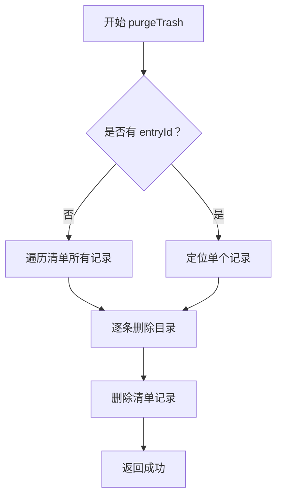

**图示来源**
- [src/verbs/purge-trash.ts](file://src/verbs/purge-trash.ts)
- [src/ports/fs-port.ts:1-33](file://src/ports/fs-port.ts#L1-L33)

**章节来源**
- [src/verbs/purge-trash.ts](file://src/verbs/purge-trash.ts)
- [src/ports/fs-port.ts:1-33](file://src/ports/fs-port.ts#L1-L33)

## 依赖关系分析

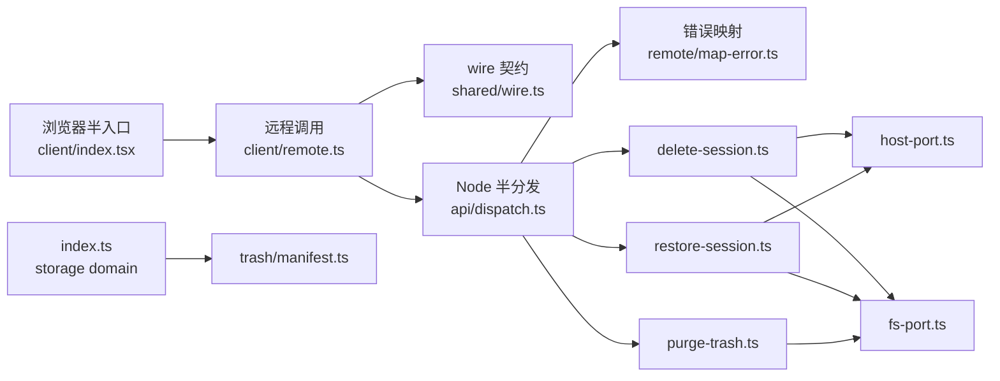

**图示来源**
- [src/client/index.tsx:1-200](file://src/client/index.tsx#L1-L200)
- [src/api/dispatch.ts:1-192](file://src/api/dispatch.ts#L1-L192)
- [src/shared/wire.ts:1-84](file://src/shared/wire.ts#L1-L84)
- [src/remote/map-error.ts:1-72](file://src/remote/map-error.ts#L1-L72)
- [src/ports/host-port.ts:1-200](file://src/ports/host-port.ts#L1-L200)
- [src/ports/fs-port.ts:1-33](file://src/ports/fs-port.ts#L1-L33)
- [src/index.ts:1-200](file://src/index.ts#L1-L200)

**章节来源**
- [src/api/dispatch.ts:1-192](file://src/api/dispatch.ts#L1-L192)
- [src/remote/map-error.ts:1-72](file://src/remote/map-error.ts#L1-L72)
- [src/shared/wire.ts:1-84](file://src/shared/wire.ts#L1-L84)

## 性能与边界

### 大目录回收站性能
- 回收站面板需要计算每条会话的大小，底层走 `sizeOfDir` 递归扫描。
- 若回收站中有大量或非常大的会话目录，刷新可能较慢。
- 优化建议：
  - 分页或虚拟滚动加载卡片。
  - 延迟计算大小，仅在展开或首屏必要时求值。
  - 缓存目录大小，并在会话变更时增量更新。
  - 对超大目录限制最大扫描深度或并发数。

### 权限不足导致 `rename` 失败
- 删除路径依赖同卷 `rename`，要求进程对源目录和目标目录都有读写与改名权限。
- 若权限不足：
  - `deleteSession` 会抛出 IO 错误，错误映射层最终返回 `sessiondelete/io`。
  - 前端不应吞掉错误；面板应显示宿主原文并允许重试。
  - 不要误报为 `not-found` 或 `live`。

### 清单丢失与会话文件自描述
- 回收站清单存储在 storage domain，介质位于 `~/.dsh/storages/`。
- 即使清单丢失，会话文件本身包含 `id` 与 `cwd`，仍可重建信息；不过插件当前主要依赖清单驱动界面，清单损坏时应优先报错并给重试。

### 撤销窗口
- 撤销 Toast 默认停留 6 秒；超过时限后用户无法直接撤销，但仍可从回收站面板手动恢复。
- 如果希望增强一致性，可在 Toast 超时后仍保留“最近一次删除”的状态，直到面板刷新覆盖。

**章节来源**
- [src/ports/fs-port.ts:1-33](file://src/ports/fs-port.ts#L1-L33)
- [src/remote/map-error.ts:1-72](file://src/remote/map-error.ts#L1-L72)
- [src/index.ts:1-200](file://src/index.ts#L1-L200)
- [README.md:1-130](file://README.md#L1-L130)

## 故障排查

| 场景 | 现象 | 可能原因 | 处理建议 |
|---|---|---|---|
| 安装后没有“回收站”也没有“删除” | 侧栏和菜单都没有相关入口 | 取数通道探测失败；插件主动不注册任何入口 | 重启宿主；确认宿主版本在兼容范围；检查 Node 半是否已重启 |
| 运行中会话无法删除 | “删除”菜单行禁用 | 活跃检查判定会话仍在运行 | 先停止会话，再删除 |
| 删除后侧栏行还在 | 冷会话或宿主尚未通知客户端 | 插件只在宿主真正不再列出行时才通告 | 刷新页面或等待重连 |
| 恢复失败 | 卡片第二行出现错误消息 | 原目录被占用、归档态不一致、宿主服务异常 | 查看错误码；必要时先手动整理目录后重试 |
| 彻底删除无效 | 面板仍有条目 | 清单与磁盘状态不一致 | 尝试清空回收站；若仍残留，检查 `~/.dsh/session-trash/` 权限 |
| 清空很慢 | 回收站条目多或体积大 | 递归扫描目录大小、逐个删除 | 分批清空、增加进度反馈、考虑后台任务 |
| 权限不足 | 删除时报 IO 错误 | 进程无权访问 `~/.dsh/sessions/` 或 `session-trash/` | 修复文件或目录权限后重试 |
| 错误码为 `sessiondelete/io` | 通用 IO 错误 | 文件读写、rename、rm、storage domain 失败 | 查看原始 message；检查磁盘空间、权限、路径 |
| 错误码为 `sessiondelete/not-found` | 找不到会话 | 会话 ID 不存在或账本未命中 | 确认 ID 正确；若确实不存在则无需恢复 |
| 错误码为 `sessiondelete/live` | 会话正在运行 | 活跃检查返回 true | 先停止会话 |

**章节来源**
- [src/api/dispatch.ts:1-192](file://src/api/dispatch.ts#L1-L192)
- [src/remote/map-error.ts:1-72](file://src/remote/map-error.ts#L1-L72)
- [src/client/trash-panel.tsx:1-200](file://src/client/trash-panel.tsx#L1-L200)
- [src/client/delete-menu-item.tsx:1-80](file://src/client/delete-menu-item.tsx#L1-L80)
- [README.md:1-130](file://README.md#L1-L130)

## 结论
DSH 会话删除插件以三个 Verb 为核心：`deleteSession` 负责“移入回收站”，`restoreSession` 负责“恢复原项目与可见性”，`purgeTrash` 负责“单条或整页彻底删除”。前端通过菜单项、撤销 Toast 和回收站面板串联这些能力，同时严格区分“不可用”“运行中”“空态”“失败”“加载中”“有条目”等状态。

对初学者，建议按“交互 → 流程 → 错误码”的顺序理解；对高级开发者，应重点关注：
- 删除与恢复中的跨系统状态（磁盘目录、storage domain、宿主 live store、宿主列表事件）。
- 同名目录冲突时的恢复策略。
- 大目录回收站的性能瓶颈。
- 权限与同卷 rename 的边界条件。
- 错误映射如何把宿主类型化错误转成稳定的 `sessiondelete/*` 码。