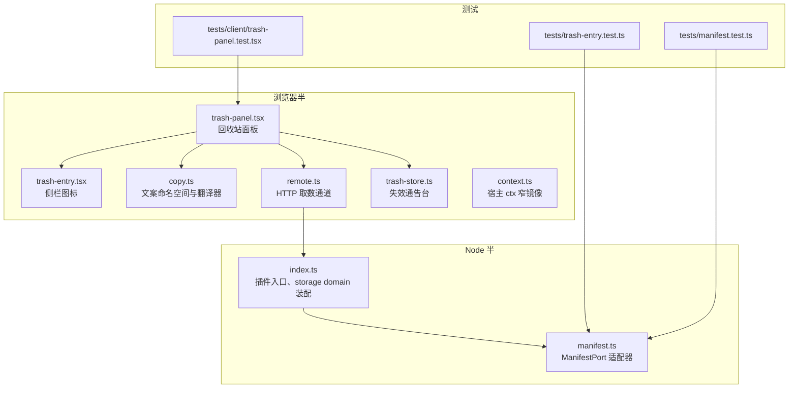
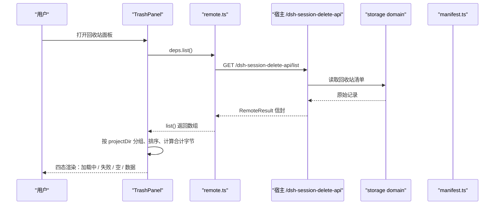
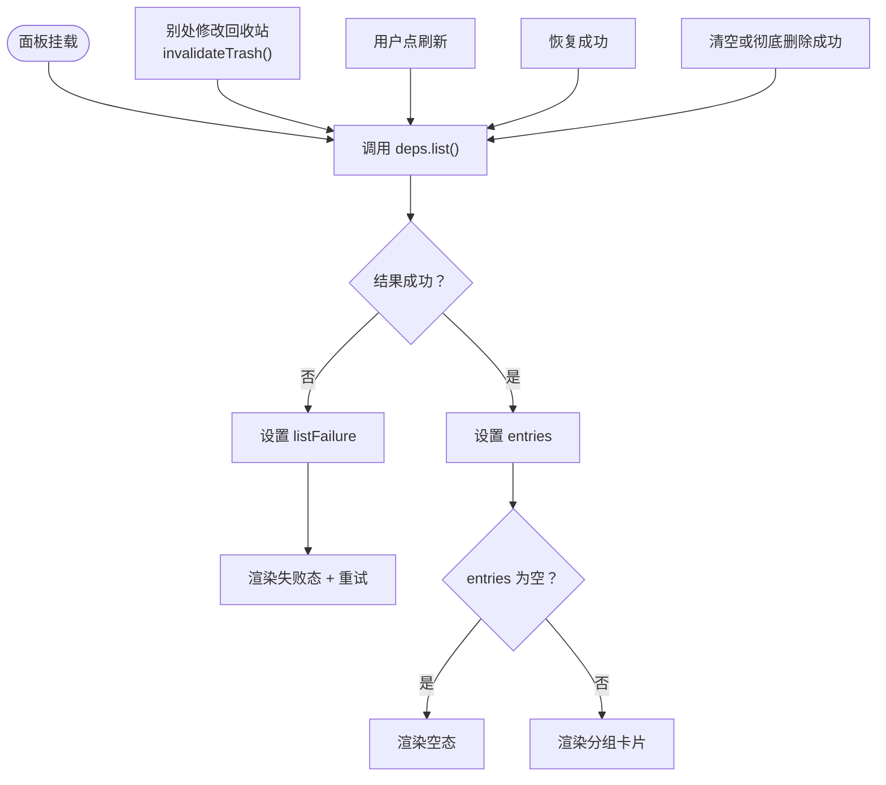
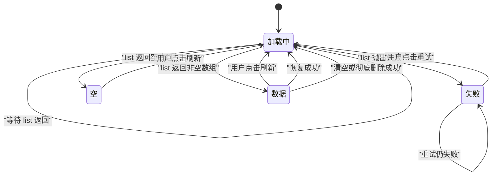
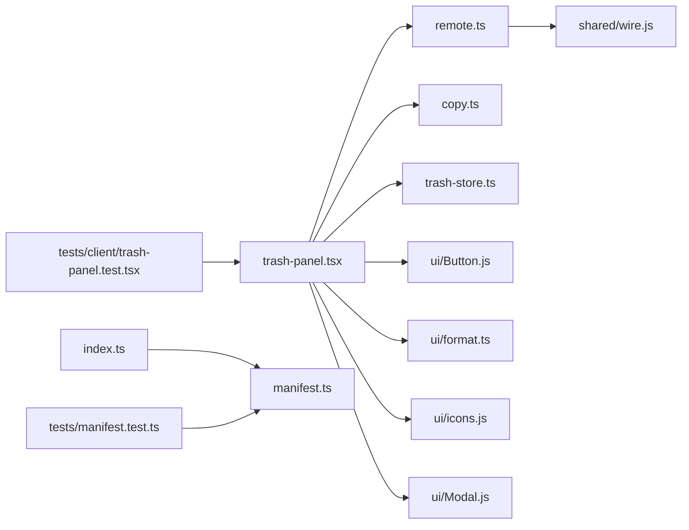

# 回收站面板

<cite>
**本文引用的文件**   
- [README.md](file://README.md)
- [src/client/trash-panel.tsx](file://src/client/trash-panel.tsx)
- [src/client/trash-entry.tsx](file://src/client/trash-entry.tsx)
- [src/client/copy.ts](file://src/client/copy.ts)
- [src/client/remote.ts](file://src/client/remote.ts)
- [src/client/trash-store.ts](file://src/client/trash-store.ts)
- [src/client/context.ts](file://src/client/context.ts)
- [src/index.ts](file://src/index.ts)
- [src/trash/manifest.ts](file://src/trash/manifest.ts)
- [tests/client/trash-panel.test.tsx](file://tests/client/trash-panel.test.tsx)
- [tests/trash-entry.test.ts](file://tests/trash-entry.test.ts)
- [tests/manifest.test.ts](file://tests/manifest.test.ts)
</cite>

## 目录
1. [简介](#简介)
2. [项目结构定位](#项目结构定位)
3. [核心组件与接口](#核心组件与接口)
4. [架构总览](#架构总览)
5. [详细组件分析](#详细组件分析)
6. [依赖关系分析](#依赖关系分析)
7. [性能考量与优化建议](#性能考量与优化建议)
8. [故障排查指南](#故障排查指南)
9. [结论](#结论)

## 简介
「回收站面板」是 DSH 会话删除插件的浏览器端中央面板，负责展示被移入回收站的会话清单、提供恢复与彻底删除操作，并通过宿主提供的存储域维护清单持久化。其 UI 分为三部分：

- **头部**：显示条目数量与合计占用字节数，以及刷新按钮。
- **中央列表**：按宿主的 `projectKey`（即 `projectDir`）分组展示卡片；每个项目一个组头，组内卡片按删除时间倒序排列。
- **页脚**：仅在存在条目时出现「清空回收站…」，并附带回收站物理位置说明与不可恢复提示。

面板支持四态渲染：加载中、读取失败、空回收站、有数据。它通过 `TrashPanelDeps` 注入 `list` / `restore` / `purge` 能力，并由 `callRemote` 调用宿主前缀路由 `/dsh-session-delete-api/list` 获取数据。

**章节来源**
- [README.md:1-40](file://README.md#L1-L40)
- [README.md:60-100](file://README.md#L60-L100)
- [src/client/trash-panel.tsx:1-120](file://src/client/trash-panel.tsx#L1-L120)

## 项目结构定位
回收站相关代码横跨浏览器半、Node 半与测试：

**图示来源**
- [src/client/trash-panel.tsx:120-200](file://src/client/trash-panel.tsx#L120-L200)
- [src/client/trash-entry.tsx:1-30](file://src/client/trash-entry.tsx#L1-L30)
- [src/client/copy.ts:1-60](file://src/client/copy.ts#L1-L60)
- [src/client/remote.ts:1-60](file://src/client/remote.ts#L1-L60)
- [src/client/trash-store.ts:1-41](file://src/client/trash-store.ts#L1-L41)
- [src/index.ts:1-60](file://src/index.ts#L1-L60)
- [src/trash/manifest.ts:1-35](file://src/trash/manifest.ts#L1-L35)

**章节来源**
- [src/client/trash-panel.tsx:1-120](file://src/client/trash-panel.tsx#L1-L120)
- [src/client/trash-entry.tsx:1-30](file://src/client/trash-entry.tsx#L1-L30)
- [src/client/copy.ts:1-60](file://src/client/copy.ts#L1-L60)
- [src/client/remote.ts:1-60](file://src/client/remote.ts#L1-L60)
- [src/client/trash-store.ts:1-41](file://src/client/trash-store.ts#L1-L41)
- [src/index.ts:1-60](file://src/index.ts#L1-L60)
- [src/trash/manifest.ts:1-35](file://src/trash/manifest.ts#L1-L35)

## 核心组件与接口
### 回收站面板组件
`TrashPanel` 是中央面板本体，职责包括：

- 维护本地状态：已加载条目、列表读取失败消息、行级错误、待确认的彻底删除目标、全局忙态。
- 通过 `deps.list()` 拉取数据，并通过 `callRemote` 把 HTTP 层的结果包装成 `{ ok, value }` / `{ ok, failure }`。
- 按 `projectDir` 分组、排序，并计算合计占用字节数。
- 渲染四态：loading、error、empty、data。
- 处理「恢复」和「彻底删除」操作，并在成功后重新拉取清单。
- 暴露 `TrashPanelProps`，包含 `deps` 与可选的翻译函数 `t`。

关键类型定义：

| 名称 | 含义 |
|---|---|
| `TrashPanelDeps` | 从 `SessionDeleteRemote` 中抽取 `list` / `restore` / `purge`，是面板唯一的外部行为契约。 |
| `TrashPanelProps` | 面板 Props：`deps` 必填，`t` 为可选翻译函数，缺省走内置中文。 |
| `PendingPurge` | 待确认的彻底删除目标，可以是单条记录或整个回收站。 |

**章节来源**
- [src/client/trash-panel.tsx:120-200](file://src/client/trash-panel.tsx#L120-L200)
- [src/client/trash-panel.tsx:200-360](file://src/client/trash-panel.tsx#L200-L360)
- [src/client/trash-panel.tsx:360-683](file://src/client/trash-panel.tsx#L360-L683)

### 侧栏回收站图标
`TrashPanelIcon` 只渲染侧栏「回收站」行的图标，不渲染标题、角标或交互逻辑。它的职责是保持与宿主 `PanelRow` 的视觉对齐：宿主负责行高、选中态、tooltip 与 label。

**章节来源**
- [src/client/trash-entry.tsx:1-30](file://src/client/trash-entry.tsx#L1-L30)

### 文案命名空间与翻译器
`copy.ts` 集中管理所有可见文案，并负责绑定宿主 locale 服务：

- 使用命名空间 `xrn1997-session-delete` 注册中文与英文字典。
- 如果宿主 locale 服务不可用，降级到内置中文 `zhTranslate`，避免插件因缺少服务而崩溃。
- 面板名等由宿主槽位解析的文本使用 thunk，随语言切换重读。
- `splitOn` 用于把确认框文案拆成三段，让中间可强调的部分在两种语言中都能独立放置。

**章节来源**
- [src/client/copy.ts:1-183](file://src/client/copy.ts#L1-L183)
- [src/client/context.ts:1-34](file://src/client/context.ts#L1-L34)

### 清单适配器：`ManifestPort`
`manifest.ts` 定义回收站清单的抽象端口，并实现两种后端：

| 实现 | 用途 |
|---|---|
| `createMemoryManifest(seed)` | 内存中的清单适配器，常用于测试与临时场景。 |
| `createStorageManifest(domain)` | 把宿主 `storageDomain` 适配为 `ManifestPort`，是生产路径。 |

`ManifestPort` 对外暴露三个动词：

| 方法 | 参数 | 返回值 | 语义 |
|---|---|---|---|
| `list()` | 无 | `Promise<TrashEntry[]>` | 返回按 `deletedAt` 倒序的条目。 |
| `add(e)` | 一条 `TrashEntry` | `Promise<void>` | 以 `id` 覆盖写入。 |
| `remove(id)` | 条目 id | `Promise<void>` | 幂等移除。 |

`createStorageManifest` 把宿主 storage domain 的 `readAll` / `put` / `delete` 封装成统一接口，使上层动词只关心业务语义，不感知底层介质。

**章节来源**
- [src/trash/manifest.ts:1-35](file://src/trash/manifest.ts#L1-L35)
- [src/index.ts:60-180](file://src/index.ts#L60-L180)

### 取数通道与 `callRemote`
`remote.ts` 提供浏览器端到宿主前缀路由 `/dsh-session-delete-api` 的 HTTP 通道：

- `RawSessionDeleteRemote` 描述四个远端方法：`list` / `delete` / `restore` / `purge`。
- `createHttpRemote` 使用相对路径 fetch，`list` 走 GET，其余走 POST。
- `probeChannel` 探测通道是否可用：一次成功拿到信封就算通道就绪。
- `buildDeps` 把远程结果展开为裸值 API，供组件直接调用。
- `callRemote` 捕获异常并包装成 `{ ok, value }` / `{ ok, failure }`。

**章节来源**
- [src/client/remote.ts:1-208](file://src/client/remote.ts#L1-L208)

## 架构总览
回收站面板的数据与控制流如下：

**图示来源**
- [src/client/trash-panel.tsx:200-360](file://src/client/trash-panel.tsx#L200-L360)
- [src/client/remote.ts:120-208](file://src/client/remote.ts#L120-L208)
- [src/index.ts:120-180](file://src/index.ts#L120-L180)
- [src/trash/manifest.ts:1-35](file://src/trash/manifest.ts#L1-L35)

## 详细组件分析

### 布局与四态渲染

#### 头部
头部左侧显示标题与条目统计，右侧显示刷新按钮。统计文案由 `trash.summary` 键生成，包含条目数与合计字节数，后者由 `fileSizeText` 格式化。

#### 中央列表
中央区域是一个自滚动容器，根据 `entries` 的状态渲染四种界面：

| 状态 | 条件 | 表现 |
|---|---|---|
| 加载中 | `entries === null` | 显示 `trash.loading`。 |
| 读取失败 | `listFailure !== null` | 显示警告图标、`trash.readFailed` 与宿主原文，并提供「重试」。 |
| 空回收站 | `entries.length === 0` | 显示 `trash.empty.title` 与提示信息，不显示「清空回收站…」。 |
| 有数据 | `entries.length > 0` | 按项目分组渲染卡片，显示页脚「清空回收站…」。 |

#### 分组与排序
条目先整体按 `deletedAt` 倒序，再按 `projectDir` 分组。每个组的标签由 `unescapeProjectKey` 还原宿主 `projectKey`，组间按该组最新一条的删除时间倒序。

#### 页脚
页脚只在有数据时出现，包含：

- 回收站物理路径说明，其中 `session-trash/` 用等宽字体强调。
- 「清空回收站…」按钮，点击后进入二次确认流程。

**章节来源**
- [src/client/trash-panel.tsx:200-683](file://src/client/trash-panel.tsx#L200-L683)
- [tests/client/trash-panel.test.tsx:1-120](file://tests/client/trash-panel.test.tsx#L1-L120)

### 刷新策略
面板的刷新不是简单重渲染，而是明确的重取数流程：

1. 首次挂载时执行 `reload()`。
2. 当 `useTrashRevision()` 返回的修订号变化时，再次执行 `reload()`。
3. 用户点击「刷新」按钮时主动调用 `reload()`。
4. 恢复成功、清空成功或单条彻底删除成功后，也调用 `reload()` 刷新清单。

`invalidateTrash()` 是模块级失效通告：其他位置对回收站做了变更时，调用它递增修订号，从而触发面板重读。

**图示来源**
- [src/client/trash-panel.tsx:200-360](file://src/client/trash-panel.tsx#L200-L360)
- [src/client/trash-store.ts:1-41](file://src/client/trash-store.ts#L1-L41)

**章节来源**
- [src/client/trash-panel.tsx:200-360](file://src/client/trash-panel.tsx#L200-L360)
- [src/client/trash-store.ts:1-41](file://src/client/trash-store.ts#L1-L41)
- [tests/client/trash-panel.test.tsx:60-120](file://tests/client/trash-panel.test.tsx#L60-L120)

### 侧栏图标与面板卡片的关联
`TrashPanelIcon` 与 `TrashPanel` 是两个不同位置的产物：

- `TrashPanelIcon` 是侧栏面板列表中的一行图标，仅渲染回收站图标。
- `TrashPanel` 是中央面板主体，负责完整交互。
- 两者共享同一份文案命名空间，但图标本身不持有状态；选中态由宿主 `PanelRow` 管理。

这种分离保证了侧栏行不会多画文字或角标，也不会引入双重选中态。

**章节来源**
- [src/client/trash-entry.tsx:1-30](file://src/client/trash-entry.tsx#L1-L30)
- [src/client/trash-panel.tsx:120-200](file://src/client/trash-panel.tsx#L120-L200)

### 文案命名空间绑定
`copy.ts` 的文案绑定遵循以下规则：

| 层级 | 行为 |
|---|---|
| 命名空间 | `xrn1997-session-delete`，避免与宿主 `common` / `settings` / `sidebar` 冲突。 |
| 注册方式 | 通过宿主 `ctx.get('locale')` 的 `register` 注册 `{ zh, en }` 字典。 |
| 降级策略 | 没有 locale 服务时返回 `zhTranslate`，插件继续工作。 |
| 面板名 | 使用 thunk，让宿主 `resolveSlotLabel` 随语言切换更新。 |
| 强绑定风险 | 不使用硬注入，因为客户端半激活失败会导致宿主进程死；这里选择“可选服务”。 |

**章节来源**
- [src/client/copy.ts:1-183](file://src/client/copy.ts#L1-L183)
- [src/client/context.ts:1-34](file://src/client/context.ts#L1-L34)

### `ManifestPort` 适配器深入讲解
`ManifestPort` 是回收站清单的唯一读法。它屏蔽了两种实现差异：

| 关注点 | 内存实现 | 宿主 storage domain 实现 |
|---|---|---|
| 数据存储 | `Map<string, TrashEntry>` | 宿主 storage domain 表 `entries` |
| 读取 | `Array.from(rows.values())` | `domain.readAll()` |
| 写入 | `rows.set(e.id, e)` | `domain.put(record)` |
| 删除 | `rows.delete(id)` | `domain.delete(key)` |
| 排序 | 在 `list()` 中按 `deletedAt` 倒序 | 在 `list()` 中按 `deletedAt` 倒序 |
| 测试友好性 | 可通过 seed 初始化 | 需要 mock storage domain |

`createStorageManifest` 是 Node 半装配的关键：`index.ts` 用插件专属 domain 名 `xrn1997_session_delete_trash` 打开宿主 storage domain，并把 `entries()` 迭代器折成 `readAll()`，从而让 `manifest.ts` 的 `createStorageManifest` 只看到稳定接口。

**章节来源**
- [src/trash/manifest.ts:1-35](file://src/trash/manifest.ts#L1-L35)
- [src/index.ts:120-180](file://src/index.ts#L120-L180)
- [tests/manifest.test.ts:1-37](file://tests/manifest.test.ts#L1-L37)

### 组件 Props 示例
由于文档目标是说明接口而非粘贴源码，下面给出类型层面的 Props 示例，而不是具体 JSX：

| 字段 | 类型 | 必填 | 默认值 | 说明 |
|---|---|---:|---|---|
| `deps` | `TrashPanelDeps` | 是 | 无 | 注入 `list` / `restore` / `purge`。 |
| `t` | `Translate` | 否 | `zhTranslate` | 翻译函数；未传入时表示没有宿主 locale 服务。 |

`TrashPanelDeps` 等价于：

| 字段 | 类型 | 说明 |
|---|---|---|
| `list` | `() => Promise<TrashEntryLike[]>` | 获取回收站条目列表。 |
| `restore` | `(entryId: string) => Promise<...>` | 恢复某条回收站条目。 |
| `purge` | `(entryId?: string) => Promise<...>` | 彻底删除单条或清空整个回收站。 |

测试中常用写法是把 `list` / `restore` / `purge` 替换为测试替身，例如 `vi.fn(async () => rows)` 或 `vi.fn().mockResolvedValue({})`。

**章节来源**
- [src/client/trash-panel.tsx:120-200](file://src/client/trash-panel.tsx#L120-L200)
- [tests/client/trash-panel.test.tsx:1-40](file://tests/client/trash-panel.test.tsx#L1-L40)

### 状态切换图示
面板内部状态机可以概括为：

**图示来源**
- [src/client/trash-panel.tsx:200-360](file://src/client/trash-panel.tsx#L200-L360)
- [tests/client/trash-panel.test.tsx:120-200](file://tests/client/trash-panel.test.tsx#L120-L200)

## 依赖关系分析

**图示来源**
- [src/client/trash-panel.tsx:120-200](file://src/client/trash-panel.tsx#L120-L200)
- [src/client/remote.ts:1-60](file://src/client/remote.ts#L1-L60)
- [src/client/copy.ts:1-60](file://src/client/copy.ts#L1-L60)
- [src/client/trash-store.ts:1-41](file://src/client/trash-store.ts#L1-L41)
- [src/index.ts:1-60](file://src/index.ts#L1-L60)
- [src/trash/manifest.ts:1-35](file://src/trash/manifest.ts#L1-L35)
- [tests/client/trash-panel.test.tsx:1-40](file://tests/client/trash-panel.test.tsx#L1-L40)
- [tests/manifest.test.ts:1-20](file://tests/manifest.test.ts#L1-L20)

**章节来源**
- [src/client/trash-panel.tsx:120-200](file://src/client/trash-panel.tsx#L120-L200)
- [src/client/remote.ts:1-60](file://src/client/remote.ts#L1-L60)
- [src/trash/manifest.ts:1-35](file://src/trash/manifest.ts#L1-L35)

## 性能考量与优化建议

### 当前实现特点
- 每次渲染都会基于当前 `Date.now()` 计算相对时间桶，但没有定时器驱动刷新；因此「刚刚删除」「X 分钟前」会停留在最近一次重读或交互时。
- 分组与合计字节数通过 `useMemo` 缓存，避免重复计算。
- 列表渲染没有虚拟滚动或分页，所有条目一次性渲染。
- 侧栏图标只做纯渲染，不承担计数逻辑，避免 stale 计数问题。

### 大目录下的优化建议

| 场景 | 建议 | 理由 |
|---|---|---|
| 数百个回收站条目 | 引入虚拟滚动或窗口化渲染 | 减少 DOM 节点数量，降低首屏渲染与滚动开销。 |
| 超大项目分组 | 对分组内容做懒加载 | 先渲染组头与少量条目，滚动到组内再展开更多。 |
| 频繁刷新 | 防抖刷新按钮 | 避免用户快速多次点击导致重复网络请求。 |
| 大数据量 list | 服务端分页或游标 | 当前 `list()` 返回全部条目，适合中小规模回收站。 |
| 时间显示抖动 | 固定渲染时刻或使用 ref 缓存 now | 当前每渲染都算 `Date.now()`，可在重读时冻结 now。 |
| 大型 JSON 往返 | 压缩响应体或只传输必要字段 | 对 `sizeBytes`、`title`、`deletedAt` 等关键字段优先优化。 |
| 长时间阻塞 | 加 loading 骨架屏 | 当前已有「正在读回收站…」，可进一步细化为骨架行。 |

这些是面向未来扩展的建议；当前仓库的实现更偏向简洁与可验证性，测试覆盖了空态、失败、分组、刷新与失效通告等主路径。

[本节为通用性能讨论，不直接分析具体代码片段，因此不附加章节来源]

## 故障排查指南

### 面板显示「回收站是空的」
可能原因：

- 确实没有回收站条目。
- `list()` 返回空数组。
- 刚清空完且尚未刷新。

处理方式：

- 点击「刷新」重新拉取。
- 检查侧栏删除动作是否真正落盘。
- 查看 `trash-store.ts` 的 `invalidateTrash()` 是否被正确调用。

**章节来源**
- [tests/client/trash-panel.test.tsx:1-40](file://tests/client/trash-panel.test.tsx#L1-L40)
- [src/client/trash-store.ts:1-41](file://src/client/trash-store.ts#L1-L41)

### 面板显示「回收站读不到」
这是读取失败态，不是空态。区别在于：

- 失败态会显示宿主原文与「重试」。
- 空态只显示「回收站是空的」与提示文案。
- 失败态底部不会出现「清空回收站…」。

常见根因：

- 宿主 web server 路由 `/dsh-session-delete-api` 未注册。
- `probeChannel` 探测失败，插件入口不注册。
- 网络层或 JSON 解析失败。
- 存储域损坏或权限异常。

**章节来源**
- [src/client/trash-panel.tsx:200-360](file://src/client/trash-panel.tsx#L200-L360)
- [src/client/remote.ts:120-208](file://src/client/remote.ts#L120-L208)
- [README.md:80-120](file://README.md#L80-L120)

### 恢复失败但行还在
面板设计是「失败写在行上，不弹全局错误，行不消失，按钮可以再点」。这适用于原项目目录缺失等可恢复错误。

排查重点：

- 检查 `restore` 抛出的错误对象是否带 `code` 与 `message`。
- 确认 `failRow(entry.id, message)` 是否被调用。
- 确认后续重试仍然能调用 `deps.restore(entry.id)`。

**章节来源**
- [tests/client/trash-panel.test.tsx:40-80](file://tests/client/trash-panel.test.tsx#L40-L80)
- [src/client/trash-panel.tsx:200-360](file://src/client/trash-panel.tsx#L200-L360)

### 清空后侧栏回收站入口仍在
README 明确说明：本插件只在宿主确实不再列出该入口时才通知客户端去掉该行；拿不准时宁可沉默。冷会话正常路径下删完即走，若正好遇到边界情况，应刷新页面。

**章节来源**
- [README.md:90-130](file://README.md#L90-L130)

### 清单适配器行为异常
内存清单的测试断言覆盖了：

- 加入后能列出，并按删除时间倒序。
- 同一 id 重复加入是覆盖整条记录。
- 移除不存在 id 不抛错。
- 空清单返回空数组。

若真实 storage domain 行为偏离，应优先检查 `createStorageManifest` 的 `readAll` / `put` / `delete` 映射。

**章节来源**
- [tests/manifest.test.ts:1-37](file://tests/manifest.test.ts#L1-L37)
- [src/trash/manifest.ts:1-35](file://src/trash/manifest.ts#L1-L35)

## 结论
回收站面板是一个结构清晰、状态明确的浏览器端中央面板。它以 `TrashPanelDeps` 为外部契约，通过 `callRemote` 调用宿主前缀路由获取数据，并以 `projectDir` 作为分组键组织卡片。文案通过 `copy.ts` 绑定宿主 locale 服务，同时具备降级能力；清单数据通过 `manifest.ts` 的 `ManifestPort` 解耦内存与宿主 storage domain。

对于日常使用，最重要的三条规则是：

1. 面板四态区分「读不到」和「空的」，失败时给重试。
2. 恢复与彻底删除失败时错误留在行上，不吞错。
3. 别处修改回收站后，通过 `invalidateTrash()` 触发面板重读，不需要用户手动切走再回来。

面向未来扩展，最值得优先考虑的是在大目录场景下引入虚拟滚动与懒加载，以减少 DOM 压力并提升长列表体验。