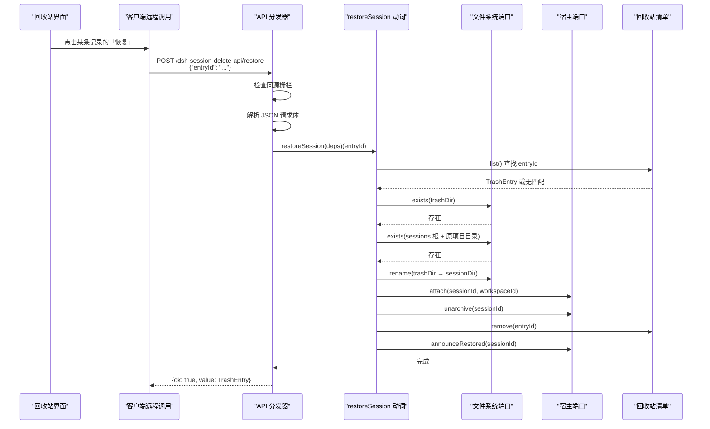
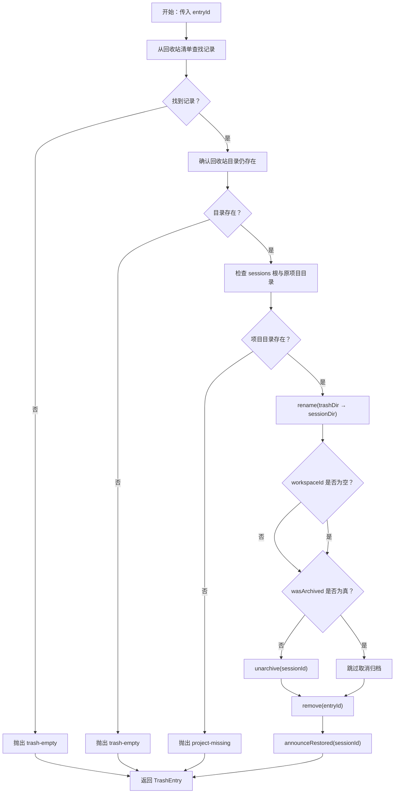
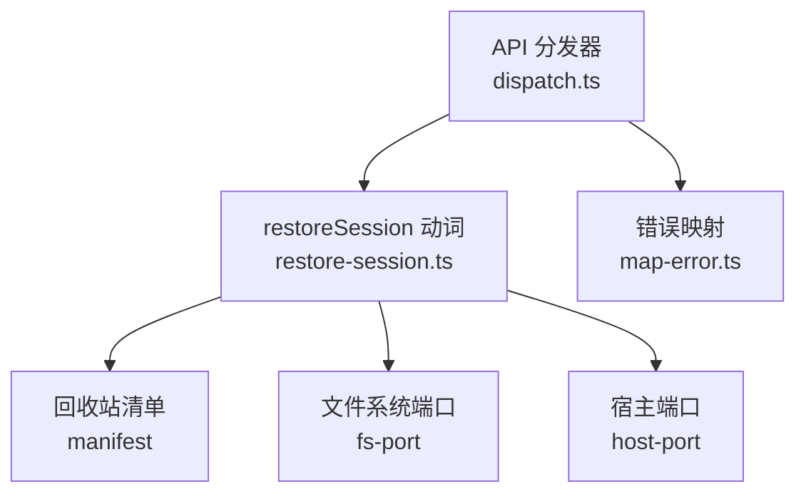

# 恢复会话

<cite>
**本文引用的文件**   
- [restore-session.ts](file://src/verbs/restore-session.ts)
- [dispatch.ts](file://src/api/dispatch.ts)
- [map-error.ts](file://src/remote/map-error.ts)
- [trash-entry.tsx](file://src/client/trash-entry.tsx)
- [restore-session.test.ts](file://tests/restore-session.test.ts)
- [README.md](file://README.md)
</cite>

## 目录
1. [引言](#引言)
2. [功能入口与用户操作](#功能入口与用户操作)
3. [HTTP 接口定义](#http-接口定义)
4. [事务语义总览](#事务语义总览)
5. [详细处理步骤](#详细处理步骤)
6. [wasArchived 字段在恢复时的语义](#wasisarchived-字段在恢复时的语义)
7. [失败场景与错误码](#失败场景与错误码)
8. [与删除事务的对比](#与删除事务的对比)
9. [客户端最小调用示例](#客户端最小调用示例)
10. [架构与依赖关系](#架构与依赖关系)
11. [故障排查](#故障排查)
12. [结论](#结论)

## 引言
「恢复会话」是会话删除插件中回收站的核心能力之一。用户从回收站面板点击某条记录的「恢复」后，该会话应回到其原始项目目录并重新可见；如果原始会话在被删除前处于归档状态，则恢复后仍保持归档态。

本文件聚焦于 `POST /restore` 对应的 `restoreSession` Verb：它负责把回收站中的条目写回原项目目录、重建工作区关联、还原可见性、从回收站清单移除，并最终通知宿主刷新列表。

## 功能入口与用户操作
用户在侧栏打开「回收站」面板，看到按项目分组的会话卡片；每条记录右侧有「恢复」和「彻底删除…」两个动作。点击「恢复」后，前端通过插件暴露的远程接口发起请求，由 Node 端的 API 路由转发到 `restoreSession` Verb。

需要区分的是：
- `trash-entry.tsx` 仅渲染回收站面板行的图标 glyph，不包含「恢复」按钮本身；实际界面行为由宿主的回收站面板与本地化文案共同实现。
- 文档中的「点击恢复」描述的是用户视角流程，具体实现落在 API 层与动词层。

**章节来源**
- [README.md:1-130](file://README.md#L1-L130)
- [trash-entry.tsx:1-30](file://src/client/trash-entry.tsx#L1-L30)

## HTTP 接口定义
| 项目 | 值 |
|---|---|
| 路径 | `/dsh-session-delete-api/restore`（由插件前缀与 `ROUTES.restore` 组合） |
| 方法 | `POST` |
| 鉴权 | 同源栅栏：仅允许本机回环地址；桌面壳页面或浏览器直接打开的宿主 URL 被视为受信 |
| 请求体 | JSON 对象，必须包含非空字符串字段 `entryId` |
| 成功响应 | `{ ok: true, value: TrashEntry }` |
| 失败响应 | `{ ok: false, error: RemoteFailure }` |
| HTTP 状态码 | 业务成功与失败均返回 `200`；只有同源栅栏拒绝时返回 `403` |

请求体解析规则：
- 空请求体返回 `null`。
- 非合法 JSON、不是对象、数组或空串都视为解析失败。
- `entryId` 缺失、为空或非字符串会抛出结构化错误。

**图表来源**
- [dispatch.ts:128-192](file://src/api/dispatch.ts#L128-L192)
- [restore-session.ts:1-68](file://src/verbs/restore-session.ts#L1-L68)

**章节来源**
- [dispatch.ts:1-192](file://src/api/dispatch.ts#L1-L192)

## 事务语义总览
`restoreSession` 的事务目标是：**把一条已删除且位于回收站的会话恢复到原项目目录，并恢复其应有的可见性与账本关联**。它不是一个简单的文件移动，而是跨三层的状态变更：
1. **文件系统层**：将回收站目录移回原项目会话目录。
2. **宿主状态层**：挂回工作区账本、取消归档标记、通告宿主与会话列表。
3. **回收站清单层**：成功后从回收站清单移除该条目。

### 关键不变式
- 目标项目目录必须存在；若不存在，不静默创建。
- 恢复后的可见性取决于删除前的 `wasArchived` 字段。
- 工作区为空串的未分组会话不会尝试挂账本。
- 任何中间步骤失败都要尽量回滚，避免留下「目录已恢复但清单仍在」或「目录退回回收站但账本已挂」的半完成状态。

**图表来源**
- [restore-session.ts:1-68](file://src/verbs/restore-session.ts#L1-L68)
- [restore-session.test.ts:1-149](file://tests/restore-session.test.ts#L1-L149)

**章节来源**
- [restore-session.ts:1-68](file://src/verbs/restore-session.ts#L1-L68)

## 详细处理步骤
### 第一步：根据 entryId 查找回收站记录
动词先从 `deps.manifest.list()` 中查找匹配的 `TrashEntry`。找不到时立即抛出 `trash-empty`，因为这意味着该条目不在回收站清单中。

### 第二步：计算源目录与目标目录
- 源目录：`trashDirOf(entry.id, deps.home)`
- 目标目录：`sessionDirOf(entry.projectDir, parseEntryId(entry.id).sessionDirName, deps.home)`

实现强调使用删除时写入 `entryId` 的原目录名段，而不是用当前 `sessionId` 重新推导命名约定；这样可以兼容不同宿主版本下会话目录前缀的变化。

### 第三步：校验磁盘位置
1. 先检查回收站目录是否存在。
2. 再检查 `sessions` 根目录及原项目目录是否存在。
3. 若原项目目录不存在，抛出 `project-missing`，且不静默创建目录。

### 第四步：移动会话目录
执行 `fs.rename(trashDir, sessionDir)`。这是原子操作，要求回收站与原会话目录在同一卷。

### 第五步：重建会话关联
如果 `entry.workspaceId` 不为空串，则调用 `host.attach(entry.sessionId, entry.workspaceId)`。  
若 `workspaceId` 为空串，说明删除时该会话没有工作区账目，恢复时也不挂账本。

### 第六步：还原可见性
可见性由 `wasArchived` 反推：
- 若 `wasArchived` 为假：调用 `host.unarchive(entry.sessionId)`，使会话从归档集移出，变为正常可见。
- 若 `wasArchived` 为真：不调用 `unarchive`，也不调用 `archive`，保持归档态。

### 第七步：从回收站清单移除
调用 `manifest.remove(entry.id)`。这是最后一个写操作；若失败，需要回滚前面所有已完成的副作用。

### 第八步：通知宿主
调用 `host.announceRestored(entry.sessionId)`。这一步发生在清单移除之后，用于让宿主重新列出该会话，而不是由插件自己构造一条会话摘要。

**章节来源**
- [restore-session.ts:1-68](file://src/verbs/restore-session.ts#L1-L68)

## wasArchived 字段在恢复时的语义
`wasArchived` 表示**该会话在被删除之前是否已经处于归档状态**。恢复时不能简单地「取消归档」，也不能简单地「保持原样」，而应按以下规则处理：

| 删除前状态 | 恢复时行为 |
|---|---|
| 未归档（`wasArchived = false`） | 先把目录放回原项目，然后调用 `unarchive`，使其回到普通会话树中 |
| 已归档（`wasArchived = true`） | 只恢复目录与账本关联，不调用 `unarchive`，也不调用 `archive`；会话仍处于归档集合 |

测试用例明确验证了两种情形：
- 原本未归档的会话：顺序为 `rename → attach → unarchive → announceRestored`。
- 原本已归档的会话：顺序为 `rename → attach → announceRestored`，且 `archive` 与 `unarchive` 均未被调用。

这保证了恢复不会改变用户删除前的可见性意图。

**章节来源**
- [restore-session.ts:33-49](file://src/verbs/restore-session.ts#L33-L49)
- [restore-session.test.ts:38-63](file://tests/restore-session.test.ts#L38-L63)

## 失败场景与错误码
`restoreSession` 的错误主要通过 `verbError` 包装，并由 API 层的 `toRemoteFailure` 转换为统一的 `RemoteFailure` 结构。核心失败分支如下：

| 失败原因 | 触发阶段 | 错误代码 | 语义 |
|---|---|---|---|
| 回收站清单中没有该 `entryId` | 清单查找 | `sessiondelete/trash-empty` | 该记录不在回收站清单中 |
| 回收站目录不存在 | 磁盘检查 | `sessiondelete/trash-empty` | 回收站条目已从磁盘消失 |
| 原项目目录不存在 | 项目根检查 | `sessiondelete/project-missing` | 无法把会话放回原项目，且不静默创建目录 |
| 移动目录失败 | `fs.rename` | `sessiondelete/io` | 文件系统中目录搬移失败 |
| 挂账本失败 | `host.attach` | `sessiondelete/io` | 账本写入失败，需把目录退回回收站 |
| 取消归档失败 | `host.unarchive` | `sessiondelete/io` | 需要整体回退：重新归档、摘账本、目录退回回收站 |
| 从清单移除失败 | `manifest.remove` | `sessiondelete/io` | 需要整体回退：重新归档、摘账本、目录退回回收站 |

注意：
- 除同源栅栏外的所有业务失败都返回 HTTP `200`，并通过信封中的 `error.code` 表达语义。
- `trash-empty` 和 `project-missing` 属于前置校验错误；`io` 通常对应 I/O 或宿主端资源操作失败。

**章节来源**
- [restore-session.ts:1-68](file://src/verbs/restore-session.ts#L1-L68)
- [dispatch.ts:1-192](file://src/api/dispatch.ts#L1-L192)
- [restore-session.test.ts:64-149](file://tests/restore-session.test.ts#L64-L149)

## 与删除事务的对比
删除事务把会话从原项目目录移到回收站，并可能需要：
- 终止活跃会话（`evictLive`）。
- 归档会话以隐藏它。
- 摘掉工作区账本。
- 写回收站清单。
- 通告宿主不再列出该会话。

恢复事务则相反：
- 从回收站目录移回原项目目录。
- 重建工作区账本。
- 根据 `wasArchived` 决定是否取消归档。
- 从回收站清单移除。
- 通告宿主重新列出该会话。

**恢复不需要 `evictLive` 的原因**：
- 删除时需要确保会话不在运行中，因此可能调用 `evictLive`。
- 恢复只是把文件与状态恢复成删除前的样子；它不负责判断会话是否正在运行，也不会主动终止会话。
- 如果恢复后宿主发现该会话仍在使用，应由宿主自身的生命周期管理逻辑处理，而不是由恢复动词替用户终止进程。

**章节来源**
- [restore-session.test.ts:14-37](file://tests/restore-session.test.ts#L14-L37)
- [restore-session.ts:1-68](file://src/verbs/restore-session.ts#L1-L68)

## 客户端最小调用示例
以下是一个最小可运行的客户端调用思路，不粘贴仓库源码，仅描述请求形状：

1. 向插件的 API 前缀发起 POST 请求，路径为 `restore`。
2. 请求头应为 `Content-Type: application/json`。
3. 请求体为一个 JSON 对象，包含必填字段 `entryId`。
4. 成功时读取响应中的 `value`，其中包含被恢复的 `TrashEntry`。
5. 失败时读取 `error.code`，可用 `sessiondelete/trash-empty`、`sessiondelete/project-missing`、`sessiondelete/io` 等码进行分支处理。

示例请求体字段：
| 字段 | 类型 | 必填 | 说明 |
|---|---|---|---|
| `entryId` | 字符串 | 是 | 回收站中要恢复的记录 ID |

示例响应形状：
| 字段 | 类型 | 说明 |
|---|---|---|
| `ok` | 布尔值 | 表示本次请求的业务成败 |
| `value` | 对象 | 成功时返回被恢复的会话条目 |
| `error.code` | 字符串 | 失败时返回错误码 |
| `error.message` | 字符串 | 失败时返回人类可读消息 |

**章节来源**
- [dispatch.ts:128-192](file://src/api/dispatch.ts#L128-L192)

## 架构与依赖关系
`restoreSession` 通过依赖注入模式接收 `DeleteDeps`，解耦了三个关键子系统：
- `deps.fs`：文件系统操作，如 `exists`、`rename`。
- `deps.host`：宿主能力，如 `attach`、`detach`、`archive`、`unarchive`、`announceRestored`。
- `deps.manifest`：回收站清单，提供 `list` 与 `remove`。

**图表来源**
- [dispatch.ts:128-192](file://src/api/dispatch.ts#L128-L192)
- [restore-session.ts:1-68](file://src/verbs/restore-session.ts#L1-L68)

**章节来源**
- [dispatch.ts:1-192](file://src/api/dispatch.ts#L1-L192)
- [restore-session.ts:1-68](file://src/verbs/restore-session.ts#L1-L68)

## 故障排查
### 回收站里没有这条记录
- 现象：调用返回 `sessiondelete/trash-empty`。
- 可能原因：
  - 客户端传入了错误的 `entryId`。
  - 回收站清单已被清空或损坏。
  - 用户已手动清除该条目。
- 建议：
  - 重新加载回收站清单。
  - 不要缓存过期的 `entryId`。

### 原项目目录不存在
- 现象：调用返回 `sessiondelete/project-missing`。
- 可能原因：
  - 原项目被迁移或删除。
  - `sessions` 根目录不存在。
- 建议：
  - 不要把恢复当作自动重建项目的工具。
  - 先恢复或重建原项目目录后再尝试恢复会话。

### 恢复中途失败
- 现象：返回 `sessiondelete/io`，并附带底层错误信息。
- 可能原因：
  - 文件系统权限不足。
  - 目录重命名失败。
  - 账本挂接失败。
  - 取消归档失败。
  - 清单写入失败。
- 建议：
  - 查看错误消息中的 cause。
  - 检查回收站是否留下了「幽灵行」。
  - 检查会话目录是否已在原项目但仍挂在回收站清单中。
  - 必要时重新加载回收站清单并人工清理不一致状态。

**章节来源**
- [restore-session.ts:1-68](file://src/verbs/restore-session.ts#L1-L68)
- [restore-session.test.ts:64-149](file://tests/restore-session.test.ts#L64-L149)

## 结论
「恢复会话」是一个跨文件系统和宿主状态的事务操作。它的正确性不仅体现在把目录移回原项目，还体现在：
- 根据 `wasArchived` 精确还原可见性。
- 对未分组会话跳过账本挂接。
- 对每一步失败执行合理回滚。
- 最终通过 `announceRestored` 让宿主重新列出会话。

与删除相比，恢复不需要终止运行中的会话，也不需要无条件取消归档；它更接近「撤销删除」，而不是「无条件激活会话」。