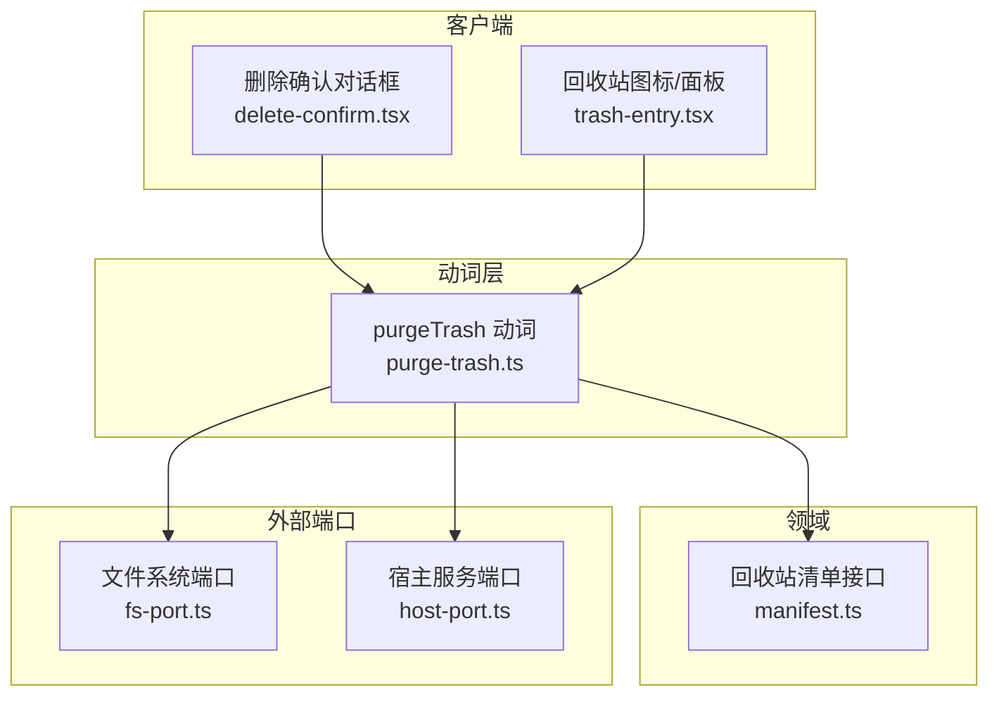
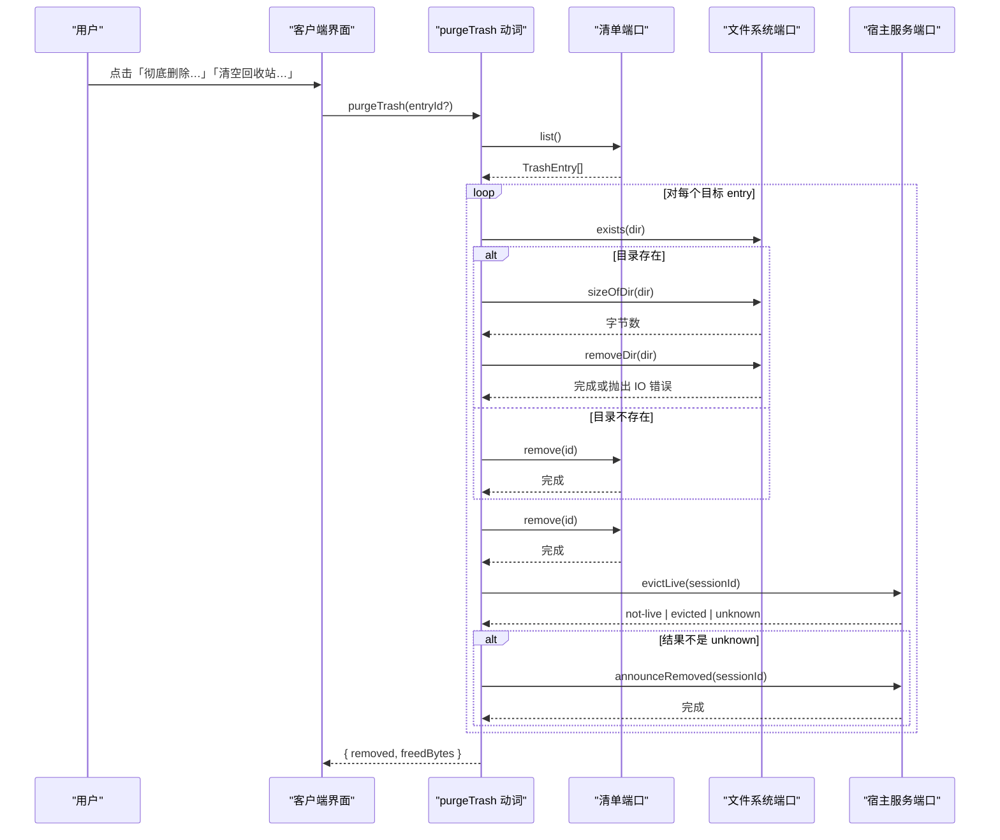
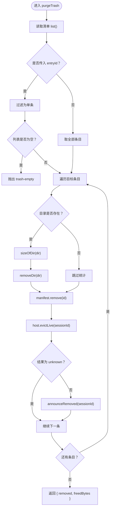
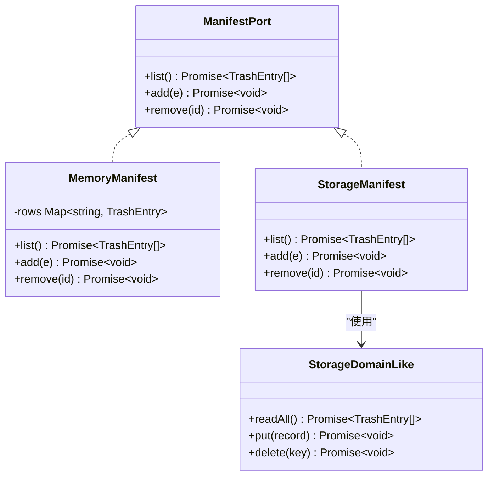
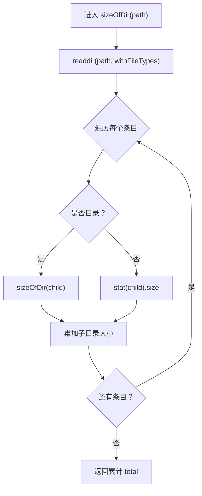
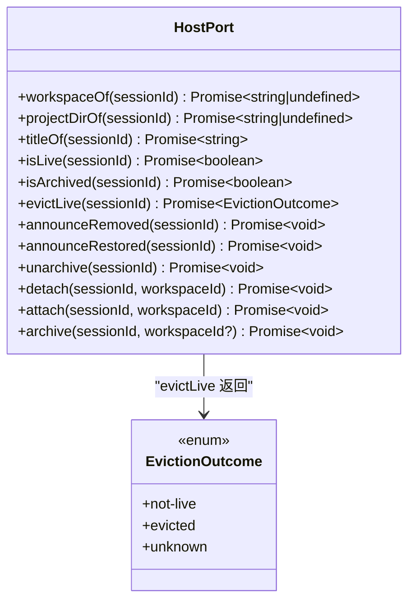
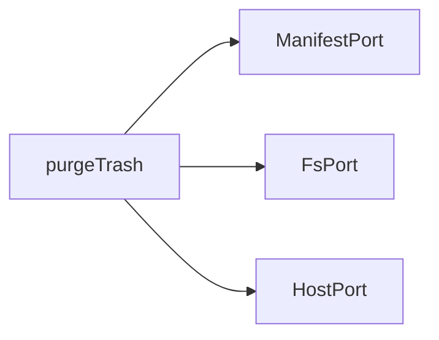
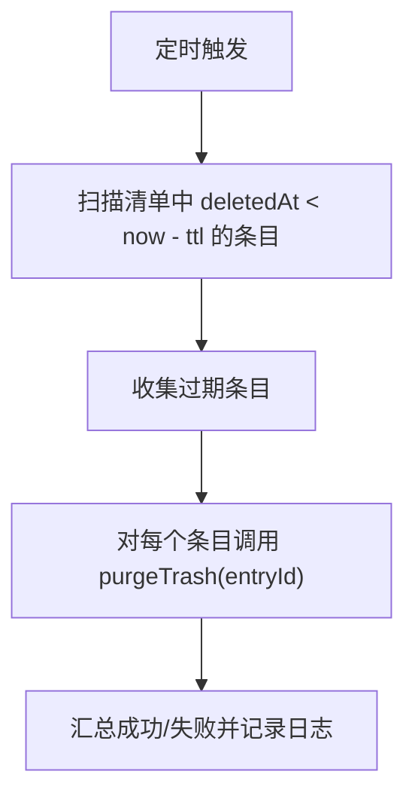

# 永久删除

<cite>
**本文引用的文件**   
- [purge-trash.ts](file://src/verbs/purge-trash.ts)
- [manifest.ts](file://src/trash/manifest.ts)
- [fs-port.ts](file://src/ports/fs-port.ts)
- [host-port.ts](file://src/ports/host-port.ts)
- [delete-confirm.tsx](file://src/client/delete-confirm.tsx)
- [trash-entry.tsx](file://src/client/trash-entry.tsx)
- [purge-trash.test.ts](file://tests/purge-trash.test.ts)
- [zh.json](file://locale/zh.json)
</cite>

## 目录
1. [引言](#引言)
2. [项目结构](#项目结构)
3. [核心组件](#核心组件)
4. [架构总览](#架构总览)
5. [详细组件分析](#详细组件分析)
6. [依赖关系分析](#依赖关系分析)
7. [性能与容量考量](#性能与容量考量)
8. [故障排查指南](#故障排查指南)
9. [结论](#结论)
10. [附录：扩展方案](#附录扩展方案)

## 引言
「永久删除」功能用于把回收站中的会话条目从磁盘、清单和宿主缓存中彻底移除。它对应两个用户入口：
- 回收站面板中某条记录的「彻底删除…」：仅删除该条记录。
- 页脚处的「清空回收站…」：删除全部回收站条目。

无论哪个入口，最终都调用 `purgeTrash` Verb。其核心语义是：**对每个目标 entry 递归删除对应目录、从清单移除、并从宿主内存与客户端通知中摘除**。该操作不可撤销，因此 UI 必须提供二次确认；对于批量清空，还应给出数量与占用提示。

## 项目结构
本仓库采用按职责分层组织：
- `src/verbs`：面向宿主的动词实现（事务逻辑）。
- `src/trash`：回收站清单抽象与持久化适配。
- `src/ports`：对外部系统的端口抽象（文件系统、宿主服务）。
- `src/client`：回收站面板与删除确认等前端交互。
- `tests`：针对各模块的行为测试。
- `locale`：插件元信息与文案。

**图表来源**
- [purge-trash.ts:1-29](file://src/verbs/purge-trash.ts#L1-L29)
- [manifest.ts:1-35](file://src/trash/manifest.ts#L1-L35)
- [fs-port.ts:1-33](file://src/ports/fs-port.ts#L1-L33)
- [host-port.ts:1-366](file://src/ports/host-port.ts#L1-L366)
- [delete-confirm.tsx:1-174](file://src/client/delete-confirm.tsx#L1-L174)
- [trash-entry.tsx:1-30](file://src/client/trash-entry.tsx#L1-L30)

**章节来源**
- [purge-trash.ts:1-29](file://src/verbs/purge-trash.ts#L1-L29)
- [manifest.ts:1-35](file://src/trash/manifest.ts#L1-L35)
- [fs-port.ts:1-33](file://src/ports/fs-port.ts#L1-L33)
- [host-port.ts:1-366](file://src/ports/host-port.ts#L1-L366)
- [delete-confirm.tsx:1-174](file://src/client/delete-confirm.tsx#L1-L174)
- [trash-entry.tsx:1-30](file://src/client/trash-entry.tsx#L1-L30)

## 核心组件
- `purgeTrash(deps)(entryId?)`：事务式永久删除入口。
  - 当 `entryId` 为空时，清空全部；不为空时仅删匹配的一条。
  - 返回 `{ removed, freedBytes }`：已删除条目数与预估释放字节数。
- `ManifestPort`：清单唯一读法，暴露 `list / add / remove`。
- `FsPort`：文件系统端口，暴露 `exists / ensureDir / rename / removeDir / sizeOfDir`。
- `HostPort`：宿主服务端口，暴露 `evictLive / announceRemoved` 等与会话状态同步的方法。
- 客户端确认框：负责二次确认与失败重试。

**章节来源**
- [purge-trash.ts:1-29](file://src/verbs/purge-trash.ts#L1-L29)
- [manifest.ts:1-35](file://src/trash/manifest.ts#L1-L35)
- [fs-port.ts:1-33](file://src/ports/fs-port.ts#L1-L33)
- [host-port.ts:1-366](file://src/ports/host-port.ts#L1-L366)
- [delete-confirm.tsx:1-174](file://src/client/delete-confirm.tsx#L1-L174)

## 架构总览
`purgeTrash` 的调用链如下：

**图表来源**
- [purge-trash.ts:1-29](file://src/verbs/purge-trash.ts#L1-L29)
- [fs-port.ts:1-33](file://src/ports/fs-port.ts#L1-L33)
- [manifest.ts:1-35](file://src/trash/manifest.ts#L1-L35)
- [host-port.ts:1-366](file://src/ports/host-port.ts#L1-L366)

## 详细组件分析

### 永久删除动词 `purgeTrash`
`purgeTrash` 是一个工厂函数，接收 `DeleteDeps`，返回一个以可选 `entryId` 为参数的异步函数。

关键行为：
1. **选择目标**：`entryId` 非空时过滤出单条；为空时取全部。
2. **校验单条删除**：若指定了 `entryId` 但清单中没有，抛出业务码 `trash-empty`。
3. **逐条处理**：
   - 通过 `trashDirOf(entry.id, home)` 计算目录路径。
   - 若目录存在，先统计大小，再递归删除。
   - 无论目录是否存在，都会执行 `manifest.remove(id)`，避免“幽灵条目”。
   - 调用 `host.evictLive(sessionId)` 尽力从宿主内存摘除；仅当结果不是 `unknown` 时才发 `announceRemoved`。
4. **返回值**：返回被删除条目数与累计 `freedBytes`。

**图表来源**
- [purge-trash.ts:1-29](file://src/verbs/purge-trash.ts#L1-L29)

**章节来源**
- [purge-trash.ts:1-29](file://src/verbs/purge-trash.ts#L1-L29)

### 清单抽象 `ManifestPort`
清单是回收站的唯一数据源。当前默认实现基于内存 Map，也提供适配宿主 storage domain 的薄封装。

要点：
- `list()` 返回按 `deletedAt` 倒序排列的 `TrashEntry[]`。
- `add()` 写入一条新回收站条目。
- `remove(id)` 删除指定 id 的记录。
- `createStorageManifest` 将宿主存储域的最小面包装成统一接口，屏蔽迭代器/快照差异。

**图表来源**
- [manifest.ts:1-35](file://src/trash/manifest.ts#L1-L35)

**章节来源**
- [manifest.ts:1-35](file://src/trash/manifest.ts#L1-L35)

### 文件系统端口 `FsPort`
文件系统端口封装 Node.js 的文件操作，并包含模块级递归实现。

关键点：
- `removeDir(p)` 使用递归删除并强制忽略不存在项。
- `sizeOfDir(p)` 在模块作用域内递归遍历子目录与文件，累加文件大小。
- 设计注释强调：端口方法应解构后单独调用，递归逻辑放在模块级以避免 `this` 丢失。

**图表来源**
- [fs-port.ts:1-33](file://src/ports/fs-port.ts#L1-L33)

**章节来源**
- [fs-port.ts:1-33](file://src/ports/fs-port.ts#L1-L33)

### 宿主服务端口 `HostPort`
`HostPort` 是对宿主内部服务的窄镜像，重点在于：
- `evictLive(sessionId)` 返回三态：
  - `not-live`：不在活体中，无需摘除。
  - `evicted`：已从宿主内存摘除。
  - `unknown`：无法判断，不能据此发“已删除”通告。
- `announceRemoved(sessionId)` 向客户端发送会话已被删除的事件，使侧栏立即移除该行。
- 其他方法如 `workspaceOf / projectDirOf / titleOf / archive / unarchive / detach / attach` 服务于恢复、归档、标题获取等流程。

**图表来源**
- [host-port.ts:1-366](file://src/ports/host-port.ts#L1-L366)

**章节来源**
- [host-port.ts:1-366](file://src/ports/host-port.ts#L1-L366)

### 客户端确认与回收站面板
- `delete-confirm.tsx`：提供通用的删除确认框，挂在宿主 `shell.overlay` 上，解决菜单行卸载导致确认框消失的问题。虽然主要服务于“移入回收站”，但其模式可作为“彻底删除”确认框的参考。
- `trash-entry.tsx`：回收站面板图标组件，只渲染 glyph，不承载按钮与计数角标；计数与占用由面板头部展示。

对于「永久删除」，建议在现有确认机制基础上增加更明确的警告信息，例如：
- “此操作会永久删除回收站中的文件，不可撤销。”
- “预计释放约 X GB，涉及 Y 个条目。”

**章节来源**
- [delete-confirm.tsx:1-174](file://src/client/delete-confirm.tsx#L1-L174)
- [trash-entry.tsx:1-30](file://src/client/trash-entry.tsx#L1-L30)

## 依赖关系分析
`purgeTrash` 依赖三个端口，耦合清晰：
- 对 `ManifestPort`：仅做读与删，不感知底层存储。
- 对 `FsPort`：只关心目录存在性、大小与递归删除。
- 对 `HostPort`：只做内存摘除与事件通告，不直接访问宿主内部对象。

**图表来源**
- [purge-trash.ts:1-29](file://src/verbs/purge-trash.ts#L1-L29)
- [manifest.ts:1-35](file://src/trash/manifest.ts#L1-L35)
- [fs-port.ts:1-33](file://src/ports/fs-port.ts#L1-L33)
- [host-port.ts:1-366](file://src/ports/host-port.ts#L1-L366)

潜在风险：
- 循环依赖：当前未出现，因为动词层不反向依赖端口实现。
- 外部副作用：`removeDir` 与 `announceRemoved` 都是副作用操作，需保证幂等与可观测性。
- 错误传播：IO 错误会中断后续条目处理，需要聚合策略。

**章节来源**
- [purge-trash.ts:1-29](file://src/verbs/purge-trash.ts#L1-L29)

## 性能与容量考量

### 时间复杂度
- 清单读取：`O(n)`。
- 每条记录：
  - 目录大小统计：`O(k)`，k 为目录下文件总数。
  - 递归删除：`O(k)`。
  - 清单删除与宿主通信：近似常数时间。
- 总体：`O(n + Σk_i)`，其中 n 为目标条目数，k_i 为第 i 条记录对应目录的文件数。

### 空间复杂度
- 清单快照：`O(n)`。
- 递归深度：取决于目录树深度，最坏可能接近 `O(d)`，d 为最大嵌套层级。
- 文件大小统计过程中不持有完整文件内容，仅累积字节数。

### 磁盘空间释放延迟
- `rm(..., { recursive: true })` 通常尽快删除目录树，但实际磁盘块释放可能受文件系统、挂载点、垃圾回收或云盘同步影响而延迟。
- `freedBytes` 是基于删除前统计的估算值，不代表操作系统立即归还的空间。

### 权限不足与部分删除
- 如果某个子文件或子目录不可删除，`removeDir` 可能抛错。
- 当前实现在单条目录删除失败时抛出带 `io` 业务码的错误，这会中断整个批次。
- 建议：
  - 对批量清空采用错误聚合：记录失败条目与原因，仍尽可能完成其余条目。
  - 区分“目录不存在”与“权限不足”：前者视为成功，后者应报错并保留清单一致性。

### 并发与锁
- 当前实现顺序处理条目，天然避免同一目录重复删除竞争。
- 如果未来改为并发删除，需要引入目录级锁，防止对同一会话目录并发写。

### 幂等性建议
- 对同一条目多次调用“彻底删除”：
  - 第一次：删除目录、清单、宿主缓存。
  - 第二次：目录已不存在，清单已不存在；应返回 `removed=0` 且 `freedBytes=0`，而不抛出业务错误。
- 对“清空回收站”：
  - 即使中间失败，也应尽量让清单与磁盘状态保持一致，并通过聚合错误报告哪些条目未清理。

**章节来源**
- [fs-port.ts:1-33](file://src/ports/fs-port.ts#L1-L33)
- [purge-trash.ts:1-29](file://src/verbs/purge-trash.ts#L1-L29)
- [purge-trash.test.ts:1-80](file://tests/purge-trash.test.ts#L1-L80)

## 故障排查指南

### 常见错误与定位
| 现象 | 可能原因 | 排查步骤 | 处理建议 |
|---|---|---|---|
| 点击「彻底删除…」后报 `sessiondelete/trash-empty` | 指定 `entryId` 但清单中不存在 | 检查清单是否已被修复或删除；确认前端传递的 id 是否正确 | 刷新回收站后再试；必要时走“清空回收站” |
| 删除中途抛出 `io` 错误 | 权限不足、磁盘只读、网络盘不可写 | 检查回收站目录权限、可用空间、网络连接 | 修复权限后重试；对失败条目单独重试 |
| 清单条目消失但侧栏仍有该行 | 宿主内存未摘除或未通告 | 检查 `evictLive` 与 `announceRemoved` 是否被调用 | 重启宿主或触发列表刷新；确认 `unknown` 分支未被误判 |
| 回收站显示已清空，但磁盘空间未减少 | 文件系统延迟释放、云盘同步延迟 | 等待一段时间或手动触发磁盘回收 | 不视为数据残留；监控磁盘趋势 |
| 清空回收站部分成功 | 某些子目录删除失败 | 查看聚合错误中的失败条目 | 对失败条目单独执行「彻底删除…」 |

### 单元测试覆盖的关键场景
测试验证了以下行为：
- 删除单条：目录被移除、清单少一条、返回释放字节。
- 不传 `entryId`：清空全部，并为每个条目调用 `removeDir`。
- 宿主内存摘除与通告：每条被删除的会话都应尝试 `evictLive` 与 `announceRemoved`。
- `evictLive` 返回 `unknown`：不发 `announceRemoved`，但不影响“已彻底删除”的结果。
- 清单中无此条目：抛出 `trash-empty`。
- 目录已被手工删除：仍移除清单行，不报错。

**章节来源**
- [purge-trash.test.ts:1-80](file://tests/purge-trash.test.ts#L1-L80)

## 结论
「永久删除」的核心是一个以 `purgeTrash` 为中心的事务流程：根据 `entryId` 选择目标，逐个递归删除目录、清理清单、并从宿主内存与客户端通知中摘除。它支持两种入口，但共享同一实现，有利于保持行为一致。

实施时应特别注意：
- 明确区分“移入回收站”与“彻底删除”的语义，并在 UI 上提供强提示与二次确认。
- 对大目录删除做好进度反馈与取消能力。
- 对批量操作实现错误聚合，避免“一处失败、全盘放弃”。
- 对幂等性进行增强，使重复删除不再抛出业务错误。
- 将 `freedBytes` 标注为估算值，并在 UI 中说明空间释放可能延迟。

## 附录：扩展方案

### 支持 TTL 自动清理
可在定时任务中扫描清单，比较 `deletedAt` 与阈值，对超期条目调用 `purgeTrash`。由于 `purgeTrash` 目前对单条删除要求条目存在，建议新增一个内部清理入口，或放宽“不存在即视为成功”的语义，以便后台任务不因历史不一致而失败。

### 按大小过滤
可先在 UI 或配置中允许用户设置最小释放阈值，例如只删除释放超过 1 GB 的条目。实现上可在 `purgeTrash` 外层对 `targets` 预筛选：先 `sizeOfDir`，再决定是否加入待删列表。注意这会增加一次目录遍历开销。

### 增量统计与进度
可对 `purgeTrash` 增加回调或流式结果，逐步上报：
- 已处理条目数
- 累计 `freedBytes`
- 当前正在处理的目录
- 失败条目列表

这样在大规模清空时，用户能看到实时进度而非长时间无响应。