# 开发指南

<cite>
**本文引用的文件**   
- [package.json](file://package.json)
- [tsconfig.json](file://tsconfig.json)
- [vitest.config.ts](file://vitest.config.ts)
- [cordis.patch.yml](file://cordis.patch.yml)
- [screenshots.json](file://screenshots.json)
- [README.md](file://README.md)
- [src/index.ts](file://src/index.ts)
- [src/api/dispatch.ts](file://src/api/dispatch.ts)
- [src/ports/fs-port.ts](file://src/ports/fs-port.ts)
- [src/ports/host-port.ts](file://src/ports/host-port.ts)
- [src/trash/manifest.ts](file://src/trash/manifest.ts)
- [src/verbs/delete-session.ts](file://src/verbs/delete-session.ts)
- [src/verbs/errors.ts](file://src/verbs/errors.ts)
- [src/verbs/purge-trash.ts](file://src/verbs/purge-trash.ts)
- [src/verbs/restore-session.ts](file://src/verbs/restore-session.ts)
- [src/client/delete-confirm.tsx](file://src/client/delete-confirm.tsx)
- [src/client/trash-entry.tsx](file://src/client/trash-entry.tsx)
- [src/client/undo-toast.tsx](file://src/client/undo-toast.tsx)
- [tests/client/support/setup.ts](file://tests/client/support/setup.ts)
- [tests/delete-session.test.ts](file://tests/delete-session.test.ts)
- [tests/purge-trash.test.ts](file://tests/purge-trash.test.ts)
- [tests/restore-session.test.ts](file://tests/restore-session.test.ts)
</cite>

## 目录
1. [引言](#引言)
2. [项目结构](#项目结构)
3. [核心组件](#核心组件)
4. [架构总览](#架构总览)
5. [详细组件分析](#详细组件分析)
6. [依赖关系分析](#依赖关系分析)
7. [性能与构建特性](#性能与构建特性)
8. [测试策略](#测试策略)
9. [贡献模板：新增 Verb、HTTP 端点、UI 控件](#贡献模板新增-verb-http-端点-ui-控件)
10. [配置文件说明](#配置文件说明)
11. [常见问题排查](#常见问题排查)
12. [结论](#结论)

## 引言
本仓库是 DeepSeek Harness（DSH）的会话删除插件。它把“删除”定义为移入回收站，并保留恢复能力；同时提供显式的彻底删除和清空回收站入口。Node 半通过宿主 web server 暴露一组同源 API，浏览器半在 DSH 界面里渲染确认框、回收站面板与撤销提示。

对于贡献者而言，最关键的是理解三件事：
- Node 半通过端口抽象访问文件系统与宿主服务，业务逻辑集中在动词层。
- 浏览器半使用 React 组件，并通过宿主远程通道调用 Node 半。
- 测试拆成 node 与 client 两个 project，分别覆盖后端动词与前端 UI。

## 项目结构
仓库采用按职责分层的组织方式：
- `src/`：插件源码，包含入口装配、API 路由、端口抽象、回收站清单、动词实现、浏览器半 UI。
- `tests/`：Vitest 用例，node 侧放在根级，client 侧放在 `tests/client/`。
- 顶层配置包括包元数据、TypeScript、Vitest、Cordis 补丁与截图清单。

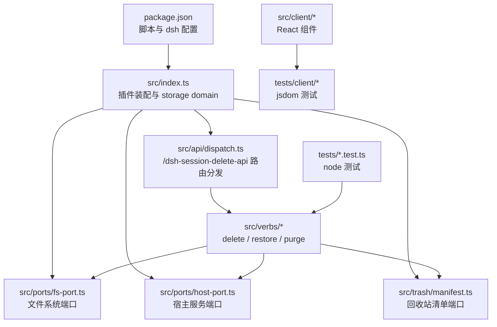

**图表来源**
- [package.json:1-91](file://package.json#L1-L91)
- [src/index.ts:1-237](file://src/index.ts#L1-L237)
- [src/api/dispatch.ts:1-192](file://src/api/dispatch.ts#L1-L192)
- [src/ports/fs-port.ts:1-33](file://src/ports/fs-port.ts#L1-L33)
- [src/ports/host-port.ts:1-366](file://src/ports/host-port.ts#L1-L366)
- [src/trash/manifest.ts:1-35](file://src/trash/manifest.ts#L1-L35)

**章节来源**
- [package.json:1-91](file://package.json#L1-L91)
- [README.md:1-130](file://README.md#L1-L130)

## 核心组件
插件的核心由四类构件组成：

| 类别 | 主要文件 | 职责 |
|---|---|---|
| 插件装配 | `src/index.ts` | 声明注入项、定义 storage domain、解析宿主数据根、创建 API handler 与清单适配器。 |
| HTTP 路由 | `src/api/dispatch.ts` | 注册 `/dsh-session-delete-api` 前缀路由，做同源校验、JSON body 解析、方法校验与动词分发。 |
| 端口层 | `src/ports/fs-port.ts`、`src/ports/host-port.ts`、`src/trash/manifest.ts` | 隔离真实系统调用与宿主服务，使动词可被单测。 |
| 动词层 | `src/verbs/delete-session.ts`、`src/verbs/restore-session.ts`、`src/verbs/purge-trash.ts` | 实现删除、恢复、清空回收站的有状态流程与回滚语义。 |

动词的错误统一通过 `src/verbs/errors.ts` 包装为带 `sessiondelete/<码>` 的错误对象，供远端映射到浏览器半错误信封。

**章节来源**
- [src/index.ts:1-237](file://src/index.ts#L1-L237)
- [src/api/dispatch.ts:1-192](file://src/api/dispatch.ts#L1-L192)
- [src/ports/fs-port.ts:1-33](file://src/ports/fs-port.ts#L1-L33)
- [src/ports/host-port.ts:1-366](file://src/ports/host-port.ts#L1-L366)
- [src/trash/manifest.ts:1-35](file://src/trash/manifest.ts#L1-L35)
- [src/verbs/delete-session.ts:1-104](file://src/verbs/delete-session.ts#L1-L104)
- [src/verbs/restore-session.ts:1-68](file://src/verbs/restore-session.ts#L1-L68)
- [src/verbs/purge-trash.ts:1-29](file://src/verbs/purge-trash.ts#L1-L29)
- [src/verbs/errors.ts:1-12](file://src/verbs/errors.ts#L1-L12)

## 架构总览
插件运行在两个环境之间：Node 半负责持久化、宿主服务交互与 HTTP 路由；浏览器半负责用户交互与轻量展示。

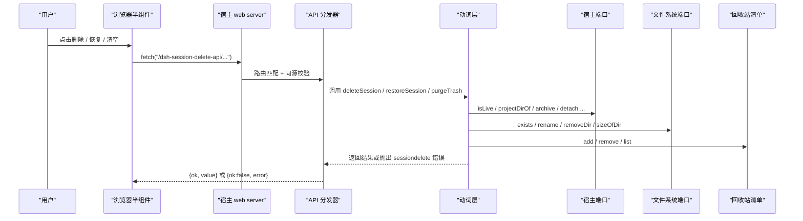

**图表来源**
- [src/api/dispatch.ts:1-192](file://src/api/dispatch.ts#L1-L192)
- [src/verbs/delete-session.ts:1-104](file://src/verbs/delete-session.ts#L1-L104)
- [src/verbs/restore-session.ts:1-68](file://src/verbs/restore-session.ts#L1-L68)
- [src/verbs/purge-trash.ts:1-29](file://src/verbs/purge-trash.ts#L1-L29)
- [src/ports/host-port.ts:1-366](file://src/ports/host-port.ts#L1-L366)
- [src/ports/fs-port.ts:1-33](file://src/ports/fs-port.ts#L1-L33)
- [src/trash/manifest.ts:1-35](file://src/trash/manifest.ts#L1-L35)

## 详细组件分析

### 插件装配与存储域
`src/index.ts` 是插件的入口。它做以下关键工作：
- 声明需要注入的宿主服务：工作区注册表、storage domain、web server。
- 定义回收站清单使用的 storage domain 名称、版本、布局与记录 schema。
- 把宿主 storage domain 适配为 `ManifestPort`，并在插件卸载时关闭 domain 句柄。
- 解析宿主数据根，用于定位 `~/.dsh/sessions` 与 `~/.dsh/session-trash`。
- 导出 `createStorageManifest` 与 `createApiHandler`，供宿主装配。

值得注意的设计约束：
- storage domain 名必须小写且只含字母、数字、下划线。
- 记录 schema 不引入 zod，而是实现官方域要求的 `parse(raw)` 接口。
- `inject` 中不包含 `remote`、`sessions`、`sessionProjectionCache`，因为它们可能是可选或浏览器半专属，直接 inject 会让插件进入 pending。

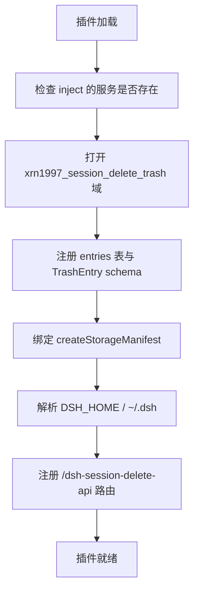

**图表来源**
- [src/index.ts:1-237](file://src/index.ts#L1-L237)

**章节来源**
- [src/index.ts:1-237](file://src/index.ts#L1-L237)

### 文件系统端口
`FsPort` 把 Node 文件系统操作抽象成 Promise 接口，便于测试替换。当前支持存在性检查、递归建目录、原子 rename、递归删除与目录大小统计。

关键点：
- `sizeOfDir` 是模块级递归函数，不是类方法，避免解构后 `this` 丢失。
- 首次写入回收站时需要先确保父目录存在，因为 `rename` 不会自动创建中间目录。
- 测试应 mock 所有五个方法，否则断言可能遗漏实际调用的路径。

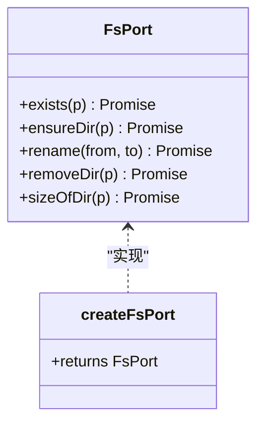

**图表来源**
- [src/ports/fs-port.ts:1-33](file://src/ports/fs-port.ts#L1-L33)

**章节来源**
- [src/ports/fs-port.ts:1-33](file://src/ports/fs-port.ts#L1-L33)

### 宿主服务端口
`HostPort` 是插件与 DSH 内部服务之间的窄契约。它负责：
- 查询会话是否活跃、是否归档、归属哪个工作区。
- 计算会话的项目目录名，镜像宿主的 `projectKey` 算法。
- 从投影缓存取标题，失败时降级为空串。
- 从宿主 live store 摘除会话，并如实通告客户端移除或恢复。
- 在工作区账本上 attach/detach，以及全局归档/unarchive。

该端口没有抛出自定义错误，而是原样转发宿主服务的异常；动词层再把原始错误包装为 `sessiondelete/io`。

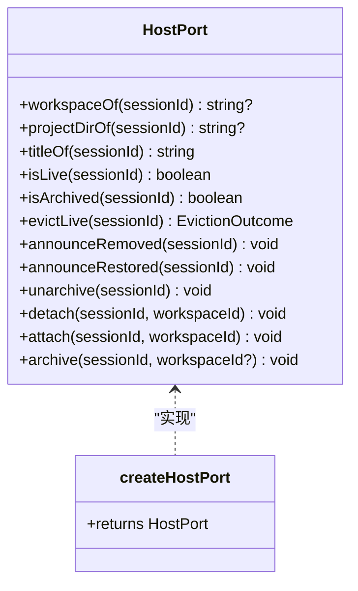

**图表来源**
- [src/ports/host-port.ts:1-366](file://src/ports/host-port.ts#L1-L366)

**章节来源**
- [src/ports/host-port.ts:1-366](file://src/ports/host-port.ts#L1-L366)

### 回收站清单端口
清单端口有两个实现：
- `createMemoryManifest`：内存 Map，适合单测。
- `createStorageManifest`：基于宿主 storage domain，适合真实运行。

清单只暴露列表、添加、删除三个操作；排序按 `deletedAt` 降序。

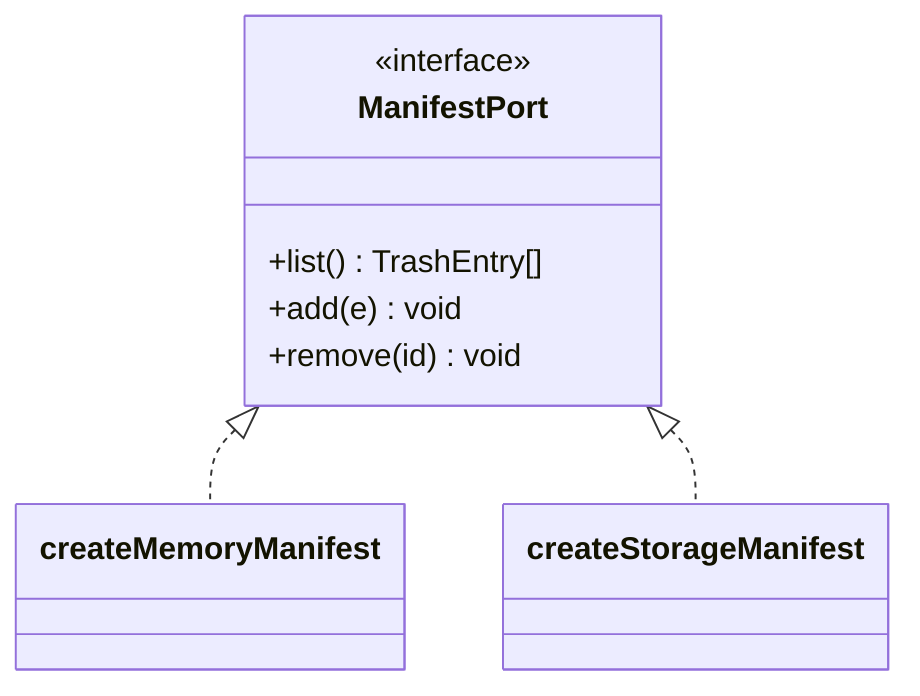

**图表来源**
- [src/trash/manifest.ts:1-35](file://src/trash/manifest.ts#L1-L35)

**章节来源**
- [src/trash/manifest.ts:1-35](file://src/trash/manifest.ts#L1-L35)

### 删除动词
删除是最复杂的动词。它的核心顺序是：
1. 拒绝运行中的会话。
2. 读取会话位置、工作区、归档态、标题与大小。
3. 对未归档会话执行归档。
4. 从工作区账本 detach。
5. 原子移动会话目录到回收站。
6. 登记回收站清单。
7. 尽力从宿主 live store 摘除，并在知道列表已干净时通告客户端。

失败路径会按相反顺序回滚，避免留下“文件进回收站但面板看不见”的孤儿条目。

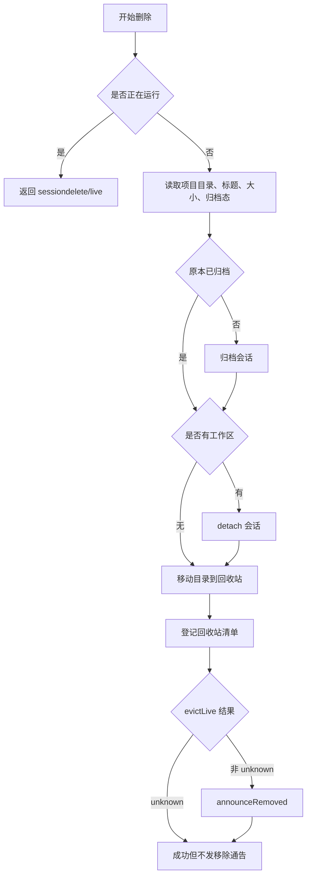

**图表来源**
- [src/verbs/delete-session.ts:1-104](file://src/verbs/delete-session.ts#L1-L104)

**章节来源**
- [src/verbs/delete-session.ts:1-104](file://src/verbs/delete-session.ts#L1-L104)

### 恢复动词
恢复的目标是把会话放回原项目目录，并按删除前的归档态还原可见性。其顺序是：
1. 从清单找到条目。
2. 校验回收站目录与原项目目录存在。
3. 先搬回文件。
4. 再挂回工作区账本。
5. 若原本未归档，则取消归档。
6. 最后摘除清单行。
7. 通告客户端会话恢复。

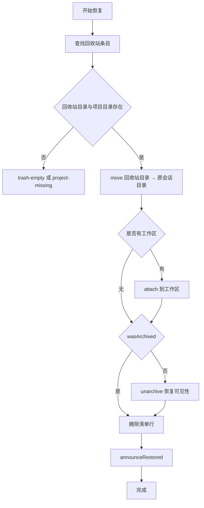

**图表来源**
- [src/verbs/restore-session.ts:1-68](file://src/verbs/restore-session.ts#L1-L68)

**章节来源**
- [src/verbs/restore-session.ts:1-68](file://src/verbs/restore-session.ts#L1-L68)

### 清空回收站动词
清空可以针对单个 entryId，也可以清空全部。它会：
- 遍历目标条目。
- 若磁盘目录仍存在则删除并累计释放字节。
- 摘除清单行。
- 尽力 evictLive 并如实通告移除。

**章节来源**
- [src/verbs/purge-trash.ts:1-29](file://src/verbs/purge-trash.ts#L1-L29)

### 错误模型
所有动词错误都通过 `verbError` 生成，包含：
- `code`：形如 `sessiondelete/live`、`sessiondelete/not-found`、`sessiondelete/trash-empty`、`sessiondelete/project-missing`、`sessiondelete/io`。
- `message`：面向用户的可读消息。
- `cause`：底层原始错误。

浏览器半通过 `toRemoteFailure` 把这些错误映射为远端失败信封。

**章节来源**
- [src/verbs/errors.ts:1-12](file://src/verbs/errors.ts#L1-L12)

### 浏览器半 UI 组件
浏览器半提供三类重要组件：

| 组件 | 文件 | 作用 |
|---|---|---|
| 删除确认框 | `src/client/delete-confirm.tsx` | 挂在宿主 overlay 上，接收菜单行的删除请求，显示会话摘要并调用远程删除。 |
| 回收站图标 | `src/client/trash-entry.tsx` | 只在侧栏面板行中输出一个图标 glyph，不画文字或按钮。 |
| 撤销提示 | `src/client/undo-toast.tsx` | 删除成功后显示 6 秒撤销横幅，支持撤销恢复。 |

这些组件使用 React 的 `useSyncExternalStore` 管理模块级状态，避免引入额外状态库。

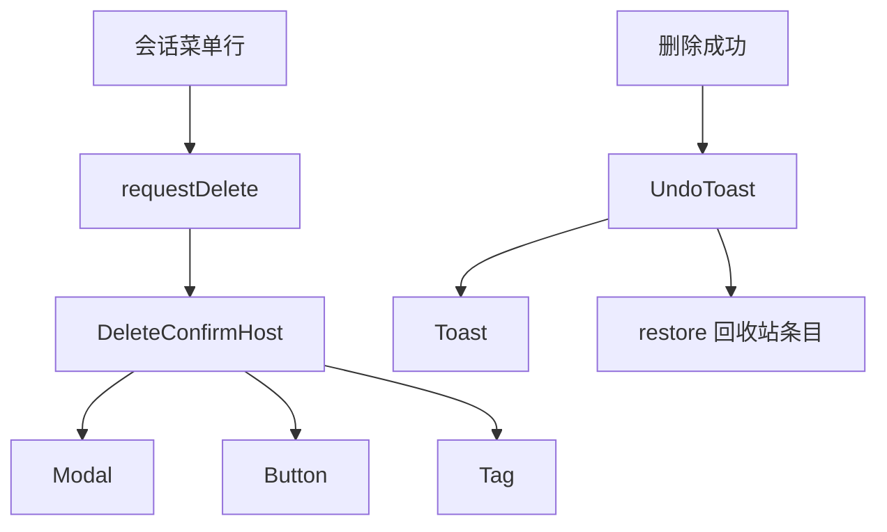

**图表来源**
- [src/client/delete-confirm.tsx:1-174](file://src/client/delete-confirm.tsx#L1-L174)
- [src/client/trash-entry.tsx:1-30](file://src/client/trash-entry.tsx#L1-L30)
- [src/client/undo-toast.tsx:1-123](file://src/client/undo-toast.tsx#L1-L123)

**章节来源**
- [src/client/delete-confirm.tsx:1-174](file://src/client/delete-confirm.tsx#L1-L174)
- [src/client/trash-entry.tsx:1-30](file://src/client/trash-entry.tsx#L1-L30)
- [src/client/undo-toast.tsx:1-123](file://src/client/undo-toast.tsx#L1-L123)

## 依赖关系分析
插件对外暴露的产物是预构建后的 `lib/`，运行时依赖分为三类：

| 依赖类型 | 示例 | 说明 |
|---|---|---|
| peerDependencies | `@deepseek-ai/cordis`、`react` | 安装阶段由宿主决定是否兼容。 |
| devDependencies | `typescript`、`vitest`、`@testing-library/react`、`jsdom` | 开发与测试工具。 |
| 宿主内部服务 | `workspaceRegistry`、`storageDomain`、`webServer` | 运行时由 DSH 注入，插件不声明为 npm 依赖。 |

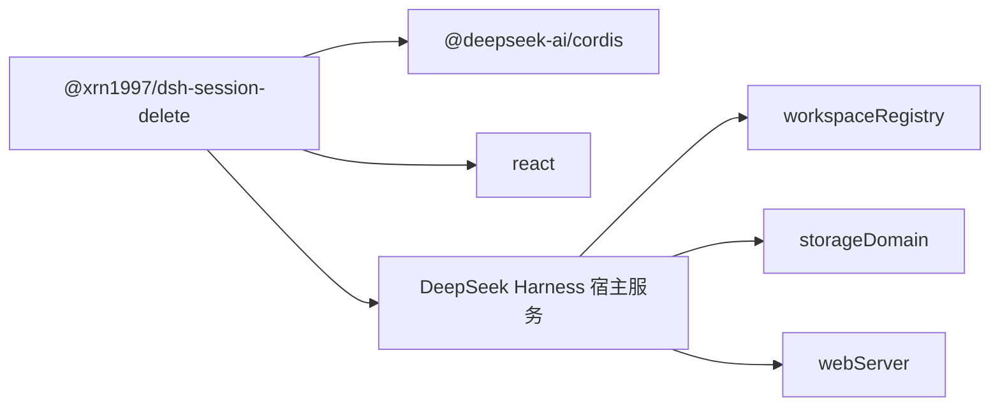

**图表来源**
- [package.json:1-91](file://package.json#L1-L91)
- [src/index.ts:1-237](file://src/index.ts#L1-L237)

**章节来源**
- [package.json:1-91](file://package.json#L1-L91)

## 性能与构建特性
- 构建命令是 `pnpm build`，底层使用 tsdown，产物同时包含 Node 半与浏览器半。
- TypeScript 编译目标是 ES2022，模块格式为 ESNext，模块解析走 Bundler。
- JSX 使用 `react-jsx`，不需要每个文件加 JSX pragma。
- 类型检查命令是 `pnpm typecheck`，即 `tsc --noEmit`。
- Node 引擎要求大于等于 24。
- 浏览器半平台标记为 `web`，并通过 `dsh.client.inject` 注入宿主 locale。

**章节来源**
- [package.json:1-91](file://package.json#L1-L91)
- [tsconfig.json:1-10](file://tsconfig.json#L1-L10)

## 测试策略

### Vitest 双 project
`vitest.config.ts` 明确使用两个 project，而不是全局 environment：
- **node project**：运行 `tests/*.test.ts`，environment 是 `node`。
- **client project**：运行 `tests/client/**/*.test.{ts,tsx}`，environment 是 `jsdom`，并加载 `tests/client/support/setup.ts`。

这样做的原因是 Node 半用例需要真实的 `import.meta.url` 行为；如果混入 jsdom，浏览器 URL 会把 `fileURLToPath` 打断。

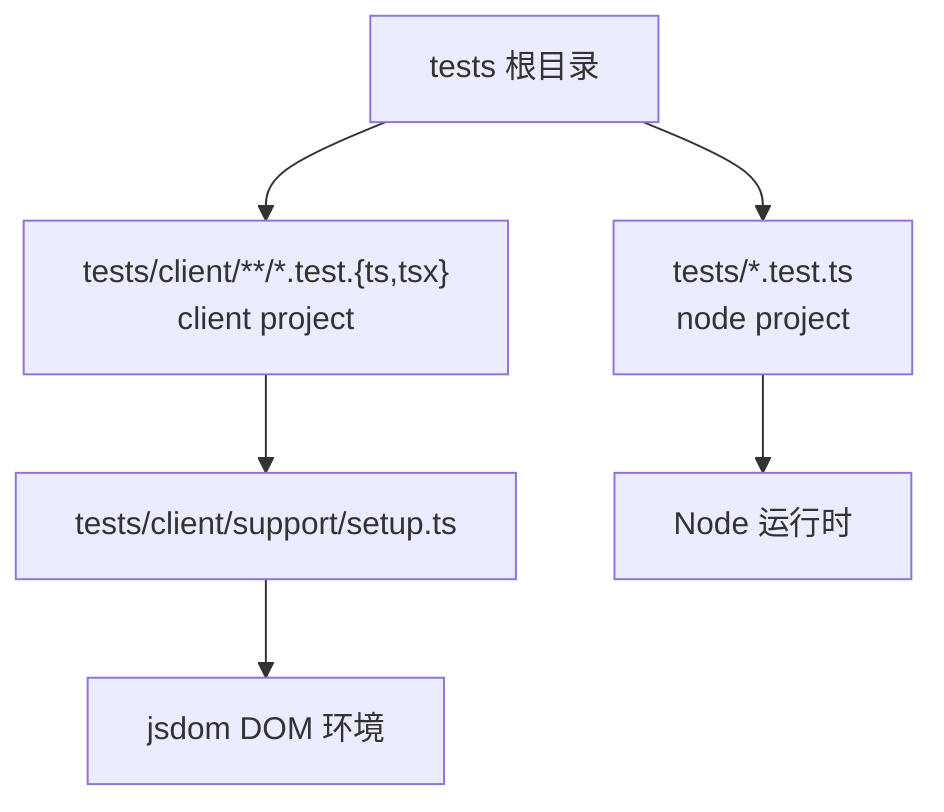

**图表来源**
- [vitest.config.ts:1-31](file://vitest.config.ts#L1-L31)
- [tests/client/support/setup.ts:1-25](file://tests/client/support/setup.ts#L1-L25)

**章节来源**
- [vitest.config.ts:1-31](file://vitest.config.ts#L1-L31)

### Mock FsPort / HostPort / ManifestPort
动词测试通常使用 `vi.fn` 构造最小夹具，并把完整依赖对象传给动词工厂。常见模式如下：

| 端口 | 测试做法 | 注意事项 |
|---|---|---|
| `FsPort` | 用 `vi.fn` 模拟 `exists`、`rename`、`removeDir`、`ensureDir`、`sizeOfDir`。 | 不要只 mock 成功路径；还要 mock 失败分支，例如 `EXDEV`、目录不存在。 |
| `HostPort` | 用 `vi.fn` 模拟 `isLive`、`projectDirOf`、`titleOf`、`isArchived`、`evictLive`、`announceRemoved`、`announceRestored`、`archive`、`unarchive`、`attach`、`detach`。 | `evictLive` 要区分 `evicted`、`not-live`、`unknown` 三种结果。 |
| `ManifestPort` | 使用 `createMemoryManifest` 或 `vi.fn` 模拟 `list`、`add`、`remove`。 | 断言清单最终长度，确保“幽灵行”不会出现。 |

参考现有夹具位置：
- 删除动词夹具：[tests/delete-session.test.ts:1-208](file://tests/delete-session.test.ts#L1-L208)
- 清空回收站夹具：[tests/purge-trash.test.ts:1-80](file://tests/purge-trash.test.ts#L1-L80)
- 恢复动词夹具：[tests/restore-session.test.ts:1-149](file://tests/restore-session.test.ts#L1-L149)

### 组件测试约定
浏览器半测试使用 `@testing-library/react` 与 `@testing-library/jest-dom`。推荐约定：
- 使用 `render` 渲染组件，使用 `screen` 或 `getBy*`/`queryBy*` 查找元素。
- 断言文案、按钮可用性、错误标签、DOM 节点存在性。
- 不要断言 CSS 具体像素值，除非设计稿明确要求；优先断言语义行为。
- 在 `afterEach` 中清理 DOM，避免上一个用例残留 `document`。

仓库已在 `tests/client/support/setup.ts` 中自动 cleanup，并 polyfill jsdom 缺少的 `ResizeObserver`，让 Tooltip 等控件不至于因缺少观测器而崩溃。

**章节来源**
- [tests/client/support/setup.ts:1-25](file://tests/client/support/setup.ts#L1-L25)

## 贡献模板：新增 Verb、HTTP 端点、UI 控件

### 新增 Verb 的步骤
1. 新建动词文件，例如 `src/verbs/new-action.ts`。
2. 定义依赖接口，遵循已有动词风格：`fs`、`host`、`manifest`、`home`、`now`。
3. 实现主函数，先做纯读校验，再做写操作，最后登记清单。
4. 失败路径要按相反顺序回滚，避免半成功状态。
5. 使用 `verbError` 包装错误，选择合适 code。
6. 在 `tests/new-action.test.ts` 中用 `createMemoryManifest` 和 `vi.fn` 构造夹具。
7. 验证错误码是否属于 `VERB_CODES`；若新增业务码，需同步更新错误映射。

参考路径：
- 动词模板：[src/verbs/delete-session.ts:1-104](file://src/verbs/delete-session.ts#L1-L104)
- 错误模板：[src/verbs/errors.ts:1-12](file://src/verbs/errors.ts#L1-L12)
- 测试模板：[tests/delete-session.test.ts:1-208](file://tests/delete-session.test.ts#L1-L208)

### 新增 HTTP 端点的步骤
1. 在共享 wire 常量中定义路由与方法参数键。
2. 在 `src/api/dispatch.ts` 的 `dispatch` 中添加路由分支。
3. 校验 HTTP 方法、解析 JSON body、校验必填字段。
4. 调用新动词并返回 `{ok, value}` 或错误信封。
5. 保持“信封在场时 HTTP 状态一律 200”的规则；只有同源栅栏拦截才返回 403。
6. 增加 Node 端单元测试，可直接 `createApiHandler` 并传入真实 `IncomingMessage` 与 `ServerResponse`。

参考路径：
- 路由分发：[src/api/dispatch.ts:1-192](file://src/api/dispatch.ts#L1-L192)

### 新增 UI 控件的步骤
1. 在 `src/client/ui/` 中新增组件文件，复用已有的 `Button`、`Modal`、`Tag`、`Tooltip`、`icons` 等基础控件。
2. 组件使用 React 函数形式，接受 props 与可选翻译函数。
3. 如需跨组件状态，使用模块级 store 配合 `useSyncExternalStore`，像 `delete-confirm.tsx` 与 `undo-toast.tsx` 那样。
4. 在 `tests/client/` 下新增 `.test.tsx`，使用 `@testing-library/react` 渲染与断言。
5. 如果需要宿主 slot，先在插件装配处注册槽位，并确保只渲染必要内容。

参考路径：
- 确认框组件：[src/client/delete-confirm.tsx:1-174](file://src/client/delete-confirm.tsx#L1-L174)
- 撤销提示组件：[src/client/undo-toast.tsx:1-123](file://src/client/undo-toast.tsx#L1-L123)
- 面板图标组件：[src/client/trash-entry.tsx:1-30](file://src/client/trash-entry.tsx#L1-L30)

## 配置文件说明

### cordis.patch.yml
该文件告诉 DSH 如何把本插件插入宿主插件表。当前内容表示插入一个 id 为 `session-delete`、包名为 `@xrn1997/dsh-session-delete` 的插件。

它的作用：
- 决定宿主启动时是否发现并激活本插件。
- 与 `package.json` 的 `dsh.bundle.patch` 指向同一份文件。
- 如果修改了插件 id 或包名，需要同步更新此处与包元数据。

**章节来源**
- [cordis.patch.yml:1-3](file://cordis.patch.yml#L1-L3)
- [package.json:1-91](file://package.json#L1-L91)

### screenshots.json
该文件列出截图文档的图片路径。当前仅包含一条截图路径，对应 README 顶部展示的回收站面板截图。

它的作用：
- 作为文档或发布资源清单的一部分。
- 与 `docs/screenshots/` 下的图片保持一致。
- 若新增截图，应同时更新 README 与截图清单。

**章节来源**
- [screenshots.json:1-3](file://screenshots.json#L1-L3)
- [README.md:1-130](file://README.md#L1-L130)

## 常见问题排查

### JSX 编译失败
现象：
- 报错 JSX 语法不可识别。
- 或 React 类型找不到。

原因：
- TypeScript 编译器选项未启用 `jsx: react-jsx`。
- 或测试环境没有正确解析 `.tsx`。

处理：
- 检查 `tsconfig.json` 的 `compilerOptions.jsx`。
- 确认 vitest 能读取 `tests/client/**/*.test.tsx`。
- 确认 `@types/react` 与 `@types/react-dom` 在 devDependencies 中。

**章节来源**
- [tsconfig.json:1-10](file://tsconfig.json#L1-L10)
- [vitest.config.ts:1-31](file://vitest.config.ts#L1-L31)
- [package.json:1-91](file://package.json#L1-L91)

### 浏览器半纯度门报错
现象：
- 构建时报浏览器半导入失败。
- 或测试加载浏览器半时出现未知依赖。

原因：
- 浏览器半代码直接或间接 import 了宿主内部包，例如旧版 alias 替身的 `@deepseek-ai/dsh-client-ui-primitives`。
- 或者浏览器半组件引用了随宿主发布的 shadcn、katex 等依赖。

处理：
- 使用本仓自有的 `src/client/ui/*` 控件，不要从宿主包 alias 掉整棵树。
- 浏览器半只依赖 React 家族与本地 UI 控件。
- 构建前先跑 `pnpm build`，确认产物能通过宿主 purity gate。

**章节来源**
- [vitest.config.ts:1-31](file://vitest.config.ts#L1-L31)
- [package.json:1-91](file://package.json#L1-L91)

### DOM 事件在 jsdom 中行为差异
现象：
- 某些原生事件行为与真实浏览器不一致。
- `ResizeObserver` 未定义导致 Tooltip 等控件报错。

原因：
- jsdom 不是完整浏览器，缺少部分浏览器 API。
- 本仓已在 setup 文件中 polyfill `ResizeObserver`，但其他 API 仍需按需补充。

处理：
- 在 `tests/client/support/setup.ts` 中补充缺失的全局 API。
- 优先断言组件最终 DOM 状态，而不是精确事件时序。
- 对需要滚动、尺寸测量、焦点的行为，尽量封装到可 mock 的辅助函数。

**章节来源**
- [tests/client/support/setup.ts:1-25](file://tests/client/support/setup.ts#L1-L25)

### 端口 mock 不完整导致测试不稳定
现象：
- 某个分支用例通过，另一个用例失败。
- 断言调用次数不够，或意外多出一个异步副作用。

原因：
- 只 mock 了成功路径，没覆盖失败、回滚、`unknown` 分支。
- 忘记 mock `evictLive`、`announceRemoved`、`announceRestored`、`archive`、`unarchive`、`attach`、`detach`。
- 忘记断言清单最终状态，导致“幽灵行”漏检。

处理：
- 对照动词实现，逐条补齐成功、失败、回滚、边界条件用例。
- 对 `HostPort.evictLive` 分别测试 `evicted`、`not-live`、`unknown`。
- 对 `FsPort` 同时 mock 成功与失败，尤其 `rename` 与 `exists`。
- 对 `ManifestPort` 断言 `list()` 的最终长度。

参考：
- 删除动词测试：[tests/delete-session.test.ts:1-208](file://tests/delete-session.test.ts#L1-L208)
- 恢复动词测试：[tests/restore-session.test.ts:1-149](file://tests/restore-session.test.ts#L1-L149)
- 清空回收站测试：[tests/purge-trash.test.ts:1-80](file://tests/purge-trash.test.ts#L1-L80)

## 结论
开发 DSH 会话删除插件的关键是坚持“端口抽象 + 动词实现 + 两端测试”的模式：
- Node 半只通过 `FsPort`、`HostPort`、`ManifestPort` 与外部世界通信。
- 动词关注状态机、顺序与回滚，不关心具体 IO 或宿主实现。
- 浏览器半组件保持轻量，复杂状态交给宿主 overlay 与模块级 store。
- 测试覆盖 node 与 client 两条链路，并用 `vi.fn` 精确断言副作用顺序。

贡献时请始终同时满足：
- `pnpm test` 通过。
- `pnpm typecheck` 通过。
- 新增行为有对应测试。
- 新增错误码同步维护错误映射。
- 新增 UI 行为有组件测试或至少可手动验证。