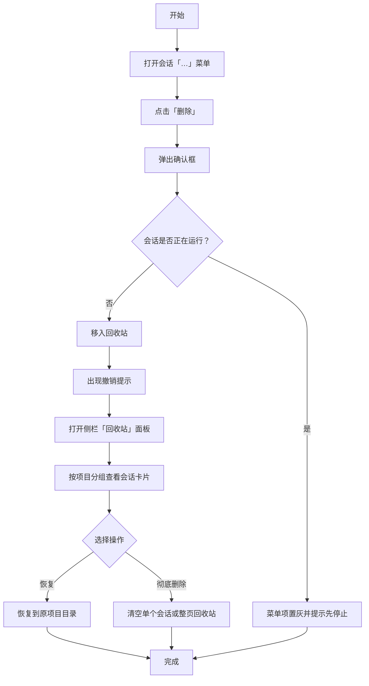
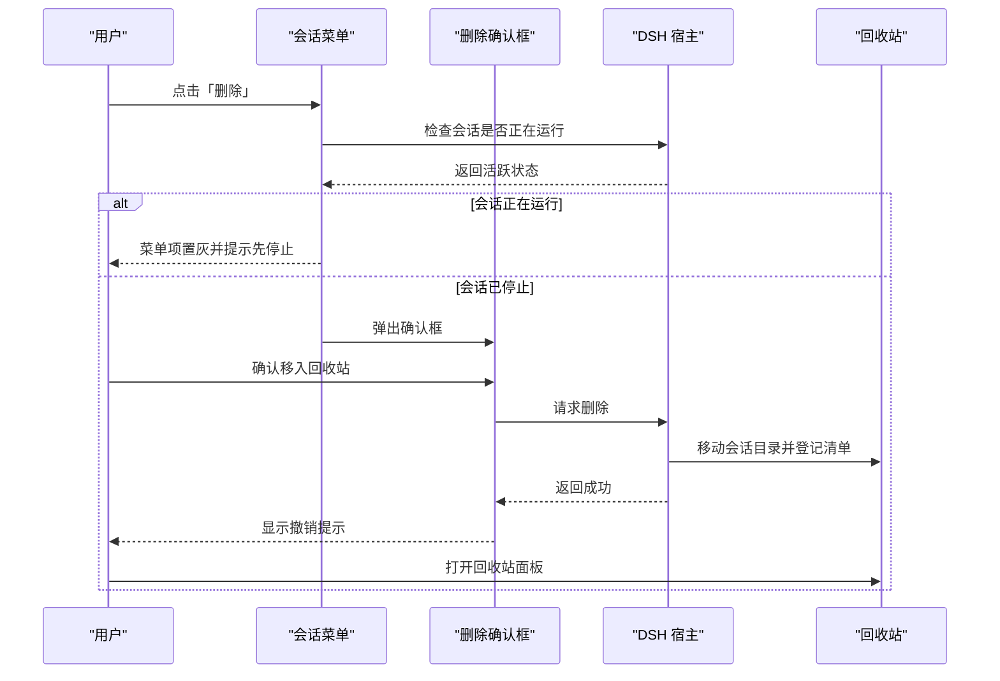
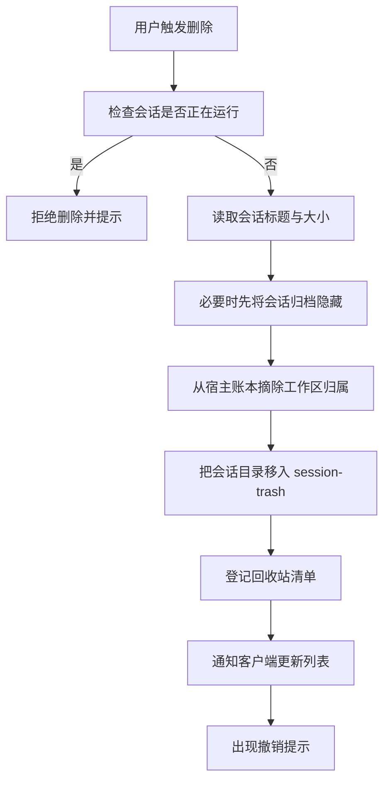
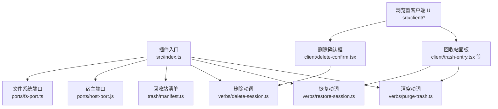

# 快速开始

<cite>
**本文引用的文件**
- [README.md](file://README.md)
- [package.json](file://package.json)
- [src/index.ts](file://src/index.ts)
- [cordis.patch.yml](file://cordis.patch.yml)
- [locale/zh.json](file://locale/zh.json)
- [src/client/copy.ts](file://src/client/copy.ts)
- [src/client/delete-confirm.tsx](file://src/client/delete-confirm.tsx)
- [src/client/trash-entry.tsx](file://src/client/trash-entry.tsx)
- [src/verbs/delete-session.ts](file://src/verbs/delete-session.ts)
- [src/verbs/restore-session.ts](file://src/verbs/restore-session.ts)
- [src/verbs/purge-trash.ts](file://src/verbs/purge-trash.ts)
</cite>

## 目录
1. [简介](#简介)
2. [从零到一：安装与首次使用](#从零到一安装与首次使用)
3. [核心用户旅程](#核心用户旅程)
4. [关键概念与运行模型](#关键概念与运行模型)
5. [环境要求与兼容性](#环境要求与兼容性)
6. [常见问题](#常见问题)
7. [给开发者的背景补充](#给开发者的背景补充)
8. [总结](#总结)

## 简介
本插件为 DeepSeek Harness（DSH）补上「删除会话」能力。它不是把会话直接抹掉，而是执行「删除 = 移入回收站」：你可以随时恢复，也可以对单条或整页进行显式彻底删除。正在运行的会话不会允许删除，避免替你终止工作。

- 安装命令：`dsh plugin --profile <profile> add @xrn1997/dsh-session-delete`
- 数据落点：本机 `~/.dsh/session-trash/`；不联网、不上传
- 界面文案随宿主语言切换，服务不可用时回退内置中文

**章节来源**
- [README.md:1-12](file://README.md#L1-L12)
- [README.md:24-40](file://README.md#L24-L40)
- [README.md:110-121](file://README.md#L110-L121)

## 从零到一：安装与首次使用

### 前置条件
- 已安装 DSH 桌面端
- Node.js 版本满足插件构建与分发要求（见后文“环境要求与兼容性”）
- 拥有目标 profile 的写入权限

### 安装步骤
1. 打开终端
2. 执行安装命令：`dsh plugin --profile <profile> add @xrn1997/dsh-session-delete`
3. 安装完成后重启 DSH 宿主进程（Node 半不走热重载）

卸载时只移除插件本体，不会自动清理 `~/.dsh/session-trash/` 下已有的回收站内容。

### 第一次使用流程
1. 在任意会话条目右侧点击「…」菜单
2. 选择「删除」
3. 弹出确认框，确认后将会话移入回收站
4. 在侧栏面板列表找到「回收站」并点击进入
5. 在回收站中查看被删会话，可执行「恢复」或「彻底删除…」

[此图为概念流程图，未直接映射具体源码文件]

**章节来源**
- [README.md:42-56](file://README.md#L42-L56)
- [README.md:58-76](file://README.md#L58-L76)

## 核心用户旅程

### 删除一条会话
- 入口：会话条目「…」菜单中的「删除」
- 行为：进入回收站，并可撤销
- 限制：正在运行的会话无法删除，菜单项会置灰并给出原因

### 查看回收站
- 入口：侧栏面板列表常驻的「回收站」行
- 视图：按项目分组的卡片列表，每条显示标题、删除时间与大小
- 头部：条数与合计占用，以及刷新按钮
- 页脚：回收站位置说明与「清空回收站…」按钮

### 恢复会话
- 行为：把会话放回原项目目录，并还原删除前的归档状态
- 语义：删除前未归档的，恢复后仍不归档；删除前已归档的，恢复后仍在归档态

### 彻底删除
- 单条彻底删除：回收站列表中每条的「彻底删除…」
- 整页清空：回收站页脚唯一的实心红按钮「清空回收站…」
- 两者共用二次确认；一旦彻底删除，文件不再保留

**图表来源**
- [src/client/delete-confirm.tsx:1-46](file://src/client/delete-confirm.tsx#L1-L46)
- [src/client/delete-confirm.tsx:108-174](file://src/client/delete-confirm.tsx#L108-L174)
- [src/verbs/delete-session.ts:1-104](file://src/verbs/delete-session.ts#L1-L104)

**章节来源**
- [README.md:24-40](file://README.md#L24-L40)
- [README.md:58-76](file://README.md#L58-L76)
- [src/client/trash-entry.tsx:1-30](file://src/client/trash-entry.tsx#L1-L30)
- [src/client/delete-confirm.tsx:1-46](file://src/client/delete-confirm.tsx#L1-L46)
- [src/verbs/delete-session.ts:1-104](file://src/verbs/delete-session.ts#L1-L104)
- [src/verbs/restore-session.ts:1-68](file://src/verbs/restore-session.ts#L1-L68)
- [src/verbs/purge-trash.ts:1-29](file://src/verbs/purge-trash.ts#L1-L29)

## 关键概念与运行模型

### 删除 ≠ 立即消失
删除操作会把会话目录移动到回收站，并把元数据登记到插件自己的 storage domain 清单中。只有执行「彻底删除」才会真正释放磁盘空间。

### 运行中的会话拒绝删除
插件通过宿主提供的活跃检查判断会话是否正在运行。若是，则拒绝删除，不替用户终止任务。

### 回收站路径与持久性
- 回收站本体位于宿主数据根下的 `~/.dsh/session-trash/<时间戳>-<原目录名>/`
- 清单保存在插件 storage domain，介质位于 `~/.dsh/storages/`
- 回收站与会话目录同卷，搬移走的是原子 rename，瞬时完成
- 不设自动过期；只有显式清空才会丢失字节

**图表来源**
- [src/verbs/delete-session.ts:1-104](file://src/verbs/delete-session.ts#L1-L104)
- [src/index.ts:120-180](file://src/index.ts#L120-L180)

**章节来源**
- [README.md:78-109](file://README.md#L78-L109)
- [src/verbs/delete-session.ts:1-104](file://src/verbs/delete-session.ts#L1-L104)
- [src/index.ts:120-180](file://src/index.ts#L120-L180)

## 环境要求与兼容性

### Node.js 与包管理器
- 插件声明 Node.js 引擎要求为 `>=24`
- 推荐使用 pnpm 管理依赖
- 本地调试时需要手动执行构建脚本，因为源码目录链进 profile 的安装方式不会自动构建 `lib/`

### 兼容的 DSH 版本
- 插件没有钉死 `@deepseek-ai/dsh*` peer 区间，因此「装得上」主要取决于 cordis 与 React 的 peer 约束
- 实测兼容记录由 `dsh.compatibility.dshReleases` 维护，当前明确标记兼容的版本为 **DSH Desktop 0.2.0-rc.2**
- 其他 rc 版本可能能装上，但没有经过同等验证

### Cordis 插件模型
- 插件以 cordis 插件形式注入宿主
- 插件描述文件 `cordis.patch.yml` 将插件 id 与名称注册到 cordis 表
- Node 半注入的服务包括 workspaceRegistry、storageDomain、webServer；浏览器半通过 webServer 暴露 API 路由
- 浏览器 UI 通过宿主槽位机制挂载到 overlay、侧栏面板等位置

**章节来源**
- [package.json:1-24](file://package.json#L1-L24)
- [package.json:25-60](file://package.json#L25-L60)
- [package.json:61-91](file://package.json#L61-L91)
- [README.md:42-56](file://README.md#L42-L56)
- [cordis.patch.yml:1-3](file://cordis.patch.yml#L1-L3)
- [src/index.ts:1-40](file://src/index.ts#L1-L40)

## 常见问题

### 安装完侧栏没有「回收站」，会话菜单里也没有「删除」
- 先重启宿主
- 若仍无入口，确认该 DSH 代上插件是否激活
- 取数通道探测失败时，插件会主动不注册任何入口；这不是禁用态，而是「不可用就不出现」

### 删完之后侧栏那行还在
- 插件只在宿主确实不再列出会话时才通告客户端去掉那一行
- 若拿不准，宁可保持沉默；冷会话走正常路径，删完即走
- 刚巧遇到时刷新页面，那一行通常会自行消失

### 正在运行的会话为什么删不掉
- 判据来自宿主活跃检查，首版一律拒绝
- 需要先停止会话再删除，插件不会替你终止任务

### 能恢复多久
- 没有时间上限
- 不自动过期；只有你显式清空或彻底删除才会丢字节

### 回收站路径不存在
- 如果宿主数据根解析不一致，或者 `~/.dsh/sessions/` 下对应项目目录缺失，恢复会报错
- 恢复逻辑明确要求原项目目录存在，不会静默创建
- 可通过检查宿主数据根、回收站目录与 sessions 目录是否存在来定位问题

### 回收站读不到
- 插件不会吞错误：读失败时会展示宿主原文，并提供「重试」
- 常见原因是 storage domain 句柄异常、清单损坏或宿主存储设施不可用

**章节来源**
- [README.md:98-121](file://README.md#L98-L121)
- [src/verbs/restore-session.ts:1-68](file://src/verbs/restore-session.ts#L1-L68)
- [src/verbs/delete-session.ts:1-104](file://src/verbs/delete-session.ts#L1-L104)

## 给开发者的背景补充

### 插件入口与服务注入
- 插件导出名称、注入字段、storage domain 绑定、home 路径解析与 API 路由注册集中在入口文件
- Node 半注入的服务是字符串数组，避免把浏览器半服务写进 Node 半导致插件一直 pending
- storage domain 名字带插件专属前缀，并使用 per-record 布局与 backup-and-skip 策略，保证坏记录不会让域开不起来

### 动词层职责
- `delete-session`：校验活跃状态、归档隐藏、摘账本、移动目录、登记清单、通告客户端
- `restore-session`：按 entryId 找回原目录名、放回 sessions 树、挂账本、还原可见性、摘清单、通告恢复
- `purge-trash`：按单条或全部删除回收站目录、统计释放空间、通告移除

### 客户端交互要点
- 删除确认框挂在宿主 overlay 上，而不是会话菜单行内部，避免菜单收起时对话框被卸载
- 回收站面板图标只渲染 glyph，不画多余控件，防止与宿主 panelRow 错位
- 文案统一通过宿主 locale 服务注册命名空间，服务不可用时降级为内置中文

**图表来源**
- [src/index.ts:1-40](file://src/index.ts#L1-L40)
- [src/verbs/delete-session.ts:1-104](file://src/verbs/delete-session.ts#L1-L104)
- [src/verbs/restore-session.ts:1-68](file://src/verbs/restore-session.ts#L1-L68)
- [src/verbs/purge-trash.ts:1-29](file://src/verbs/purge-trash.ts#L1-L29)
- [src/client/delete-confirm.tsx:1-46](file://src/client/delete-confirm.tsx#L1-L46)
- [src/client/trash-entry.tsx:1-30](file://src/client/trash-entry.tsx#L1-L30)

**章节来源**
- [src/index.ts:1-40](file://src/index.ts#L1-L40)
- [src/index.ts:120-180](file://src/index.ts#L120-L180)
- [src/verbs/delete-session.ts:1-104](file://src/verbs/delete-session.ts#L1-L104)
- [src/verbs/restore-session.ts:1-68](file://src/verbs/restore-session.ts#L1-L68)
- [src/verbs/purge-trash.ts:1-29](file://src/verbs/purge-trash.ts#L1-L29)
- [src/client/delete-confirm.tsx:1-46](file://src/client/delete-confirm.tsx#L1-L46)
- [src/client/trash-entry.tsx:1-30](file://src/client/trash-entry.tsx#L1-L30)
- [src/client/copy.ts:1-40](file://src/client/copy.ts#L1-L40)
- [locale/zh.json:1-6](file://locale/zh.json#L1-L6)

## 总结
DSH 会话删除插件把「删除」做成可恢复的安全操作：默认移入回收站，支持恢复、单条彻底删除与整页清空，同时保护运行中的会话不被误删。安装简单、数据落盘清晰、错误不吞，并通过 cordis 插件模型与宿主槽位体系融入 DSH 界面。遇到问题时，优先检查 DSH 版本、宿主进程是否重启、回收站与 sessions 目录是否存在，以及插件是否处于可用状态。