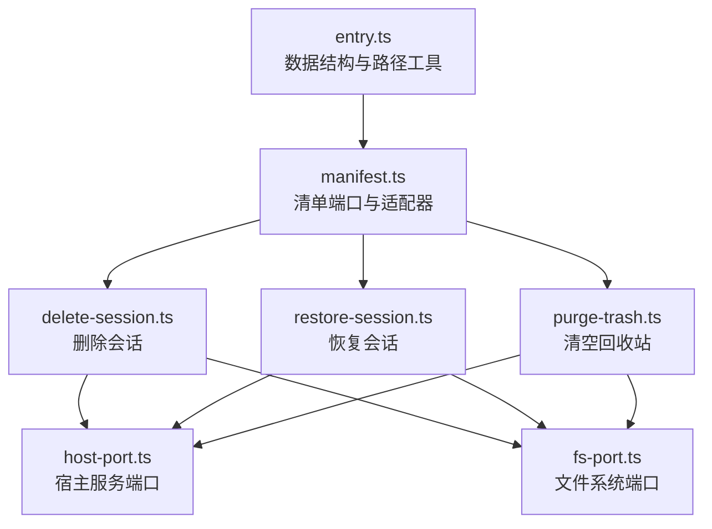
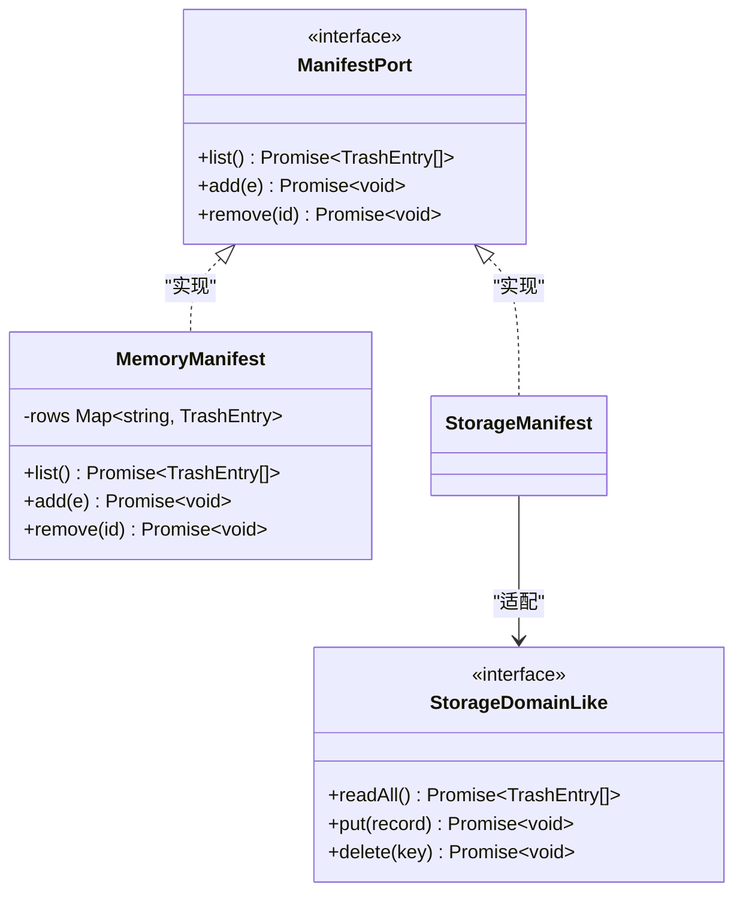
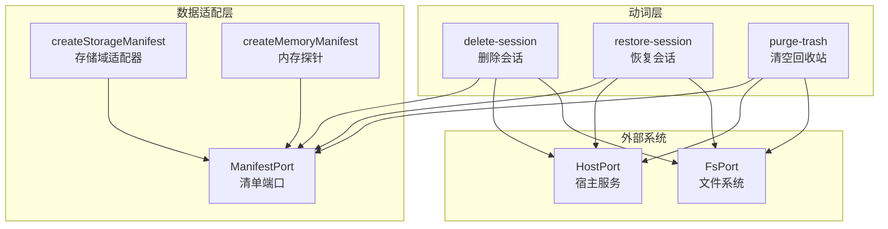
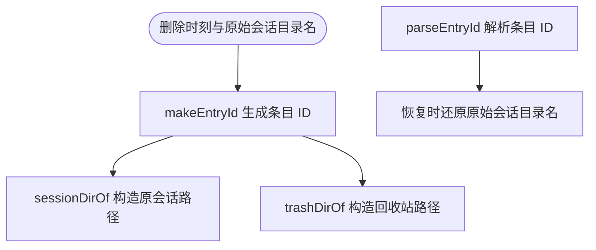
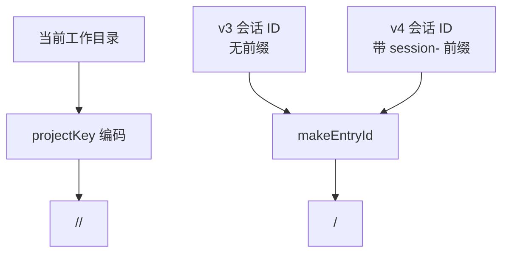
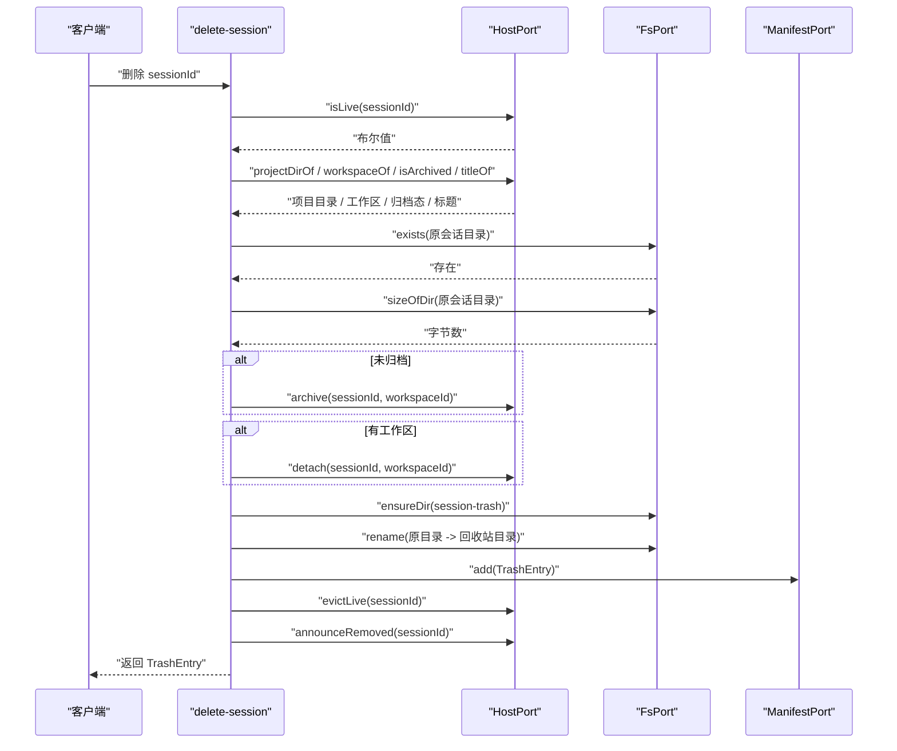
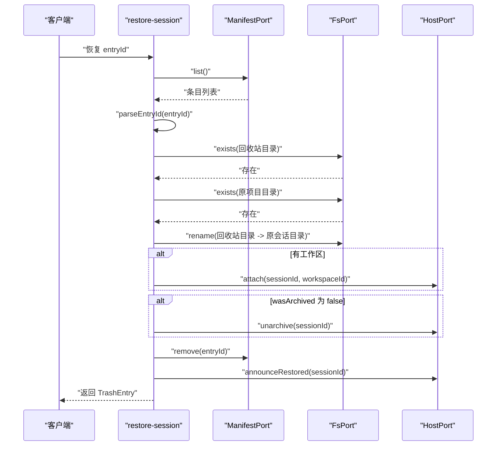
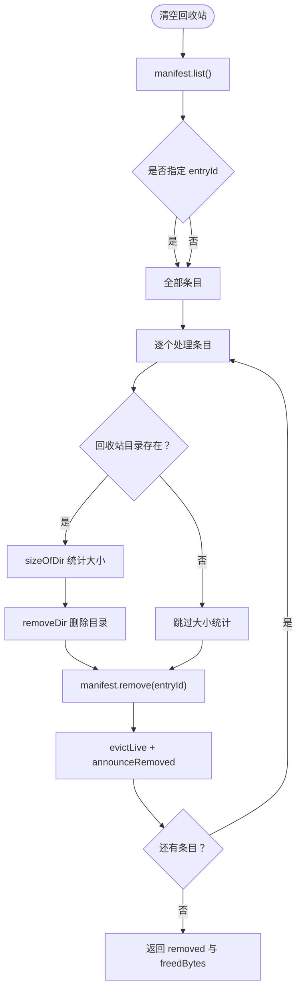
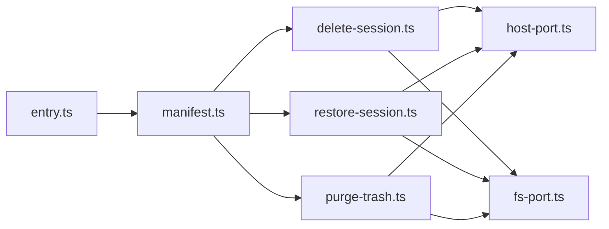

# 数据模型与存储

<cite>
**本文引用的文件**   
- [manifest.ts](file://src/trash/manifest.ts)
- [entry.ts](file://src/trash/entry.ts)
- [delete-session.ts](file://src/verbs/delete-session.ts)
- [restore-session.ts](file://src/verbs/restore-session.ts)
- [purge-trash.ts](file://src/verbs/purge-trash.ts)
- [host-port.ts](file://src/ports/host-port.ts)
- [fs-port.ts](file://src/ports/fs-port.ts)
- [manifest.test.ts](file://tests/manifest.test.ts)
- [trash-entry.test.ts](file://tests/trash-entry.test.ts)
</cite>

## 目录
1. [引言](#引言)
2. [项目结构](#项目结构)
3. [核心组件](#核心组件)
4. [架构总览](#架构总览)
5. [详细组件分析](#详细组件分析)
6. [依赖关系分析](#依赖关系分析)
7. [性能考量](#性能考量)
8. [故障排查指南](#故障排查指南)
9. [结论](#结论)

## 引言
本文聚焦回收站的数据模型、持久化适配、目录组织与清理恢复流程，目标是让读者理解：
- 一条 `TrashEntry` 在删除、恢复、彻底清理时的完整生命周期。
- 宿主 per-record 存储域如何被适配为统一的 `ManifestPort`。
- `~/.dsh/session-trash/` 下实体目录的组织规则与大小统计方式。
- `projectKey` 编码/解码以及 v3/v4 会话 ID 兼容逻辑。
- 面向测试的内存探针设计与断言约定。
- 大目录开销、权限安全、清单损坏恢复等工程问题。

## 项目结构
本仓库中与回收站相关的代码集中在以下模块：
- 数据模型与路径工具：`src/trash/entry.ts`
- 清单接口与适配器：`src/trash/manifest.ts`
- 动词（业务用例）：`src/verbs/delete-session.ts`、`src/verbs/restore-session.ts`、`src/verbs/purge-trash.ts`
- 外部系统端口：`src/ports/host-port.ts`、`src/ports/fs-port.ts`
- 行为测试：`tests/manifest.test.ts`、`tests/trash-entry.test.ts`

**图示来源**
- [entry.ts:1-48](file://src/trash/entry.ts#L1-L48)
- [manifest.ts:1-35](file://src/trash/manifest.ts#L1-L35)
- [delete-session.ts:1-104](file://src/verbs/delete-session.ts#L1-L104)
- [restore-session.ts:1-68](file://src/verbs/restore-session.ts#L1-L68)
- [purge-trash.ts:1-29](file://src/verbs/purge-trash.ts#L1-L29)
- [host-port.ts:1-366](file://src/ports/host-port.ts#L1-L366)
- [fs-port.ts:1-33](file://src/ports/fs-port.ts#L1-L33)

**章节来源**
- [entry.ts:1-48](file://src/trash/entry.ts#L1-L48)
- [manifest.ts:1-35](file://src/trash/manifest.ts#L1-L35)
- [delete-session.ts:1-104](file://src/verbs/delete-session.ts#L1-L104)
- [restore-session.ts:1-68](file://src/verbs/restore-session.ts#L1-L68)
- [purge-trash.ts:1-29](file://src/verbs/purge-trash.ts#L1-L29)
- [host-port.ts:1-366](file://src/ports/host-port.ts#L1-L366)
- [fs-port.ts:1-33](file://src/ports/fs-port.ts#L1-L33)

## 核心组件
本节定义回收站的核心抽象：条目数据、清单端口、适配器、文件系统与宿主端口。

### TrashEntry 数据模型
`TrashEntry` 是回收站的一条记录，其字段含义与约束如下：

| 字段 | 类型 | 是否必填 | 业务含义 | 约束与生命周期 |
|---|---:|---:|---|---|
| `id` | `string` | 是 | 回收站条目标识，同时也是回收站实体目录名。由删除时刻和原会话目录名拼接而成。 | 由 `makeEntryId` 生成；`parseEntryId` 可逆解析出删除时间与原始目录名。 |
| `sessionId` | `string` | 是 | 被删除会话的真实会话 ID。 | 删除时从宿主读取，不随目录命名变化而变化。 |
| `projectDir` | `string` | 是 | 会话落盘所在的项目目录名，即 `<sessions>/<projectDir>/` 中的中间段。 | 镜像宿主的 `projectKey(cwd)` 结果，用于恢复时定位原项目根。 |
| `workspaceId` | `string` | 是 | 删除时该会话所属工作区 ID；空串表示删除时没有账目（未分组会话）。 | 决定恢复时是否调用 `attach`；空串时跳过挂账本。 |
| `wasArchived` | `boolean` | 是 | 删除前会话是否已归档。 | 决定恢复后是否需要取消归档：`false` 表示应放回树中可见，`true` 表示保持隐藏。 |
| `deletedAt` | `number` | 是 | 删除发生的时间戳（毫秒），同时参与 `id` 编码。 | 由 `deps.now()` 提供，用于排序与显示。 |
| `title` | `string` | 是 | 删除时尽力取到的会话标题。 | 来自宿主投影缓存；取不到为空串，不导致删除失败。 |
| `sizeBytes` | `number` | 是 | 删除时通过 `fs.sizeOfDir` 计算的会话目录字节数。 | 用于释放空间统计；若目录已被手工删除，彻底清理仍会跳过统计但继续摘清单。 |

这些约束由测试夹具与行为测试共同保证：类型层面要求所有字段存在，行为层面要求 `add`/`list`/`remove` 语义正确，且 `id` 往返必须与 `deletedAt` 一致。

**章节来源**
- [entry.ts:1-48](file://src/trash/entry.ts#L1-L48)
- [manifest.test.ts:1-37](file://tests/manifest.test.ts#L1-L37)
- [trash-entry.test.ts:1-54](file://tests/trash-entry.test.ts#L1-L54)

### ManifestPort 与 StorageDomainLike
`ManifestPort` 是回收站清单的统一读法，只暴露三个方法：

| 方法 | 入参 | 返回值 | 职责 |
|---|---|---|---|
| `list()` | 无 | `Promise<TrashEntry[]>` | 返回按 `deletedAt` 倒序排列的条目。 |
| `add(e)` | `TrashEntry` | `Promise<void>` | 以 `id` 为键写入或覆盖条目。 |
| `remove(id)` | `string` | `Promise<void>` | 按条目 ID 移除记录。 |

`StorageDomainLike` 是宿主 per-record 存储域的最小面，包含：

| 方法 | 入参 | 返回值 | 职责 |
|---|---|---|---|
| `readAll()` | 无 | `Promise<TrashEntry[]>` | 读取全部记录。 |
| `put(record)` | `TrashEntry` | `Promise<void>` | 写入或覆盖单条记录。 |
| `delete(key)` | `string` | `Promise<void>` | 按 key 删除记录。 |

`createStorageManifest(domain)` 将宿主存储域适配为 `ManifestPort`：
- `list` 调用 `domain.readAll()` 后再按 `deletedAt` 倒序排序。
- `add` 映射到 `domain.put`。
- `remove` 映射到 `domain.delete`。

`createMemoryManifest(seed)` 是内存探针，内部用 `Map<string, TrashEntry>` 保存条目，`add` 是整条覆盖而非字段合并，`remove` 对不存在 ID 幂等返回 `undefined`，`list` 返回空数组而不是 `undefined`。

**图示来源**
- [manifest.ts:1-35](file://src/trash/manifest.ts#L1-L35)

**章节来源**
- [manifest.ts:1-35](file://src/trash/manifest.ts#L1-L35)
- [manifest.test.ts:1-37](file://tests/manifest.test.ts#L1-L37)

### 文件系统端口
`FsPort` 是回收站对文件系统的抽象：

| 方法 | 职责 |
|---|---|
| `exists(p)` | 判断路径是否存在。 |
| `ensureDir(p)` | 递归创建目录，用于首删时创建 `~/.dsh/session-trash/`。 |
| `rename(from, to)` | 同卷移动会话目录，作为原子操作。 |
| `removeDir(p)` | 递归删除回收站目录。 |
| `sizeOfDir(p)` | 递归计算目录字节数。 |

`createFsPort()` 基于 Node.js `fs` 与 `fs/promises` 实现，其中 `sizeOfDir` 使用递归遍历：
- 对子目录递归求和。
- 对文件取 `stat().size`。
- 最终累加为总字节数。

**章节来源**
- [fs-port.ts:1-33](file://src/ports/fs-port.ts#L1-L33)

### 宿主端口
`HostPort` 描述回收站与宿主服务的交互面，包括：
- 查询会话归属：`workspaceOf`、`projectDirOf`。
- 读取会话元信息：`titleOf`、`isLive`、`isArchived`。
- 管理活体与会话列表：`evictLive`、`announceRemoved`、`announceRestored`。
- 管理工作区账目：`detach`、`attach`。
- 管理归档可见性：`archive`、`unarchive`。

`createHostPort(ctx)` 是宿主真实绑定，把动词层的问题映射到宿主内部服务，如工作区注册表、会话存储、投影缓存、事件转发等。端口本身不包裹业务错误码，而是由动词层统一包装为 `verbError`。

**章节来源**
- [host-port.ts:1-366](file://src/ports/host-port.ts#L1-L366)

## 架构总览
回收站的运行时架构围绕“动词 + 端口 + 适配器”展开：

**图示来源**
- [delete-session.ts:1-104](file://src/verbs/delete-session.ts#L1-L104)
- [restore-session.ts:1-68](file://src/verbs/restore-session.ts#L1-L68)
- [purge-trash.ts:1-29](file://src/verbs/purge-trash.ts#L1-L29)
- [manifest.ts:1-35](file://src/trash/manifest.ts#L1-L35)
- [host-port.ts:1-366](file://src/ports/host-port.ts#L1-L366)
- [fs-port.ts:1-33](file://src/ports/fs-port.ts#L1-L33)

## 详细组件分析

### 回收站条目命名与路径规则
`entry.ts` 定义了条目 ID 的编码、解码与路径构造：

| 名称 | 输入 | 输出 | 说明 |
|---|---|---|---|
| `makeEntryId(deletedAt, sessionDirName)` | 时间戳、会话目录名 | 字符串 | 格式为 `<UTC 时间戳>-<会话目录名>`。 |
| `parseEntryId(id)` | 条目 ID | `{ deletedAt, sessionDirName }` | 正则解析；非法 ID 抛错。 |
| `sessionDirOf(projectDir, sessionDirName, home)` | 项目目录、会话目录名、家目录 | 字符串 | 返回 `<home>/sessions/<projectDir>/<sessionDirName>`。 |
| `trashDirOf(entryId, home)` | 条目 ID、家目录 | 字符串 | 返回 `<home>/session-trash/<entryId>`。 |

示例路径关系：
- 原会话目录：`C:/Users/x/.dsh/sessions/--C-develop-GitHub-dsh-ebook--/session-abc`
- 回收站实体目录：`C:/Users/x/.dsh/session-trash/20260930T130500Z-session-abc`

测试覆盖了：
- v4 会话目录带 `session-` 前缀。
- v3 会话目录无前缀。
- 非函数产出的 ID 一律抛错。
- 路径拼接结果与预期一致。

**图示来源**
- [entry.ts:1-48](file://src/trash/entry.ts#L1-L48)

**章节来源**
- [entry.ts:1-48](file://src/trash/entry.ts#L1-L48)
- [trash-entry.test.ts:1-54](file://tests/trash-entry.test.ts#L1-L54)

### projectKey 编码/解码与 v3/v4 兼容
`projectKey` 是宿主会话持久化使用的“项目目录名”算法，实现为宿主包行为的镜像，避免跨插件直接 import 宿主类型。

编码规则要点：
- 将当前工作目录转换为可读字符串。
- `/`、`\`、`:` 被视为分隔符，连续分隔符压缩为单个 `-`。
- 仅保留字母、数字、`.`、`_`、`-`，其余字符转为十六进制转义形式。
- 去掉开头多余 `-`，不足则退化为 `root`。
- 截断到 251 个字符，并以 `--` 包裹两端。

v3/v4 会话 ID 兼容：
- v3 会话目录名是无前缀的 UUID。
- v4 会话目录名带 `session-` 前缀。
- `makeEntryId` 接收的是宿主提供的 `sessionId`，它本身就是原目录名，因此删除时编码、恢复时解码都无需再推断前缀。
- 测试断言 v4 与 v3 两种 ID 都能被 `parseEntryId` 正确解析并保留原始目录名。

**图示来源**
- [host-port.ts:1-366](file://src/ports/host-port.ts#L1-L366)
- [entry.ts:1-48](file://src/trash/entry.ts#L1-L48)
- [trash-entry.test.ts:1-54](file://tests/trash-entry.test.ts#L1-L54)

**章节来源**
- [host-port.ts:1-366](file://src/ports/host-port.ts#L1-L366)
- [entry.ts:1-48](file://src/trash/entry.ts#L1-L48)
- [trash-entry.test.ts:1-54](file://tests/trash-entry.test.ts#L1-L54)

### 删除会话流程
`delete-session.ts` 的实现遵循“先读后写、最后动文件、清单最后登记、失败尽量回滚”的原则：

1. 检查会话是否正在运行。
2. 查询宿主持久化是否持有该会话。
3. 查询工作区归属，允许为空（未分组会话）。
4. 构造原会话目录路径并确认存在。
5. 读取归档态、删除时间、标题、目录大小。
6. 如果未归档，先归档会话。
7. 如果有工作区，再从工作区 detach。
8. 确保 `~/.dsh/session-trash/` 存在，并将会话目录 rename 到回收站。
9. 将 `TrashEntry` 写入清单。
10. 从宿主内存中请掉活体，并如实通告客户端。

关键设计：
- 标题和目录大小提前读取，避免写操作中途失败留下不一致状态。
- 归档必须先于 detach，否则可能出现“已摘账本但仍未归档”的短暂可见窗口。
- 清单登记失败时，尝试回滚目录、重新 attach、取消归档。
- 通告客户端只在知道宿主列表已干净时才发，避免假消息。

**图示来源**
- [delete-session.ts:1-104](file://src/verbs/delete-session.ts#L1-L104)

**章节来源**
- [delete-session.ts:1-104](file://src/verbs/delete-session.ts#L1-L104)

### 恢复会话流程
`restore-session.ts` 根据清单条目将回收站目录移回原位置，并恢复工作区归属与可见性：

1. 按 `entry.id` 查找清单条目。
2. 构造回收站目录与原会话目录。
3. 校验回收站目录存在。
4. 校验原项目目录存在。
5. 将目录从回收站 rename 回原位置。
6. 如果有工作区，重新 attach。
7. 如果 `wasArchived` 为 false，取消归档使其可见。
8. 从清单移除条目。
9. 通告客户端会话已恢复。

关键点：
- 恢复时使用 `parseEntryId(entry.id).sessionDirName`，而不是从 `sessionId` 现推，从而兼容 v3/v4 命名差异。
- 工作区为空串表示删除时无账目，跳过 attach/detach。
- 恢复失败时按相反顺序回滚：重新归档 → detach → 目录放回回收站。

**图示来源**
- [restore-session.ts:1-68](file://src/verbs/restore-session.ts#L1-L68)

**章节来源**
- [restore-session.ts:1-68](file://src/verbs/restore-session.ts#L1-L68)

### 清空回收站流程
`purge-trash.ts` 支持清空全部或指定条目：

1. 列出清单中的所有条目。
2. 如果传入 `entryId`，只处理匹配项；找不到则报错。
3. 对每个目标：
   - 如果回收站目录仍存在，计算其大小并删除。
   - 从清单移除条目。
   - 从宿主内存中请掉活体并如实通告客户端。
4. 返回移除数量与释放字节数。

注意：
- 即使目录已被手工删除，也会继续摘清单行，避免“幽灵条目”。
- 释放字节数只统计实际存在的目录。

**图示来源**
- [purge-trash.ts:1-29](file://src/verbs/purge-trash.ts#L1-L29)

**章节来源**
- [purge-trash.ts:1-29](file://src/verbs/purge-trash.ts#L1-L29)

### 清单数据流与测试断言
`manifest.test.ts` 验证了清单的核心契约：
- `add` 后 `list` 能列出条目。
- `list` 按 `deletedAt` 倒序排序。
- 同一 `id` 重复 `add` 是整条覆盖。
- `remove` 不存在 ID 不抛错。
- 空清单 `list()` 返回空数组。

这些断言保证了：
- 面板可直接读取 `title`、`sizeBytes` 列。
- 清单是幂等的追加源。
- 内存探针可用于单元测试与集成测试。

**章节来源**
- [manifest.test.ts:1-37](file://tests/manifest.test.ts#L1-L37)

## 依赖关系分析

**图示来源**
- [entry.ts:1-48](file://src/trash/entry.ts#L1-L48)
- [manifest.ts:1-35](file://src/trash/manifest.ts#L1-L35)
- [delete-session.ts:1-104](file://src/verbs/delete-session.ts#L1-L104)
- [restore-session.ts:1-68](file://src/verbs/restore-session.ts#L1-L68)
- [purge-trash.ts:1-29](file://src/verbs/purge-trash.ts#L1-L29)
- [host-port.ts:1-366](file://src/ports/host-port.ts#L1-L366)
- [fs-port.ts:1-33](file://src/ports/fs-port.ts#L1-L33)

耦合特征：
- 动词层只依赖 `ManifestPort`，不感知具体存储实现。
- `createStorageManifest` 解耦宿主 per-record 存储域与清单读法。
- 内存探针 `createMemoryManifest` 提供确定性测试环境。
- 宿主端口与文件系统端口分别封装外部副作用。

**章节来源**
- [manifest.ts:1-35](file://src/trash/manifest.ts#L1-L35)
- [delete-session.ts:1-104](file://src/verbs/delete-session.ts#L1-L104)
- [restore-session.ts:1-68](file://src/verbs/restore-session.ts#L1-L68)
- [purge-trash.ts:1-29](file://src/verbs/purge-trash.ts#L1-L29)

## 性能考量
- **大目录 sizeOfDir 开销**：`fs-port.ts` 的 `sizeOfDir` 是递归遍历，时间复杂度约为 O(N)，N 为目录中文件与子目录总数；空间复杂度取决于递归深度与操作系统 readdir 返回量。对超大项目会话，删除与清空操作可能明显变慢。
- **清单排序成本**：`ManifestPort.list()` 每次返回前对全量条目按 `deletedAt` 排序；条目较多时建议在上层分页或缓存排序结果。
- **宿主枚举成本**：`workspaceOf` 当前实现遍历工作区列表查找包含该会话的工作区；工作区很多时会有线性开销。
- **I/O 顺序**：删除流程把 I/O 密集型读取（标题、大小）放在写之前，减少部分写成功后失败的代价。
- **原子移动**：`rename` 是同卷原子操作，比复制+删除更高效且更安全。

优化建议：
- 对 `sizeOfDir` 引入增量缓存或延迟统计，仅在用户查看容量时计算。
- 对 `list()` 增加分页与索引，避免每次全量排序。
- 对 `workspaceOf` 建立 `sessionId -> workspaceId` 的反向索引。
- 对大目录清空提供进度反馈与可中断能力。

[本节为通用性能讨论，不直接分析具体代码片段]

## 故障排查指南

### 清单损坏或丢失
现象：
- 回收站面板无法显示条目。
- 恢复按钮不可用。
- 已有回收站目录无法被识别。

处理思路：
1. 确认 `~/.dsh/session-trash/` 下是否存在实体目录。
2. 若清单为空但目录存在，可从目录名重建 `entryId`，再用 `parseEntryId` 解析删除时间。
3. 对于无法解析的 ID，应视为损坏条目，不建议静默修复。
4. 若清单完全丢失，优先导出用户数据，再考虑清空回收站目录。
5. 重建后重新扫描宿主会话状态，必要时重新归档或挂账本。

### 会话仍在运行
删除前会调用 `host.isLive`，若会话仍在运行则抛出业务错误。应先停止会话再删除。

### 原项目目录缺失
恢复时会校验 `~/.dsh/sessions/<projectDir>/` 是否存在；不存在则抛出 `project-missing`。不要静默新建项目目录，因为这样会破坏数据一致性。

### 权限问题
- 回收站目录需要当前用户具备读写权限。
- 宿主工作区账本与归档集需要对应权限才能 detach/attach/archive/unarchive。
- 若权限不足，应提示用户检查 `~/.dsh` 及其子目录权限，不要降级为强制删除。

### 不可逆删除
彻底清理会调用 `removeDir` 递归删除回收站目录。一旦执行完成，数据通常不可恢复。应在 UI 上二次确认，并记录操作日志。

**章节来源**
- [delete-session.ts:1-104](file://src/verbs/delete-session.ts#L1-L104)
- [restore-session.ts:1-68](file://src/verbs/restore-session.ts#L1-L68)
- [purge-trash.ts:1-29](file://src/verbs/purge-trash.ts#L1-L29)
- [fs-port.ts:1-33](file://src/ports/fs-port.ts#L1-L33)

## 结论
回收站实现以 `TrashEntry` 为中心，通过 `ManifestPort` 抽象清单访问，通过 `createStorageManifest` 适配宿主存储域，并通过 `createMemoryManifest` 提供测试探针。删除、恢复、清空三条路径都强调：
- 目录名与条目 ID 的可逆编码。
- v3/v4 会话目录名的兼容。
- 先读后写、失败回滚、最后登记清单。
- 显式处理归档态与工作区归属。
- 对 I/O 与宿主副作用进行端口隔离。

未来改进可集中在大目录性能、清单分页、反向索引、进度反馈与更强的一致性保护上。