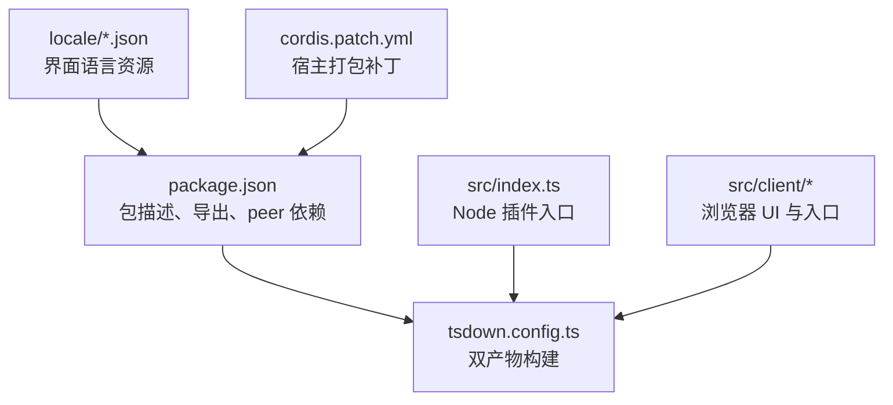
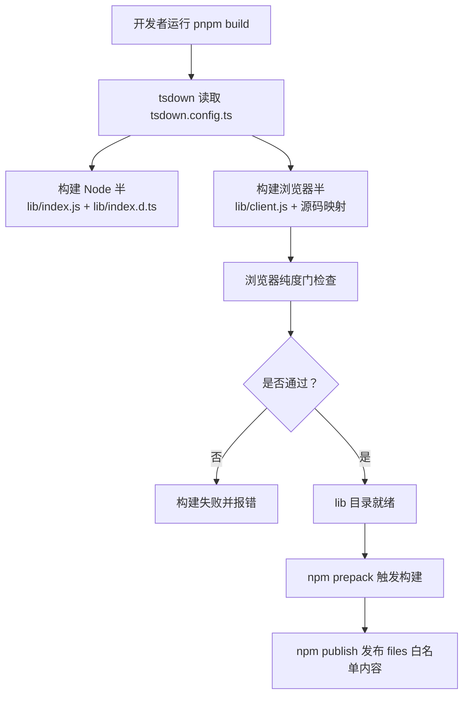
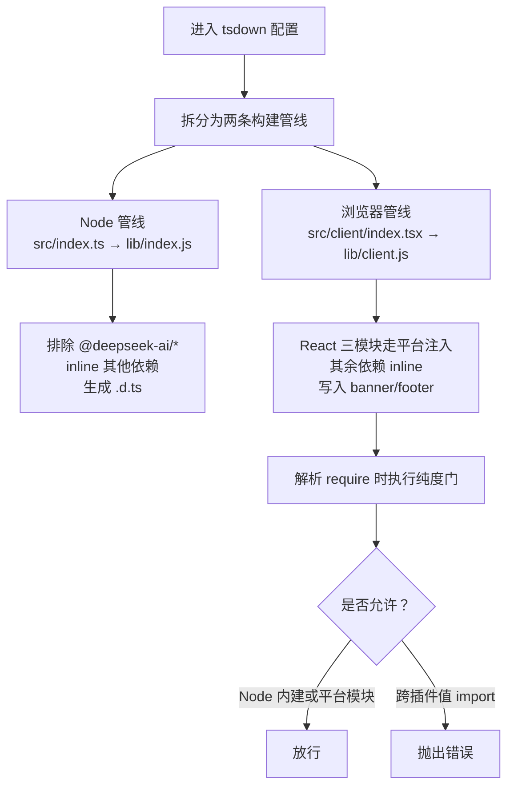
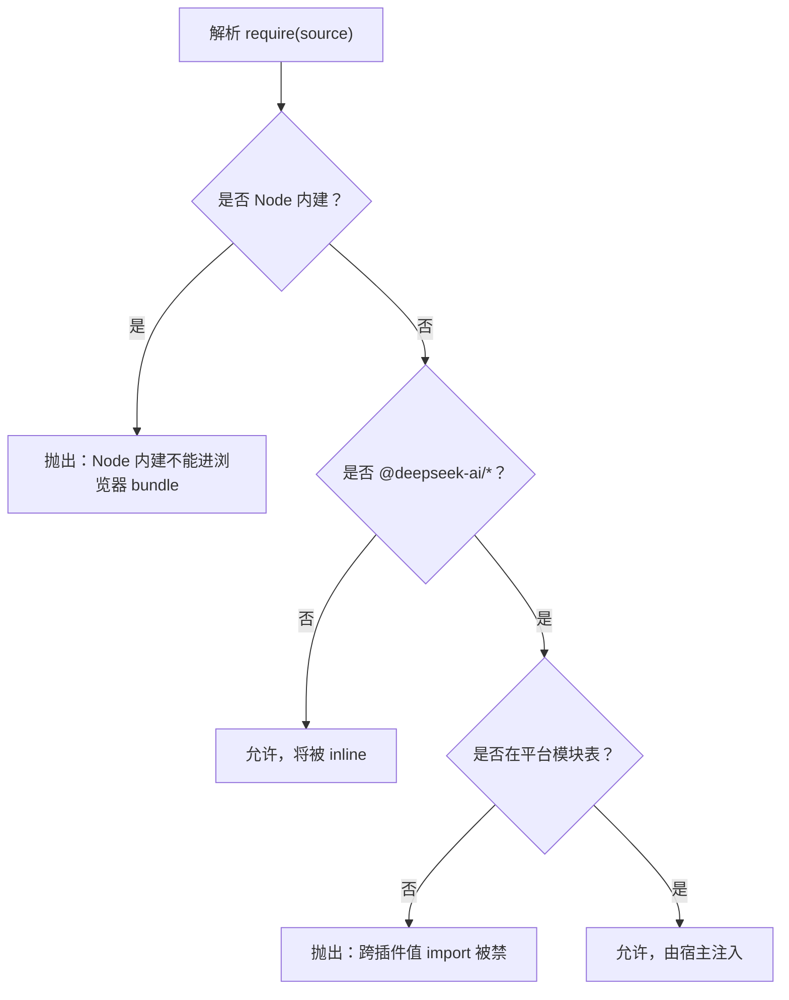
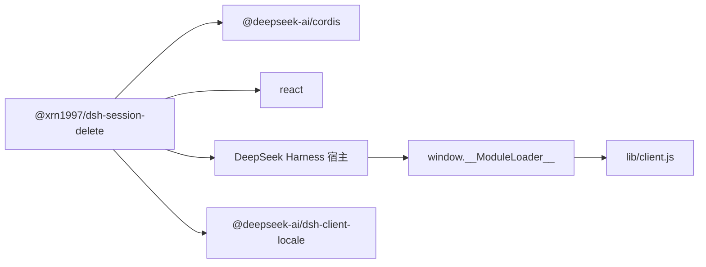

# 构建与发布

<cite>
**本文引用的文件**   
- [package.json](file://package.json)
- [tsdown.config.ts](file://tsdown.config.ts)
- [cordis.patch.yml](file://cordis.patch.yml)
- [README.md](file://README.md)
- [vitest.config.ts](file://vitest.config.ts)
- [src/index.ts](file://src/index.ts)
</cite>

## 目录

1. [简介](#简介)
2. [项目结构](#项目结构)
3. [核心组件](#核心组件)
4. [架构总览](#架构总览)
5. [详细组件分析](#详细组件分析)
6. [依赖关系分析](#依赖关系分析)
7. [性能考虑](#性能考虑)
8. [故障排查](#故障排查)
9. [结论](#结论)
10. [附录：发布与回归清单](#附录发布与回归清单)

## 简介

本文面向 `@xrn1997/dsh-session-delete` 的维护者，说明如何从源码构建、打包并发布 DSH 会话删除插件。重点包括：

- tsdown 双产物构建流程（Node 半 `lib/index.js`、浏览器半 `lib/client.js`）
- `cordis.patch.yml` 在宿主打包时的作用
- 浏览器端 purity 检查的意义与实现位置
- `npm publish` 前置条件、版本号与 DSH 兼容性声明
- peer 依赖约束
- 构建产物验证方法
- 发布后回归测试清单

## 项目结构

本仓库按“功能域 + 运行环境”组织源码：

| 路径 | 职责 |
| --- | --- |
| `src/index.ts` | Node 端插件入口，注册 Cordis 服务、存储域、API 路由、回收站清单 |
| `src/api/` | 暴露给浏览器半调用的 API 调度逻辑 |
| `src/ports/` | 文件系统与宿主通信的最小端口抽象 |
| `src/trash/` | 回收站清单的存储域定义与 manifest 适配 |
| `src/verbs/` | 删除、恢复、清空回收站等具体动词 |
| `src/client/` | 浏览器端 UI、上下文、Toast、回收站条目等 |
| `locale/` | 中文与英文本地化资源 |
| `tests/` | Node 与浏览器两套 Vitest 用例 |
| `tsdown.config.ts` | 双产物构建配置与浏览器纯度门 |
| `cordis.patch.yml` | 把插件注入宿主 bundle 的补丁 |
| `package.json` | 包元数据、导出表、peer 依赖、DSH 扩展字段 |

**图表来源**
- [package.json:1-91](file://package.json#L1-L91)
- [tsdown.config.ts:1-150](file://tsdown.config.ts#L1-L150)
- [src/index.ts:1-237](file://src/index.ts#L1-L237)
- [cordis.patch.yml:1-3](file://cordis.patch.yml#L1-L3)

**章节来源**
- [package.json:1-91](file://package.json#L1-L91)
- [tsdown.config.ts:1-150](file://tsdown.config.ts#L1-L150)
- [README.md:1-130](file://README.md#L1-L130)

## 核心组件

### 包元数据与导出

`package.json` 定义了插件作为 npm 包的对外契约：

| 字段 | 含义 |
| --- | --- |
| `name` | 包名 `@xrn1997/dsh-session-delete` |
| `version` | 当前版本；发布前必须手动更新 |
| `main` | Node 端默认入口 `lib/index.js` |
| `types` | TypeScript 类型声明 `lib/index.d.ts` |
| `exports` | 指定 `.`、`./client`、`./locale/*.json`、`./package.json` 的解析路径 |
| `files` | `npm publish` 时纳入包的内容 |
| `engines.node` | 要求 Node ≥ 24 |
| `scripts.prepack` | 发布前先执行构建 |
| `peerDependencies` | 宿主安装阶段校验的运行期依赖 |
| `dsh.bundle.patch` | 指向 `cordis.patch.yml` |
| `dsh.client.inject` | 客户端注入 `@deepseek-ai/dsh-client-locale` |
| `dsh.compatibility.dshReleases` | 已实测兼容的 DSH 桌面版列表 |
| `publishConfig.access` | 允许公开发布 |

**章节来源**
- [package.json:1-91](file://package.json#L1-L91)

### 浏览器端导出契约

`exports` 中的 `./client` 直接映射到 `lib/client.js`，而 `tsdown.config.ts` 通过 `outputOptions.entryFileNames: 'client.js'` 保证浏览器端产物文件名一致。浏览器端不暴露 `.d.ts`，因为 `dts: false` 避免 banner/footer 污染类型文件。

**章节来源**
- [package.json:1-91](file://package.json#L1-L91)
- [tsdown.config.ts:1-150](file://tsdown.config.ts#L1-L150)

## 架构总览

下图展示构建与发布过程中关键文件的协作关系：

**图表来源**
- [tsdown.config.ts:1-150](file://tsdown.config.ts#L1-L150)
- [package.json:1-91](file://package.json#L1-L91)

## 详细组件分析

### tsdown 双产物构建

tsdown 输出两个独立产物：

| 产物 | 入口 | 格式 | 平台 | 目标 | 类型声明 | 关键行为 |
| --- | --- | --- | --- | --- | --- | --- |
| Node 半 | `src/index.ts` | ESM | node | ES2024 | 开启 | `@deepseek-ai/*` 不被打包，其余依赖 inline |
| 浏览器半 | `src/client/index.tsx` | CJS 单文件工厂 | browser | ES2022 | 关闭 | React 家族模块走平台注入，其余依赖 inline |

#### Node 半

Node 半由 `src/index.ts` 提供插件名称、Cordis 依赖注入项、storage domain、回收站 manifest、API 处理函数和宿主端口适配器。构建时使用：

- `platform: 'node'`
- `format: ['esm']`
- `target: 'es2024'`
- `deps.neverBundle` 排除 `@deepseek-ai/*`
- `deps.alwaysBundle` 打包非 cordis 依赖
- `dts: true` 生成 `lib/index.d.ts`

这意味着 Node 半依赖的 Cordis、React 等在宿主环境中真实存在，而不是被打包进插件包。

#### 浏览器半

浏览器半是一个 CJS 闭合工厂，被宿主以 `window.__ModuleLoader__.load` 加载。构建时使用：

- `platform: 'browser'`
- `format: ['cjs']`
- `target: 'es2022'`
- `banner/intro/footer` 包裹 `factory(require)` 返回值
- `entryFileNames: 'client.js'`
- `sourcemap: true`
- `process.env` 等 Node 全局被替换为浏览器安全值
- `resolve.conditionNames` 优先使用浏览器条件导出

此外，`.css` 文件通过自定义插件转成字符串常量，由运行时注入 `<style>`，因此浏览器产物不需要外部 CSS 资产通道。

**图表来源**
- [tsdown.config.ts:1-150](file://tsdown.config.ts#L1-L150)

**章节来源**
- [tsdown.config.ts:1-150](file://tsdown.config.ts#L1-L150)
- [src/index.ts:1-237](file://src/index.ts#L1-L237)

### cordis.patch.yml 的作用

`cordis.patch.yml` 是一个插入式补丁，把插件注册到宿主 bundle 中：

| 字段 | 值 | 含义 |
| --- | --- | --- |
| `insert` | 数组 | 表示向宿主 bundle 插入插件条目 |
| `id` | `session-delete` | 插件内部标识 |
| `name` | `@xrn1997/dsh-session-delete` | 对应 `package.json.name` |

该文件同时被 `package.json` 的 `dsh.bundle.patch` 引用，说明它不是普通文档，而是参与宿主打包流程的配置。若缺少这个补丁，宿主可能不会自动发现并加载插件；这也是为什么 README 强调安装后要重启宿主。

**章节来源**
- [cordis.patch.yml:1-3](file://cordis.patch.yml#L1-L3)
- [package.json:1-91](file://package.json#L1-L91)
- [README.md:1-130](file://README.md#L1-L130)

### 浏览器端 purity 检查

浏览器端 purity 检查由 `tsdown.config.ts` 中的 `gateClientImport` 实现。其规则如下：

| 情况 | 行为 | 原因 |
| --- | --- | --- |
| source 是 Node 内建模块 | 抛出错误 | 浏览器 CJS 没有 Node 模块加载器，运行时会导致 ReferenceError |
| source 以 `@deepseek-ai/` 开头且不在平台模块表 | 抛出错误 | 跨插件值 import 被禁止，应通过 Cordis 服务交互 |
| source 是 `react`、`react/jsx-runtime`、`react-dom` | 放行 | 这三个模块由宿主冻结平台模块注入，必须与宿主 React 实例一致 |
| 其他 npm 依赖 | 放行 | 会被 tsdown inline 进 bundle，不走 require |

允许的平台模块只有 React 家族三个键。上一版还包含多个宿主客户端包，但这次重构把所有控件固化到 `src/client/ui/*`，从而缩小白名单，降低未来引入宿主客户端实现的概率。

**图表来源**
- [tsdown.config.ts:1-150](file://tsdown.config.ts#L1-L150)

**章节来源**
- [tsdown.config.ts:1-150](file://tsdown.config.ts#L1-L150)
- [README.md:1-130](file://README.md#L1-L130)

### 构建产物与导出验证

#### 预期产物

构建完成后，`lib/` 下应至少包含：

| 路径 | 期望 |
| --- | --- |
| `lib/index.js` | Node 端 ESM 插件入口 |
| `lib/index.d.ts` | Node 端类型声明 |
| `lib/client.js` | 浏览器端 CJS 闭合工厂 |
| `lib/client.js.map` | 浏览器端源码映射 |

`lib/` 不应出现在 Git 工作区，因为它是构建产物。

#### 导出验证

可逐项确认：

1. **Node 端默认导出**  
   用 Node 运行 `import('@xrn1997/dsh-session-delete')`，应能解析到 `lib/index.js`。

2. **Node 端类型**  
   用 TypeScript 导入包时，类型应从 `lib/index.d.ts` 解析。

3. **浏览器端导出**  
   解析 `@xrn1997/dsh-session-delete/client` 时应得到 `lib/client.js`。

4. **locale 资源**  
   解析 `@xrn1997/dsh-session-delete/locale/en.json` 和 `@xrn1997/dsh-session-delete/locale/zh.json` 应返回 JSON 文件。

5. **package.json 可达**  
   解析 `@xrn1997/dsh-session-delete/package.json` 应返回包元数据。

6. **浏览器产物包含预期导出**  
   打开 `lib/client.js`，确认它是一个包裹在宿主 loader banner 与 footer 中的工厂函数，并能返回 UI 相关导出。

7. **locale 是否被宿主加载**  
   宿主通过 `dsh.client.inject` 注入 `@deepseek-ai/dsh-client-locale`，插件再挂中文与英文文案。可在宿主界面切换语言后观察菜单与面板文案是否跟随。

#### 构建与类型检查命令

| 任务 | 命令 | 说明 |
| --- | --- | --- |
| 安装依赖 | `pnpm install` | 使用 pnpm workspace |
| 构建 | `pnpm build` | 等价 `tsdown` |
| 类型检查 | `pnpm typecheck` | 等价 `tsc --noEmit` |
| 测试 | `pnpm test` | 等价 `vitest run` |

Vitest 配置将 Node 与浏览器用例分两个 project 运行：Node 端用 `node` 环境，浏览器端用 `jsdom` 环境。这避免了 `import.meta.url` 在 jsdom 下的 scheme 问题，也确保浏览器端测试不会通过 alias 绕过真产物。

**章节来源**
- [package.json:1-91](file://package.json#L1-L91)
- [tsdown.config.ts:1-150](file://tsdown.config.ts#L1-L150)
- [vitest.config.ts:1-31](file://vitest.config.ts#L1-L31)
- [README.md:1-130](file://README.md#L1-L130)

### 发布前置条件

在执行 `npm publish` 之前，应满足以下条件：

1. **依赖已安装**  
   运行 `pnpm install` 成功。

2. **构建通过**  
   运行 `pnpm build`，确认 `lib/index.js`、`lib/index.d.ts`、`lib/client.js` 均已生成。

3. **类型检查通过**  
   运行 `pnpm typecheck`，退出码为 0。

4. **测试通过**  
   运行 `pnpm test`，Node 与浏览器两类用例均通过。

5. **版本号已更新**  
   `package.json.version` 必须是新发布的语义化版本。

6. **DSH 兼容性已确认**  
   如果已在某个 DSH 版本上完成端到端测试，应将结果写入 `dsh.compatibility.dshReleases`。

7. **files 白名单完整**  
   `package.json.files` 应包含 `lib`、`locale`、`icon.svg`、`cordis.patch.yml`、`README.md`、`LICENSE`。

8. **peer 依赖符合宿主环境**  
   插件的 `peerDependencies` 应满足宿主实际安装的 Cordis 与 React 版本。

注意：`prepack` 脚本会再次执行构建，因此发布 tarball 自带预构建产物；用户离线安装时不需要执行构建脚本。

**章节来源**
- [package.json:1-91](file://package.json#L1-L91)
- [README.md:1-130](file://README.md#L1-L130)

### 版本号与 DSH 兼容性声明

#### 版本号

当前版本位于 `package.json.version`。发布前应改为下一个稳定或候选版本，例如 `0.1.0`、`0.2.0-rc.1` 等，并与 README 中的兼容性记录保持一致。

#### DSH 兼容性

`package.json.dsh.compatibility.dshReleases` 是“已跑过”的记录，不是安装限制。示例中记录了：

| DSH 版本 | 状态 |
| --- | --- |
| `0.2.0-rc.2` | `compatible` |

README 明确区分两层兼容性：

- **能否装上**：由 `peerDependencies` 决定。本插件未声明任何 `dsh-*` peer，因此安装闸不会因 DSH 版本拒绝。
- **能否真正跑过**：由 `dshReleases` 记录。其他 rc 版本可能装得上，但未经验证。

当新的 DSH 版本上线并通过回归测试后，应追加一条兼容性记录。

**章节来源**
- [package.json:1-91](file://package.json#L1-L91)
- [README.md:1-130](file://README.md#L1-L130)

### peer 依赖约束

| peer 依赖 | 范围 | 说明 |
| --- | --- | --- |
| `@deepseek-ai/cordis` | `^4.0.2` | 插件 Node 端依赖的 Cordis 运行时接口 |
| `react` | `^18.3.1` | 浏览器端 UI 使用的 React 主包 |

`devDependencies` 中使用的是具体固定版本，用于开发、类型检查与测试；`peerDependencies` 才是宿主安装时校验的版本区间。

由于浏览器端控件已固化到 `src/client/ui/*`，插件不再 require 宿主客户端包，因此 peer 只保留 Cordis 与 React。这也使浏览器端 purity 检查只需放行 React 三个键。

**章节来源**
- [package.json:1-91](file://package.json#L1-L91)
- [tsdown.config.ts:1-150](file://tsdown.config.ts#L1-L150)

## 依赖关系分析

**图表来源**
- [package.json:1-91](file://package.json#L1-L91)
- [tsdown.config.ts:1-150](file://tsdown.config.ts#L1-L150)

### 耦合与边界

- Node 半通过 Cordis 的 `Context` 获取 workspace、storage、webServer 等服务。
- 浏览器半通过宿主注入的 locale 服务加载 `locale/en.json` 与 `locale/zh.json`。
- 浏览器半不直接 require 宿主客户端包，而是通过 `cordis.patch.yml` 被宿主识别并加载。
- 浏览器端 purity 检查阻止 Node 内建与任意 `@deepseek-ai/*` 模块进入浏览器 bundle。

**章节来源**
- [package.json:1-91](file://package.json#L1-L91)
- [tsdown.config.ts:1-150](file://tsdown.config.ts#L1-L150)
- [src/index.ts:1-237](file://src/index.ts#L1-L237)

## 性能考虑

- 浏览器端所有 npm 依赖被 inline，减少运行时模块查找次数。
- React 三模块不走 inline，避免重复 React 实例导致 hooks 崩溃。
- 浏览器端使用 CJS 单文件工厂，配合宿主 loader banner/footer，简化宿主集成。
- 样式通过字符串注入，无需额外静态资源请求，适合浏览器端单文件产物形态。
- Node 端保持 ESM，并让 `@deepseek-ai/*` 由宿主提供，避免重复打包宿主能力。

[本节为通用指导，不直接分析具体代码片段]

## 故障排查

| 现象 | 可能原因 | 处理建议 |
| --- | --- | --- |
| `pnpm build` 报浏览器端 purity 错误 | 浏览器半引入了 Node 内建或未被允许的 `@deepseek-ai/*` | 改用宿主提供的浏览器实现，或把依赖移到 Node 端 |
| `lib/client.js` 不存在 | 浏览器端入口构建失败 | 检查 `src/client/index.tsx` 是否存在，以及 CSS 是否只在浏览器端导入 |
| `lib/index.js` 或 `lib/index.d.ts` 缺失 | Node 端构建失败 | 检查 `src/index.ts` 与 Cordis 类型依赖 |
| 安装时报 peer 依赖冲突 | 宿主 Cordis 或 React 版本不在插件 peer 区间 | 升级宿主或调整 peer 依赖 |
| 安装后侧栏没有“回收站” | 插件未激活或取数通道不可用 | 重启宿主；确认插件在该 DSH 版本上已通过回归 |
| 浏览器端 HMR 不生效 | 修改了 Node 端而非浏览器端 | 仅改 `src/client/*` 才会触发 HMR；Node 端需重启宿主 |
| 类型检查失败 | TypeScript 配置或源码类型错误 | 运行 `pnpm typecheck` 并按错误修复 |
| 发布后浏览器端无法加载 | `exports['./client']` 与 `tsdown.outputOptions.entryFileNames` 不一致 | 确认两者都指向 `lib/client.js` |

**章节来源**
- [tsdown.config.ts:1-150](file://tsdown.config.ts#L1-L150)
- [vitest.config.ts:1-31](file://vitest.config.ts#L1-L31)
- [README.md:1-130](file://README.md#L1-L130)

## 结论

`@xrn1997/dsh-session-delete` 的构建模型清晰分离 Node 端与浏览器端：Node 端负责插件生命周期、存储域与 API，浏览器端负责 UI 与回收站面板。tsdown 双产物、`cordis.patch.yml` 注入、浏览器端 purity 检查和 `package.json` 导出表共同保证了宿主能正确加载插件，同时避免把 Node 内建或宿主客户端实现误打包进浏览器端。发布前应确保构建、类型检查、测试全部通过，并更新版本号与 DSH 兼容性记录。

[本节为总结性内容，不直接分析具体代码片段]

## 附录：发布与回归清单

### 发布前检查

1. 运行 `pnpm install`。
2. 运行 `pnpm build`，确认产出：
   - `lib/index.js`
   - `lib/index.d.ts`
   - `lib/client.js`
   - `lib/client.js.map`
3. 运行 `pnpm typecheck`，退出码为 0。
4. 运行 `pnpm test`，Node 与浏览器用例全部通过。
5. 检查 `package.json.version` 是否为预期新版本。
6. 如已在某 DSH 版本上完成端到端测试，更新 `dsh.compatibility.dshReleases`。
7. 检查 `package.json.files` 是否包含 `lib`、`locale`、`icon.svg`、`cordis.patch.yml`、`README.md`、`LICENSE`。
8. 检查 `package.json.exports` 是否正确映射 `.`、`./client`、`./locale/*.json`、`./package.json`。
9. 可选：手动运行 `npm pack`，解压 tarball 确认产物齐全。
10. 执行 `npm publish`。

### 发布后回归清单

以下操作应在目标 DSH 版本上执行：

| 步骤 | 操作 | 预期结果 |
| --- | --- | --- |
| 1 | 安装插件 | `dsh plugin --profile <profile> add @xrn1997/dsh-session-delete` 成功 |
| 2 | 重启宿主 | 宿主启动后加载插件，无启动错误 |
| 3 | 找到待删除会话 | 会话处于非运行中状态 |
| 4 | 点击删除 | 弹出“移入回收站”确认框 |
| 5 | 确认删除 | 会话离开原列表，出现撤销 Toast |
| 6 | 等待撤销 Toast | 约 6 秒后自动消失 |
| 7 | 打开回收站面板 | 侧栏出现“回收站”，面板列出刚删除的会话 |
| 8 | 查看条目信息 | 显示标题、删除时间与大小 |
| 9 | 恢复一条会话 | 会话回到原项目目录，可见性与归档态还原 |
| 10 | 刷新回收站 | 条目数量减少，合计占用变化 |
| 11 | 清空回收站 | 二次确认后整页清空，条目全部移除 |
| 12 | 确认撤销提示消失 | 清空后的撤销 Toast 正常消失 |
| 13 | 检查数据目录 | `~/.dsh/session-trash/` 中对应目录已被清理 |
| 14 | 检查回收站清单 | storage domain 中不再残留该条记录 |
| 15 | 卸载插件 | `dsh plugin --profile <profile> remove @xrn1997/dsh-session-delete` 成功 |
| 16 | 确认旧回收站目录仍存在 | 卸载不会自动清理 `~/.dsh/session-trash/` |

**章节来源**
- [package.json:1-91](file://package.json#L1-L91)
- [README.md:1-130](file://README.md#L1-L130)