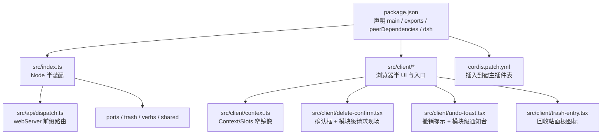
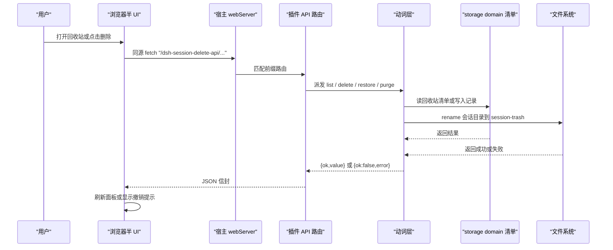
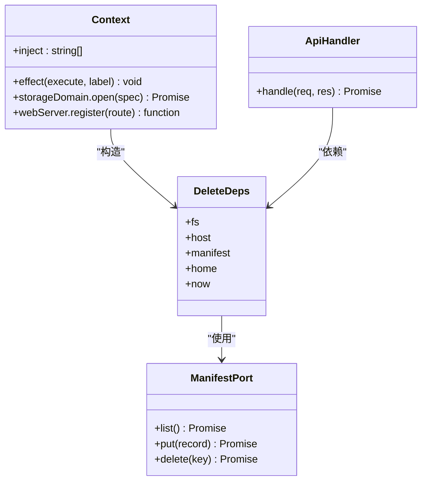
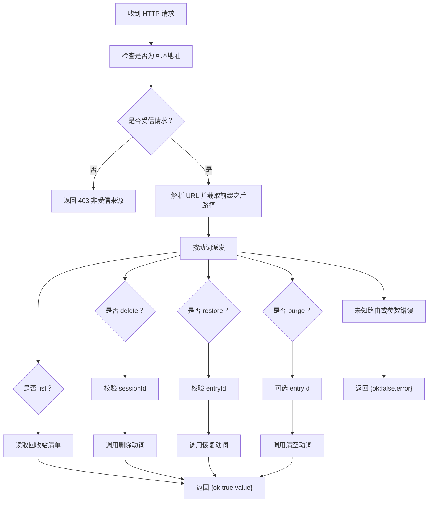
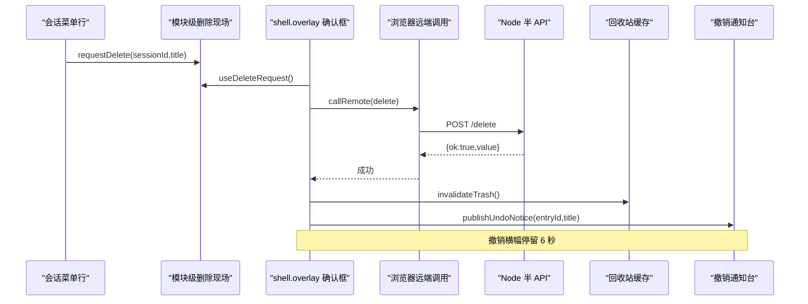
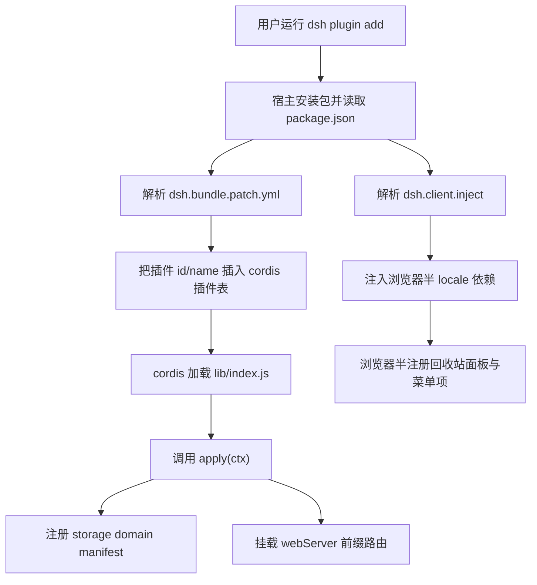

# DSH 插件模型与双半结构

<cite>
**本文引用的文件**   
- [package.json](file://package.json)
- [README.md](file://README.md)
- [cordis.patch.yml](file://cordis.patch.yml)
- [src/index.ts](file://src/index.ts)
- [src/api/dispatch.ts](file://src/api/dispatch.ts)
- [src/client/context.ts](file://src/client/context.ts)
- [src/client/delete-confirm.tsx](file://src/client/delete-confirm.tsx)
- [src/client/trash-entry.tsx](file://src/client/trash-entry.tsx)
- [src/client/undo-toast.tsx](file://src/client/undo-toast.tsx)
</cite>

## 目录
1. [引言](#引言)
2. [项目定位与结构](#项目定位与结构)
3. [核心组件](#核心组件)
4. [架构总览](#架构总览)
5. [详细组件分析](#详细组件分析)
6. [依赖关系分析](#依赖关系分析)
7. [性能与健壮性](#性能与健壮性)
8. [故障排查指南](#故障排查指南)
9. [结论](#结论)

## 引言
本仓库是 DeepSeek Harness（DSH）的第三方会话删除插件，命名为 `@xrn1997/dsh-session-delete`。它不直接修改宿主源码，而是通过 cordis 插件机制向宿主注入两类能力：
- **Node 半**：注册 storage domain、解析宿主数据根 home、在 webServer 上挂前缀路由，提供回收站清单、删除、恢复与清空接口。
- **浏览器半**：注入侧栏“回收站”面板图标、会话条目“…”菜单中的“删除”项，以及基于 shell.overlay 的确认对话框和撤销提示。

安装后，用户可以在 DSH 中把会话移入回收站并随时恢复；同时提供显式彻底删除与清空回收站入口。回收站本体位于本机 `~/.dsh/session-trash/`，清单落在宿主 storage domain 介质 `~/.dsh/storages/`，不联网上传。

**章节来源**
- [README.md:1-20](file://README.md#L1-L20)

## 项目定位与结构
仓库以 Node 包形式发布，构建产物位于 `lib/`，源码位于 `src/`。其关键结构如下：



**图示来源**
- [package.json:1-91](file://package.json#L1-L91)
- [src/index.ts:1-237](file://src/index.ts#L1-L237)
- [src/api/dispatch.ts:1-192](file://src/api/dispatch.ts#L1-L192)
- [src/client/context.ts:1-34](file://src/client/context.ts#L1-L34)
- [src/client/delete-confirm.tsx:1-174](file://src/client/delete-confirm.tsx#L1-L174)
- [src/client/undo-toast.tsx:1-123](file://src/client/undo-toast.tsx#L1-L123)
- [src/client/trash-entry.tsx:1-30](file://src/client/trash-entry.tsx#L1-L30)

### 包元数据与导出面
`package.json` 暴露三个对外维度：
- `main` 与 `exports["."]` 指向 `lib/index.js`，即 cordis 加载的 Node 半。
- `exports["./client"]` 指向 `lib/client.js`，即浏览器半入口。
- `exports["./locale/*.json"]` 与 `./package.json` 让宿主能按约定读取本地化资源与包信息。

`files` 指定发布内容包含 `lib`、`locale`、`icon.svg`、`cordis.patch.yml`、`README.md` 与 `LICENSE`，确保插件安装包既带运行时产物，也带装配描述。

**章节来源**
- [package.json:1-30](file://package.json#L1-L30)

## 核心组件
| 组件 | 职责 | 关键实现位置 |
|---|---|---|
| Node 半装配器 | 注入依赖、创建 storage manifest、解析 home、挂载 webServer 前缀路由 | [src/index.ts:1-237](file://src/index.ts#L1-L237) |
| API 路由分发器 | 同源校验、JSON 体解析、动词派发、错误信封统一输出 | [src/api/dispatch.ts:1-192](file://src/api/dispatch.ts#L1-L192) |
| 浏览器 Context 窄镜像 | 定义 Slots、inject、get、effect 等宿主桥接类型 | [src/client/context.ts:1-34](file://src/client/context.ts#L1-L34) |
| 删除确认框 | 从模块级请求现场读取待删会话，调用远程删除，失败原文上屏 | [src/client/delete-confirm.tsx:1-174](file://src/client/delete-confirm.tsx#L1-L174) |
| 撤销提示 | 删除成功后发布可撤销横幅，支持 restore 失败回写错误 | [src/client/undo-toast.tsx:1-123](file://src/client/undo-toast.tsx#L1-L123) |
| 回收站面板图标 | 向 sidebar.panellist 提供纯图标占位 | [src/client/trash-entry.tsx:1-30](file://src/client/trash-entry.tsx#L1-L30) |

**章节来源**
- [src/index.ts:1-237](file://src/index.ts#L1-L237)
- [src/api/dispatch.ts:1-192](file://src/api/dispatch.ts#L1-L192)
- [src/client/context.ts:1-34](file://src/client/context.ts#L1-L34)
- [src/client/delete-confirm.tsx:1-174](file://src/client/delete-confirm.tsx#L1-L174)
- [src/client/undo-toast.tsx:1-123](file://src/client/undo-toast.tsx#L1-L123)
- [src/client/trash-entry.tsx:1-30](file://src/client/trash-entry.tsx#L1-L30)

## 架构总览
本插件采用“双半结构”：Node 半处理文件系统、storage domain 与 HTTP 路由；浏览器半处理 React UI、槽位注册与用户交互。两者通过一条薄的前缀路由通信，而不是试图侵入 cordis 内部服务挂载逻辑。



**图示来源**
- [src/api/dispatch.ts:1-192](file://src/api/dispatch.ts#L1-L192)
- [src/client/delete-confirm.tsx:1-174](file://src/client/delete-confirm.tsx#L1-L174)
- [src/client/undo-toast.tsx:1-123](file://src/client/undo-toast.tsx#L1-L123)
- [src/index.ts:201-237](file://src/index.ts#L201-L237)

## 详细组件分析

### Node 半装配：storage domain、home 与 webServer 路由
Node 半导出两个关键符号：
- `name`：插件标识。
- `apply(ctx)`：宿主调用 cordis 装配阶段的函数。

`apply` 的执行顺序为：
1. 构造依赖对象 `deps`，包含 fs、host、manifest、home、now。
2. 从 `ctx` 取 `webServer`。
3. 用 `ctx.effect` 注册 `/dsh-session-delete-api` 前缀路由，并把 disposer 交给宿主在卸载时清理。
4. 路由处理器由 `createApiHandler(deps)` 返回。

storage domain 方面，插件定义自己的域名 `xrn1997_session_delete_trash`，并通过 `defineDomain` 构造 spec，其中：
- `layout: 'per-record'` 表示每条记录独立存储。
- `invalidRecords: 'backup-and-skip'` 表示坏记录被备份跳过，不会阻止整个域打开。
- 列表表名为 `entries`，字段面覆盖 id、sessionId、projectDir、workspaceId、wasArchived、deletedAt、title、sizeBytes。

`createStorageManifest` 懒开 storage domain，并在 `ctx.effect` 中关闭句柄，避免资源泄漏。

home 解析走 `resolveHome`：优先 `$DSH_HOME`（空白视为未设），否则回退到 `homedir()/.dsh`，再规范化展开 `~`。若宿主 profile 使用了显式配置根，插件无法访问该配置层，因此可能出现路径不一致导致的“找不到文件”，但不会误动其他目录。

**章节来源**
- [src/index.ts:1-199](file://src/index.ts#L1-L199)
- [src/index.ts:201-237](file://src/index.ts#L201-L237)

#### Node 半装配类图


**图示来源**
- [src/index.ts:1-237](file://src/index.ts#L1-L237)
- [src/api/dispatch.ts:1-192](file://src/api/dispatch.ts#L1-L192)

### API 路由分发器：同源栅栏与错误信封
`createApiHandler` 暴露给宿主的 webServer handler，承担四层职责：
1. **同源栅栏**：只允许回环地址；Origin 必须同源或来自桌面壳 `dsh-app://app`；Referer 为桌面壳 URL 也放行；两者都缺席则视为本机工具。
2. **请求体限制**：最大 1MiB，空体为 null，非法 JSON 或非对象抛出错误。
3. **动词派发**：根据 REST 路径分发到 list、delete、restore、purge。
4. **错误信封**：所有业务失败返回 `{ok:false,error}`，HTTP 状态仍为 200；只有同源失败返回 403。

四条路由语义如下：
| 路由 | 方法 | 参数 | 行为 |
|---|---|---|---|
| `/list` | GET | 无 | 返回回收站清单 |
| `/delete` | POST | `sessionId` | 把会话移入回收站 |
| `/restore` | POST | `entryId` | 从回收站恢复到原项目目录 |
| `/purge` | POST | 可选 `entryId` | 缺省清空全部，在场则彻底删除单条 |

**章节来源**
- [src/api/dispatch.ts:1-192](file://src/api/dispatch.ts#L1-L192)

#### API 处理流程


**图示来源**
- [src/api/dispatch.ts:1-192](file://src/api/dispatch.ts#L1-L192)

### 浏览器半：Context、Slots 与服务注入
浏览器半不直接依赖宿主包，而是定义一个窄镜像 `ClientContextLike` 与 `SlotsLike`，用于：
- `slots.inject(key, contribute)`：向宿主槽位贡献模块级副作用。
- `slots.register(options, component)`：注册面板、行或主键视图。
- `ctx.get(name)`：读取可选服务。
- `ctx.effect(execute, label)`：注册随插件卸载撤销的副作用。

这些类型与宿主实际注入方式对齐，但不引入宿主类型依赖，保持插件边界清晰。

**章节来源**
- [src/client/context.ts:1-34](file://src/client/context.ts#L1-L34)

### 浏览器半：回收站面板与会话菜单
浏览器半通过两条典型路径进入宿主 UI：
1. **回收站面板**：在 `sidebar.panellist` 注册图标，由宿主绘制行本体，插件只负责图标与 label。
2. **会话菜单项**：在会话条目“…”菜单中加入“删除”项；由于菜单行会随菜单收起而卸载，确认框不能放在菜单子树内，因此改为模块级请求现场 + `shell.overlay` 常驻组件。

`delete-confirm.tsx` 维护一个模块级 `DeleteRequest` 现场：
- `requestDelete({sessionId,title})`：菜单行触发。
- `useDeleteRequest()`：供 overlay 上的确认框订阅。
- `clearDeleteRequest()`：取消或删除成功后清理。

`undo-toast.tsx` 维护另一个模块级通知台：
- `publishUndoNotice({entryId,title})`：删除成功后发布撤销横幅。
- `useUndoNotice()`：供 overlay 上的 Toast 订阅。
- 撤销失败时把错误写回同一条横幅，不再静默吞错。

**章节来源**
- [src/client/delete-confirm.tsx:1-174](file://src/client/delete-confirm.tsx#L1-L174)
- [src/client/undo-toast.tsx:1-123](file://src/client/undo-toast.tsx#L1-L123)
- [src/client/trash-entry.tsx:1-30](file://src/client/trash-entry.tsx#L1-L30)

#### 删除确认与撤销时序


**图示来源**
- [src/client/delete-confirm.tsx:1-174](file://src/client/delete-confirm.tsx#L1-L174)
- [src/client/undo-toast.tsx:1-123](file://src/client/undo-toast.tsx#L1-L123)

## 依赖关系分析

### package.json 中三个关键字段
| 字段 | 作用 | 说明 |
|---|---|---|
| `dsh.bundle.patch` | 告诉宿主加载 cordis patch 文件 | 值为 `./cordis.patch.yml`，指示宿主在插件表中插入本插件 |
| `dsh.client.inject` | 声明浏览器半要注入的 locale 依赖 | 当前注入 `@deepseek-ai/dsh-client-locale`，平台固定为 `web` |
| `dsh.compatibility.dshReleases` | 声明实测兼容的宿主版本 | 示例列出 `0.2.0-rc.2: compatible`，仅表达“已验证过”，不代表其他版本不可装 |

`dsh.bundle.patch` 的内容非常简洁：
```yaml
- insert:
    - id: session-delete
      name: '@xrn1997/dsh-session-delete'
```
它不是 Node 半代码，而是 cordis 插件装配表的增量描述：当宿主加载插件 bundle 时，会把这条记录插入宿主插件表，使后续 cordis 生命周期能够发现并调用插件的 `apply`。

**章节来源**
- [package.json:56-76](file://package.json#L56-L76)
- [cordis.patch.yml:1-3](file://cordis.patch.yml#L1-L3)

### cordis patch 机制如何装配 Node 半与浏览器半
整体装配链路如下：



**图示来源**
- [package.json:1-91](file://package.json#L1-L91)
- [cordis.patch.yml:1-3](file://cordis.patch.yml#L1-L3)
- [src/index.ts:201-237](file://src/index.ts#L201-L237)
- [src/client/context.ts:1-34](file://src/client/context.ts#L1-L34)

### 为什么用 peer dependency 而非钉死宿主版本
`peerDependencies` 声明 `@deepseek-ai/cordis ^4.0.2` 与 `react ^18.3.1`，而不声明任何 `dsh-*` 包。原因是：
- `peerDependencies` 决定“能否安装”：宿主在执行 `dsh plugin add` 时会比对运行中宿主版本的 peer 区间，不满足就拒绝并回滚。
- 本插件的界面控件与图标已经固化到 `src/client/ui/*`，浏览器半只依赖 React 家族，不依赖宿主 UI 包，因此不需要对 `dsh-*` 做 peer 约束。
- 真正“跑过哪代宿主”的信息由 `dsh.compatibility.dshReleases` 表达，属于运营与兼容性声明，不参与安装闸门。

这种设计让插件可以装进更多宿主版本，同时在 README 中明确哪些版本经过实测，降低“装得上但没测过”的风险。

**章节来源**
- [package.json:31-47](file://package.json#L31-L47)
- [README.md:36-56](file://README.md#L36-L56)

### Cordis Context、Slots、Service 注入流程
从插件视角看：
- `inject = ['workspaceRegistry','storageDomain','webServer']` 表示 Node 半期望宿主在 `Context` 上提供这三个设施。
- `ctx.storageDomain.open(spec)` 打开 storage domain。
- `ctx.webServer.register(...)` 注册前缀路由。
- `ctx.effect(...)` 注册生命周期副作用，保证卸载时关闭 storage domain 句柄并摘除路由。
- 浏览器半通过 `ctx.slots.inject` 与 `ctx.slots.register` 接入宿主 UI 槽位。
- `ctx.get('remote')` 等可选服务需要宿主实际注入；如果宿主没有该服务，应安全降级，而不是把插件卡成 pending。

注意：Node 半注释明确指出不要把浏览器半的服务如 `remote` 写进 Node 半的 `inject`，否则会因服务缺失导致插件停在等待状态。

**章节来源**
- [src/index.ts:1-30](file://src/index.ts#L1-L30)
- [src/index.ts:201-237](file://src/index.ts#L201-L237)
- [src/client/context.ts:1-34](file://src/client/context.ts#L1-L34)

## 性能与健壮性
- **storage domain 懒开**：只在首次读取清单时 open，避免启动阶段不必要的 I/O。
- **per-record 布局与 backup-and-skip**：单条坏记录不会拖垮整个域，提升容错。
- **home 解析保守**：不信任宿主显式配置根，只镜像已知两级行为，避免越权或误写。
- **API 请求体上限**：1MiB 防止内存放大攻击。
- **同源栅栏严格**：只接受回环、宿主同源或桌面壳页面，防止 CSRF 式的跨源写操作。
- **错误信封统一**：业务失败始终返回 `{ok:false,error}`，浏览器半不必区分 HTTP 状态与业务状态。
- **UI 状态隔离**：确认框与撤销提示脱离菜单子树，避免菜单关闭导致 UI 中断。

[本节为通用建议，不直接分析具体代码片段]

## 故障排查指南
| 现象 | 可能原因 | 处理建议 |
|---|---|---|
| 安装后侧栏没有“回收站”，会话菜单也没有“删除” | Node 半未激活或通道探测失败 | 重启宿主；确认插件在该宿主版本上已激活；若通道不可用，插件故意不注册入口 |
| 安装成功但报 peer 不兼容 | `@deepseek-ai/cordis` 或 React 版本不在 peer 区间 | 升级或切换宿主版本，使 peer 条件满足 |
| 已装过但没有功能 | 浏览器半未刷新或 Node 半未重启 | 浏览器半可通过 HMR 生效，Node 半需重启宿主 |
| 删除正在运行的会话失败 | 活跃会话受保护 | 先停止会话再删除；插件不替用户终止运行中进程 |
| 回收站读不到 | storage domain 损坏或 host port 失败 | 查看宿主错误消息，必要时重试或重建清单 |
| 桌面版 403 | 同源栅栏拒绝 | 确认请求来自宿主页面或桌面壳，不要从外部网页直接 POST |

**章节来源**
- [README.md:72-116](file://README.md#L72-L116)
- [src/api/dispatch.ts:1-192](file://src/api/dispatch.ts#L1-L192)

## 结论
DSH 会话删除插件以 cordis 第三方插件身份工作：通过 `package.json` 的 `dsh.bundle.patch` 进入宿主插件表，由 cordis 加载 Node 半 `apply`，完成 storage domain、home 与 webServer 路由装配；同时通过 `dsh.client.inject` 注入浏览器半 locale 与 UI 行为。Node 半与浏览器半之间只用一条薄前缀路由通信，既保留宿主控制权，又避免第三方硬改 cordis 内部装配。peer dependency 解决“能否装”的问题，`dshReleases` 解决“是否测过”的问题，二者分工清晰。