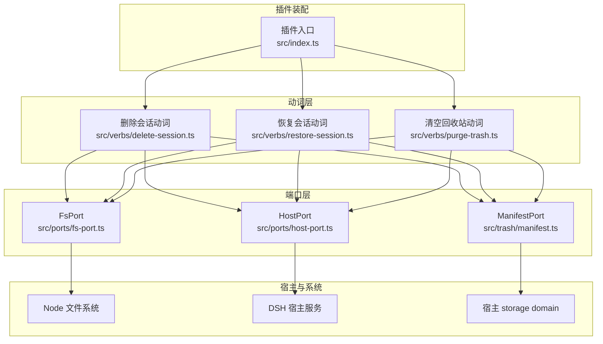
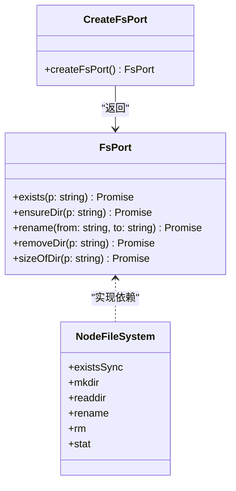
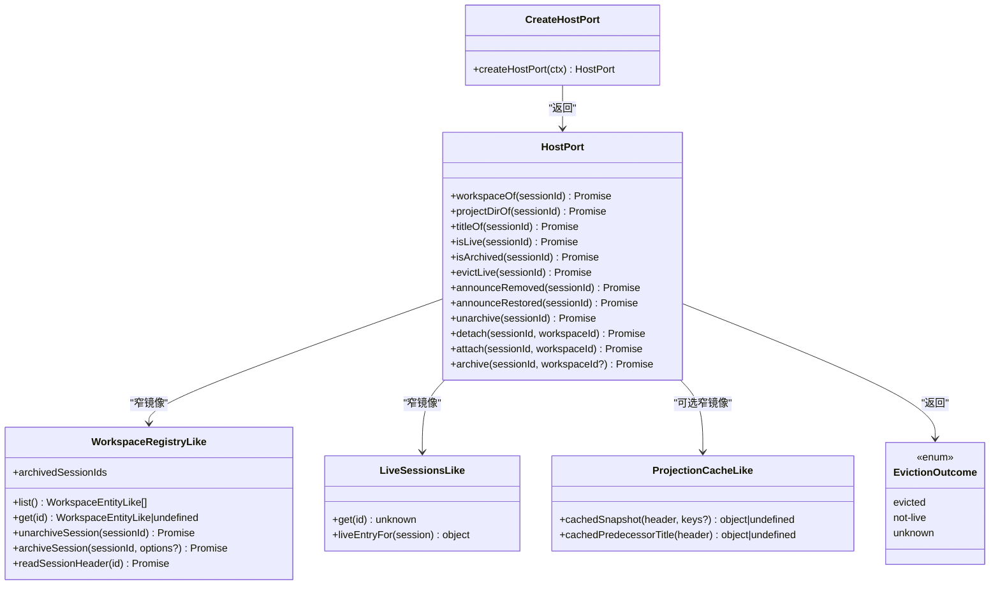
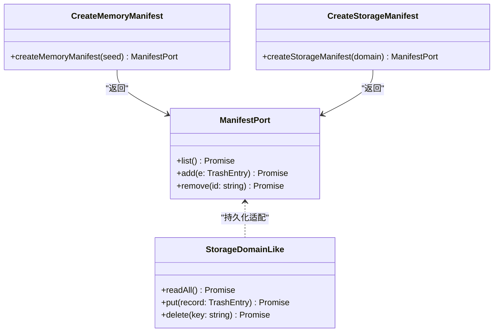
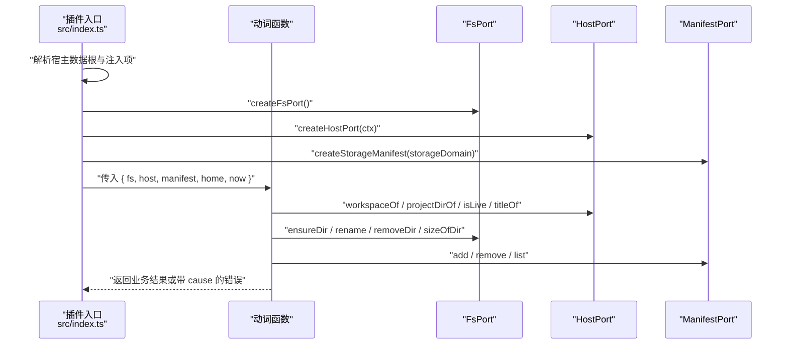
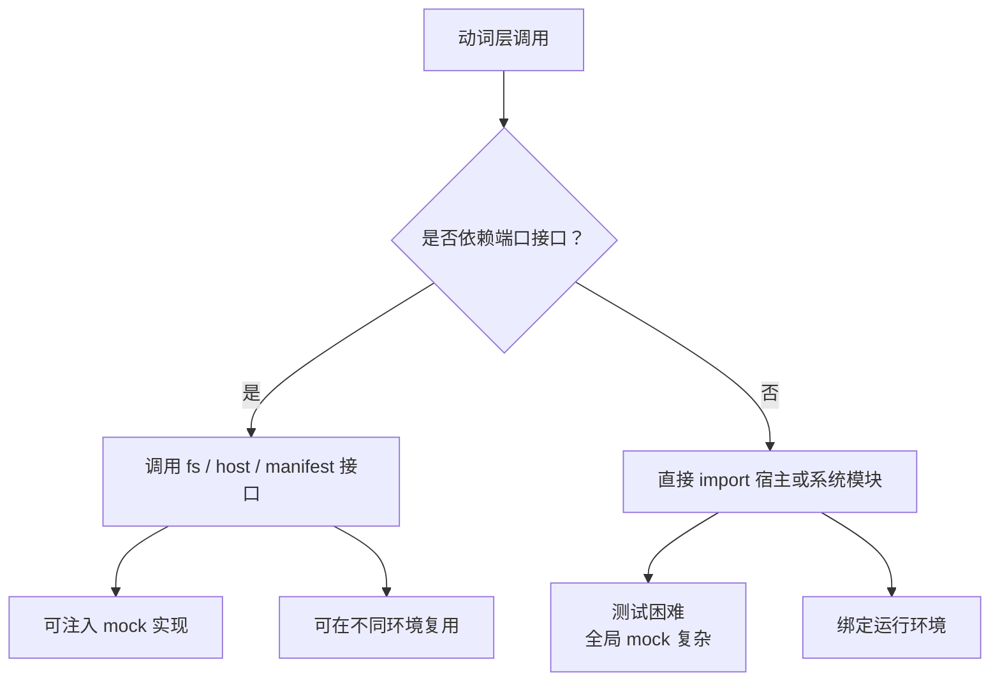
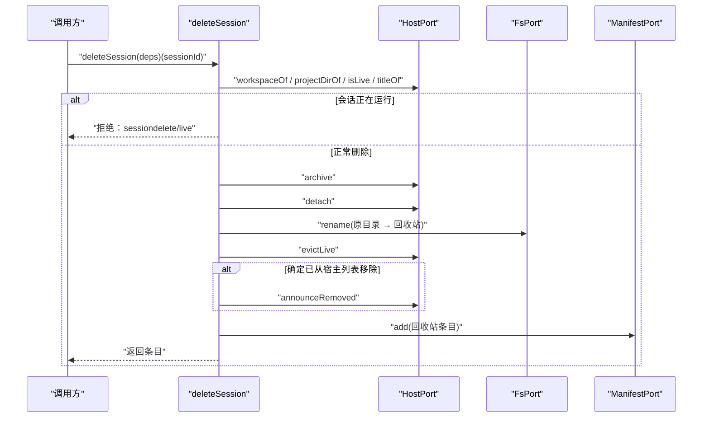
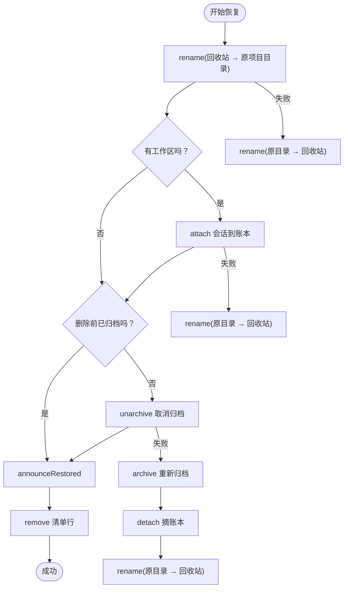
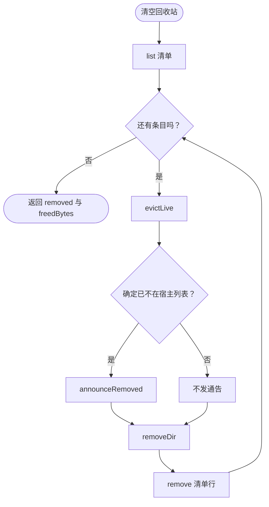
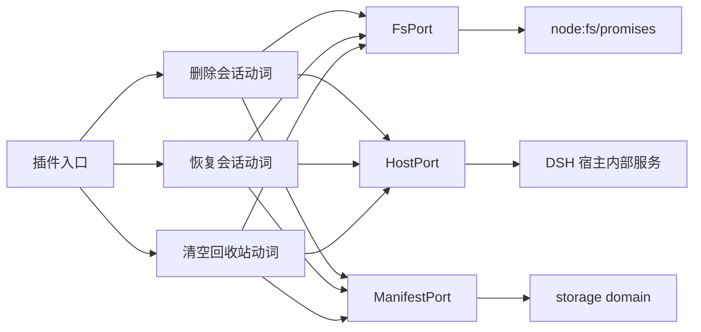

# Port 模式与依赖注入

<cite>
**本文引用的文件**   
- [fs-port.ts](file://src/ports/fs-port.ts)
- [host-port.ts](file://src/ports/host-port.ts)
- [manifest.ts](file://src/trash/manifest.ts)
- [index.ts](file://src/index.ts)
- [delete-session.test.ts](file://tests/delete-session.test.ts)
- [purge-trash.test.ts](file://tests/purge-trash.test.ts)
- [restore-session.test.ts](file://tests/restore-session.test.ts)
- [ports.test.ts](file://tests/ports.test.ts)
- [README.md](file://README.md)
</cite>

## 目录
1. [引言](#引言)
2. [项目结构](#项目结构)
3. [核心端口定义](#核心端口定义)
4. [架构总览](#架构总览)
5. [详细组件分析](#详细组件分析)
6. [依赖关系分析](#依赖关系分析)
7. [性能特征](#性能特征)
8. [测试与替换策略](#测试与替换策略)
9. [扩展性与最佳实践](#扩展性与最佳实践)
10. [故障排查](#故障排查)
11. [结论](#结论)

## 引言
本插件为 DeepSeek Harness（DSH）增加“删除会话”能力：删除不是直接销毁，而是移入回收站；回收站支持恢复与显式彻底删除。为保证可测试性、跨环境复用和宿主耦合可控，代码采用 **Port + 依赖注入** 模式：动词层只依赖窄接口，由装配层把真实实现注入进来。

该模式的三个关键端口是：
- **FsPort**：文件系统抽象。
- **HostPort**：宿主服务窄镜像。
- **ManifestPort**：回收站清单持久化抽象。

## 项目结构
仓库按职责分层组织：
- `src/ports`：端口定义与默认实现。
- `src/trash`：回收站清单模型与存储适配。
- `src/verbs`：业务动词（删除、恢复、清空）。
- `src/api`、`src/client`、`src/remote`：浏览器半与远端错误映射。
- `src/index.ts`：插件装配入口，负责解析宿主数据根、注册 webServer、创建 ManifestPort。
- `tests`：以端口夹具进行单元测试。

**图表来源**
- [index.ts:1-200](file://src/index.ts#L1-L200)
- [fs-port.ts:1-33](file://src/ports/fs-port.ts#L1-L33)
- [host-port.ts:1-200](file://src/ports/host-port.ts#L1-L200)
- [manifest.ts:1-35](file://src/trash/manifest.ts#L1-L35)

**章节来源**
- [README.md:1-130](file://README.md#L1-L130)
- [index.ts:1-200](file://src/index.ts#L1-L200)

## 核心端口定义

### FsPort：文件系统端口
FsPort 暴露五个最小方法：
- `exists(p)`：判断路径是否存在。
- `ensureDir(p)`：递归创建目录，解决首删时回收站父目录不存在的问题。
- `rename(from, to)`：整目录原子搬迁。
- `removeDir(p)`：递归删除目录。
- `sizeOfDir(p)`：递归累加目录字节数，用于显示回收站占用。

设计要点：
- `sizeOfDir` 使用模块级递归函数而非实例方法，避免解构后 `this` 丢失。
- 所有副作用都集中在端口实现中，动词层不直接 import `node:fs`。

**图表来源**
- [fs-port.ts:1-33](file://src/ports/fs-port.ts#L1-L33)

**章节来源**
- [fs-port.ts:1-33](file://src/ports/fs-port.ts#L1-L33)
- [ports.test.ts:1-42](file://tests/ports.test.ts#L1-L42)

### HostPort：宿主服务窄镜像
HostPort 是宿主内部能力的窄接口，包括：
- 工作区与会话元信息：`workspaceOf`、`projectDirOf`、`titleOf`。
- 状态查询：`isLive`、`isArchived`。
- 内存与会话列表操作：`evictLive`、`announceRemoved`、`announceRestored`。
- 账本与可见性：`detach`、`attach`、`archive`、`unarchive`。

关键约束：
- 本仓不 import 宿主类型包，也不声明 `declare module`，而是通过本地 interface 镜像宿主 asar 源码中的方法面。
- `EvictionOutcome` 三态 `'evicted' | 'not-live' | 'unknown'` 决定客户端是否应收到“已移除”通告：只有确定宿主列表已干净时才发。
- `projectKey` 是项目目录名的算法镜像，避免跨插件 import 宿主包。

**图表来源**
- [host-port.ts:1-200](file://src/ports/host-port.ts#L1-L200)

**章节来源**
- [host-port.ts:1-200](file://src/ports/host-port.ts#L1-L200)

### ManifestPort：回收站清单端口
ManifestPort 暴露三个最小操作：
- `list()`：读取清单并倒序排序。
- `add(e)`：写入一条回收站条目。
- `remove(id)`：删除一条条目。

两种实现：
- `createMemoryManifest(seed)`：基于 `Map` 的内存实现，适合单元测试。
- `createStorageManifest(domain)`：适配宿主 `storageDomain`，提供持久化清单。

**图表来源**
- [manifest.ts:1-35](file://src/trash/manifest.ts#L1-L35)

**章节来源**
- [manifest.ts:1-35](file://src/trash/manifest.ts#L1-L35)

## 架构总览
动词层是业务编排中心，它不关心文件系统具体怎么读盘，也不关心宿主如何列出会话，只调用端口接口。装配层在 `src/index.ts` 中完成以下工作：
- 解析宿主数据根。
- 注入 `workspaceRegistry`、`storageDomain`、`webServer`。
- 创建 `createFsPort`、`createHostPort`、`createStorageManifest`。
- 将端口对象作为依赖传给动词函数。

**图表来源**
- [index.ts:1-200](file://src/index.ts#L1-L200)
- [fs-port.ts:1-33](file://src/ports/fs-port.ts#L1-L33)
- [host-port.ts:1-200](file://src/ports/host-port.ts#L1-L200)
- [manifest.ts:1-35](file://src/trash/manifest.ts#L1-L35)

## 详细组件分析

### 为什么动词层只依赖接口
动词层（如删除、恢复、清空）需要三类外部能力：
1. 文件系统读写与目录大小统计。
2. 宿主会话列表、归档态、账本挂接、事件通告。
3. 回收站清单的持久化。

如果动词直接 import 宿主内部模块或 `node:fs`，会产生以下问题：
- 测试时必须 mock 全局模块，难以隔离副作用。
- 无法在浏览器半或其他环境中复用同一业务逻辑。
- 宿主 API 变更会直接破坏导入链。

通过端口接口：
- 动词层只依赖稳定、窄的契约。
- 实现细节被封装在端口工厂里。
- 测试可以用内存或 mock 实现替换真实后端。

[无图表来源，因为这是概念流程图]

**章节来源**
- [delete-session.test.ts:1-200](file://tests/delete-session.test.ts#L1-L200)
- [purge-trash.test.ts:1-80](file://tests/purge-trash.test.ts#L1-L80)
- [restore-session.test.ts:1-149](file://tests/restore-session.test.ts#L1-L149)

### 删除会话的端口协作流程
删除会话是一个多步骤事务：先查状态，再归档、摘账本、搬目录、摘活体、通告、写清单。失败路径必须回滚已完成的副作用。

**图表来源**
- [delete-session.test.ts:1-200](file://tests/delete-session.test.ts#L1-L200)
- [fs-port.ts:1-33](file://src/ports/fs-port.ts#L1-L33)
- [host-port.ts:1-200](file://src/ports/host-port.ts#L1-L200)
- [manifest.ts:1-35](file://src/trash/manifest.ts#L1-L35)

**章节来源**
- [delete-session.test.ts:1-200](file://tests/delete-session.test.ts#L1-L200)

### 恢复会话的回滚语义
恢复会话从回收站把目录搬回原项目目录，并按删除前的归档态决定是否取消归档，最后挂回账本并通告客户端。测试覆盖了：
- 原本未归档：恢复后取消归档。
- 原本已归档：恢复后仍归档。
- 未分组会话：没有工作区可挂账本。
- attach 失败：目录搬回去。
- unarchive 失败：重新归档、摘账本、目录放回回收站。
- 清单行删除失败：整体回退。

**图表来源**
- [restore-session.test.ts:1-149](file://tests/restore-session.test.ts#L1-L149)

**章节来源**
- [restore-session.test.ts:1-149](file://tests/restore-session.test.ts#L1-L149)

### 清空回收站的批量语义
清空回收站会遍历清单条目，逐个：
- 从宿主内存摘除活体。
- 如实通告客户端移除。
- 删除回收站目录。
- 删除清单行。

若目录已被手工删除，仍应清理清单行并报告释放空间。

**图表来源**
- [purge-trash.test.ts:1-80](file://tests/purge-trash.test.ts#L1-L80)

**章节来源**
- [purge-trash.test.ts:1-80](file://tests/purge-trash.test.ts#L1-L80)

## 依赖关系分析

**图表来源**
- [index.ts:1-200](file://src/index.ts#L1-L200)
- [fs-port.ts:1-33](file://src/ports/fs-port.ts#L1-L33)
- [host-port.ts:1-200](file://src/ports/host-port.ts#L1-L200)
- [manifest.ts:1-35](file://src/trash/manifest.ts#L1-L35)

**章节来源**
- [index.ts:1-200](file://src/index.ts#L1-L200)
- [fs-port.ts:1-33](file://src/ports/fs-port.ts#L1-L33)
- [host-port.ts:1-200](file://src/ports/host-port.ts#L1-L200)
- [manifest.ts:1-35](file://src/trash/manifest.ts#L1-L35)

## 性能特征

### 仅声明所需成员
- FsPort 只暴露 5 个方法，不引入整个 Node 文件系统对象。
- HostPort 只声明动词实际调用的宿主方法，避免持有完整宿主上下文。
- ManifestPort 只暴露 list/add/remove，不暴露 storage domain 的内部实现。

这降低了耦合面，也让测试夹具更精确。

### 递归目录大小计算
`sizeOfDir` 对每个子项执行 `readdir`、`stat` 或递归目录访问。时间复杂度近似 O(N)，N 为目录树中的文件与子目录总数。对于大型会话目录，这可能成为一次 UI 刷新或汇总时的开销点。

优化建议：
- 对高频重复统计做短期缓存。
- 在界面刷新时限制最大深度或并发。
- 将大目录大小计算放入异步任务队列，避免阻塞主线程。

### 清单排序
`list()` 每次读取后按 `deletedAt` 倒序排序。内存实现使用数组拷贝加比较排序，时间复杂度 O(M log M)，M 为清单行数。对普通用户场景足够；若清单非常大，应考虑分页或增量更新。

### 宿主内存摘除三态
`evictLive` 返回 `unknown` 时不发送“已移除”通告，避免假消息导致客户端重连后行目复现。这是正确性与一致性的权衡：宁可延迟消失，也不发错误状态。

**章节来源**
- [fs-port.ts:1-33](file://src/ports/fs-port.ts#L1-L33)
- [host-port.ts:1-200](file://src/ports/host-port.ts#L1-L200)
- [manifest.ts:1-35](file://src/trash/manifest.ts#L1-L35)

## 测试与替换策略

### 使用 createFsPort 的真实行为测试
`tests/ports.test.ts` 验证：
- `exists` 对不存在路径返回 false。
- `sizeOfDir` 能正确累加多个文件和子目录。
- 解构调用不会丢失 `this`。
- `ensureDir` 能创建多级路径。

这些用例确认端口实现本身的行为，而不是通过动词间接验证。

**章节来源**
- [ports.test.ts:1-42](file://tests/ports.test.ts#L1-L42)
- [fs-port.ts:1-33](file://src/ports/fs-port.ts#L1-L33)

### 在动词测试中替换 FsPort
`tests/delete-session.test.ts`、`tests/purge-trash.test.ts`、`tests/restore-session.test.ts` 都构造一个轻量 `fs` 对象：
- `exists`、`rename`、`removeDir`、`ensureDir`、`sizeOfDir`。
- 用 `vi.fn` 记录调用顺序，断言回滚路径。

这种方式让测试不依赖真实磁盘，同时保留 I/O 语义。

**章节来源**
- [delete-session.test.ts:1-200](file://tests/delete-session.test.ts#L1-L200)
- [purge-trash.test.ts:1-80](file://tests/purge-trash.test.ts#L1-L80)
- [restore-session.test.ts:1-149](file://tests/restore-session.test.ts#L1-L149)

### 使用 createMemoryManifest 进行单元测试
`createMemoryManifest` 基于 `Map`，不需要启动宿主 storage domain。测试可以直接：
- 用种子数据初始化清单。
- 断言 `list` 的顺序。
- 断言 `add` 与 `remove` 后的条目数量。

**章节来源**
- [manifest.ts:1-35](file://src/trash/manifest.ts#L1-L35)
- [delete-session.test.ts:1-200](file://tests/delete-session.test.ts#L1-L200)
- [purge-trash.test.ts:1-80](file://tests/purge-trash.test.ts#L1-L80)
- [restore-session.test.ts:1-149](file://tests/restore-session.test.ts#L1-L149)

### 替换 HostPort 模拟宿主服务
动词测试构造的 `host` 对象覆盖：
- `workspaceOf`、`projectDirOf`、`titleOf`。
- `isLive`、`isArchived`。
- `evictLive`、`announceRemoved`、`announceRestored`。
- `unarchive`、`detach`、`attach`、`archive`。

这样可以分别验证：
- 运行中会话拒绝删除。
- 未分组会话的处理分支。
- 摘内存结果为 `unknown` 时不发通告。
- 各阶段失败的回滚顺序。

**章节来源**
- [delete-session.test.ts:1-200](file://tests/delete-session.test.ts#L1-L200)
- [purge-trash.test.ts:1-80](file://tests/purge-trash.test.ts#L1-L80)
- [restore-session.test.ts:1-149](file://tests/restore-session.test.ts#L1-L149)

## 扩展性与最佳实践

### 自定义文件系统后端
由于动词只依赖 `FsPort`，可以替换为：
- 内存文件系统，用于快速集成测试。
- 沙箱文件系统，用于隔离临时数据。
- 网络文件系统适配器，用于远程会话存储场景。

新增实现只需满足五个方法签名，无需改动动词逻辑。

### 模拟宿主服务
`HostPort` 允许模拟：
- 工作区与会话列表。
- 归档态与活跃状态。
- 客户端事件通告。
- 账本挂接与分离。

这对以下场景很有价值：
- 验证宿主不可用时行为。
- 验证 live store 未知结果。
- 验证断网或权限不足等边界条件。

### 扩展清单持久化
`ManifestPort` 已经区分内存实现与 storage domain 适配。未来可扩展：
- 带版本迁移的清单格式。
- 增量同步到远程存储。
- 压缩或分片的大清单。

只要保持 `list/add/remove` 契约不变，动词层无需修改。

### 装配层最佳实践
- 把端口工厂放在 `src/index.ts`，集中管理依赖注入。
- 不要把端口实现散落到动词层。
- 测试夹具尽量贴近生产实现的最小方法面，减少“测试友好但生产不兼容”的风险。

**章节来源**
- [fs-port.ts:1-33](file://src/ports/fs-port.ts#L1-L33)
- [host-port.ts:1-200](file://src/ports/host-port.ts#L1-L200)
- [manifest.ts:1-35](file://src/trash/manifest.ts#L1-L35)
- [index.ts:1-200](file://src/index.ts#L1-L200)

## 故障排查

### 端口方法缺失
如果某个动词报错找不到 `exists`、`rename`、`workspaceOf`、`list` 等方法，优先检查：
- 测试夹具是否补齐了端口接口。
- 是否误传了宿主原始对象而非端口对象。
- 是否忘记调用 `createFsPort`、`createHostPort`、`createStorageManifest`。

### 宿主内存摘除后客户端行仍存在
如果 `evictLive` 返回 `unknown`，插件不会发送 `announceRemoved`。此时：
- 刷新页面或等待宿主重列。
- 检查宿主 live store 是否可用。
- 不要认为删除失败：删除本身仍可成功。

### 清单与文件不一致
- 清单是辅助索引，会话文件自描述。
- 若清单损坏但文件存在，可通过恢复流程重建。
- 若文件被手工删除，清空回收站仍应清理清单行。

**章节来源**
- [host-port.ts:1-200](file://src/ports/host-port.ts#L1-L200)
- [purge-trash.test.ts:1-80](file://tests/purge-trash.test.ts#L1-L80)
- [README.md:1-130](file://README.md#L1-L130)

## 结论
Port + 依赖注入在本插件中承担了三件事：
1. **隔离副作用**：文件系统、宿主服务、清单持久化都被包装成窄接口。
2. **提升可测试性**：测试可以注入 mock 或内存实现，精确断言调用顺序与回滚路径。
3. **增强扩展性**：可以替换自定义文件系统后端、模拟宿主服务、扩展清单存储，而不改动业务动词。

代价是装配层需要显式构造端口对象，并在测试中维护夹具。但从长期看，这种设计让“删除会话”这一业务逻辑真正独立于宿主实现细节，也更符合跨环境复用的插件架构目标。