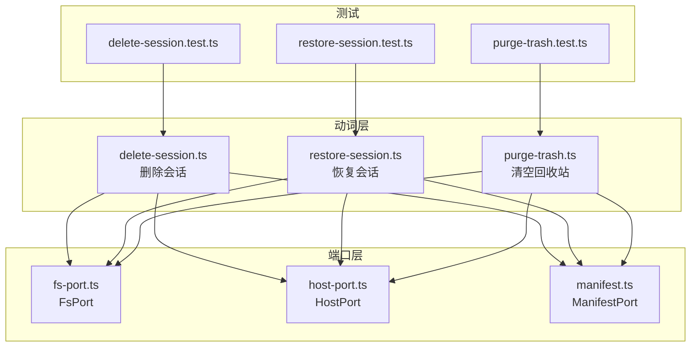
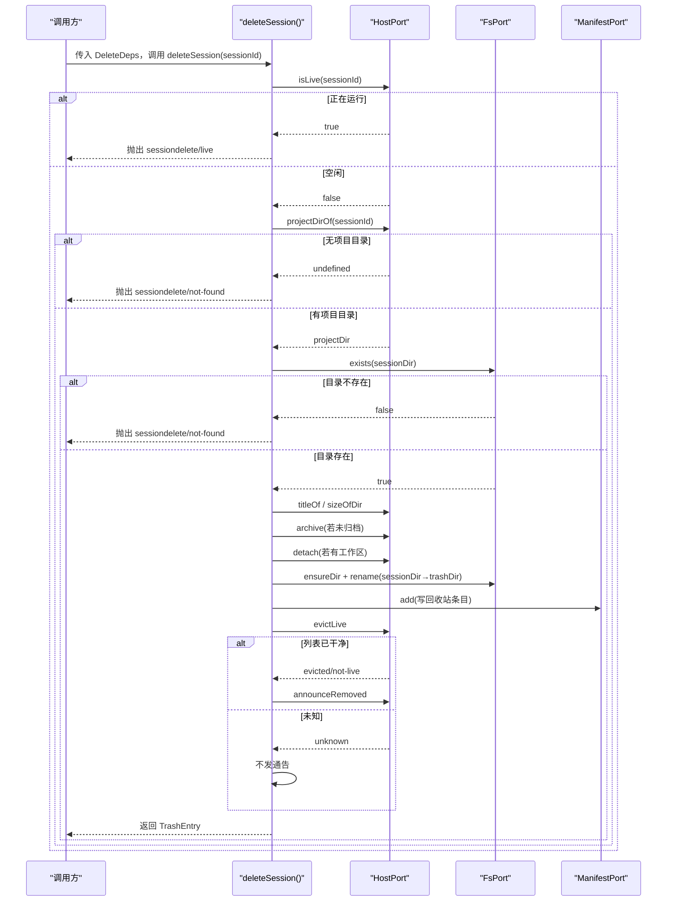
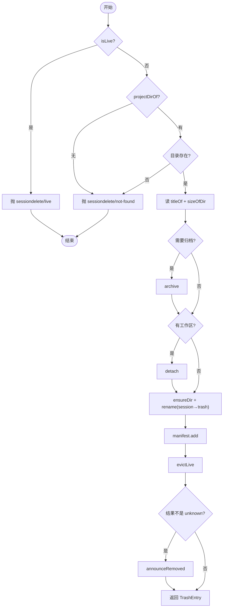
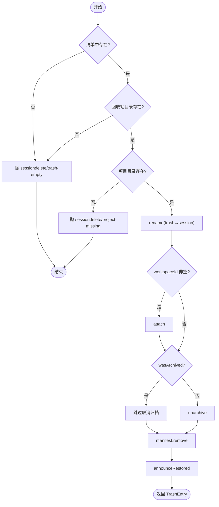
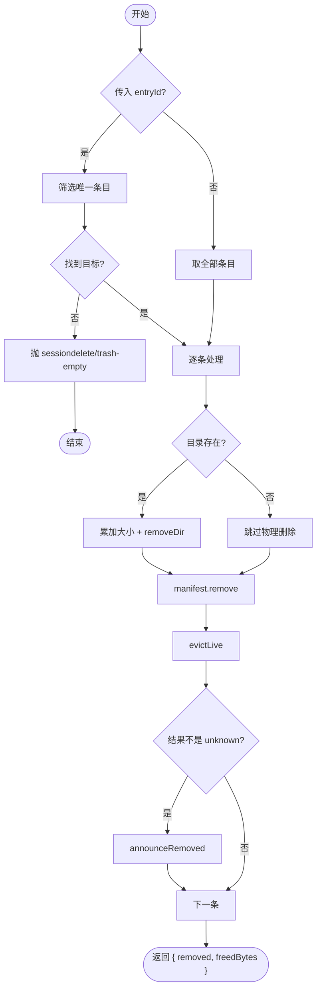
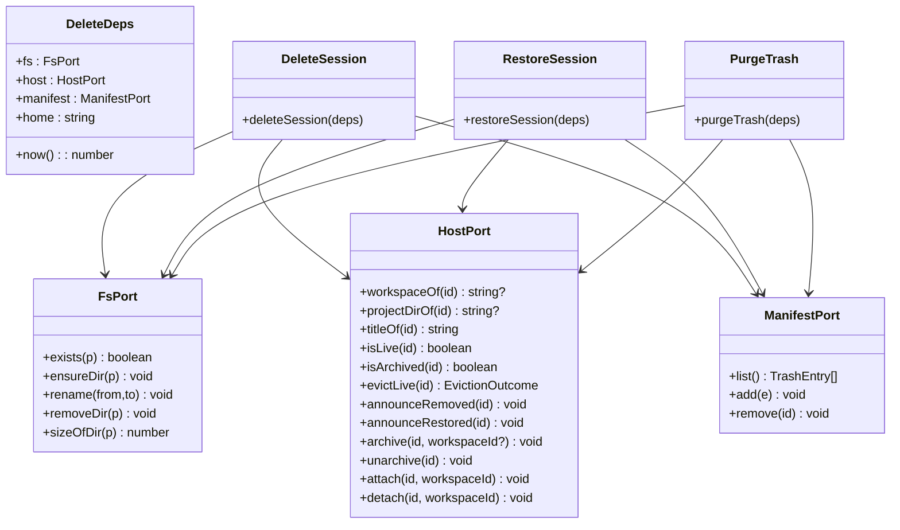

# Verb 事务模式

<cite>
**本文引用的文件**   
- [delete-session.ts](file://src/verbs/delete-session.ts)
- [restore-session.ts](file://src/verbs/restore-session.ts)
- [purge-trash.ts](file://src/verbs/purge-trash.ts)
- [fs-port.ts](file://src/ports/fs-port.ts)
- [host-port.ts](file://src/ports/host-port.ts)
- [manifest.ts](file://src/trash/manifest.ts)
- [delete-session.test.ts](file://tests/delete-session.test.ts)
- [restore-session.test.ts](file://tests/restore-session.test.ts)
- [purge-trash.test.ts](file://tests/purge-trash.test.ts)
</cite>

## 目录
1. [引言](#引言)
2. [项目结构](#项目结构)
3. [核心组件](#核心组件)
4. [架构总览](#架构总览)
5. [详细组件分析](#详细组件分析)
6. [依赖关系分析](#依赖关系分析)
7. [性能与一致性](#性能与一致性)
8. [故障排查指南](#故障排查指南)
9. [结论](#结论)

## 引言
本仓库实现了一套“动词（Verb）”事务模式，围绕会话回收站三个业务动作展开：删除会话、恢复会话、清空回收站。每个动词都是工厂函数，接收 `DeleteDeps`，返回一个异步函数；所有外部副作用通过端口注入：文件系统端口 `FsPort`、宿主服务端口 `HostPort`、回收站清单端口 `ManifestPort`。这种设计把业务步骤、错误码映射、回滚顺序和客户端通告解耦成可测试的纯逻辑流程。

## 项目结构


**图示来源**
- [delete-session.ts:1-104](file://src/verbs/delete-session.ts#L1-L104)
- [restore-session.ts:1-68](file://src/verbs/restore-session.ts#L1-L68)
- [purge-trash.ts:1-29](file://src/verbs/purge-trash.ts#L1-L29)
- [fs-port.ts:1-33](file://src/ports/fs-port.ts#L1-L33)
- [host-port.ts:1-366](file://src/ports/host-port.ts#L1-L366)
- [manifest.ts:1-35](file://src/trash/manifest.ts#L1-L35)

**章节来源**
- [delete-session.ts:1-104](file://src/verbs/delete-session.ts#L1-L104)
- [restore-session.ts:1-68](file://src/verbs/restore-session.ts#L1-L68)
- [purge-trash.ts:1-29](file://src/verbs/purge-trash.ts#L1-L29)
- [fs-port.ts:1-33](file://src/ports/fs-port.ts#L1-L33)
- [host-port.ts:1-366](file://src/ports/host-port.ts#L1-L366)
- [manifest.ts:1-35](file://src/trash/manifest.ts#L1-L35)

## 核心组件

### 工厂函数与依赖注入
每个动词都遵循同一签名：
- `deleteSession(deps)` → `async deleteSession(sessionId): Promise<TrashEntry>`
- `restoreSession(deps)` → `async restoreSession(entryId): Promise<TrashEntry>`
- `purgeTrash(deps)` → `async purgeTrash(entryId?): Promise<{ removed: number; freedBytes: number }>`

`DeleteDeps` 统一暴露：
| 字段 | 类型 | 职责 |
|---|---|---|
| `fs` | `FsPort` | 检查存在、创建目录、原子移动、递归删除、计算目录大小 |
| `host` | `HostPort` | 查询会话状态、归档/取消归档、挂账本/摘账本、摘内存活体、向客户端转发事件 |
| `manifest` | `ManifestPort` | 增删查回收站条目 |
| `home` | `string` | 根路径，用于拼接 `<home>/sessions` 与 `<home>/session-trash` |
| `now` | `() => number` | 生成删除时间戳，用于构造条目 id |

**章节来源**
- [delete-session.ts:1-18](file://src/verbs/delete-session.ts#L1-L18)
- [fs-port.ts:1-33](file://src/ports/fs-port.ts#L1-L33)
- [host-port.ts:1-366](file://src/ports/host-port.ts#L1-L366)
- [manifest.ts:1-35](file://src/trash/manifest.ts#L1-L35)

### 端口契约

#### FsPort
| 方法 | 语义 |
|---|---|
| `exists(p)` | 同步存在性检查 |
| `ensureDir(p)` | 递归创建目录 |
| `rename(from, to)` | 同卷原子重命名 |
| `removeDir(p)` | 递归删除目录 |
| `sizeOfDir(p)` | 递归统计字节数 |

#### HostPort
| 方法 | 语义 |
|---|---|
| `workspaceOf(sessionId)` | 返回工作区 id 或 `undefined` |
| `projectDirOf(sessionId)` | 返回持久化项目目录名或 `undefined` |
| `titleOf(sessionId)` | 尽力读取标题 |
| `isLive(sessionId)` | 是否为运行中会话 |
| `isArchived(sessionId)` | 是否已在归档集 |
| `evictLive(sessionId)` | 从宿主内存摘除，返回 `evicted` / `not-live` / `unknown` |
| `announceRemoved(sessionId)` | 通知客户端该会话已移除 |
| `announceRestored(sessionId)` | 通知客户端该会话已恢复 |
| `archive/unarchive` | 控制全局归档可见性 |
| `attach/detach` | 在工作区账本中挂入/摘出会话 |

#### ManifestPort
| 方法 | 语义 |
|---|---|
| `list()` | 按 `deletedAt` 倒序返回条目 |
| `add(e)` | 写入回收站条目 |
| `remove(id)` | 删除回收站条目 |

**章节来源**
- [fs-port.ts:1-33](file://src/ports/fs-port.ts#L1-L33)
- [host-port.ts:1-366](file://src/ports/host-port.ts#L1-L366)
- [manifest.ts:1-35](file://src/trash/manifest.ts#L1-L35)

## 架构总览


**图示来源**
- [delete-session.ts:1-104](file://src/verbs/delete-session.ts#L1-L104)

**章节来源**
- [delete-session.ts:1-104](file://src/verbs/delete-session.ts#L1-L104)

## 详细组件分析

### 删除会话：`deleteSession`

#### 事务步骤
1. **前置读**
   - `isLive`：运行中会话直接拒绝。
   - `projectDirOf`：没有项目目录即 `not-found`。
   - `workspaceOf`：可选，空值表示“未分组”。
   - `fs.exists(sessionDir)`：目录不存在即 `not-found`。
   - `isArchived`：记录删除前是否已归档。
   - `titleOf`、`sizeOfDir`：提前到任何写之前，失败走 `io`。

2. **构建回收站条目**
   - 使用 `makeEntryId(deletedAt, sessionId)` 生成稳定 `id`。
   - 保留原 `sessionId`、`projectDir`、`workspaceId`、`wasArchived`、`title`、`sizeBytes`。

3. **写阶段**
   - ③ 归档：若未归档则先隐藏，避免 detach 后出现“无主且可见”窗口。
   - ② 摘账本：若存在工作区则 detach；失败时回滚归档。
   - ① 移动目录：确保回收站根目录存在后执行原子 `rename`。
   - 登记清单：最后写入 `manifest.add`。
   - 收尾：`evictLive` + 条件性 `announceRemoved`。



**图示来源**
- [delete-session.ts:1-104](file://src/verbs/delete-session.ts#L1-L104)

#### 回滚策略
- `archive` 失败：第一步写失败，无需回滚。
- `detach` 失败：若曾归档则 `unarchive`，再抛 `io`。
- `rename` 失败：`attach` 账本 + `unarchive` 还原可见性，再抛 `io`。
- `manifest.add` 失败：反向回滚——`rename(trash→session)` → `attach` → `unarchive`，再抛 `io`。
- `evictLive` / `announceRemoved` 不抛，不影响成功结果。

#### 调用示例
```ts
import { createFsPort } from './src/ports/fs-port.js'
import { createHostPort } from './src/ports/host-port.js'
import { createStorageManifest } from './src/trash/manifest.js'
import { deleteSession } from './src/verbs/delete-session.js'

const deps = {
  fs: createFsPort(),
  host: createHostPort(ctx),
  manifest: createStorageManifest(storageDomain),
  home: process.env.HOME ?? '/home/user',
  now: () => Date.now(),
}

const entry = await deleteSession(deps)('session-abc')
// entry.id 形如 "20261002T...Z-session-abc"
```

**章节来源**
- [delete-session.ts:1-104](file://src/verbs/delete-session.ts#L1-L104)
- [delete-session.test.ts:1-208](file://tests/delete-session.test.ts#L1-L208)

### 恢复会话：`restoreSession`

#### 事务步骤
1. **校验条目**
   - 在 `manifest.list()` 中查找 `entryId`，不存在即 `trash-empty`。
   - 回收站目录必须存在，否则视为孤儿并走 `trash-empty`。
   - 目标项目目录必须存在；`sessions` 根缺失或项目目录缺失均报 `project-missing`。

2. **写阶段**
   - ① 目录搬回：`rename(trashDir → sessionDir)`。
   - ② 挂账本：若 `workspaceId !== ''` 则 `attach`。
   - ③ 可见性恢复：根据 `wasArchived` 决定 `unarchive`；原本已归档则不动。
   - 摘清单行：`manifest.remove`。
   - ④ 通告恢复：`announceRestored`。



**图示来源**
- [restore-session.ts:1-68](file://src/verbs/restore-session.ts#L1-L68)

#### 回滚策略
- `rename(trash→session)` 失败：包装为 `io`。
- `attach` 失败：`rename(session→trash)`，再抛 `io`。
- `unarchive` 失败：反向回滚——`archive` → `detach` → `rename(session→trash)`，再抛 `io`。
- `manifest.remove` 失败：反向回滚——`archive` → `detach` → `rename(session→trash)`，再抛 `io`。

#### 调用示例
```ts
import { restoreSession } from './src/verbs/restore-session.js'

const restored = await restoreSession(deps)(entry.id)
// 成功后清单不再包含该 id，会话回到 sessions 树中
```

**章节来源**
- [restore-session.ts:1-68](file://src/verbs/restore-session.ts#L1-L68)
- [restore-session.test.ts:1-149](file://tests/restore-session.test.ts#L1-L149)

### 清空回收站：`purgeTrash`

#### 批量清理逻辑
- 若传入 `entryId`：只处理匹配条目；找不到即 `trash-empty`。
- 若未传参：遍历全部条目。
- 对每个条目：
  - 若目录存在：累加 `sizeOfDir` 并 `removeDir`。
  - 无论目录是否存在，都 `manifest.remove`。
  - `evictLive` 后仅在结果为 `evicted` / `not-live` 时 `announceRemoved`。
- 返回 `{ removed, freedBytes }`。



**图示来源**
- [purge-trash.ts:1-29](file://src/verbs/purge-trash.ts#L1-L29)

#### 调用示例
```ts
import { purgeTrash } from './src/verbs/purge-trash.js'

// 彻底删除单个条目
await purgeTrash(deps)('20261002T...Z-session-abc')

// 清空整个回收站
const result = await purgeTrash(deps)()
// result.removed === 2, result.freedBytes 为累计字节数
```

**章节来源**
- [purge-trash.ts:1-29](file://src/verbs/purge-trash.ts#L1-L29)
- [purge-trash.test.ts:1-80](file://tests/purge-trash.test.ts#L1-L80)

## 依赖关系分析



**图示来源**
- [delete-session.ts:1-104](file://src/verbs/delete-session.ts#L1-L104)
- [restore-session.ts:1-68](file://src/verbs/restore-session.ts#L1-L68)
- [purge-trash.ts:1-29](file://src/verbs/purge-trash.ts#L1-L29)
- [fs-port.ts:1-33](file://src/ports/fs-port.ts#L1-L33)
- [host-port.ts:1-366](file://src/ports/host-port.ts#L1-L366)
- [manifest.ts:1-35](file://src/trash/manifest.ts#L1-L35)

**章节来源**
- [delete-session.ts:1-104](file://src/verbs/delete-session.ts#L1-L104)
- [restore-session.ts:1-68](file://src/verbs/restore-session.ts#L1-L68)
- [purge-trash.ts:1-29](file://src/verbs/purge-trash.ts#L1-L29)
- [fs-port.ts:1-33](file://src/ports/fs-port.ts#L1-L33)
- [host-port.ts:1-366](file://src/ports/host-port.ts#L1-L366)
- [manifest.ts:1-35](file://src/trash/manifest.ts#L1-L35)

## 性能与一致性

### 性能特征
- 删除前的 `titleOf` 与 `sizeOfDir` 属于纯读操作，放在写之前以避免“半写状态”下的重复修复成本。
- 目录移动使用 `rename`，在同卷下是原子瞬时操作，减少大会话复制开销。
- 回收站目录大小统计递归遍历文件树，复杂度与文件数量线性相关；对超大会话可能成为热点。
- `purgeTrash` 的 `freedBytes` 在删除目录前统计，适合批量释放空间估算。

### 事务一致性约束
- 删除会话的最终一致目标是：**会话不在运行时、不在分组面、不在客户端列表、清单中有记录**。
- 恢复会话的最终一致目标是：**会话回到原项目目录、账本挂回、可见性恢复、清单中不再存在**。
- 清空回收站的最终一致目标是：**物理目录被删、清单行被清、宿主内存中的活体被请掉、客户端列表不再显示**。
- 关键不变式：
  - “文件在回收站而清单无行”是孤儿状态，应避免。
  - “文件在原位而清单有行”是幽灵行，应避免。
  - 列表可见性必须与归档态、账本挂接状态保持一致。

### 幂等性约束
- `deleteSession` 并非完全幂等：重复调用会基于当前状态重新归档、重新 detach、再次 rename，但测试期望返回相同 `sessionId` 的条目；实际幂等需由调用方保证会话仍在回收站外且未被其他流程修改。
- `restoreSession` 也不是天然幂等：如果目录已被恢复、清单已移除，再次调用会因清单找不到而报 `trash-empty`。
- `purgeTrash` 对“目录已不存在但仍摘清单行”的设计使其部分幂等：多次清空不会报错，但 `removed` 计数仍按传入目标数计算，调用方需注意语义。

**章节来源**
- [delete-session.ts:1-104](file://src/verbs/delete-session.ts#L1-L104)
- [restore-session.ts:1-68](file://src/verbs/restore-session.ts#L1-L68)
- [purge-trash.ts:1-29](file://src/verbs/purge-trash.ts#L1-L29)
- [fs-port.ts:1-33](file://src/ports/fs-port.ts#L1-L33)

## 故障排查指南

### 错误码与处理策略
| 场景 | 错误码 | 说明 |
|---|---|---|
| 会话正在运行 | `sessiondelete/live` | 删除前拦截，零写操作 |
| 无项目目录或目录不存在 | `sessiondelete/not-found` | 读阶段失败，零副作用 |
| 回收站中找不到条目 | `sessiondelete/trash-empty` | 恢复或精准清空时的输入校验 |
| 原项目目录缺失 | `sessiondelete/project-missing` | 恢复时禁止静默重建 |
| I/O 或宿主服务异常 | `sessiondelete/io` | 包裹原始错误于 `cause` |

### 回滚时机总结
| 动词 | 失败点 | 回滚动作 |
|---|---|---|
| 删除 | `archive` | 无 |
| 删除 | `detach` | `unarchive`（若曾归档） |
| 删除 | `rename` | `attach` + `unarchive` |
| 删除 | `manifest.add` | `rename(trash→session)` + `attach` + `unarchive` |
| 恢复 | `attach` | `rename(session→trash)` |
| 恢复 | `unarchive` | `archive` + `detach` + `rename(session→trash)` |
| 恢复 | `manifest.remove` | `archive` + `detach` + `rename(session→trash)` |
| 清空 | `removeDir` | 继续摘清单行，不整体回滚 |

### 通告边界
- `evictLive` 返回 `unknown` 时，说明宿主内存状态不可信，不能发“已移除”通告，否则重连后列表会出现假消失。
- `evictLive` 返回 `evicted` / `not-live` 时才发 `announceRemoved`。
- `announceRestored` 只在恢复成功后发出，用宿主自己的会话摘要推送，避免自造消息形状。

**章节来源**
- [delete-session.ts:1-104](file://src/verbs/delete-session.ts#L1-L104)
- [restore-session.ts:1-68](file://src/verbs/restore-session.ts#L1-L68)
- [purge-trash.ts:1-29](file://src/verbs/purge-trash.ts#L1-L29)
- [host-port.ts:1-366](file://src/ports/host-port.ts#L1-L366)

## 结论
这套 Verb 事务模式通过工厂函数 + 端口注入的方式，把“会话生命周期变更”拆成可验证的最小步骤：先读后写、先藏后摘、先文件后清单、最后才通告客户端。回滚逻辑严格遵循“逆序撤销”，避免产生“删一半”的孤儿或幽灵行。错误处理以 `verbError` 统一映射为 `sessiondelete/<code>`，并把原始错误挂在 `cause` 上，便于远程失败映射与调试。对于宿主内存侧的可见性，系统采用尽力而为策略：能确定列表干净才通告，不确定则保持沉默，让连接重连后的自然重列修复 UI。