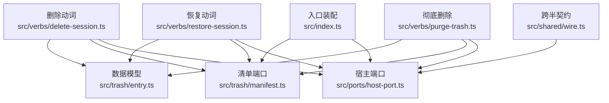
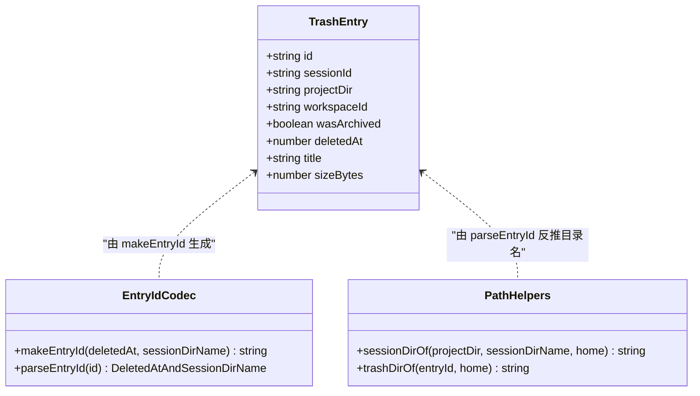
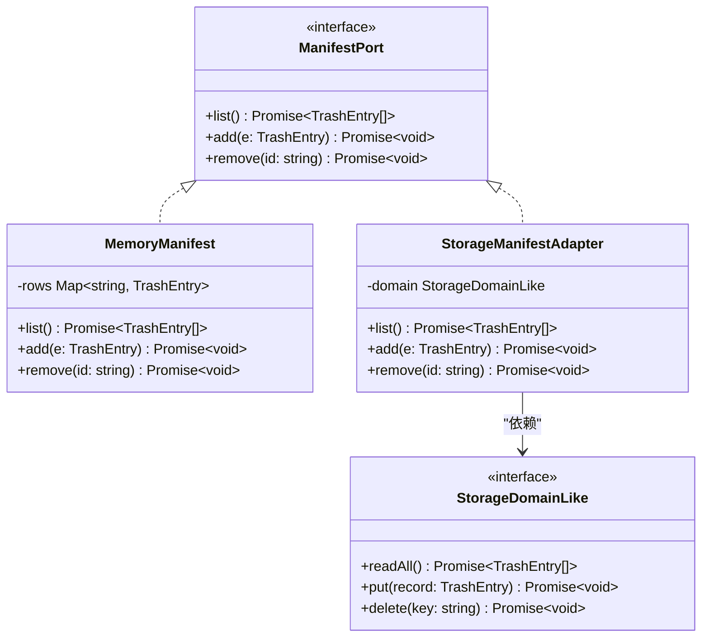
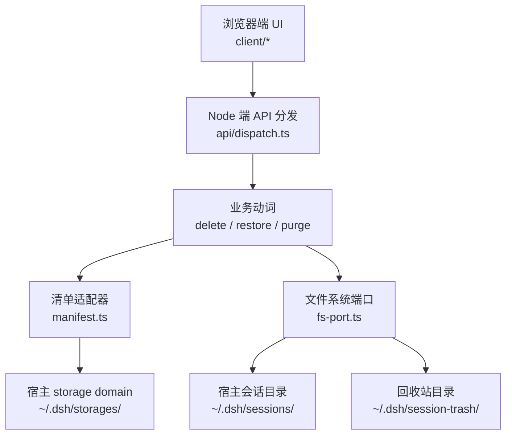
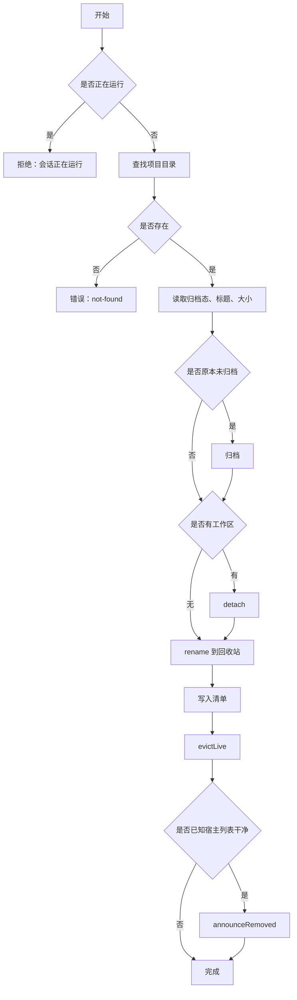
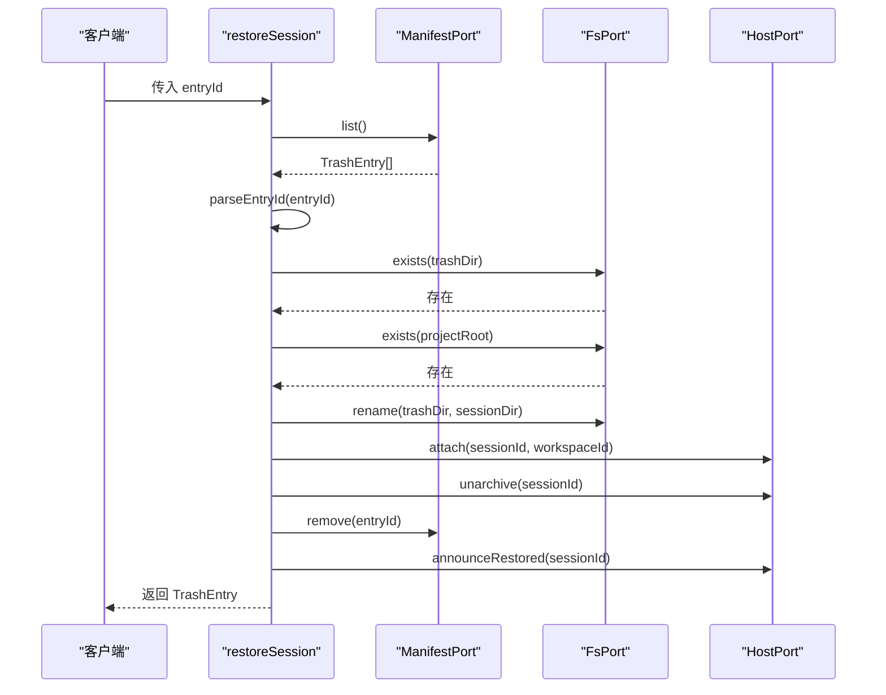
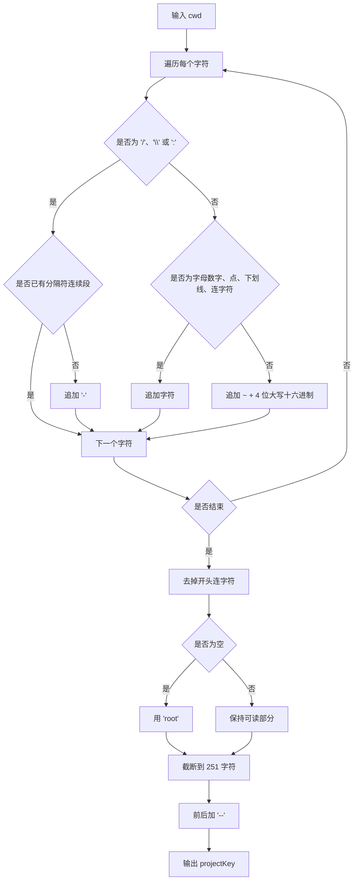
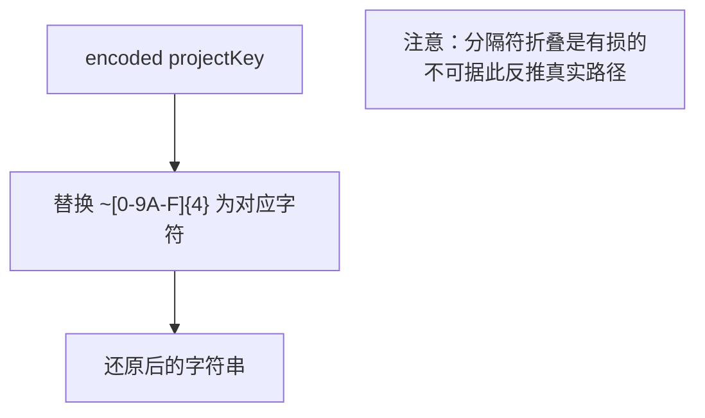
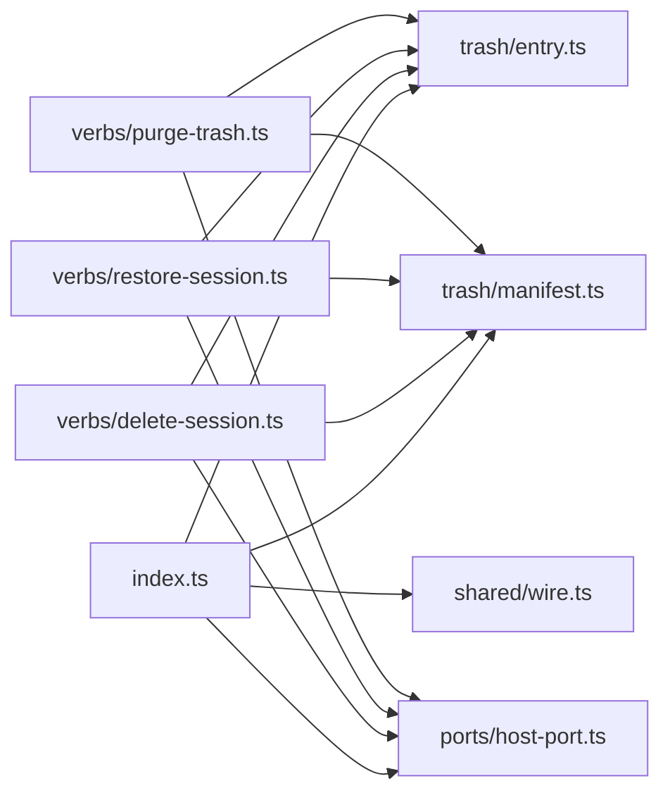

# 存储架构与项目目录算法

<cite>
**本文引用的文件**   
- [README.md](file://README.md)
- [package.json](file://package.json)
- [src/index.ts](file://src/index.ts)
- [src/trash/entry.ts](file://src/trash/entry.ts)
- [src/trash/manifest.ts](file://src/trash/manifest.ts)
- [src/ports/host-port.ts](file://src/ports/host-port.ts)
- [src/shared/wire.ts](file://src/shared/wire.ts)
- [src/verbs/delete-session.ts](file://src/verbs/delete-session.ts)
- [src/verbs/restore-session.ts](file://src/verbs/restore-session.ts)
- [src/verbs/purge-trash.ts](file://src/verbs/purge-trash.ts)
- [tests/manifest.test.ts](file://tests/manifest.test.ts)
- [tests/delete-session.test.ts](file://tests/delete-session.test.ts)
- [tests/restore-session.test.ts](file://tests/restore-session.test.ts)
- [tests/purge-trash.test.ts](file://tests/purge-trash.test.ts)
</cite>

## 目录

1. [引言](#引言)
2. [项目结构](#项目结构)
3. [核心组件](#核心组件)
4. [架构总览](#架构总览)
5. [详细组件分析](#详细组件分析)
6. [依赖关系分析](#依赖关系分析)
7. [性能考虑](#性能考虑)
8. [故障排查指南](#故障排查指南)
9. [结论](#结论)

## 引言

本插件为 DeepSeek Harness（DSH）增加“删除会话”能力：删除不等于直接销毁，而是把会话目录搬进本机回收站；回收站条目可恢复，也可显式彻底删除。其关键约束是：

- **回收站本体**位于宿主数据根下的 `~/.dsh/session-trash/`，按 `<删除时间戳>-<原会话目录名>` 命名。
- **回收站清单**通过宿主的 `storageDomain` 持久化，使用 per-record 布局，介质落在 `~/.dsh/storages/`。
- 会话在 `~/.dsh/sessions/<projectKey>/<sessionId>` 下，删除时在同卷 rename 到回收站；恢复时再 rename 回去。
- wasArchived 决定恢复后的可见性：原本未归档的恢复后取消归档；原本已归档的恢复后仍处归档态。
- projectKey 编码/解码镜像宿主实现，兼容 v3 无前缀、v4 带 session- 前缀的会话 ID。

这些语义由入口装配、TrashEntry 模型、ManifestPort、HostPort、动词层与测试共同钉住。

**章节来源**
- [README.md:1-130](file://README.md#L1-L130)
- [package.json:1-91](file://package.json#L1-L91)

## 项目结构

仓库按职责分层组织：

| 层级 | 路径 | 职责 |
|---|---|---|
| 入口装配 | [src/index.ts](file://src/index.ts) | 注册 storage domain、解析宿主数据根、绑定 ManifestPort |
| 数据模型 | [src/trash/entry.ts](file://src/trash/entry.ts) | TrashEntry 接口、id 编解码、sessionDir / trashDir 路径构造 |
| 清单端口 | [src/trash/manifest.ts](file://src/trash/manifest.ts) | ManifestPort 抽象、内存探针、storage domain 适配器 |
| 宿主端口 | [src/ports/host-port.ts](file://src/ports/host-port.ts) | workspaceRegistry、live store、归档集、projectKey 镜像 |
| 业务动词 | [src/verbs/delete-session.ts](file://src/verbs/delete-session.ts) | 删除 → 归档 → 摘账本 → rename → 登记清单 → 通告 |
| 业务动词 | [src/verbs/restore-session.ts](file://src/verbs/restore-session.ts) | 恢复 → rename → 挂账本 → 还原可见性 → 摘清单 |
| 业务动词 | [src/verbs/purge-trash.ts](file://src/verbs/purge-trash.ts) | 单条或清空回收站，释放字节并通告 |
| 跨半契约 | [src/shared/wire.ts](file://src/shared/wire.ts) | API 前缀、路由、失败信封、projectKey 解码 |
| 测试 | tests/* | 清单、删除、恢复、彻底删除的行为断言 |

**图示来源**
- [src/index.ts:1-200](file://src/index.ts#L1-L200)
- [src/trash/entry.ts:1-48](file://src/trash/entry.ts#L1-L48)
- [src/trash/manifest.ts:1-35](file://src/trash/manifest.ts#L1-L35)
- [src/ports/host-port.ts:1-200](file://src/ports/host-port.ts#L1-L200)
- [src/verbs/delete-session.ts:1-104](file://src/verbs/delete-session.ts#L1-L104)
- [src/verbs/restore-session.ts:1-68](file://src/verbs/restore-session.ts#L1-L68)
- [src/verbs/purge-trash.ts:1-29](file://src/verbs/purge-trash.ts#L1-L29)
- [src/shared/wire.ts:1-84](file://src/shared/wire.ts#L1-L84)

**章节来源**
- [src/index.ts:1-200](file://src/index.ts#L1-L200)
- [src/trash/entry.ts:1-48](file://src/trash/entry.ts#L1-L48)
- [src/trash/manifest.ts:1-35](file://src/trash/manifest.ts#L1-L35)
- [src/ports/host-port.ts:1-200](file://src/ports/host-port.ts#L1-L200)
- [src/verbs/delete-session.ts:1-104](file://src/verbs/delete-session.ts#L1-L104)
- [src/verbs/restore-session.ts:1-68](file://src/verbs/restore-session.ts#L1-L68)
- [src/verbs/purge-trash.ts:1-29](file://src/verbs/purge-trash.ts#L1-L29)
- [src/shared/wire.ts:1-84](file://src/shared/wire.ts#L1-L84)

## 核心组件

### TrashEntry 数据模型

TrashEntry 是回收站记录的唯一事实源，字段语义如下：

| 字段 | 类型 | 语义 | 重要约束 |
|---|---|---|---|
| id | string | 回收站记录主键，也是回收站目录名 | 形如 `<UTC 时间戳>-<原会话目录名>`，由 makeEntryId 生成 |
| sessionId | string | 被删除会话的真实 ID | 用于恢复、清理活体、通告客户端 |
| projectDir | string | 会话所属的项目目录名（projectKey） | 不是完整路径，恢复时拼接回 `sessions/<projectDir>` |
| workspaceId | string | 删除时所属工作区 ID；空串表示删除时无账目 | 空串时恢复不 attach，也不 detach |
| wasArchived | boolean | 删除之前的归档状态 | 决定恢复后是否 unarchive |
| deletedAt | number | 删除时刻的时间戳 | 参与 id 生成、列表倒序排序 |
| title | string | 尽力取到的会话标题 | 读取失败不阻断删除，缺省时为空串 |
| sizeBytes | number | 删除时用 fs.sizeOfDir 量出的目录大小 | 面板显示占用，也用于 purge 统计 freedBytes |

**图示来源**
- [src/trash/entry.ts:1-48](file://src/trash/entry.ts#L1-L48)

wasArchived 是可见性控制的关键：

- 删除时若会话原本未归档，插件会先调用宿主归档，使会话从分组面隐藏。
- 恢复时若 wasArchived 为 false，则调用 unarchive 把会话放回树中。
- 若 wasArchived 为 true，说明删除前就在归档集里，恢复后仍应隐藏，不应动归档集。

**章节来源**
- [src/trash/entry.ts:1-48](file://src/trash/entry.ts#L1-L48)
- [src/verbs/delete-session.ts:33-52](file://src/verbs/delete-session.ts#L33-L52)
- [src/verbs/restore-session.ts:26-47](file://src/verbs/restore-session.ts#L26-L47)

### ManifestPort 与 storage domain 适配

ManifestPort 是动词层对回收站清单的唯一抽象：

| 方法 | 输入 | 输出 | 语义 |
|---|---|---|---|
| list | 无 | Promise\<TrashEntry[]\> | 按 deletedAt 倒序返回所有记录 |
| add | TrashEntry | Promise\<void\> | 以 id 为键写入记录 |
| remove | id | Promise\<void\> | 按 id 移除记录 |

它有两种实现：

1. **createMemoryManifest**：基于 Map 的内存探针，用于单元测试。
2. **createStorageManifest**：桥接宿主 storage domain，真实落盘到 `~/.dsh/storages/`。

**图示来源**
- [src/trash/manifest.ts:1-35](file://src/trash/manifest.ts#L1-L35)

storage domain 规范由入口装配定义：

- domain 名：`xrn1997_session_delete_trash`，带插件专属前缀。
- version：1。
- layout：per-record。
- invalidRecords：backup-and-skip。
- table：entries。
- valueSchema：逐项校验 TrashEntry 字段类型。

host 侧 open 返回的 DomainTableLike 提供 entries、put、delete；adapter 再折成 StorageDomainLike 的 readAll、put、delete，最后由 createStorageManifest 包装成 ManifestPort。

**章节来源**
- [src/trash/manifest.ts:1-35](file://src/trash/manifest.ts#L1-L35)
- [src/index.ts:57-140](file://src/index.ts#L57-L140)
- [tests/manifest.test.ts:1-37](file://tests/manifest.test.ts#L1-L37)

### HostPort：宿主服务窄镜像

HostPort 把 DSH 内部服务抽象成插件能安全使用的最小接口：

| 方法 | 语义 |
|---|---|
| workspaceOf | 查工作区归属 |
| projectDirOf | 查 projectKey（cwd 映射后的项目目录名） |
| titleOf | 尽力取标题，失败返回空串 |
| isLive | 通过宿主 waterfall 判断会话是否活跃 |
| isArchived | 查全局归档集 |
| evictLive | 从宿主 live store 摘除，返回三态结果 |
| announceRemoved | 转发 api-session/removed |
| announceRestored | 转发 api-session/added |
| unarchive | 取消归档 |
| detach | 从工作区摘除 |
| attach | 挂回工作区 |
| archive | 加入归档集 |

evictLive 的三态设计很重要：

- evicted：成功摘除。
- not-live：宿主列表本来就没有它。
- unknown：读不到 live store、形状不符、detach 抛错等；此时不能发“已移除”，因为无法保证宿主列表已经干净。

**章节来源**
- [src/ports/host-port.ts:1-200](file://src/ports/host-port.ts#L1-L200)
- [src/ports/host-port.ts:201-366](file://src/ports/host-port.ts#L201-L366)

## 架构总览

系统由 Node 端插件与浏览器端 UI 组成，但存储相关逻辑集中在 Node 端：

**图示来源**
- [src/verbs/delete-session.ts:1-104](file://src/verbs/delete-session.ts#L1-L104)
- [src/verbs/restore-session.ts:1-68](file://src/verbs/restore-session.ts#L1-L68)
- [src/verbs/purge-trash.ts:1-29](file://src/verbs/purge-trash.ts#L1-L29)
- [src/trash/manifest.ts:1-35](file://src/trash/manifest.ts#L1-L35)
- [src/index.ts:141-200](file://src/index.ts#L141-L200)

## 详细组件分析

### 删除流程

删除是一个多步骤事务：

1. 检查是否运行中；若是，直接拒绝。
2. 查询 projectDir；不存在则 not-found。
3. 可选查询 workspaceId。
4. 验证 sessionDir 存在。
5. 读取 wasArchived、deletedAt、title、sizeBytes。
6. 若原本未归档，先归档。
7. 若有工作区，detach。
8. ensureDir 回收站根，rename 会话目录到回收站。
9. 写入清单。
10. evictLive 并如实通告。

**图示来源**
- [src/verbs/delete-session.ts:1-104](file://src/verbs/delete-session.ts#L1-L104)

删除顺序被测试严格钉住：archive → detach → rename → evictLive → announceRemoved。

#### 回滚策略

删除有三段写操作：归档/账本、文件、清单。每段失败都有对应回滚：

- rename 失败：attach 挂回账本，unarchive 还原可见性。
- manifest.add 失败：rename 回原目录，attach，unarchive。
- detach 失败：unarchive（仅当 wasArchived 为 false）。

这保证了不会出现“文件已在回收站但清单不可见”的孤儿。

**章节来源**
- [src/verbs/delete-session.ts:1-104](file://src/verbs/delete-session.ts#L1-L104)
- [tests/delete-session.test.ts:1-200](file://tests/delete-session.test.ts#L1-L200)

### 恢复流程

恢复的核心原则是：**不依赖宿主当前的目录命名约定**。

删除时，entryId 中嵌入的是原始 sessionId（即当时的原目录名），而不是重新推导的 projectKey 或 cwd。恢复时：

1. 从 manifest.list 找到 entry。
2. 用 parseEntryId 提取 sessionDirName。
3. 拼接 trashDir。
4. 验证 trashDir 存在。
5. 验证 sessions 根和 projectDir 存在。
6. rename trashDir → sessionDir。
7. 若有 workspaceId，attach。
8. 若 wasArchived 为 false，unarchive。
9. remove 清单。
10. announceRestored。

**图示来源**
- [src/verbs/restore-session.ts:1-68](file://src/verbs/restore-session.ts#L1-L68)
- [src/trash/entry.ts:25-48](file://src/trash/entry.ts#L25-L48)

恢复的回滚顺序与执行相反：

- attach 失败：rename 回回收站。
- unarchive 失败：archive 藏回去、detach 摘账本、rename 回回收站。
- manifest.remove 失败：archive、detach、rename 回回收站。

**章节来源**
- [src/verbs/restore-session.ts:1-68](file://src/verbs/restore-session.ts#L1-L68)
- [tests/restore-session.test.ts:1-149](file://tests/restore-session.test.ts#L1-L149)

### 彻底删除流程

purgeTrash 支持两种模式：

- 传 entryId：只删一条。
- 不传 entryId：清空整个回收站。

每条目标都执行：

1. 计算 trashDir。
2. 若目录存在，统计 sizeOfDir 并 removeDir。
3. remove 清单行。
4. evictLive。
5. 若已知宿主列表干净，announceRemoved。

即使磁盘上目录已被手工删除，只要清单行还在，也会清掉清单并尝试清理宿主内存。

**章节来源**
- [src/verbs/purge-trash.ts:1-29](file://src/verbs/purge-trash.ts#L1-L29)
- [tests/purge-trash.test.ts:1-80](file://tests/purge-trash.test.ts#L1-L80)

### 项目目录编码与解码

projectKey 编码是宿主实现的一部分，插件没有直接 import，而是逐字镜像：

**图示来源**
- [src/ports/host-port.ts:141-170](file://src/ports/host-port.ts#L141-L170)

解码只还原 `~XXXX` 转义，不还原 `/`、`\`、`:` 折叠成的 `-`，因此它是“尽力显示”的单向还原。

**图示来源**
- [src/shared/wire.ts:53-84](file://src/shared/wire.ts#L53-L84)

#### 与 v3/v4 会话 ID 的兼容

文档明确提到：宿主给的 sessionId 实测就是目录名，v3 无前缀、v4 带 session- 前缀，两者都在真机上读到过。删除时使用这个 sessionId 作为原目录名记入 entryId；恢复时也不再现推，从而绕过宿主当时可能变化的目录命名约定。

这意味着：

- 删除时的 sessionId 就是 sessionDirName。
- parseEntryId 能稳定拆出该名称。
- 恢复时直接用该名称拼回原 projectDir。
- 插件不依赖宿主 projectKey 的逆向推导来定位原目录。

**章节来源**
- [src/ports/host-port.ts:141-170](file://src/ports/host-port.ts#L141-L170)
- [src/shared/wire.ts:53-84](file://src/shared/wire.ts#L53-L84)
- [src/verbs/delete-session.ts:20-32](file://src/verbs/delete-session.ts#L20-L32)
- [src/verbs/restore-session.ts:10-18](file://src/verbs/restore-session.ts#L10-L18)

### 存储域规范与持久化

回收站清单的 domain spec：

| 属性 | 值 | 含义 |
|---|---|---|
| name | xrn1997_session_delete_trash | 带插件作用域前缀，符合 UNIT_NAME_RE |
| version | 1 | 当前领域版本 |
| layout | per-record | 每条记录独立存储 |
| invalidRecords | backup-and-skip | 坏记录备份并跳过，不导致整域打开失败 |
| tables.entries.valueSchema | 逐项类型校验器 | 要求 id、sessionId、projectDir、workspaceId、wasArchived、deletedAt、title、sizeBytes 类型正确 |

open 是懒加载且只开一次；卸载时通过 ctx.effect 关闭 domain 句柄。

**章节来源**
- [src/index.ts:57-140](file://src/index.ts#L57-L140)
- [src/index.ts:141-200](file://src/index.ts#L141-L200)

### 宿主数据根解析

resolveHome 的实现等价于宿主行为：

- 优先 env.DSH_HOME（空白视为未设置）。
- 否则 ~/.dsh。
- 展开 ~/ 和绝对路径。

注意：如果 profile 显式配置了不同的 dshHome，插件只能拿到平台默认解析方式，因此可能出现“插件算出的根与宿主不一致”的情况。此时删除/恢复会以 not-found 响亮拒绝，不会误动其他树。

**章节来源**
- [src/index.ts:141-200](file://src/index.ts#L141-L200)

## 依赖关系分析

### 模块依赖图

**图示来源**
- [src/index.ts:1-20](file://src/index.ts#L1-L20)
- [src/verbs/delete-session.ts:1-10](file://src/verbs/delete-session.ts#L1-L10)
- [src/verbs/restore-session.ts:1-6](file://src/verbs/restore-session.ts#L1-L6)
- [src/verbs/purge-trash.ts:1-4](file://src/verbs/purge-trash.ts#L1-L4)

### 耦合与内聚

- 动词层只依赖 ManifestPort、HostPort、FsPort，不直接认识 storage domain 或 workspaceRegistry，内聚良好。
- HostPort 是较重的适配层，集中封装宿主内部 API，避免动词层散落对 cordis、registry、live store 的直接访问。
- entry.ts 是纯函数和数据模型，几乎无外部依赖。
- manifest.ts 把内存实现与持久化实现解耦。

潜在风险：

- HostPort 直接镜像宿主私有服务面，属于脆弱边界；宿主内部 API 变化可能破坏插件。
- projectKey 编码在两个文件中分别出现：host-port.ts 的镜像与 wire.ts 的解码，需由 assembly 测试维持配对。

**章节来源**
- [src/ports/host-port.ts:1-200](file://src/ports/host-port.ts#L1-L200)
- [src/shared/wire.ts:1-84](file://src/shared/wire.ts#L1-L84)
- [src/trash/manifest.ts:1-35](file://src/trash/manifest.ts#L1-L35)

## 性能考虑

- 删除和恢复主要做两次同卷 rename，属于原子且瞬时操作，时间复杂度接近 O(1)。
- list() 按 deletedAt 排序，时间复杂度 O(n log n)，n 为回收站条目数。
- 标题和目录大小是删除时的“尽力读取”，失败不影响删除主流程，适合缓存命中场景。
- storage domain 懒开，避免插件激活阶段立即打开持久化句柄。
- 回收站不设 TTL 自动清理，空间增长完全由用户显式清空控制。

扩展建议：

- 可在 purgeTrash 或定时任务中加入 TTL 扩展点，例如按 deletedAt 超过阈值批量清理。
- 可引入引用计数处理附件，但目前附件是全局内容寻址，不在回收站范围内。

**章节来源**
- [src/trash/manifest.ts:1-35](file://src/trash/manifest.ts#L1-L35)
- [src/verbs/delete-session.ts:1-104](file://src/verbs/delete-session.ts#L1-L104)
- [src/verbs/restore-session.ts:1-68](file://src/verbs/restore-session.ts#L1-L68)
- [src/verbs/purge-trash.ts:1-29](file://src/verbs/purge-trash.ts#L1-L29)

## 故障排查指南

### 常见错误码

| 错误码 | 触发条件 | 典型表现 |
|---|---|---|
| sessiondelete/live | 会话正在运行 | 菜单项置灰，删除被拒绝 |
| sessiondelete/not-found | 宿主持久化里没有会话 | 提示会话不存在 |
| sessiondelete/io | 文件系统、storage domain、host API 失败 | 带 cause 的原始错误 |
| sessiondelete/trash-empty | 恢复或删除的条目不在回收站 | 面板点击无效 |
| sessiondelete/project-missing | 恢复时原项目目录不存在 | 不静默创建目录 |

**章节来源**
- [src/verbs/delete-session.ts:1-104](file://src/verbs/delete-session.ts#L1-L104)
- [src/verbs/restore-session.ts:1-68](file://src/verbs/restore-session.ts#L1-L68)
- [src/verbs/purge-trash.ts:1-29](file://src/verbs/purge-trash.ts#L1-L29)

### 磁盘空间不足时的降级行为

当前实现没有显式的“磁盘空间不足”分支：

- delete-session 在 rename 失败时走 io 错误路径，并尝试回滚。
- purge-trash 在 removeDir 失败时抛出 io 错误。
- restore-session 在 rename 失败时抛出 io 错误。
- 清单失败会触发回滚。

因此，磁盘写失败会被当作 I/O 错误向上抛出，而不是静默降级为“只改清单不改文件”或“只改文件不改清单”。这是合理的强一致选择，但用户侧需要看到明确的失败提示。

### 清单丢失与会话文件自描述

文档指出：回收站与 sessions 同卷，搬入搬出靠 rename；清单丢了不致命，因为会话文件自描述，第一行 header 含 id 与 cwd。不过当前代码并没有实现“扫描回收站重建清单”的能力——这属于未来迁移或修复工具的范围。

### 数据迁移路径

当前 domain version 为 1，没有显式 schema migration 表。可能的演进方向包括：

- 升级 version 并增加新字段时，在 open 阶段检测旧格式并迁移 entries。
- 新增 TTL 字段后，扫描存量记录补全。
- 若未来需要扫描回收站重建清单，应基于 entry.id 解析 sessionDirName，再结合 projectDir 与 home 重建 sessionDir。

**章节来源**
- [src/index.ts:57-140](file://src/index.ts#L57-L140)
- [README.md:70-110](file://README.md#L70-L110)

## 结论

本插件的存储架构围绕三个关键事实建立：

1. **回收站目录名即清单 id**：通过 makeEntryId 把删除时间与原目录名绑定，使恢复路径不依赖宿主目录命名约定。
2. **清单持久化在宿主 storage domain**：per-record 布局允许单条损坏隔离，backup-and-skip 保证域仍可打开。
3. **可见性与工作区归属由删除快照决定**：wasArchived 与 workspaceId 在删除时冻结，恢复时原样应用。

删除、恢复、彻底删除三条路径都遵循“先读后写、按反向顺序回滚、最后写清单”的原则，避免产生“面板看不见却占磁盘”的孤儿状态。HostPort 把宿主内部 API 收敛为窄接口，使动词层保持业务语义清晰。

未来若需要自动过期、回收站重建、附件引用计数或更强的迁移保障，应在现有 ManifestPort 与 HostPort 边界之外扩展，而不破坏已有的强一致回滚语义。