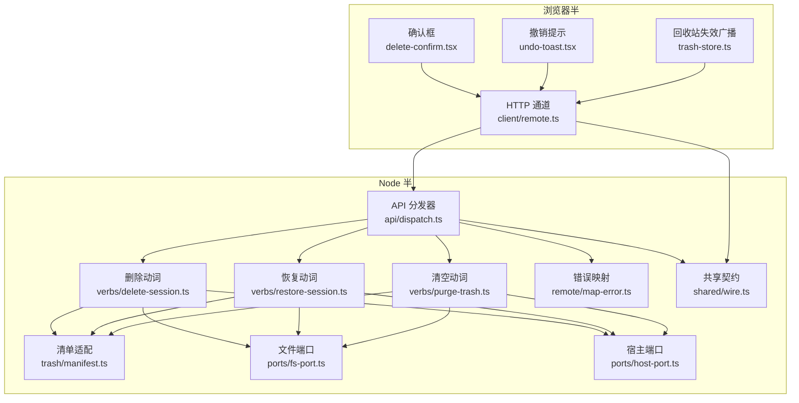
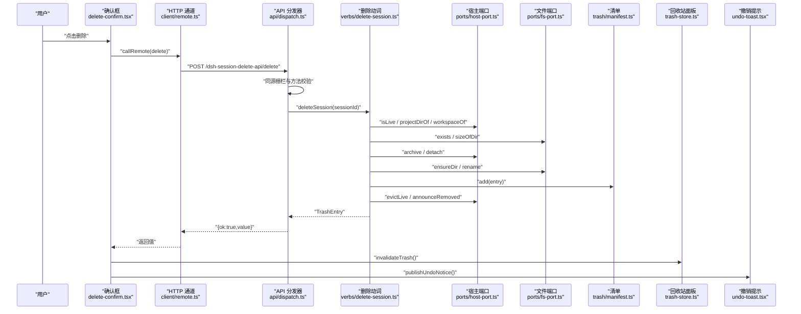
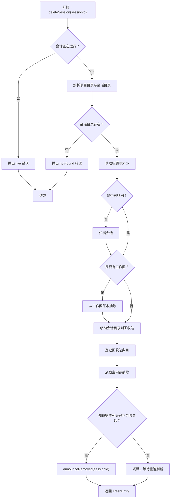
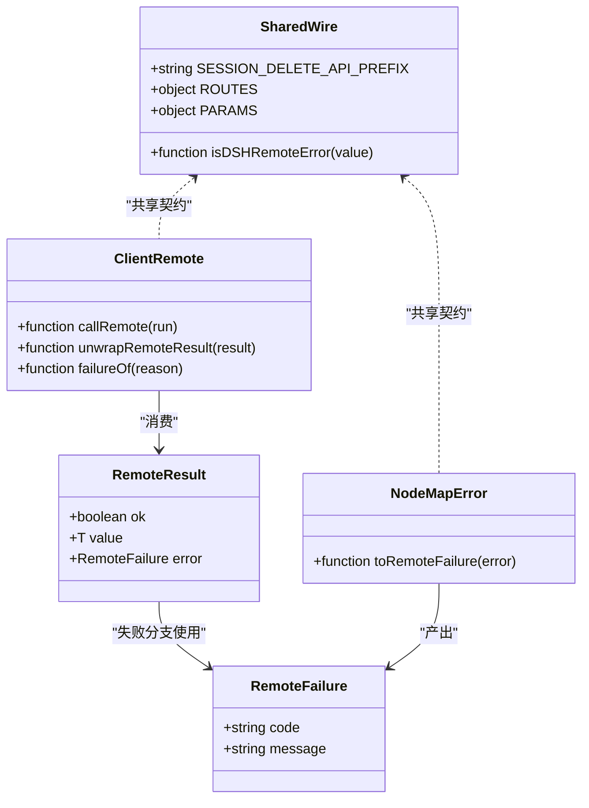
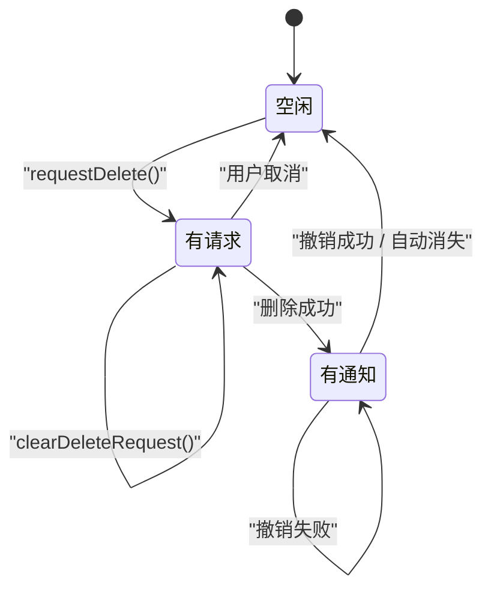
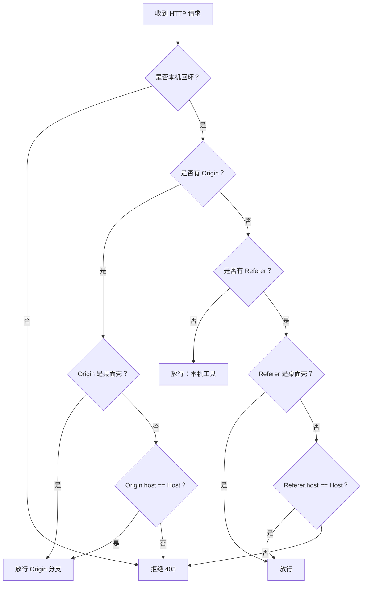
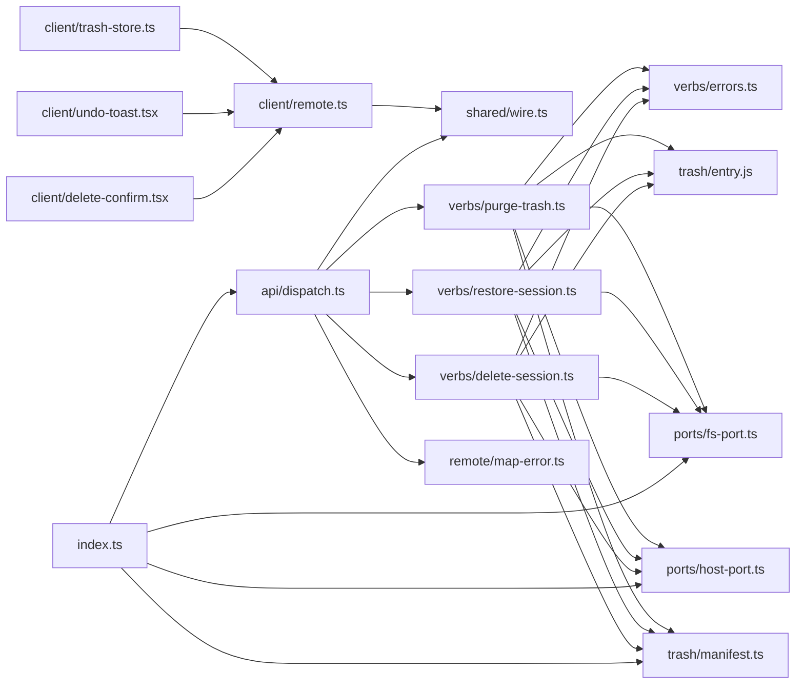

# 数据流与状态管理

<cite>
**本文引用的文件**   
- [src/index.ts](file://src/index.ts)
- [src/api/dispatch.ts](file://src/api/dispatch.ts)
- [src/shared/wire.ts](file://src/shared/wire.ts)
- [src/client/remote.ts](file://src/client/remote.ts)
- [src/client/delete-confirm.tsx](file://src/client/delete-confirm.tsx)
- [src/client/undo-toast.tsx](file://src/client/undo-toast.tsx)
- [src/client/trash-store.ts](file://src/client/trash-store.ts)
- [src/verbs/delete-session.ts](file://src/verbs/delete-session.ts)
- [src/verbs/errors.ts](file://src/verbs/errors.ts)
- [src/ports/fs-port.ts](file://src/ports/fs-port.ts)
- [src/ports/host-port.ts](file://src/ports/host-port.ts)
- [src/remote/map-error.ts](file://src/remote/map-error.ts)
- [src/trash/manifest.ts](file://src/trash/manifest.ts)
</cite>

## 目录

1. [引言](#引言)
2. [项目结构](#项目结构)
3. [核心组件](#核心组件)
4. [架构总览](#架构总览)
5. [关键流程详解](#关键流程详解)
6. [共享契约：RemoteResult、RemoteFailure 与路由](#共享契约remoteresultremotefailure-与路由)
7. [跨卸载状态管理](#跨卸载状态管理)
8. [同源栅栏与安全边界](#同源栅栏与安全边界)
9. [依赖关系分析](#依赖关系分析)
10. [性能考量](#性能考量)
11. [故障排查指南](#故障排查指南)
12. [结论](#结论)

## 引言

本插件围绕「会话删除 → 回收站 → 撤销恢复」这条链路，把浏览器半的交互、Node 半的 HTTP API、动词层的状态变更、宿主进程的内部服务以及回收站清单连接起来。其设计目标有三点：

- 用户点击删除后，能稳定地进入确认框；
- 成功后在 `shell.overlay` 上显示可撤销的 Toast；
- 正打开的回收站面板收到通知并刷新，而不用重新挂载整个页面。

同时，插件刻意避免跨插件值 import 宿主类型、不引入额外状态库，并通过共享 wire 契约让 Node 半与浏览器半对错误和路由保持一致。

## 项目结构

仓库采用按职责分层的组织方式：

| 路径 | 职责 |
| --- | --- |
| `src/client/*` | 浏览器端 UI：确认框、撤销提示、取数通道、回收站清单失效广播 |
| `src/api/dispatch.ts` | 宿主 web server 上的前缀路由分发器 |
| `src/verbs/*` | 无宿主耦合的动词实现：删除、恢复、清空、错误码 |
| `src/ports/*` | 文件系统与宿主服务的窄接口 |
| `src/trash/*` | 回收站条目模型、持久化清单适配 |
| `src/shared/wire.ts` | 两半共享的路由、参数、信封与失败契约 |
| `src/remote/map-error.ts` | Node 半的错误到远程失败信封映射 |
| `src/index.ts` | 插件装配：存储域、web server 路由、home 路径解析 |

**图示来源**  
- [src/client/delete-confirm.tsx:1-174](file://src/client/delete-confirm.tsx#L1-L174)  
- [src/client/undo-toast.tsx:1-123](file://src/client/undo-toast.tsx#L1-L123)  
- [src/client/trash-store.ts:1-41](file://src/client/trash-store.ts#L1-L41)  
- [src/client/remote.ts:1-208](file://src/client/remote.ts#L1-L208)  
- [src/api/dispatch.ts:1-192](file://src/api/dispatch.ts#L1-L192)  
- [src/verbs/delete-session.ts:1-104](file://src/verbs/delete-session.ts#L1-L104)  
- [src/verbs/restore-session.ts:1-68](file://src/verbs/restore-session.ts#L1-L68)  
- [src/verbs/purge-trash.ts:1-29](file://src/verbs/purge-trash.ts#L1-L29)  
- [src/shared/wire.ts:1-84](file://src/shared/wire.ts#L1-L84)

**章节来源**  
- [src/index.ts:1-237](file://src/index.ts#L1-L237)  
- [src/api/dispatch.ts:1-192](file://src/api/dispatch.ts#L1-L192)

## 核心组件

### 浏览器端入口

- **确认框模块**负责捕获菜单行的删除意图，并把请求写入模块级 store；常驻宿主浮层渲染对话框。
- **撤销提示模块**在删除成功后发布一条横幅，提供「撤销」动作。
- **回收站清单失效模块**维护单调递增修订号，供正打开的面板订阅。
- **HTTP 通道**用同源 fetch 调用 `/dsh-session-delete-api`，把 `{ok,value}` / `{ok,false,error}` 信封展开为裸值或抛出失败。

### Node 半入口

- **API 分发器**注册插件专属前缀路由，做同源校验、方法校验、JSON 体校验，再转发给动词。
- **删除动词**是整条链路最复杂的状态机：归档、摘账本、移动文件、登记回收站、从内存摘除、通告客户端。
- **恢复动词**把目录放回原处、挂回工作区账本、取消归档、摘清单行，并按需要通告客户端。
- **清空动词**批量删除回收站目录并摘清单行。
- **错误映射**把宿主类型化错误和本插件动词错误统一成远程失败信封。

**章节来源**  
- [src/client/delete-confirm.tsx:1-174](file://src/client/delete-confirm.tsx#L1-L174)  
- [src/client/undo-toast.tsx:1-123](file://src/client/undo-toast.tsx#L1-L123)  
- [src/client/trash-store.ts:1-41](file://src/client/trash-store.ts#L1-L41)  
- [src/client/remote.ts:1-208](file://src/client/remote.ts#L1-L208)  
- [src/api/dispatch.ts:1-192](file://src/api/dispatch.ts#L1-L192)  
- [src/verbs/delete-session.ts:1-104](file://src/verbs/delete-session.ts#L1-L104)  
- [src/verbs/restore-session.ts:1-68](file://src/verbs/restore-session.ts#L1-L68)  
- [src/verbs/purge-trash.ts:1-29](file://src/verbs/purge-trash.ts#L1-L29)

## 架构总览

整体请求链路可以拆成五段：

1. **浏览器半发起**：菜单行调用模块级 `requestDelete`，随后确认框通过 `callRemote` 走 HTTP 通道。
2. **HTTP API 接收**：Node 半的同源栅栏放行后，分发器按路由选择 `deleteSession`。
3. **动词执行**：删除动词依次查询宿主、归档、摘账本、移动文件、登记回收站、从内存摘除并通告。
4. **结果返回**：错误经 `toRemoteFailure` 映射为 `{ok:false,error:{code,message}}`。
5. **UI 反馈**：确认框关闭、回收站清单失效、撤销 Toast 出现。

**图示来源**  
- [src/client/delete-confirm.tsx:1-174](file://src/client/delete-confirm.tsx#L1-L174)  
- [src/client/remote.ts:1-208](file://src/client/remote.ts#L1-L208)  
- [src/api/dispatch.ts:1-192](file://src/api/dispatch.ts#L1-L192)  
- [src/verbs/delete-session.ts:1-104](file://src/verbs/delete-session.ts#L1-L104)  
- [src/ports/host-port.ts:1-366](file://src/ports/host-port.ts#L1-L366)  
- [src/ports/fs-port.ts:1-33](file://src/ports/fs-port.ts#L1-L33)  
- [src/trash/manifest.ts:1-35](file://src/trash/manifest.ts#L1-L35)  
- [src/client/trash-store.ts:1-41](file://src/client/trash-store.ts#L1-L41)

## 关键流程详解

### 从点击删除到撤销 Toast

#### 1. 菜单行提交删除请求

菜单行只负责构造 `{sessionId,title}` 并写入模块级现场。这样做的关键是：**菜单行随菜单一起卸载**，但确认框必须留在 `shell.overlay` 上。

- `requestDelete` 生成递增 `seq`，覆盖当前请求并触发监听者。
- `useDeleteRequest` 通过 `useSyncExternalStore` 订阅模块级字段。
- 宿主的 `DeleteConfirmHost` 挂在浮层上，没有请求时不渲染；有请求时用 `key={current.seq}` 创建新对话框。

#### 2. 确认框发起远程调用

确认框内部持有 `busy` 与 `failure` 两个局部状态：

- 点击确认后设置 busy，调用 `deps.delete(sessionId)`。
- `callRemote` 捕获异常，把网络失败、非信封响应、带标记失败都转成 `{ok:false,failure}`。
- 成功时清除当前请求、刷新回收站、发布撤销通知。
- 失败时保留对话框，让用户重试。

#### 3. HTTP 层校验与分发

分发器先做同源栅栏；通过后判断 URL 是否以 `/dsh-session-delete-api` 开头，再根据剩余路径选择路由：

| 路由 | 方法 | 输入 | 输出 |
| --- | --- | --- | --- |
| `/list` | GET | 无 | 回收站条目数组 |
| `/delete` | POST | `sessionId` | 新建回收站条目 |
| `/restore` | POST | `entryId` | 恢复后的会话条目 |
| `/purge` | POST | 可选 `entryId` | 已删数量与释放字节 |

#### 4. 删除动词的多阶段状态机

删除不是简单地把文件搬进回收站。它必须同时处理三处状态：

- **宿主可见性**：归档集与工作区账本。
- **磁盘文件**：会话目录与回收站目录。
- **宿主内存与客户端视图**：活体会话与 `announceRemoved`。

**图示来源**  
- [src/verbs/delete-session.ts:1-104](file://src/verbs/delete-session.ts#L1-L104)

#### 5. 成功后的界面刷新

成功路径中，确认框会做两件事：

1. 调用 `invalidateTrash()`，把模块级修订号加一。
2. 调用 `publishUndoNotice({entryId,title})`，发布撤销提示。

回收站面板通过 `useTrashRevision()` 订阅修订号，变化时重新拉取清单。撤销提示则直接显示 Toast，并在用户点击「撤销」时调用 `restore(entryId)`。

**章节来源**  
- [src/client/delete-confirm.tsx:1-174](file://src/client/delete-confirm.tsx#L1-L174)  
- [src/client/undo-toast.tsx:1-123](file://src/client/undo-toast.tsx#L1-L123)  
- [src/client/trash-store.ts:1-41](file://src/client/trash-store.ts#L1-L41)  
- [src/api/dispatch.ts:1-192](file://src/api/dispatch.ts#L1-L192)  
- [src/verbs/delete-session.ts:1-104](file://src/verbs/delete-session.ts#L1-L104)

## 共享契约：RemoteResult、RemoteFailure 与路由

`src/shared/wire.ts` 是 Node 半与浏览器半之间唯一的数据交换契约，所有字面量都集中在这里，避免两侧各自维护路由字符串或信封形状。

### 路由契约

| 常量 | 含义 |
| --- | --- |
| `SESSION_DELETE_API_PREFIX` | 宿主 web server 上的插件专属前缀 |
| `ROUTES.list` | 列出回收站 |
| `ROUTES.delete` | 删除会话 |
| `ROUTES.restore` | 恢复会话 |
| `ROUTES.purge` | 清空或单条删除回收站 |
| `PARAMS.sessionId` | 删除与恢复的请求字段名 |
| `PARAMS.entryId` | 恢复与清空的请求字段名 |

### 信封契约

`RemoteResult<T>` 只有两种分支：

- `{ ok: true; value: T }`
- `{ ok: false; error: RemoteFailure }`

`RemoteFailure` 只有两个字段：

- `code`：用于判别错误类型，例如 `sessiondelete/live`、`sessiondelete/not-found`。
- `message`：最终上屏的原文。

没有 `details`，因为进程边界之外只能传递 JSON，结构化原始错误不能跨进程。

### 失败判别

`isDSHRemoteError` 按标记位判别，而不是 `instanceof`。这是因为跨 realm 或跨 bundle 时类身份可能不一致；标记位 `isDSHRemoteError === true` 且 `code` 为字符串才是远程失败。

浏览器半收到 JSON 后，会用 `throwRemoteFailure` 就地补上 Error 本体与标记位；Node 半的 `toRemoteFailure` 则把宿主类型化错误和动词错误统一成线上形状。

**图示来源**  
- [src/shared/wire.ts:1-84](file://src/shared/wire.ts#L1-L84)  
- [src/client/remote.ts:1-208](file://src/client/remote.ts#L1-L208)  
- [src/remote/map-error.ts:1-72](file://src/remote/map-error.ts#L1-L72)

**章节来源**  
- [src/shared/wire.ts:1-84](file://src/shared/wire.ts#L1-L84)  
- [src/client/remote.ts:1-208](file://src/client/remote.ts#L1-L208)  
- [src/remote/map-error.ts:1-72](file://src/remote/map-error.ts#L1-L72)

## 跨卸载状态管理

### 为什么用模块级 store

确认框和撤销提示都不能固定在菜单行里。原因很具体：

- 宿主菜单行随菜单收起而卸载；
- 确认框需要在菜单收起后继续存在；
- 撤销提示需要在菜单完全关闭后仍然停留；
- 回收站面板位于另一个树节点，与菜单行没有共同父组件。

因此，三个模块分别实现了同一种模式：

1. 模块级变量保存当前请求或通知。
2. `Set<() => void>` 保存订阅者。
3. `emit()` 遍历并通知所有订阅者。
4. 暴露一个 `useXxx()` Hook，内部使用 `useSyncExternalStore`。

这种模式的好处是：

- 不需要引入额外的状态库；
- 生命周期由 React 外部 store 决定，而不是组件树；
- 多个互不相关的组件可以订阅同一份状态；
- 每次发布递增 `seq`，确保新消息能强制重挂载组件。

### 确认框状态

`delete-confirm.tsx` 中的模块级状态包括：

- `request`：当前待确认的删除请求。
- `nextSeq`：每次新建请求递增。
- `listeners`：订阅者集合。

对话框本身只持有本地 `busy` 与 `failure`；这些不属于跨卸载状态，因为对话框是按需创建的。

### 撤销提示状态

`undo-toast.tsx` 中的模块级状态包括：

- `notice`：当前待显示的撤销通知。
- `nextSeq`：每次发布递增。
- `listeners`：订阅者集合。

撤销操作会更新 `notice.failure`，并再次 `emit()`，让 Toast 显示失败原文而不静默失败。

### 回收站清单失效

`trash-store.ts` 只维护一个单调递增的 `revision`。它不关心谁动了回收站，也不关心是删除、恢复还是清空——只要动过，就加一并通知。

**图示来源**  
- [src/client/delete-confirm.tsx:1-174](file://src/client/delete-confirm.tsx#L1-L174)  
- [src/client/undo-toast.tsx:1-123](file://src/client/undo-toast.tsx#L1-L123)  
- [src/client/trash-store.ts:1-41](file://src/client/trash-store.ts#L1-L41)

**章节来源**  
- [src/client/delete-confirm.tsx:1-174](file://src/client/delete-confirm.tsx#L1-L174)  
- [src/client/undo-toast.tsx:1-123](file://src/client/undo-toast.tsx#L1-L123)  
- [src/client/trash-store.ts:1-41](file://src/client/trash-store.ts#L1-L41)

## 同源栅栏与安全边界

### 栅栏规则

`createApiHandler` 对所有请求先调用 `isTrustedRequest`。放行条件如下：

1. 请求来自本机回环地址。
2. 如果存在 `Origin` 且不是桌面壳地址，则要求 `Origin.host` 与 `Host` 一致。
3. 如果存在 `Referer`，允许它是桌面壳地址，或者它的 host 与 `Host` 一致。
4. 两者都缺席时放行，这代表本机工具或 curl。

### 桌面壳特殊路径

桌面壳加载 `dsh-app://app/`，并对非静态资源请求转发到宿主 web server。转发时会删除 `host`、`origin`、`cookie`、`sec-fetch-site`，并替换成一个宿主 cookie。

因此，桌面版打到这条路由的请求**没有 `Origin`**，但保留 `Referer`。代码必须检查 `Referer` 是否为 `dsh-app://app`，否则真机上所有入口都会返回 403。

### 安全影响

| 风险 | 处理方式 |
| --- | --- |
| 任意网页跨源 POST 删除会话 | 要求回环地址，且跨源 POST 必带 `Origin` |
| `<meta name="referrer">` 隐藏 Referer | 仍看 `Origin` |
| 桌面壳去掉 Origin | 单独接受 `Referer` 为桌面壳地址 |
| no-cors GET 泄露 | 只读 `list`，且 opaque 响应不可被恶意页读取 |
| 伪造 forbidden header | `Origin` 与 `Referer` 由浏览器或壳控制，网页无法伪造 |

需要注意：栅栏保护的是**请求准入**，不是业务权限。真正删除会话的语义还受宿主侧会话状态、工作区权限、文件权限等约束。

**图示来源**  
- [src/api/dispatch.ts:1-192](file://src/api/dispatch.ts#L1-L192)

**章节来源**  
- [src/api/dispatch.ts:1-192](file://src/api/dispatch.ts#L1-L192)

## 依赖关系分析

### 模块依赖图

**图示来源**  
- [src/index.ts:1-237](file://src/index.ts#L1-L237)  
- [src/api/dispatch.ts:1-192](file://src/api/dispatch.ts#L1-L192)  
- [src/client/remote.ts:1-208](file://src/client/remote.ts#L1-L208)  
- [src/client/delete-confirm.tsx:1-174](file://src/client/delete-confirm.tsx#L1-L174)  
- [src/client/undo-toast.tsx:1-123](file://src/client/undo-toast.tsx#L1-L123)  
- [src/client/trash-store.ts:1-41](file://src/client/trash-store.ts#L1-L41)  
- [src/verbs/delete-session.ts:1-104](file://src/verbs/delete-session.ts#L1-L104)  
- [src/verbs/restore-session.ts:1-68](file://src/verbs/restore-session.ts#L1-L68)  
- [src/verbs/purge-trash.ts:1-29](file://src/verbs/purge-trash.ts#L1-L29)  
- [src/verbs/errors.ts:1-12](file://src/verbs/errors.ts#L1-L12)  
- [src/ports/fs-port.ts:1-33](file://src/ports/fs-port.ts#L1-L33)  
- [src/ports/host-port.ts:1-366](file://src/ports/host-port.ts#L1-L366)  
- [src/trash/manifest.ts:1-35](file://src/trash/manifest.ts#L1-L35)  
- [src/shared/wire.ts:1-84](file://src/shared/wire.ts#L1-L84)

### 耦合与内聚

- **高内聚**：每个动词只关注自己的状态转换；错误码集中在 `verbs/errors.ts`。
- **低耦合**：动词通过 `FsPort` 和 `HostPort` 访问副作用，便于测试。
- **共享边界清晰**：wire 契约、错误映射、路由常量全部集中，避免散落字面量。
- **宿主耦合集中在端口层**：`index.ts` 负责把 Cordis 上下文适配成端口，动词不直接碰宿主服务。

**章节来源**  
- [src/verbs/errors.ts:1-12](file://src/verbs/errors.ts#L1-L12)  
- [src/ports/host-port.ts:1-366](file://src/ports/host-port.ts#L1-L366)  
- [src/ports/fs-port.ts:1-33](file://src/ports/fs-port.ts#L1-L33)

## 性能考量

### 长列表场景下的优化建议

当前回收站清单按 `deletedAt` 倒序排序，并在 `list()` 中构建完整数组。对于少量回收站条目足够，但在以下场景值得考虑优化：

1. **大列表分页**  
   当回收站条目较多时，应支持分页或虚拟滚动，避免一次性渲染数百行。

2. **懒加载标题与大小**  
   标题取自宿主投影缓存，大小需递归统计目录。若清单只显示摘要，可延迟计算 `title` 与 `sizeBytes`，或在服务端缓存。

3. **增量更新**  
   当前 `invalidateTrash()` 会让面板全量重读。若未来清单变大，可改为按 `entryId` 增量增删改，而不是重建整张表。

4. **避免重复递归统计**  
   `fs-port.ts` 的 `sizeOfDir` 是递归统计。对同一个会话目录多次删除或恢复时应考虑缓存，或只在展示时计算。

5. **React 渲染优化**  
   - 列表项使用稳定 `key`。
   - 大列表配合 `react-window` 或宿主提供的虚拟列表。
   - 撤销 Toast 已经通过 `key={seq}` 保证重挂载，但列表项不应因 Toast 频繁重建。

6. **I/O 合并**  
   清空回收站时逐个目录递归统计并删除，顺序是安全的，但大量小文件下可考虑批处理或后台任务。

### 当前实现的性能特征

| 操作 | 时间复杂度 | 空间复杂度 | 备注 |
| --- | --- | --- | --- |
| 列出回收站 | O(n log n) | O(n) | 排序产生新数组 |
| 删除会话 | O(1) 主逻辑 | O(1) | 主要成本在 I/O 与宿主调用 |
| 恢复会话 | O(n) 查找 | O(1) | 清单未建立 id 索引 |
| 清空回收站 | O(n + Σ文件大小) | O(k) | k 为目标条目数 |
| 撤销 Toast 状态 | O(1) | O(1) | 模块级对象引用 |
| 回收站修订号 | O(1) | O(1) | 单调递增整数 |

**章节来源**  
- [src/trash/manifest.ts:1-35](file://src/trash/manifest.ts#L1-L35)  
- [src/ports/fs-port.ts:1-33](file://src/ports/fs-port.ts#L1-L33)  
- [src/client/trash-store.ts:1-41](file://src/client/trash-store.ts#L1-L41)

## 故障排查指南

### 常见问题与定位线索

| 现象 | 可能原因 | 排查位置 |
| --- | --- | --- |
| 桌面版点击删除立即 403 | 桌面壳去掉 `Origin`，但栅栏没放行 `Referer` | `api/dispatch.ts` 的同源栅栏 |
| 浏览器控制台报“取数通道打不通” | 宿主 web server 没挂路由或页面不同源 | `client/remote.ts` 的 `requestEnvelope` |
| 回包不是信封 | 请求落到 SPA 兜底处理器，返回 HTML | `client/remote.ts` 的 JSON 解析分支 |
| 删除提示“会话正在运行” | 会话仍在宿主内存中活跃 | `verbs/delete-session.ts` 的 `isLive` 检查 |
| 删除提示“持久化里没有这个会话” | 会话不在宿主账本中 | `verbs/delete-session.ts` 的 `projectDirOf` |
| 恢复时报“原项目目录不存在” | 会话根目录已被手工清理 | `verbs/restore-session.ts` 的目录检查 |
| 撤销失败但 Toast 还在 | 恢复失败后更新 `notice.failure`，需要用户再次操作 | `client/undo-toast.tsx` |
| 回收站面板不刷新 | 没有触发 `invalidateTrash()` 或面板未订阅修订号 | `client/trash-store.ts` |
| 错误码变成 `io` | 错误链上没有宿主类型化错误，也没有 `sessiondelete/<码>` | `remote/map-error.ts` |

### 错误码对照

| 码 | 含义 | 典型来源 |
| --- | --- | --- |
| `sessiondelete/live` | 会话正在运行 | 宿主 `WorkspaceActiveSessionError` 或动词主动抛出 |
| `sessiondelete/not-found` | 会话不存在 | 宿主 `WorkspaceUnknownSessionError` 或动词主动抛出 |
| `sessiondelete/trash-empty` | 回收站为空或条目不存在 | 恢复或清空时找不到条目 |
| `sessiondelete/project-missing` | 原项目目录不存在 | 恢复时目标根缺失 |
| `sessiondelete/io` | I/O 或未知错误 | 文件操作、宿主调用失败、其他未识别错误 |
| `client/unknown` | 浏览器端网络或类型错误 | `client/remote.ts` 的 `failureOf` |

**章节来源**  
- [src/remote/map-error.ts:1-72](file://src/remote/map-error.ts#L1-L72)  
- [src/verbs/errors.ts:1-12](file://src/verbs/errors.ts#L1-L12)  
- [src/verbs/delete-session.ts:1-104](file://src/verbs/delete-session.ts#L1-L104)  
- [src/verbs/restore-session.ts:1-68](file://src/verbs/restore-session.ts#L1-L68)  
- [src/client/remote.ts:1-208](file://src/client/remote.ts#L1-L208)

## 结论

本插件的数据流与状态管理围绕三个设计原则展开：

1. **契约前置**：路由、参数、信封、失败形状全部放在 `shared/wire.ts`，浏览器半与 Node 半共享同一份真相。
2. **副作用分层**：浏览器端只负责交互与状态订阅，Node 半的动词负责多阶段状态机，端口层隔离宿主与文件系统。
3. **跨卸载状态独立于组件树**：确认框、撤销提示、回收站清单失效都使用模块级 store 加 `useSyncExternalStore`，从而跨越菜单卸载、浮层挂载和跨树通信。

在安全方面，同源栅栏把写口限制在本机回环，并结合 `Origin`、`Referer` 与桌面壳特殊路径，避免普通网页通过 CSRF 删除会话。在性能方面，当前实现适合小规模回收站；若未来列表增长，应优先引入分页、虚拟滚动、增量更新和 I/O 缓存。