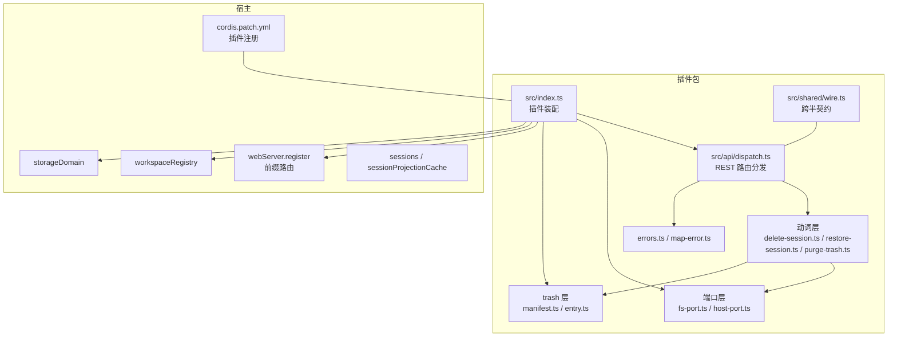
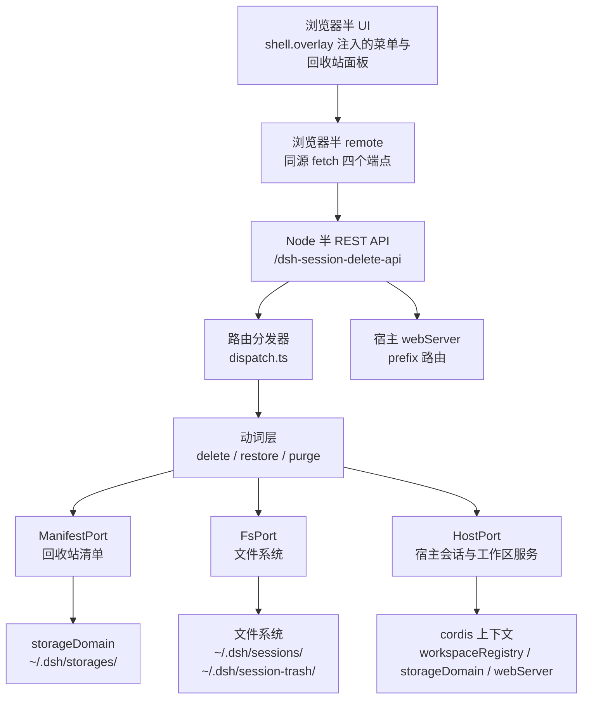
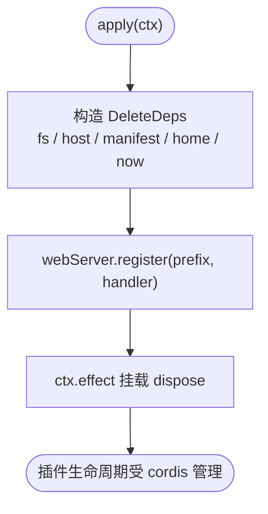
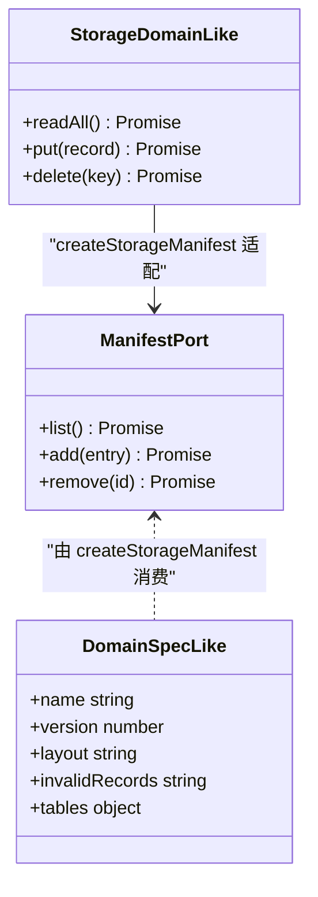
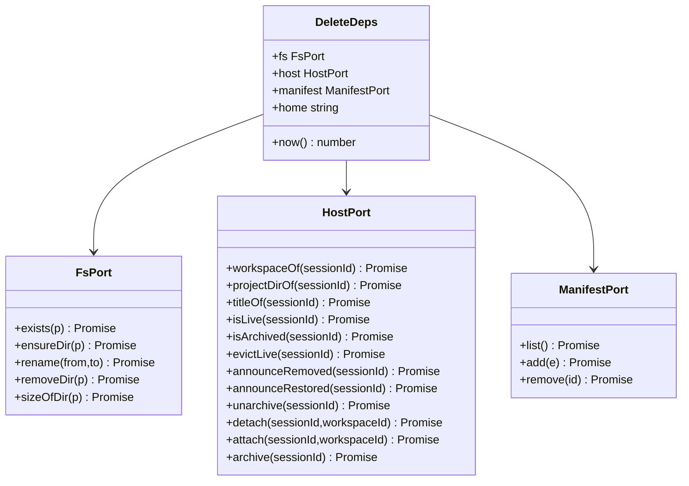
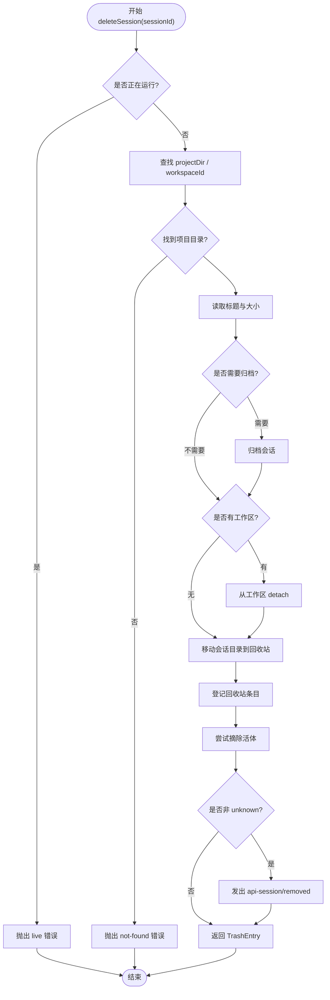
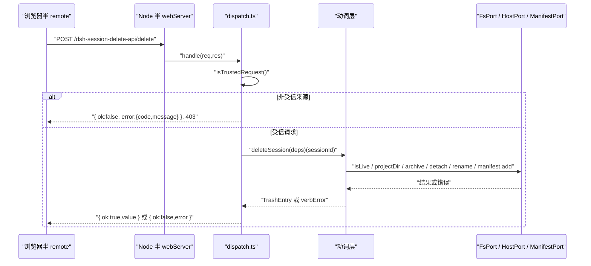
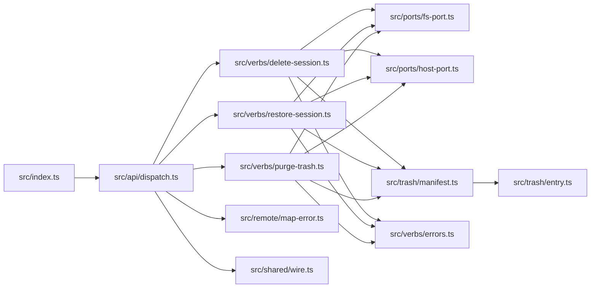

# 架构概览

<cite>
**本文引用的文件**
- [package.json](file://package.json)
- [README.md](file://README.md)
- [cordis.patch.yml](file://cordis.patch.yml)
- [src/index.ts](file://src/index.ts)
- [src/api/dispatch.ts](file://src/api/dispatch.ts)
- [src/shared/wire.ts](file://src/shared/wire.ts)
- [src/ports/fs-port.ts](file://src/ports/fs-port.ts)
- [src/ports/host-port.ts](file://src/ports/host-port.ts)
- [src/trash/manifest.ts](file://src/trash/manifest.ts)
- [src/trash/entry.ts](file://src/trash/entry.ts)
- [src/verbs/delete-session.ts](file://src/verbs/delete-session.ts)
- [src/verbs/purge-trash.ts](file://src/verbs/purge-trash.ts)
- [src/verbs/restore-session.ts](file://src/verbs/restore-session.ts)
- [src/verbs/errors.ts](file://src/verbs/errors.ts)
- [src/remote/map-error.ts](file://src/remote/map-error.ts)
</cite>

## 目录
1. [引言](#引言)
2. [项目结构](#项目结构)
3. [核心组件](#核心组件)
4. [系统边界与部署拓扑](#系统边界与部署拓扑)
5. [详细组件分析](#详细组件分析)
6. [依赖关系分析](#依赖关系分析)
7. [性能与可靠性考量](#性能与可靠性考量)
8. [可扩展点](#可扩展点)
9. [故障排查](#故障排查)
10. [结论](#结论)

## 引言
本插件为 DeepSeek Harness（DSH）提供“删除会话”能力：删除不是直接销毁，而是把会话目录移入回收站并记录清单；用户可恢复或删除单条、清空整个回收站。浏览器半通过宿主 shell.overlay 注入侧栏与菜单入口，Node 半通过 `webServer.register` 暴露 `/dsh-session-delete-api` 前缀 REST 路由；动词层以 Port + Dependency Injection 模式调用 FsPort / HostPort / ManifestPort，完成文件系统、宿主会话服务与回收站清单操作。

关键设计要点：
- 双出口包：Node 端主入口导出 `name`、`inject`、`apply`；浏览器端由构建产物单独输出。
- cordis 插件上下文注入：只声明 `workspaceRegistry`、`storageDomain`、`webServer` 三个真正用到的宿主服务。
- storage domain 适配器：本地窄镜像定义域规范，懒加载并随插件卸载关闭句柄。
- Port + DI：FsPort、HostPort、ManifestPort 是窄接口，动词层不感知宿主内部实现。
- Verb 事务模式：删除/恢复按写顺序分步执行，失败时逆向回滚，保证“文件 / 账本 / 归档态 / 清单”一致性。
- HTTP API 同源栅栏：仅允许回环地址的同源或桌面壳请求，拒绝跨源简单请求 CSRF。

**章节来源**
- [README.md:1-130](file://README.md#L1-L130)
- [package.json:1-91](file://package.json#L1-L91)

## 项目结构
仓库采用 Node 半与浏览器半共享领域模型、但运行时入口分离的结构：

**图表来源**
- [src/index.ts:1-237](file://src/index.ts#L1-L237)
- [src/api/dispatch.ts:1-192](file://src/api/dispatch.ts#L1-L192)
- [src/shared/wire.ts:1-84](file://src/shared/wire.ts#L1-L84)
- [src/ports/fs-port.ts:1-33](file://src/ports/fs-port.ts#L1-L33)
- [src/ports/host-port.ts:1-366](file://src/ports/host-port.ts#L1-L366)
- [src/trash/manifest.ts:1-35](file://src/trash/manifest.ts#L1-L35)
- [src/trash/entry.ts:1-48](file://src/trash/entry.ts#L1-L48)
- [src/verbs/delete-session.ts:1-104](file://src/verbs/delete-session.ts#L1-L104)
- [src/verbs/purge-trash.ts:1-29](file://src/verbs/purge-trash.ts#L1-L29)
- [src/verbs/restore-session.ts:1-68](file://src/verbs/restore-session.ts#L1-L68)
- [src/verbs/errors.ts:1-12](file://src/verbs/errors.ts#L1-L12)
- [src/remote/map-error.ts:1-72](file://src/remote/map-error.ts#L1-L72)
- [cordis.patch.yml:1-3](file://cordis.patch.yml#L1-L3)

**章节来源**
- [src/index.ts:1-237](file://src/index.ts#L1-L237)
- [src/api/dispatch.ts:1-192](file://src/api/dispatch.ts#L1-L192)
- [src/shared/wire.ts:1-84](file://src/shared/wire.ts#L1-L84)
- [cordis.patch.yml:1-3](file://cordis.patch.yml#L1-L3)

## 核心组件
| 组件 | 职责 | 关键行为 |
|---|---|---|
| 插件装配 `src/index.ts` | 声明插件名、注入项、存储域、home 路径，并把 REST 路由挂到宿主 web server | 懒开 storage domain，注册 effect 清理；`apply` 构造 `DeleteDeps` |
| REST 分发器 `src/api/dispatch.ts` | 解析同源请求、校验方法/参数、转发到动词函数 | 同源栅栏、JSON body 上限、统一信封 `{ok,value}` / `{ok:false,error}` |
| FsPort `src/ports/fs-port.ts` | 抽象文件系统操作 | exists、ensureDir、rename、removeDir、sizeOfDir |
| HostPort `src/ports/host-port.ts` | 抽象宿主会话与工作区服务 | workspace/project/title/live/archived、evictLive、announceRemoved/Restored、attach/detach/archive/unarchive |
| ManifestPort `src/trash/manifest.ts` | 抽象回收站清单读写 | list/add/remove，支持内存与 storage domain 两种实现 |
| 词条与路径 `src/trash/entry.ts` | 定义 TrashEntry、生成/解析 entryId、计算 sessions/trash 路径 | 时间戳+原目录名编码，v3/v4 兼容 |
| 动词层 | 组合端口完成删除、恢复、清空 | 错误码化、多步写、失败回滚 |
| 错误映射 `src/remote/map-error.ts` | 把任意抛出物映射成远程失败信封 | 识别宿主类型化错误、动词码、兜底 io |
| 跨半契约 `src/shared/wire.ts` | 定义 API 前缀、路由段、字段名、RemoteFailure | 两端共享，零运行时依赖 |

**章节来源**
- [src/index.ts:1-237](file://src/index.ts#L1-L237)
- [src/api/dispatch.ts:1-192](file://src/api/dispatch.ts#L1-L192)
- [src/ports/fs-port.ts:1-33](file://src/ports/fs-port.ts#L1-L33)
- [src/ports/host-port.ts:1-366](file://src/ports/host-port.ts#L1-L366)
- [src/trash/manifest.ts:1-35](file://src/trash/manifest.ts#L1-L35)
- [src/trash/entry.ts:1-48](file://src/trash/entry.ts#L1-L48)
- [src/verbs/delete-session.ts:1-104](file://src/verbs/delete-session.ts#L1-L104)
- [src/verbs/purge-trash.ts:1-29](file://src/verbs/purge-trash.ts#L1-L29)
- [src/verbs/restore-session.ts:1-68](file://src/verbs/restore-session.ts#L1-L68)
- [src/verbs/errors.ts:1-12](file://src/verbs/errors.ts#L1-L12)
- [src/remote/map-error.ts:1-72](file://src/remote/map-error.ts#L1-L72)
- [src/shared/wire.ts:1-84](file://src/shared/wire.ts#L1-L84)

## 系统边界与部署拓扑
### 系统边界图

**图表来源**
- [src/api/dispatch.ts:1-192](file://src/api/dispatch.ts#L1-L192)
- [src/ports/fs-port.ts:1-33](file://src/ports/fs-port.ts#L1-L33)
- [src/ports/host-port.ts:1-366](file://src/ports/host-port.ts#L1-L366)
- [src/trash/manifest.ts:1-35](file://src/trash/manifest.ts#L1-L35)
- [src/index.ts:1-237](file://src/index.ts#L1-L237)

### 部署拓扑
- 安装：`dsh plugin --profile <profile> add @xrn1997/dsh-session-delete`。
- cordis.patch.yml 把插件名插入宿主插件装配列表。
- 浏览器半通过宿主 HMR 更新 UI，无需重启；Node 半不在热重载链路，需要重启宿主。
- 数据落盘在宿主数据根下：会话位于 `~/.dsh/sessions/`，回收站位于 `~/.dsh/session-trash/`，清单介质位于 `~/.dsh/storages/`。

**章节来源**
- [README.md:1-130](file://README.md#L1-L130)
- [cordis.patch.yml:1-3](file://cordis.patch.yml#L1-L3)
- [src/index.ts:120-199](file://src/index.ts#L120-L199)

## 详细组件分析

### 插件装配与 cordis 注入
`src/index.ts` 暴露三个顶层导出：
- `name`：插件标识。
- `inject`：只声明三个实际使用的宿主服务，避免未注入服务导致插件 pending。
- `apply(ctx)`：构造依赖、创建 storage domain、注册 REST 路由，并用 `ctx.effect` 绑定卸载清理。

技术决策：
- 窄接口隔离宿主内部模块：`WebServerLike`、`WorkspaceRegistryLike`、`LiveSessionsLike`、`ProjectionCacheLike` 都只声明被调用的成员，不引入宿主类型包。
- storage domain 懒开且唯一：`createStorageManifest` 内缓存 `opening` promise，确保同一 facility 中同名域只打开一次；effect 清理句柄。
- home 解析镜像官方优先级：显式配置不可得，因此降级为 `$DSH_HOME` 或 `~/.dsh`；若宿主使用显式配置，则本插件可能探测不到真实目录，但不会误动其他路径。

**图表来源**
- [src/index.ts:201-237](file://src/index.ts#L201-L237)
- [src/index.ts:1-199](file://src/index.ts#L1-L199)

**章节来源**
- [src/index.ts:1-237](file://src/index.ts#L1-L237)

### storage domain 适配器
`createStorageManifest` 把宿主 `storageDomain.open(spec)` 返回的 domain/table 适配为 `ManifestPort`：
- `readAll` → `table.entries()` 迭代器转数组。
- `put` → `table.put(record.id, record)`。
- `delete` → `table.delete(key)`。

域规格：
- name 带插件专属前缀，满足 `UNIT_NAME_RE`。
- layout `per-record`，invalidRecords `backup-and-skip`，坏记录不影响整域启动。
- 版本固定为 1，表名为 `entries`。

**图表来源**
- [src/index.ts:1-199](file://src/index.ts#L1-L199)
- [src/trash/manifest.ts:1-35](file://src/trash/manifest.ts#L1-L35)

**章节来源**
- [src/index.ts:1-199](file://src/index.ts#L1-L199)
- [src/trash/manifest.ts:1-35](file://src/trash/manifest.ts#L1-L35)

### Port + Dependency Injection 模式
动词层只依赖 `DeleteDeps`：

**图表来源**
- [src/verbs/delete-session.ts:1-104](file://src/verbs/delete-session.ts#L1-L104)
- [src/ports/fs-port.ts:1-33](file://src/ports/fs-port.ts#L1-L33)
- [src/ports/host-port.ts:1-366](file://src/ports/host-port.ts#L1-L366)
- [src/trash/manifest.ts:1-35](file://src/trash/manifest.ts#L1-L35)

该模式让：
- 测试可用内存 manifest 替换持久清单。
- 端口实现可独立演进，不改变动词契约。
- 宿主服务变更只在 HostPort 内部消化。

**章节来源**
- [src/verbs/delete-session.ts:1-104](file://src/verbs/delete-session.ts#L1-L104)
- [src/ports/fs-port.ts:1-33](file://src/ports/fs-port.ts#L1-L33)
- [src/ports/host-port.ts:1-366](file://src/ports/host-port.ts#L1-L366)
- [src/trash/manifest.ts:1-35](file://src/trash/manifest.ts#L1-L35)

### Verb 事务模式：删除会话
删除流程遵循“读提前、写分步、失败回滚”的事务语义：

**图表来源**
- [src/verbs/delete-session.ts:1-104](file://src/verbs/delete-session.ts#L1-L104)

关键点：
- 活跃检查复用宿主 `workspace/session-activity` waterfall，不与宿主逻辑分叉。
- 先归档再 detach，避免短暂出现“无主且可见”的会话行。
- 文件 move 后登记清单；清单失败会回滚文件、账本、归档态。
- evictLive 三态决定客户端通告：只有确定宿主列表已干净才发 removed。

**章节来源**
- [src/verbs/delete-session.ts:1-104](file://src/verbs/delete-session.ts#L1-L104)
- [src/ports/host-port.ts:201-366](file://src/ports/host-port.ts#L201-L366)

### Verb 事务模式：恢复与会话清空
恢复流程强调“用删除时记录的原始目录名放回”，从而兼容 v3 无前缀与 v4 带 `session-` 前缀的会话目录命名差异：
1. 查清单确认 entry 存在。
2. 确认回收站目录仍在。
3. 确认原项目目录存在。
4. 文件 rename 回来。
5. 挂回工作区账本。
6. 根据 wasArchived 取消归档。
7. 删除清单行。
8. 通告客户端 restored。

清空回收站对每个目标：
- 统计释放字节。
- 删除回收站目录（目录可能已被手工删除）。
- 删除清单行。
- 尝试 evictLive 并如实通告 removed。

**章节来源**
- [src/verbs/restore-session.ts:1-68](file://src/verbs/restore-session.ts#L1-L68)
- [src/verbs/purge-trash.ts:1-29](file://src/verbs/purge-trash.ts#L1-L29)

### HTTP API 同源栅栏
REST 端点统一走 `/dsh-session-delete-api`：
- GET `/list`：列出回收站条目。
- POST `/delete`：传入 sessionId。
- POST `/restore`：传入 entryId。
- POST `/purge`：可选传入 entryId；缺席表示清空。

同源放行条件：
- 请求必须来自回环地址。
- Origin 与 Host 同源，或 Origin 是桌面壳 `dsh-app://app`。
- Referer 是桌面壳 `dsh-app://app`，或与 Host 同源。
- Origin 与 Referer 同时缺席视为本机工具请求。
- 跨源简单请求无法绕过栅栏，因为写口必带 Origin。

HTTP 状态语义：
- 业务成功或失败统一 200，信封里 `ok` 判别成败。
- 同源栅栏失败返回 403，因为这是请求准入失败，不是业务操作失败。

**图表来源**
- [src/api/dispatch.ts:1-192](file://src/api/dispatch.ts#L1-L192)
- [src/verbs/delete-session.ts:1-104](file://src/verbs/delete-session.ts#L1-L104)

**章节来源**
- [src/api/dispatch.ts:1-192](file://src/api/dispatch.ts#L1-L192)
- [src/shared/wire.ts:1-84](file://src/shared/wire.ts#L1-L84)

### 错误映射与代码约定
动词层统一通过 `verbError(code, message, cause)` 抛错，code 为五个值之一：
- `live`：会话正在运行。
- `not-found`：宿主持久化中没有该会话。
- `trash-empty`：回收站为空或找不到目标。
- `project-missing`：恢复时原项目目录不存在。
- `io`：文件、宿主服务或其他 I/O 失败。

`toRemoteFailure` 负责把任意抛出物映射为 `RemoteFailure`：
- 已经是远程失败则原样透传。
- 在 cause 链上查找宿主类型化错误，映射到 `live` / `not-found`。
- 匹配 `sessiondelete/<code>` 动词码。
- 其余全部降级为 `io`，保留 message。

**章节来源**
- [src/verbs/errors.ts:1-12](file://src/verbs/errors.ts#L1-L12)
- [src/remote/map-error.ts:1-72](file://src/remote/map-error.ts#L1-L72)

### projectKey 编码解码与 v3/v4 兼容性
- Node 端 HostPort 镜像宿主 `projectKey(cwd)` 算法，把 cwd 编码成 `<sessions>/<projectKey>/` 下的目录名。
- 浏览器端 shared/wire 提供 `unescapeProjectKey`，还原 `~XXXX` 十六进制转义字符，用于界面展示。
- 分隔符 `/` `\` `:` 会被折成一个 `-`，属于有损编码，因此解码只能尽力显示，不能反推真实路径。
- 会话 ID 本身可能是 v3（无前缀）或 v4（带 `session-` 前缀），但删除时把该原目录名写入 entryId，恢复时按 entryId 中的原目录名放回，不再依赖当前宿主命名规则。

**章节来源**
- [src/ports/host-port.ts:120-199](file://src/ports/host-port.ts#L120-L199)
- [src/shared/wire.ts:40-84](file://src/shared/wire.ts#L40-L84)
- [src/trash/entry.ts:1-48](file://src/trash/entry.ts#L1-L48)

## 依赖关系分析

**图表来源**
- [src/index.ts:1-237](file://src/index.ts#L1-L237)
- [src/api/dispatch.ts:1-192](file://src/api/dispatch.ts#L1-L192)
- [src/verbs/delete-session.ts:1-104](file://src/verbs/delete-session.ts#L1-L104)
- [src/verbs/restore-session.ts:1-68](file://src/verbs/restore-session.ts#L1-L68)
- [src/verbs/purge-trash.ts:1-29](file://src/verbs/purge-trash.ts#L1-L29)
- [src/ports/fs-port.ts:1-33](file://src/ports/fs-port.ts#L1-L33)
- [src/ports/host-port.ts:1-366](file://src/ports/host-port.ts#L1-L366)
- [src/trash/manifest.ts:1-35](file://src/trash/manifest.ts#L1-L35)
- [src/trash/entry.ts:1-48](file://src/trash/entry.ts#L1-L48)
- [src/remote/map-error.ts:1-72](file://src/remote/map-error.ts#L1-L72)
- [src/verbs/errors.ts:1-12](file://src/verbs/errors.ts#L1-L12)

耦合特点：
- 动词层对宿主内部实现解耦，只认识端口接口。
- 错误码集中定义，避免浏览器端与 Node 端两张表漂移。
- 跨半契约集中在 wire.ts，避免两侧各自维护字面量。

**章节来源**
- [src/api/dispatch.ts:1-192](file://src/api/dispatch.ts#L1-L192)
- [src/verbs/delete-session.ts:1-104](file://src/verbs/delete-session.ts#L1-L104)
- [src/remote/map-error.ts:1-72](file://src/remote/map-error.ts#L1-L72)
- [src/shared/wire.ts:1-84](file://src/shared/wire.ts#L1-L84)

## 性能与可靠性考量
- 同卷 rename：会话目录搬进回收站是原子瞬时操作，适合“删除=移入回收站”的语义。
- 清单 per-record + backup-and-skip：一条坏记录不拖垮整域，符合“清单丢了不致命”的设计。
- JSON body 上限：限制请求体大小，防止内存放大。
- 标题与大小提前读取：读失败走 `io` 错误，避免进入写阶段留下半副作用。
- 回滚顺序严格逆序：删除失败时按“文件→账本→归档态”反向恢复，恢复失败时按“目录→账本→归档态→清单”回退。
- 活体摘除与事件通告失败不污染主结果：它们是收尾动作，不应把已完成的数据变更翻成失败。
- 模块级 store：FsPort 的 sizeOfDir 递归在模块作用域调用，避免 `this` 丢失；HostPort 的 live store 访问通过最小方法面判据安全探测。

[本节为通用性能与可靠性讨论，不直接分析具体源码片段]

## 可扩展点
| 扩展方向 | 当前实现 | 如何扩展 |
|---|---|---|
| 自定义端口实现 | FsPort、HostPort、ManifestPort 都是窄接口 | 新增实现替换 DI 中的 deps，例如内存版 HostPort 用于测试 |
| 错误映射扩展 | `HOST_ERROR_CODE` 加键、`VERB_CODES` 加码、`map-error.ts` 增加分支 | 保持 code 与 message 一致，避免两边漂移 |
| 文案命名空间扩展 | 当前错误码与远程域名集中在 verbs/errors.ts 与 remote/map-error.ts | 新增错误码时同步更新 VERB_CODES 和映射表 |
| 新动词 | 动词函数接收 DeleteDeps 并返回异步函数 | 在 dispatch.ts 的路由表中新增段名与方法校验 |
| 新前端入口 | 浏览器半通过 src/shared/wire.ts 共享路由与参数名 | 新增端点后两端同时 import wire，不要各写字符串常量 |
| 新存储介质 | ManifestPort 已有内存与 storage domain 两套实现 | 可按同样方式适配新的持久化后端 |

**章节来源**
- [src/verbs/errors.ts:1-12](file://src/verbs/errors.ts#L1-L12)
- [src/remote/map-error.ts:1-72](file://src/remote/map-error.ts#L1-L72)
- [src/api/dispatch.ts:1-192](file://src/api/dispatch.ts#L1-L192)
- [src/trash/manifest.ts:1-35](file://src/trash/manifest.ts#L1-L35)
- [src/shared/wire.ts:1-84](file://src/shared/wire.ts#L1-L84)

## 故障排查
| 现象 | 可能原因 | 处理建议 |
|---|---|---|
| 安装后侧栏没有“回收站”，会话菜单也没有“删除” | 取数通道探测不过，插件一个入口都不注册 | 重启宿主；确认该宿主代已在兼容性列表中 |
| 删除后侧栏那一行还在 | 冷会话或活体摘除失败，客户端未收到 removed | 刷新页面；如果是运行中会话，先停止再删 |
| 删除提示 IO 失败 | 文件权限、磁盘不可用、宿主服务异常 | 查看宿主日志；确认 `~/.dsh/sessions` 与 `~/.dsh/session-trash` 所在卷正常 |
| 恢复时报 project-missing | 原项目目录被手动删除或迁移 | 恢复前先把会话目录放回正确项目路径 |
| 回收站里有条目但点击打不开 | 回收站目录被手工删除 | 清空回收站；该条目会成为孤儿，直到被清掉 |
| 桌面端所有请求 403 | 桌面壳 Origin 被移除，栅栏判断失败 | 确认插件版本与宿主匹配；栅栏逻辑已包含 `dsh-app://app` 的 Referer 路径 |
| 浏览器半与 Node 半报错码不一致 | 错误码表漂移 | 只改 verbs/errors.ts 中的 VERB_CODES，并由 map-error.ts 统一映射 |

**章节来源**
- [README.md:1-130](file://README.md#L1-L130)
- [src/api/dispatch.ts:1-192](file://src/api/dispatch.ts#L1-L192)
- [src/verbs/delete-session.ts:1-104](file://src/verbs/delete-session.ts#L1-L104)
- [src/verbs/restore-session.ts:1-68](file://src/verbs/restore-session.ts#L1-L68)
- [src/verbs/purge-trash.ts:1-29](file://src/verbs/purge-trash.ts#L1-L29)

## 结论
DSH 会话删除插件以“端口 + 依赖注入”为核心组织方式，把浏览器半 UI、Node 半 REST、文件系统、宿主会话服务和回收站清单清晰分层。其关键价值在于：
- 用窄接口隔离宿主内部模块，降低跨插件耦合风险。
- 用 module-level store 和 effect 管理跨卸载生命周期状态。
- 用 verb 事务模式保证文件、账本、归档态、清单的一致性。
- 用 projectKey 镜像与 entryId 中的原目录名兼容 v3/v4 会话命名。
- 用 HTTP 同源栅栏保护本机写口，同时兼容桌面壳的特殊请求形态。

未来扩展应优先通过端口实现、错误码表和路由表进行，而不是侵入动词层或宿主内部实现。

[本节为总结性内容，不直接分析具体源码片段]